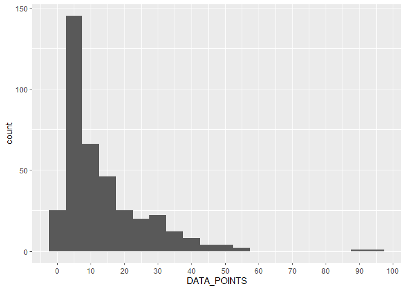
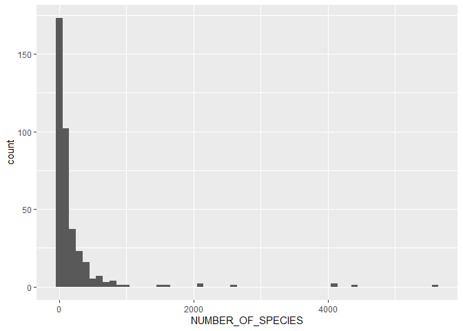

00-import-BioTIME-database
================
Compiled at 2023-11-09 09:55:57 UTC

``` r
here::i_am(paste0(params$name, ".Rmd"), uuid = "92e0b108-b72d-4d77-bf7a-4e46e4cde787")
```

The purpose of this document is to import and have a first look into the
BioTIME database from *BioTIME: A database of biodiversity time series
for the Anthropocene*.

``` r
library("conflicted")
library(dplyr)
library(data.table)
library(ggplot2)
library(stringr)
```

``` r
# create or *empty* the target directory, used to write this file's data: 
projthis::proj_create_dir_target(params$name, clean = TRUE)

# function to get path to target directory: path_target("sample.csv")
path_target <- projthis::proj_path_target(params$name)

# function to get path to previous data: path_source("00-import", "sample.csv")
path_source <- projthis::proj_path_source(params$name)
```

## Data

#### Read files

``` r
#### read the file
dt_fullquery <- 
  fread("input_data/BioTIME/BioTIMEquery_24_06_2021.csv")

colnames(dt_fullquery)[1] <- "ID_SAMPLE"

# remove whitespaces at beginning/end of species name
dt_fullquery[, GENUS_SPECIES := str_trim(GENUS_SPECIES, side = c("both"))] %>% 
  # correct spelling mistake
  .[GENUS == "Zanthoxylem", GENUS := "Zanthoxylum"]

# number of studies
print(paste("number of studies:", 
            dt_fullquery$STUDY_ID %>% uniqueN()))
```

    ## [1] "number of studies: 381"

#### Prepare for phyloseq

``` r
# show list of duplicated species IDs which will be removed in tax table
dt_fullquery[,.(ID_SPECIES, GENUS, SPECIES)] %>% 
  unique() %>%
  .[duplicated(ID_SPECIES)]
```

    ##    ID_SPECIES           GENUS          SPECIES
    ## 1:      41778      Mollinedia      pinchotiana
    ## 2:      43979    Aspidosperma       desmanthum
    ## 3:      44093         Cestrum schlechtendahlii
    ## 4:      44336           Ficus        matiziana
    ## 5:      44401    Handroanthus         guayacan
    ## 6:      44640       Nectandra            fuzzy
    ## 7:      44784           Piper        imperiale
    ## 8:      45049 Tabernaemontana      grandiflora
    ## 9:      45084           Trema     unidentified

``` r
# create taxonomic table
dt_tax_table <-
  dt_fullquery[,.(ID_SPECIES, GENUS, SPECIES)] %>% 
  unique() %>%
  .[!duplicated(ID_SPECIES)]

# extract sample information
dt_sample_info <-
  dt_fullquery[,.(ID_SAMPLE, STUDY_ID, DAY, MONTH, YEAR, SAMPLE_DESC, PLOT, 
                  ID_SPECIES, LATITUDE, LONGITUDE)]

# extract count table
dt_count_table <-
  dt_fullquery[,.(ID_SAMPLE, ID_SPECIES,
                  ABUNDANCE = sum.allrawdata.ABUNDANCE)]
```

#### Focus on only one study (ID = 63)

``` r
# focus on one study
study_id = 63
```

``` r
# extract one study
dt_query <- 
  dt_fullquery[STUDY_ID == study_id]

knitr::kable(head(dt_query))
```

| ID_SAMPLE | STUDY_ID | DAY | MONTH | YEAR | SAMPLE_DESC                                     | PLOT | ID_SPECIES | LATITUDE | LONGITUDE | sum.allrawdata.ABUNDANCE | sum.allrawdata.BIOMASS | GENUS     | SPECIES        | GENUS_SPECIES            |
|----------:|---------:|----:|------:|-----:|:------------------------------------------------|:-----|-----------:|---------:|----------:|-------------------------:|-----------------------:|:----------|:---------------|:-------------------------|
|     78181 |       63 |  NA |    NA | 1959 | 52.422100\_-0.180928_WoodwaltonFen_20smallPonds | NA   |       1414 |  52.4221 | -0.180928 |                      130 |                      0 | Libellula | quadrimaculata | Libellula quadrimaculata |
|     78182 |       63 |  NA |    NA | 1961 | 52.422100\_-0.180928_WoodwaltonFen_20smallPonds | NA   |       1414 |  52.4221 | -0.180928 |                       45 |                      0 | Libellula | quadrimaculata | Libellula quadrimaculata |
|     78183 |       63 |  NA |    NA | 1962 | 52.422100\_-0.180928_WoodwaltonFen_20smallPonds | NA   |       1309 |  52.4221 | -0.180928 |                       12 |                      0 | Ischnura  | elegans        | Ischnura elegans         |
|     78184 |       63 |  NA |    NA | 1962 | 52.422100\_-0.180928_WoodwaltonFen_20smallPonds | NA   |       1414 |  52.4221 | -0.180928 |                       95 |                      0 | Libellula | quadrimaculata | Libellula quadrimaculata |
|     78185 |       63 |  NA |    NA | 1962 | 52.422100\_-0.180928_WoodwaltonFen_20smallPonds | NA   |       2258 |  52.4221 | -0.180928 |                       19 |                      0 | Sympetrum | striolatum     | Sympetrum striolatum     |
|     78186 |       63 |  NA |    NA | 1963 | 52.422100\_-0.180928_WoodwaltonFen_20smallPonds | NA   |       1309 |  52.4221 | -0.180928 |                       26 |                      0 | Ischnura  | elegans        | Ischnura elegans         |

### plot time series for selected study

``` r
# ## group species
# rf_grouped <- as.data.table(rf) %>% 
#   # .[, c("Genus", "Species") := tstrsplit(Species, " ")] %>% 
#   .[, .(Abundance_sum = sum(Abundance)),
#         by = c("Year", "Species")]

ggplot(rf, aes(Year, Abundance, col = Species)) +
  geom_line() #+
```

<!-- -->

``` r
  # theme(legend.position = "none")
```

### values of selected time series

``` r
rf_time <- as.data.table(rf) %>% 
  # .[, c("Genus", "Species") := tstrsplit(Species, " ")] %>% 
  dcast(., Species ~ Year, value.var = "Abundance")

knitr::kable(rf_time)
```

| Species                  | 1959 | 1961 | 1962 | 1963 | 1964 | 1965 | 1966 | 1967 | 1968 | 1969 | 1970 | 1971 | 1972 | 1973 | 1974 | 1975 | 1976 | 1977 | 1978 | 1979 | 1980 | 1981 | 1982 | 1983 | 1984 | 1985 | 1986 | 1987 | 1988 |
|:-------------------------|-----:|-----:|-----:|-----:|-----:|-----:|-----:|-----:|-----:|-----:|-----:|-----:|-----:|-----:|-----:|-----:|-----:|-----:|-----:|-----:|-----:|-----:|-----:|-----:|-----:|-----:|-----:|-----:|-----:|
| Coenagrion puella        |   NA |   NA |   NA |    1 |    9 |   14 |   16 |    3 |    1 |    4 |   16 |   30 |   14 |   12 |   19 |   51 |   11 |    7 |  137 |  204 |   67 |  197 |  183 |  149 |  102 |  141 |  147 |  178 |   52 |
| Ischnura elegans         |   NA |   NA |   12 |   26 |   41 |   14 |   30 |   33 |   15 |   25 |   18 |   38 |    7 |   25 |   10 |   25 |   13 |    9 |   30 |   27 |   22 |   27 |   43 |   45 |   32 |   22 |   15 |   12 |   16 |
| Lestes sponsa            |   NA |   NA |   NA |   NA |    1 |    1 |   36 |   16 |   57 |   63 |   65 |  111 |   17 |   41 |   91 |   21 |   15 |   61 |   42 |   31 |    9 |  155 |  188 |   62 |   89 |   66 |   93 |   69 |   92 |
| Libellula quadrimaculata |  130 |   45 |   95 |  210 |   13 |    2 |    5 |    1 |    2 |    3 |    9 |    2 |   NA |    1 |   NA |    2 |    4 |    4 |    6 |   13 |   16 |   20 |   17 |   13 |   15 |   12 |   19 |   13 |   14 |
| Sympetrum striolatum     |   NA |   NA |   19 |   18 |   16 |   12 |   16 |   12 |   17 |    7 |    8 |    4 |    4 |    9 |    8 |    2 |    6 |    9 |   11 |    8 |    4 |    4 |    6 |    6 |    4 |   11 |    7 |   12 |   19 |

<br>

## BioTime Metadata

#### Read file

``` r
#### read the file
dt_biotimeMeta <-
  fread("input_data/BioTIME/biotimeMetadata_24_06_2021.csv")
```

#### List of all columns

- STUDY_ID
- REALM
- CLIMATE
- GENERAL_TREAT
- TREATMENT
- TREAT_COMMENTS
- TREAT_DATE
- HABITAT
- PROTECTED_AREA
- BIOME_MAP
- TAXA
- ORGANISMS
- TITLE
- AB_BIO
- HAS_PLOT
- DATA_POINTS
- START_YEAR
- END_YEAR
- CENT_LAT
- CENT_LONG
- NUMBER_OF_SPECIES
- NUMBER_OF_SAMPLES
- NUMBER_LAT_LONG
- TOTAL
- GRAIN_SIZE_TEXT
- GRAIN_SQ_KM
- AREA_SQ_KM
- CONTACT_1
- CONTACT_2
- CONT_1_MAIL
- CONT_2_MAIL
- LICENSE
- WEB_LINK
- DATA_SOURCE
- METHODS
- SUMMARY_METHODS
- LINK_ID
- COMMENTS
- DATE_STUDY_ADDED
- ABUNDANCE_TYPE
- BIOMASS_TYPE
- SAMPLE_DESC_NAME

#### First rows of table (only including important columns)

Select some important columns to get a better overview which studies are
included in the dataset.

Some of the Studies in the BioTIME data are listed in the table below
(only studies with at least 10 datapoints):

``` r
knitr::kable(dt_biotimeMeta_small %>% head(n = 16))
```

| STUDY_ID | REALM       | CLIMATE   | TAXA                      | AB_BIO | DATA_POINTS | NUMBER_OF_SPECIES | NUMBER_OF_SAMPLES | NUMBER_LAT_LONG | TOTAL | ABUNDANCE_TYPE | BIOMASS_TYPE |
|---------:|:------------|:----------|:--------------------------|:-------|------------:|------------------:|------------------:|----------------:|------:|:---------------|:-------------|
|       18 | Terrestrial | Temperate | Terrestrial plants        | A      |          29 |                98 |               542 |               1 |  8034 | Count          | NA           |
|       33 | Marine      | Temperate | Marine plants             | A      |          18 |               170 |                 1 |               1 | 17841 | Count          | NA           |
|       39 | Terrestrial | Temperate | Birds                     | A      |          45 |                52 |                45 |               1 |   959 | Density        | NA           |
|       41 | Terrestrial | Temperate | Birds                     | A      |          10 |                56 |                10 |               1 |   418 | Count          | NA           |
|       45 | Marine      | Tropical  | Fish                      | AB     |          10 |               338 |              1105 |               1 | 47282 | Count          | Size         |
|       46 | Terrestrial | Temperate | Birds                     | A      |          47 |                29 |                47 |               1 |   528 | Count          | NA           |
|       47 | Terrestrial | Temperate | Birds                     | A      |          26 |                13 |                35 |               2 |   392 | Count          | NA           |
|       51 | Terrestrial | Temperate | Birds                     | A      |          14 |                 4 |                 1 |               1 |    56 | MeanCount      | NA           |
|       52 | Terrestrial | Polar     | Mammals                   | A      |          13 |                 3 |                 5 |               1 |   144 | MeanCount      | NA           |
|       53 | Terrestrial | Temperate | Mammals                   | A      |          10 |                 5 |                 1 |               1 |    44 | MeanCount      | NA           |
|       54 | Terrestrial | Tropical  | Terrestrial invertebrates | A      |          24 |                19 |               798 |               1 | 21702 | Count          | NA           |
|       56 | Terrestrial | Temperate | Mammals                   | AB     |          20 |                28 |              8026 |               1 | 16657 | Count          | Weight       |
|       57 | Freshwater  | Temperate | Fish                      | A      |          32 |                76 |               258 |               1 | 10892 | Count          | NA           |
|       58 | Terrestrial | Tropical  | Birds                     | A      |          18 |                31 |                 6 |               1 |  1171 | Count          | NA           |
|       59 | Terrestrial | Temperate | Mammals                   | A      |          26 |                29 |                 2 |               1 |   427 | Count          | NA           |
|       63 | Terrestrial | Temperate | Terrestrial invertebrates | A      |          29 |                 5 |                 1 |               1 |   132 | Count          | NA           |

### Detailed Info about some columns

##### DATA_POINTS

Number of years covered by study

``` r
ggplot(dt_biotimeMeta, aes(DATA_POINTS)) +
  geom_histogram(binwidth = 5) +
  scale_x_continuous(breaks = seq(0,100,10))
```

<!-- -->

##### AB_BIO

Does study contain abundance, biomass or both (A, B or AB)

``` r
knitr::kable(dt_biotimeMeta$AB_BIO %>% table(useNA = "ifany"))
```

| .   | Freq |
|:----|-----:|
|     |    1 |
| A   |  270 |
| AB  |   64 |
| B   |   46 |

##### ABUNDANCE_TYPE

``` r
knitr::kable(dt_biotimeMeta$ABUNDANCE_TYPE %>% table(useNA = "ifany"))
```

| .                | Freq |
|:-----------------|-----:|
| Count            |  262 |
| Density          |   40 |
| MeanCount        |    7 |
| Presence/Absence |   28 |
| NA               |   44 |

##### BIOMASS_TYPE

``` r
knitr::kable(dt_biotimeMeta$BIOMASS_TYPE %>% table(useNA = "ifany"))
```

| .      | Freq |
|:-------|-----:|
| Cover  |   34 |
| Size   |    3 |
| Volume |    3 |
| Weight |   68 |
| NA     |  273 |

##### REALM

``` r
dt_biotimeMeta$REALM %>% unique()
```

    ## [1] "Terrestrial" "Marine"      "Freshwater"

##### CLIMATE

``` r
dt_biotimeMeta$CLIMATE %>% unique()
```

    ## [1] "Temperate"          "Tropical"           "Polar"             
    ## [4] "Polar/Temperate"    "Temperate/Tropical" "Global"

##### TAXA

``` r
dt_biotimeMeta$TAXA %>% unique()
```

    ##  [1] "Terrestrial plants"        "Marine plants"            
    ##  [3] "Birds"                     "Fish"                     
    ##  [5] "Mammals"                   "Terrestrial invertebrates"
    ##  [7] "Marine invertebrates"      "Benthos"                  
    ##  [9] "All"                       "Freshwater invertebrates" 
    ## [11] "Freshwater plants"         "Reptiles"                 
    ## [13] "Amphibians"                "Fungi"

##### NUMBER_OF_SPECIES

Number of species in study

``` r
range(dt_biotimeMeta$NUMBER_OF_SPECIES)
```

    ## [1]    3 5624

``` r
ggplot(dt_biotimeMeta, aes(NUMBER_OF_SPECIES)) +
  geom_histogram(binwidth = 100)
```

<!-- -->

``` r
ggplot(dt_biotimeMeta[NUMBER_OF_SPECIES < 200], aes(NUMBER_OF_SPECIES)) +
  geom_histogram(binwidth = 1)
```

<!-- -->

<!-- ##### NUMBER_OF_SAMPLES -->
<!-- Number of unique samples in study -->
<!-- ```{r} -->
<!-- dt_biotimeMeta$NUMBER_OF_SAMPLES %>% range() -->
<!-- # ggplot(dt_biotimeMeta, aes(NUMBER_OF_SAMPLES)) + -->
<!-- #   geom_histogram(binwidth = 100) -->
<!-- ggplot(dt_biotimeMeta[NUMBER_OF_SAMPLES < 100], aes(NUMBER_OF_SAMPLES)) + -->
<!--   geom_histogram(binwidth = 1) -->
<!-- ``` -->

##### NUMBER_LAT_LONG

Number of studies at **1 location** (NUMBER_LAT_LONG == 1): **170**

Number of studies at **multiple locations** (NUMBER_LAT_LONG \> 1):
**211**

Max. NUMBER_LAT_LONG: **93906**

## Files written

These files have been written to the target directory,
`data/00-import-BioTIME-database`:

``` r
projthis::proj_dir_info(path_target())
```

    ## # A tibble: 2 × 4
    ##   path                     type         size modification_time  
    ##   <fs::path>               <fct> <fs::bytes> <dttm>             
    ## 1 BioTIME-Study-63.csv     file        5.59K 2023-11-09 09:56:06
    ## 2 BioTIME_Meta_reduced.csv file       60.37K 2023-11-09 09:56:07
