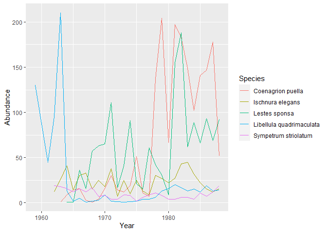
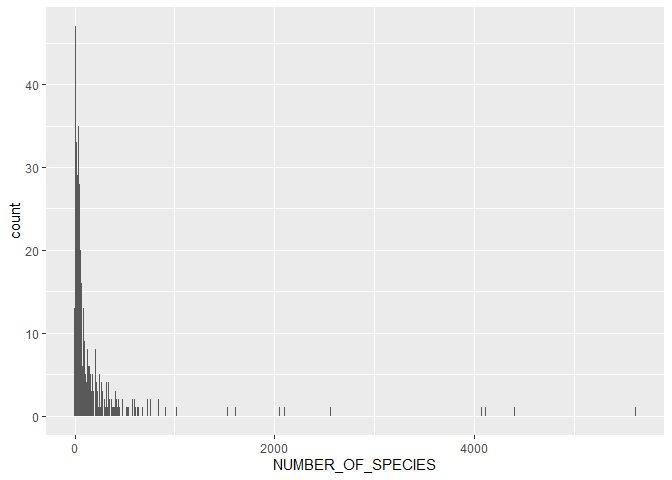
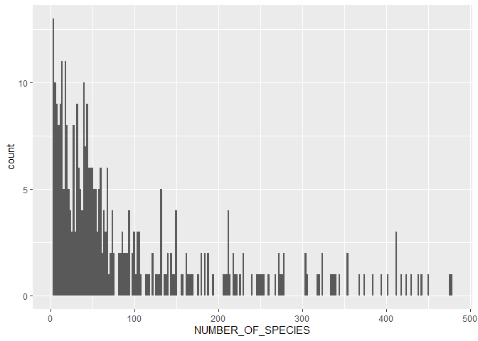
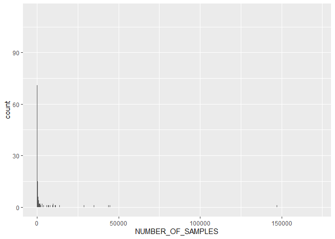

00-import-BioTIME-database
================
Compiled at 2023-04-24 13:34:29 UTC

``` r
here::i_am(paste0(params$name, ".Rmd"), uuid = "92e0b108-b72d-4d77-bf7a-4e46e4cde787")
```

The purpose of this document is to import and have a first look into the
BioTIME database from the paper *BioTIME: A database of biodiversity
time series for the Anthropocene*.

``` r
library("conflicted")
library(dplyr)
library(data.table)
library(ggplot2)
```

``` r
# create or *empty* the target directory, used to write this file's data: 
projthis::proj_create_dir_target(params$name, clean = TRUE)

# function to get path to target directory: path_target("sample.csv")
path_target <- projthis::proj_path_target(params$name)

# function to get path to previous data: path_source("00-import", "sample.csv")
path_source <- projthis::proj_path_source(params$name)
```

## Data

#### Read files

``` r
#### read the file
dt_fullquery <- 
  fread("data/BioTIME/BioTIMEquery_24_06_2021.csv")

# focus on one study
study_id = 63
```

#### Focus on only one study (ID = 63)

``` r
# extract one study
dt_query <- 
  dt_fullquery[STUDY_ID == study_id]

knitr::kable(head(dt_query))
```

|    V1 | STUDY_ID | DAY | MONTH | YEAR | SAMPLE_DESC                                     | PLOT | ID_SPECIES | LATITUDE | LONGITUDE | sum.allrawdata.ABUNDANCE | sum.allrawdata.BIOMASS | GENUS     | SPECIES        | GENUS_SPECIES            |
|------:|---------:|----:|------:|-----:|:------------------------------------------------|:-----|-----------:|---------:|----------:|-------------------------:|-----------------------:|:----------|:---------------|:-------------------------|
| 78181 |       63 |  NA |    NA | 1959 | 52.422100\_-0.180928_WoodwaltonFen_20smallPonds | NA   |       1414 |  52.4221 | -0.180928 |                      130 |                      0 | Libellula | quadrimaculata | Libellula quadrimaculata |
| 78182 |       63 |  NA |    NA | 1961 | 52.422100\_-0.180928_WoodwaltonFen_20smallPonds | NA   |       1414 |  52.4221 | -0.180928 |                       45 |                      0 | Libellula | quadrimaculata | Libellula quadrimaculata |
| 78183 |       63 |  NA |    NA | 1962 | 52.422100\_-0.180928_WoodwaltonFen_20smallPonds | NA   |       1309 |  52.4221 | -0.180928 |                       12 |                      0 | Ischnura  | elegans        | Ischnura elegans         |
| 78184 |       63 |  NA |    NA | 1962 | 52.422100\_-0.180928_WoodwaltonFen_20smallPonds | NA   |       1414 |  52.4221 | -0.180928 |                       95 |                      0 | Libellula | quadrimaculata | Libellula quadrimaculata |
| 78185 |       63 |  NA |    NA | 1962 | 52.422100\_-0.180928_WoodwaltonFen_20smallPonds | NA   |       2258 |  52.4221 | -0.180928 |                       19 |                      0 | Sympetrum | striolatum     | Sympetrum striolatum     |
| 78186 |       63 |  NA |    NA | 1963 | 52.422100\_-0.180928_WoodwaltonFen_20smallPonds | NA   |       1309 |  52.4221 | -0.180928 |                       26 |                      0 | Ischnura  | elegans        | Ischnura elegans         |

#### Some code from BioTIMEInteractions_02_04_2018.Rmd

``` r
TSrf <- list()
IDs <- unique(dt_query$STUDY_ID)

for(i in 1:length(IDs)) {
  data <- dt_query[dt_query$STUDY_ID == IDs[i], ]
  TSrf[[i]] <-
    rarefysamples(
      data$YEAR,
      data$SAMPLE_DESC,
      data$GENUS_SPECIES,
      data$sum.allrawdata.ABUNDANCE,
      1
    )
}
names(TSrf) <- IDs

rf <- do.call(rbind, TSrf)
rf <-
  data.frame(rf, ID = rep(names(TSrf), times = unlist(lapply(TSrf, nrow))))
rf <- rf[!is.na(rf$Year), -1]

#### prepare the rarefied output for diversity metric code
t1 <- with(rf, tapply(Abundance, list(Year, Species, ID), sum))
t2 <- unique(rf[, c("ID", "Year")])

#### produces a list of matrices for each study - in this case is only a single dataset
dsList <- list()

for (i in 1:dim(t1)[3]) {
  id <- dimnames(t1)[[3]][i]
  a <- subset(t2, ID == id)$Year
  b <- t1[dimnames(t1)[[1]] %in% as.character(a), , i]
  dsList[[i]] <- data.frame(Year = rownames(b), b)
}

names(dsList) <- dimnames(t1)[[3]]

#### replacing NA with zero
for(i in 1:(length(dsList))) {
  dsList[[i]][is.na(dsList[[i]])] <- 0
}
```

### Own Examples

#### plot time series for selected study

``` r
## group species
rf_grouped <- as.data.table(rf) %>% 
  # .[, c("Genus", "Species") := tstrsplit(Species, " ")] %>% 
  .[, .(Abundance_sum = sum(Abundance)),
        by = c("Year", "Species")]

ggplot(rf_grouped, aes(Year, Abundance_sum, col = Species)) +
  geom_line() #+
```

<!-- -->

``` r
  # theme(legend.position = "none")
```

#### create table of the selected time series

``` r
rf_time <- as.data.table(rf) %>% 
  # .[, c("Genus", "Species") := tstrsplit(Species, " ")] %>% 
  dcast(., Species ~ Year, value.var = "Abundance")

knitr::kable(rf_time, format="html")
```

<table>
<thead>
<tr>
<th style="text-align:left;">
Species
</th>
<th style="text-align:right;">
1959
</th>
<th style="text-align:right;">
1961
</th>
<th style="text-align:right;">
1962
</th>
<th style="text-align:right;">
1963
</th>
<th style="text-align:right;">
1964
</th>
<th style="text-align:right;">
1965
</th>
<th style="text-align:right;">
1966
</th>
<th style="text-align:right;">
1967
</th>
<th style="text-align:right;">
1968
</th>
<th style="text-align:right;">
1969
</th>
<th style="text-align:right;">
1970
</th>
<th style="text-align:right;">
1971
</th>
<th style="text-align:right;">
1972
</th>
<th style="text-align:right;">
1973
</th>
<th style="text-align:right;">
1974
</th>
<th style="text-align:right;">
1975
</th>
<th style="text-align:right;">
1976
</th>
<th style="text-align:right;">
1977
</th>
<th style="text-align:right;">
1978
</th>
<th style="text-align:right;">
1979
</th>
<th style="text-align:right;">
1980
</th>
<th style="text-align:right;">
1981
</th>
<th style="text-align:right;">
1982
</th>
<th style="text-align:right;">
1983
</th>
<th style="text-align:right;">
1984
</th>
<th style="text-align:right;">
1985
</th>
<th style="text-align:right;">
1986
</th>
<th style="text-align:right;">
1987
</th>
<th style="text-align:right;">
1988
</th>
</tr>
</thead>
<tbody>
<tr>
<td style="text-align:left;">
Coenagrion puella
</td>
<td style="text-align:right;">
NA
</td>
<td style="text-align:right;">
NA
</td>
<td style="text-align:right;">
NA
</td>
<td style="text-align:right;">
1
</td>
<td style="text-align:right;">
9
</td>
<td style="text-align:right;">
14
</td>
<td style="text-align:right;">
16
</td>
<td style="text-align:right;">
3
</td>
<td style="text-align:right;">
1
</td>
<td style="text-align:right;">
4
</td>
<td style="text-align:right;">
16
</td>
<td style="text-align:right;">
30
</td>
<td style="text-align:right;">
14
</td>
<td style="text-align:right;">
12
</td>
<td style="text-align:right;">
19
</td>
<td style="text-align:right;">
51
</td>
<td style="text-align:right;">
11
</td>
<td style="text-align:right;">
7
</td>
<td style="text-align:right;">
137
</td>
<td style="text-align:right;">
204
</td>
<td style="text-align:right;">
67
</td>
<td style="text-align:right;">
197
</td>
<td style="text-align:right;">
183
</td>
<td style="text-align:right;">
149
</td>
<td style="text-align:right;">
102
</td>
<td style="text-align:right;">
141
</td>
<td style="text-align:right;">
147
</td>
<td style="text-align:right;">
178
</td>
<td style="text-align:right;">
52
</td>
</tr>
<tr>
<td style="text-align:left;">
Ischnura elegans
</td>
<td style="text-align:right;">
NA
</td>
<td style="text-align:right;">
NA
</td>
<td style="text-align:right;">
12
</td>
<td style="text-align:right;">
26
</td>
<td style="text-align:right;">
41
</td>
<td style="text-align:right;">
14
</td>
<td style="text-align:right;">
30
</td>
<td style="text-align:right;">
33
</td>
<td style="text-align:right;">
15
</td>
<td style="text-align:right;">
25
</td>
<td style="text-align:right;">
18
</td>
<td style="text-align:right;">
38
</td>
<td style="text-align:right;">
7
</td>
<td style="text-align:right;">
25
</td>
<td style="text-align:right;">
10
</td>
<td style="text-align:right;">
25
</td>
<td style="text-align:right;">
13
</td>
<td style="text-align:right;">
9
</td>
<td style="text-align:right;">
30
</td>
<td style="text-align:right;">
27
</td>
<td style="text-align:right;">
22
</td>
<td style="text-align:right;">
27
</td>
<td style="text-align:right;">
43
</td>
<td style="text-align:right;">
45
</td>
<td style="text-align:right;">
32
</td>
<td style="text-align:right;">
22
</td>
<td style="text-align:right;">
15
</td>
<td style="text-align:right;">
12
</td>
<td style="text-align:right;">
16
</td>
</tr>
<tr>
<td style="text-align:left;">
Lestes sponsa
</td>
<td style="text-align:right;">
NA
</td>
<td style="text-align:right;">
NA
</td>
<td style="text-align:right;">
NA
</td>
<td style="text-align:right;">
NA
</td>
<td style="text-align:right;">
1
</td>
<td style="text-align:right;">
1
</td>
<td style="text-align:right;">
36
</td>
<td style="text-align:right;">
16
</td>
<td style="text-align:right;">
57
</td>
<td style="text-align:right;">
63
</td>
<td style="text-align:right;">
65
</td>
<td style="text-align:right;">
111
</td>
<td style="text-align:right;">
17
</td>
<td style="text-align:right;">
41
</td>
<td style="text-align:right;">
91
</td>
<td style="text-align:right;">
21
</td>
<td style="text-align:right;">
15
</td>
<td style="text-align:right;">
61
</td>
<td style="text-align:right;">
42
</td>
<td style="text-align:right;">
31
</td>
<td style="text-align:right;">
9
</td>
<td style="text-align:right;">
155
</td>
<td style="text-align:right;">
188
</td>
<td style="text-align:right;">
62
</td>
<td style="text-align:right;">
89
</td>
<td style="text-align:right;">
66
</td>
<td style="text-align:right;">
93
</td>
<td style="text-align:right;">
69
</td>
<td style="text-align:right;">
92
</td>
</tr>
<tr>
<td style="text-align:left;">
Libellula quadrimaculata
</td>
<td style="text-align:right;">
130
</td>
<td style="text-align:right;">
45
</td>
<td style="text-align:right;">
95
</td>
<td style="text-align:right;">
210
</td>
<td style="text-align:right;">
13
</td>
<td style="text-align:right;">
2
</td>
<td style="text-align:right;">
5
</td>
<td style="text-align:right;">
1
</td>
<td style="text-align:right;">
2
</td>
<td style="text-align:right;">
3
</td>
<td style="text-align:right;">
9
</td>
<td style="text-align:right;">
2
</td>
<td style="text-align:right;">
NA
</td>
<td style="text-align:right;">
1
</td>
<td style="text-align:right;">
NA
</td>
<td style="text-align:right;">
2
</td>
<td style="text-align:right;">
4
</td>
<td style="text-align:right;">
4
</td>
<td style="text-align:right;">
6
</td>
<td style="text-align:right;">
13
</td>
<td style="text-align:right;">
16
</td>
<td style="text-align:right;">
20
</td>
<td style="text-align:right;">
17
</td>
<td style="text-align:right;">
13
</td>
<td style="text-align:right;">
15
</td>
<td style="text-align:right;">
12
</td>
<td style="text-align:right;">
19
</td>
<td style="text-align:right;">
13
</td>
<td style="text-align:right;">
14
</td>
</tr>
<tr>
<td style="text-align:left;">
Sympetrum striolatum
</td>
<td style="text-align:right;">
NA
</td>
<td style="text-align:right;">
NA
</td>
<td style="text-align:right;">
19
</td>
<td style="text-align:right;">
18
</td>
<td style="text-align:right;">
16
</td>
<td style="text-align:right;">
12
</td>
<td style="text-align:right;">
16
</td>
<td style="text-align:right;">
12
</td>
<td style="text-align:right;">
17
</td>
<td style="text-align:right;">
7
</td>
<td style="text-align:right;">
8
</td>
<td style="text-align:right;">
4
</td>
<td style="text-align:right;">
4
</td>
<td style="text-align:right;">
9
</td>
<td style="text-align:right;">
8
</td>
<td style="text-align:right;">
2
</td>
<td style="text-align:right;">
6
</td>
<td style="text-align:right;">
9
</td>
<td style="text-align:right;">
11
</td>
<td style="text-align:right;">
8
</td>
<td style="text-align:right;">
4
</td>
<td style="text-align:right;">
4
</td>
<td style="text-align:right;">
6
</td>
<td style="text-align:right;">
6
</td>
<td style="text-align:right;">
4
</td>
<td style="text-align:right;">
11
</td>
<td style="text-align:right;">
7
</td>
<td style="text-align:right;">
12
</td>
<td style="text-align:right;">
19
</td>
</tr>
</tbody>
</table>

## BioTime Metadata

#### Read file

### Analysis of BioTIME Metadata

Select some important columns to get a better overview which studies are
included in the dataset.

Some of the Studies in the BioTIME data are listed in the table below
(only studies with at least 10 datapoints):

``` r
knitr::kable(dt_biotimeMeta_small[1:10, ])
```

| STUDY_ID | REALM       | CLIMATE   | TAXA               | DATA_POINTS | START_YEAR | END_YEAR | NUMBER_OF_SPECIES | NUMBER_OF_SAMPLES | TOTAL | ABUNDANCE_TYPE | BIOMASS_TYPE |
|---------:|:------------|:----------|:-------------------|------------:|-----------:|---------:|------------------:|------------------:|------:|:---------------|:-------------|
|       18 | Terrestrial | Temperate | Terrestrial plants |          29 |       1923 |     1973 |                98 |               542 |  8034 | Count          | NA           |
|       33 | Marine      | Temperate | Marine plants      |          18 |       1992 |     2009 |               170 |                 1 | 17841 | Count          | NA           |
|       39 | Terrestrial | Temperate | Birds              |          45 |       1970 |     2015 |                52 |                45 |   959 | Density        | NA           |
|       41 | Terrestrial | Temperate | Birds              |          10 |       1923 |     1940 |                56 |                10 |   418 | Count          | NA           |
|       45 | Marine      | Tropical  | Fish               |          10 |       2006 |     2015 |               338 |              1105 | 47282 | Count          | Size         |
|       46 | Terrestrial | Temperate | Birds              |          47 |       1928 |     1979 |                29 |                47 |   528 | Count          | NA           |
|       47 | Terrestrial | Temperate | Birds              |          26 |       1952 |     1977 |                13 |                35 |   392 | Count          | NA           |
|       51 | Terrestrial | Temperate | Birds              |          14 |       1964 |     1977 |                 4 |                 1 |    56 | MeanCount      | NA           |
|       52 | Terrestrial | Polar     | Mammals            |          13 |       1968 |     1980 |                 3 |                 5 |   144 | MeanCount      | NA           |
|       53 | Terrestrial | Temperate | Mammals            |          10 |       1966 |     1976 |                 5 |                 1 |    44 | MeanCount      | NA           |

#### Columns and their meaning

``` r
# list all column names of Metadata
dt_biotimeMeta %>% colnames()
```

    ##  [1] "STUDY_ID"          "REALM"             "CLIMATE"          
    ##  [4] "GENERAL_TREAT"     "TREATMENT"         "TREAT_COMMENTS"   
    ##  [7] "TREAT_DATE"        "HABITAT"           "PROTECTED_AREA"   
    ## [10] "BIOME_MAP"         "TAXA"              "ORGANISMS"        
    ## [13] "TITLE"             "AB_BIO"            "HAS_PLOT"         
    ## [16] "DATA_POINTS"       "START_YEAR"        "END_YEAR"         
    ## [19] "CENT_LAT"          "CENT_LONG"         "NUMBER_OF_SPECIES"
    ## [22] "NUMBER_OF_SAMPLES" "NUMBER_LAT_LONG"   "TOTAL"            
    ## [25] "GRAIN_SIZE_TEXT"   "GRAIN_SQ_KM"       "AREA_SQ_KM"       
    ## [28] "CONTACT_1"         "CONTACT_2"         "CONT_1_MAIL"      
    ## [31] "CONT_2_MAIL"       "LICENSE"           "WEB_LINK"         
    ## [34] "DATA_SOURCE"       "METHODS"           "SUMMARY_METHODS"  
    ## [37] "LINK_ID"           "COMMENTS"          "DATE_STUDY_ADDED" 
    ## [40] "ABUNDANCE_TYPE"    "BIOMASS_TYPE"      "SAMPLE_DESC_NAME"

##### REALM

``` r
dt_biotimeMeta$REALM %>% unique()
```

    ## [1] "Terrestrial" "Marine"      "Freshwater"

##### CLIMATE

``` r
dt_biotimeMeta$CLIMATE %>% unique()
```

    ## [1] "Temperate"          "Tropical"           "Polar"             
    ## [4] "Polar/Temperate"    "Temperate/Tropical" "Global"

##### TAXA

``` r
dt_biotimeMeta$TAXA %>% unique()
```

    ##  [1] "Terrestrial plants"        "Marine plants"            
    ##  [3] "Birds"                     "Fish"                     
    ##  [5] "Mammals"                   "Terrestrial invertebrates"
    ##  [7] "Marine invertebrates"      "Benthos"                  
    ##  [9] "All"                       "Freshwater invertebrates" 
    ## [11] "Freshwater plants"         "Reptiles"                 
    ## [13] "Amphibians"                "Fungi"

##### NUMBER_OF_SPECIES

``` r
ggplot(dt_biotimeMeta, aes(NUMBER_OF_SPECIES)) +
  geom_histogram(binwidth = 10)
```

<!-- -->

``` r
ggplot(dt_biotimeMeta[NUMBER_OF_SPECIES < 500], aes(NUMBER_OF_SPECIES)) +
  geom_histogram(binwidth = 2)
```

<!-- -->

##### NUMBER_OF_SAMPLES

``` r
dt_biotimeMeta$NUMBER_OF_SAMPLES %>% range()
```

    ## [1]      1 171843

``` r
ggplot(dt_biotimeMeta, aes(NUMBER_OF_SAMPLES)) +
  geom_histogram(binwidth = 100)
```

<!-- -->

``` r
ggplot(dt_biotimeMeta[NUMBER_OF_SAMPLES < 100], aes(NUMBER_OF_SAMPLES)) +
  geom_histogram(binwidth = 1)
```

<!-- -->

##### NUMBER_LAT_LONG

``` r
dt_biotimeMeta$NUMBER_LAT_LONG %>% range()
```

    ## [1]     1 93906

``` r
knitr::kable(dt_biotimeMeta$NUMBER_LAT_LONG %>% table() %>% head()) # mostly 1
```

| .   | Freq |
|:----|-----:|
| 1   |  170 |
| 2   |   14 |
| 3   |    4 |
| 4   |    5 |
| 5   |    2 |
| 6   |    7 |

##### ABUNDANCE_TYPE

``` r
knitr::kable(dt_biotimeMeta$ABUNDANCE_TYPE %>% table())
```

| .                | Freq |
|:-----------------|-----:|
| Count            |  262 |
| Density          |   40 |
| MeanCount        |    7 |
| Presence/Absence |   28 |

##### BIOMASS_TYPE

``` r
knitr::kable(dt_biotimeMeta$BIOMASS_TYPE %>% table())
```

| .      | Freq |
|:-------|-----:|
| Cover  |   34 |
| Size   |    3 |
| Volume |    3 |
| Weight |   68 |

## Files written

These files have been written to the target directory,
`data/00-import-BioTIME-database`:

``` r
projthis::proj_dir_info(path_target())
```

    ## # A tibble: 0 × 4
    ## # ℹ 4 variables: path <fs::path>, type <fct>, size <fs::bytes>,
    ## #   modification_time <dttm>
