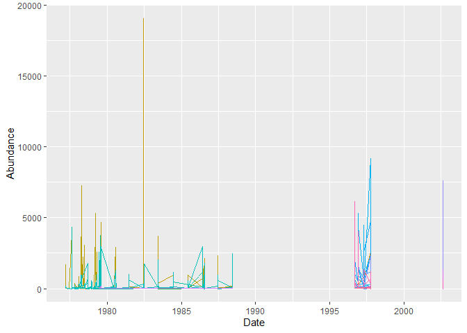
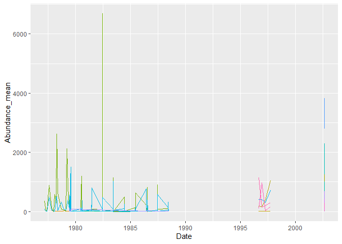
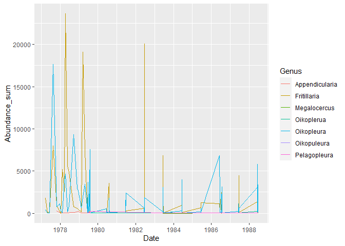
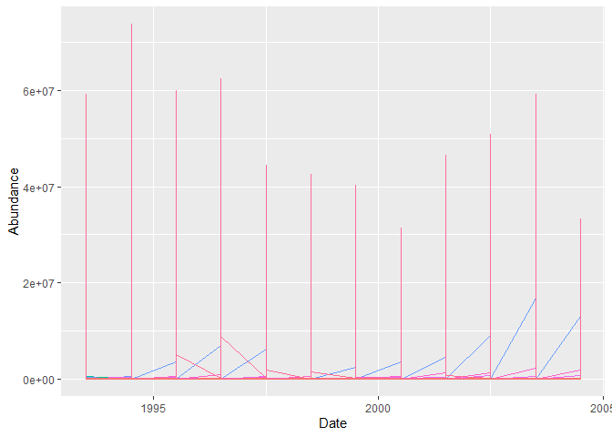
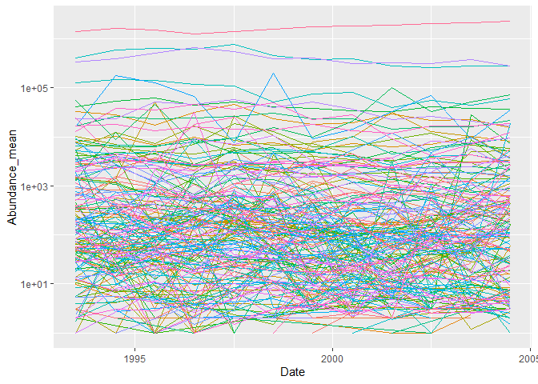
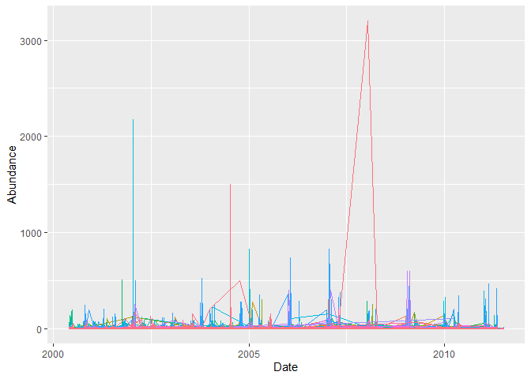
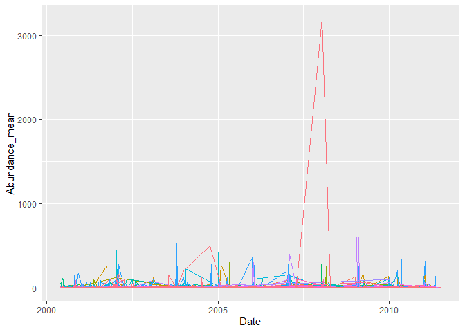
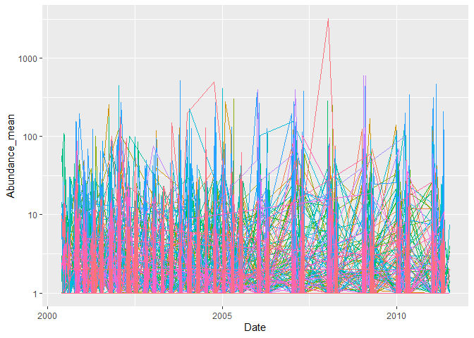
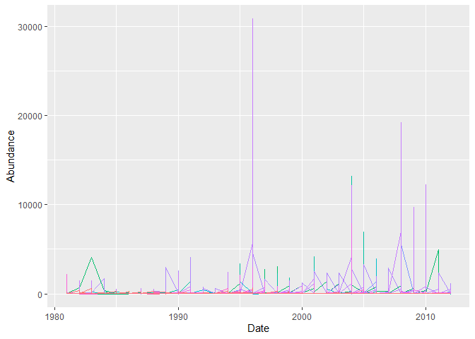
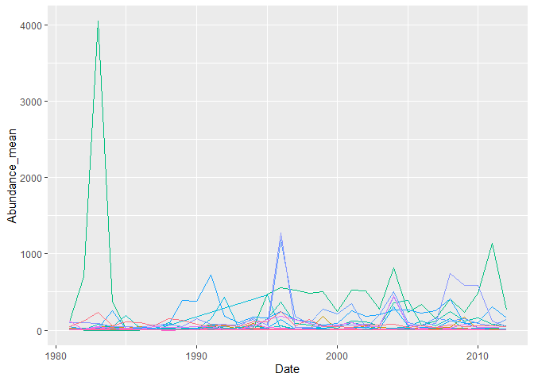

Different time series
================
Compiled at 2023-04-27 10:07:48 UTC

``` r
here::i_am(paste0(params$name, ".Rmd"), uuid = "964cf30c-e7ec-4fee-a704-f01c350f8766")
```

The purpose of this document is to give an overview of different time
series that can be used in the further process. These time series can
differ in

- number of species
- number of time points

#### Packages

``` r
library("conflicted")
library(dplyr)
library(data.table)
library(ggplot2)
```

``` r
# create or *empty* the target directory, used to write this file's data: 
projthis::proj_create_dir_target(params$name, clean = TRUE)

# function to get path to target directory: path_target("sample.csv")
path_target <- projthis::proj_path_target(params$name)

# function to get path to previous data: path_source("00-import", "sample.csv")
path_source <- projthis::proj_path_source(params$name)
```

## BioTIME

#### Read Data

``` r
#### read the file
dt_fullquery <- 
  fread("data/BioTIME/BioTIMEquery_24_06_2021.csv")

#### read BioTIME Metadata
dt_biotimeMeta <-
  fread("data/00-import-BioTIME-database/BioTIME_Meta_reduced.csv")
```

#### Criteria to select a suitable study

- there should be enough DATA_POINTS
- certain Abundance Type (“Count”)

``` r
# Example
dt_biotimeMeta[DATA_POINTS > 10 & ABUNDANCE_TYPE == "Count" & NUMBER_LAT_LONG == 1 & NUMBER_OF_SPECIES > 50]$STUDY_ID
```

    ##  [1]  18  33  57 225 240 248 249 313 335 336 340 379 419 427 441 473 478

## Bad Example (with gaps in time)

``` r
study_id = 152

# extract data of the specific study
dt_study <-
  extract_study(dt_fullquery, ID = study_id)

# summarize over multiple entries in the same year
dt_study_grouped <-
  dt_study[, .(Abundance_mean = mean(Abundance)),
    by = c("Date", "Genus")]


# plot timeseries
ggplot(dt_study, aes(Date, Abundance)) +
  geom_line(aes(col = GENUS_SPECIES))  +
  theme(legend.position = "none")
```

<!-- -->

``` r
# plot Abundance summed up for same Date
ggplot(dt_study_grouped, aes(Date, Abundance_mean)) +
  geom_line(aes(col = Genus))  +
  theme(legend.position = "none")
```

<!-- -->

``` r
# plot only first part
ggplot(dt_study_grouped[Date < "1990-01-01"], aes(Date, Abundance_mean)) +
  geom_line(aes(col = Genus)) 
```

<!-- -->

``` r
dt_study_grouped[Genus == "Fritillaria"] %>% View()

# multiple values on consecutive days (e.g. 1982-06-XY)
```

## 2nd Example

Example with multiple locations.

``` r
study_id = 163
```

#### Information on the study

| Column            | Info                                                             |
|:------------------|:-----------------------------------------------------------------|
| STUDY_ID          | 163                                                              |
| REALM             | Marine                                                           |
| CLIMATE           | Temperate                                                        |
| TAXA              | Benthos                                                          |
| TITLE             | North Pacific Groundfish Observer (North Pacific Research Board) |
| AB_BIO            | AB                                                               |
| DATA_POINTS       | 12                                                               |
| START_YEAR        | 1993                                                             |
| END_YEAR          | 2004                                                             |
| NUMBER_OF_SPECIES | 355                                                              |
| NUMBER_OF_SAMPLES | 1827                                                             |
| NUMBER_LAT_LONG   | 1827                                                             |
| TOTAL             | 419940                                                           |
| ABUNDANCE_TYPE    | Count                                                            |
| BIOMASS_TYPE      | Weight                                                           |

### time series plots

``` r
# extract data of the specific study
dt_study <-
  extract_study(dt_fullquery, ID = study_id)

# summarize over multiple entries in the same year
dt_study_grouped <-
  dt_study[, .(Abundance_mean = mean(Abundance)),
    by = c("Date", "Genus")]


# plot timeseries
ggplot(dt_study, aes(Date, Abundance)) +
  geom_line(aes(col = GENUS_SPECIES))  +
  theme(legend.position = "none")
```

<!-- -->

``` r
# plot Abundance summed up for same Date
ggplot(dt_study_grouped, aes(Date, Abundance_mean)) +
  geom_line(aes(col = Genus))  +
  theme(legend.position = "none")
```

<!-- -->

``` r
# same plot with y log-scaled
ggplot(dt_study_grouped, aes(Date, Abundance_mean)) +
  geom_line(aes(col = Genus))  +
  theme(legend.position = "none") +
  scale_y_log10()
```

<!-- -->

``` r
dt_study_grouped[Abundance_mean < 10]
```

    ##            Date            Genus Abundance_mean
    ##   1: 1996-07-01         Diomedea       5.932432
    ##   2: 1996-07-01      Diomedeidae       3.166667
    ##   3: 1996-07-01 Procellariformes       2.800000
    ##   4: 1996-07-01            Lamna       3.187500
    ##   5: 1996-07-01          Larinae       9.862069
    ##  ---                                           
    ## 342: 2003-07-02             Uria       3.250000
    ## 343: 2003-07-02         Sarritor       3.000000
    ## 344: 2003-07-02     Hydrobatidae       3.000000
    ## 345: 2003-07-02         Prionace       2.500000
    ## 346: 2003-07-02     Gymnocanthus       3.000000

## 3rd Example

``` r
study_id = 225
```

#### Information on the study

| Column            | Info                                                                                                                              |
|:------------------|:----------------------------------------------------------------------------------------------------------------------------------|
| STUDY_ID          | 225                                                                                                                               |
| REALM             | Terrestrial                                                                                                                       |
| CLIMATE           | Temperate                                                                                                                         |
| TAXA              | Birds                                                                                                                             |
| TITLE             | Point count bird censusing long-term monitoring of bird distrubution and diversity in central Arizona-Phoenix period 2000 to 2011 |
| AB_BIO            | A                                                                                                                                 |
| DATA_POINTS       | 12                                                                                                                                |
| START_YEAR        | 2000                                                                                                                              |
| END_YEAR          | 2011                                                                                                                              |
| NUMBER_OF_SPECIES | 278                                                                                                                               |
| NUMBER_OF_SAMPLES | 4865                                                                                                                              |
| NUMBER_LAT_LONG   | 1                                                                                                                                 |
| TOTAL             | 48841                                                                                                                             |
| ABUNDANCE_TYPE    | Count                                                                                                                             |
| BIOMASS_TYPE      | NA                                                                                                                                |

### time series plots

``` r
# extract data of the specific study
dt_study <-
  extract_study(dt_fullquery, ID = study_id)

# summarize over multiple entries in the same year
dt_study_grouped <-
  dt_study[, .(Abundance_mean = mean(Abundance)),
    by = c("Date", "Genus")]


# plot timeseries
ggplot(dt_study, aes(Date, Abundance)) +
  geom_line(aes(col = GENUS_SPECIES))  +
  theme(legend.position = "none")
```

    ## Warning: Removed 209 rows containing missing values (`geom_line()`).

<!-- -->

``` r
# plot Abundance summed up for same Date
ggplot(dt_study_grouped, aes(Date, Abundance_mean)) +
  geom_line(aes(col = Genus))  +
  theme(legend.position = "none")
```

    ## Warning: Removed 49 rows containing missing values (`geom_line()`).

<!-- -->

``` r
# same plot with y log-scaled
ggplot(dt_study_grouped, aes(Date, Abundance_mean)) +
  geom_line(aes(col = Genus))  +
  theme(legend.position = "none") +
  scale_y_log10()
```

    ## Warning: Removed 49 rows containing missing values (`geom_line()`).

<!-- -->

## 4th Example

``` r
study_id = 57
```

#### Information on the study

| Column            | Info                                      |
|:------------------|:------------------------------------------|
| STUDY_ID          | 57                                        |
| REALM             | Freshwater                                |
| CLIMATE           | Temperate                                 |
| TAXA              | Fish                                      |
| TITLE             | North Temperate Lakes LTER Fish Abundance |
| AB_BIO            | A                                         |
| DATA_POINTS       | 32                                        |
| START_YEAR        | 1981                                      |
| END_YEAR          | 2012                                      |
| NUMBER_OF_SPECIES | 76                                        |
| NUMBER_OF_SAMPLES | 258                                       |
| NUMBER_LAT_LONG   | 1                                         |
| TOTAL             | 10892                                     |
| ABUNDANCE_TYPE    | Count                                     |
| BIOMASS_TYPE      | NA                                        |

### time series plots

``` r
# extract data of the specific study
dt_study <-
  extract_study(dt_fullquery, ID = study_id)

# summarize over multiple entries in the same year
dt_study_grouped <-
  dt_study[, .(Abundance_mean = mean(Abundance)),
    by = c("Date", "Genus")]

# number of entries per Date and Genus
dt_study[, .N, by= c("Date", "Genus")]
```

    ##      Date       Genus  N
    ##   1: 1981 Ambloplites 23
    ##   2: 1981   Catasomus 14
    ##   3: 1981      Cottus  3
    ##   4: 1981        Esox 11
    ##   5: 1981  Etheostoma 12
    ##  ---                    
    ## 960: 2012   Ictalurus  1
    ## 961: 2012        Amia  1
    ## 962: 2012 Lepisosteus  2
    ## 963: 2012   Percopsis  1
    ## 964: 2012  Salvelinus  5

``` r
# plot timeseries
ggplot(dt_study, aes(Date, Abundance)) +
  geom_line(aes(col = GENUS_SPECIES))  +
  theme(legend.position = "none")
```

<!-- -->

``` r
# plot Abundance summed up for same Date
ggplot(dt_study_grouped, aes(Date, Abundance_mean)) +
  geom_line(aes(col = Genus))  +
  theme(legend.position = "none")
```

<!-- -->

``` r
# same plot with y log-scaled
ggplot(dt_study_grouped, aes(Date, Abundance_mean)) +
  geom_line(aes(col = Genus))  +
  theme(legend.position = "bottom") +
  scale_y_log10()
```

<!-- -->

## Files written

These files have been written to the target directory,
`data/01-different-time-series`:

``` r
projthis::proj_dir_info(path_target())
```

    ## # A tibble: 0 × 4
    ## # ℹ 4 variables: path <fs::path>, type <fct>, size <fs::bytes>,
    ## #   modification_time <dttm>
