Time series (BioTIME)
================

``` r
here::i_am(paste0(params$name, ".Rmd"), uuid = "964cf30c-e7ec-4fee-a704-f01c350f8766")
```

The purpose of this document is to analyse different time series from
the BioTIME database that could be interesting for the further process.

#### Packages

``` r
library("conflicted")
library(dplyr)
library(data.table)
library(ggplot2)
library(viridis) # for color palettes
```

    ## Lade nötiges Paket: viridisLite

``` r
library(RColorBrewer)
```

``` r
# create or *empty* the target directory, used to write this file's data: 
projthis::proj_create_dir_target(params$name, clean = TRUE)

# function to get path to target directory: path_target("sample.csv")
path_target <- projthis::proj_path_target(params$name)

# function to get path to previous data: path_source("00-import", "sample.csv")
path_source <- projthis::proj_path_source(params$name)
```

## BioTIME

#### Read Data

``` r
#### read the file
dt_fullquery <- 
  fread("data/BioTIME/BioTIMEquery_24_06_2021.csv")

#### read BioTIME Metadata
dt_biotimeMeta <-
  fread("data/00-import-BioTIME-database/BioTIME_Meta_reduced.csv")
```

#### Criteria to select a suitable study

- there should be enough DATA_POINTS (\>50)
- certain Abundance Type (“Count”) –\> not so important
- the samples should be taken from only one location
- the intervals between the time steps should be equal (e.g. one year)

``` r
# show available studies
dt_biotimeMeta[DATA_POINTS > 35 & NUMBER_LAT_LONG == 1] %>%
# dt_biotimeMeta[DATA_POINTS > 35 & NUMBER_LAT_LONG == 1 & AB_BIO %in% c("AB", "A")] %>%
  .[, YEARS := paste0(START_YEAR, "-", END_YEAR)] %>% 
  .[, c("TITLE", "AB_BIO", "REALM", "CLIMATE", "START_YEAR", "END_YEAR") := NULL]%>% 
  .[order(-DATA_POINTS)] %>% 
  knitr::kable()
```

| STUDY_ID | TAXA                     | DATA_POINTS | NUMBER_OF_SPECIES | NUMBER_OF_SAMPLES | NUMBER_LAT_LONG |  TOTAL | ABUNDANCE_TYPE | BIOMASS_TYPE | YEARS     |
|---------:|:-------------------------|------------:|------------------:|------------------:|----------------:|-------:|:---------------|:-------------|:----------|
|      339 | Birds                    |          57 |                39 |                57 |               1 |   1210 | Count          | NA           | 1953-2009 |
|      298 | Terrestrial plants       |          56 |               146 |            147201 |               1 | 147201 | NA             | Cover        | 1903-1972 |
|      414 | Birds                    |          48 |                48 |                48 |               1 |    963 | Density        | NA           | 1924-1976 |
|       46 | Birds                    |          47 |                29 |                47 |               1 |    528 | Count          | NA           | 1928-1979 |
|       39 | Birds                    |          45 |                52 |                45 |               1 |    959 | Density        | NA           | 1970-2015 |
|      413 | Birds                    |          44 |                60 |               177 |               1 |   1196 | Density        | NA           | 1927-1976 |
|      360 | Birds                    |          40 |                86 |               277 |               1 |  10061 | NA             | Weight       | 1975-2014 |
|      363 | Birds                    |          37 |                35 |                37 |               1 |    636 | Count          | NA           | 1963-1999 |
|      478 | Freshwater invertebrates |          37 |                90 |                37 |               1 |   1537 | Count          | NA           | 1969-2005 |

We need Time Series with at least 50 time steps.

Further Criteria for useful time series:

- 50 time points

- time steps should be at equal intervals

- location of sampling should be only one

## Data Preprocessing and Plotting

Function to preprocess data given a study ID and plot abundances
afterwards.

#### Preprocessing steps of the sample data for each study:

1.  extracting the study ID from the whole dataset
2.  for Genus add Abundances at the same Date / same Genus
3.  calculating relative abundance by
    1)  Species
    2)  Genus (sum of abundance over the samples)
4.  Check how many Species/Genus have relative abundance below certain
    threshold -\> group them as “other”
5.  sum up abundances for group “other”

``` r
# create color vector for plotting
qual_col_pals = brewer.pal.info[brewer.pal.info$category == 'qual',]
col_vector = unlist(mapply(brewer.pal, qual_col_pals$maxcolors, rownames(qual_col_pals)))
```

``` r
study_processing_bioTIME <-
  function(study_id, th_species = 0.05, th_genus = 0.05) {
    
    # Metadata (Information about this study)
    study_Meta <-
      dt_biotimeMeta[STUDY_ID == study_id]
    
    table_Meta <-
      data.table(Column = colnames(study_Meta),
                 Info = as.character(study_Meta[1,]))
    
    print(knitr::kable(table_Meta))
    cat("\n")
    
    
    # 1)  extract data of the specific study
    dt_study <-
      extract_study(dt_fullquery, ID = study_id)
    
    ## add zeros for missing values
    
    ### generate data.table with all combinations of Species/Genus and Time
    all_combinations <-
      as.data.table(tidyr::crossing(unique(dt_study$Time), unique(dt_study$Species)))
    colnames(all_combinations) <- c("Time", "Species")
    all_combinations[, Abundance := 0] %>% 
      .[, c("Genus", "tmp") := tstrsplit(Species, " ")] %>% 
      .[, tmp := NULL]
    
    ### merge combinations and zero values to dt_study
    dt_study <- 
      merge(dt_study, all_combinations,
            by = c("Time", "Species", "Genus"),
            all = T) %>% 
      .[, Abundance := Abundance.x] %>% 
      .[is.na(Abundance.x), Abundance := Abundance.y] %>% 
      .[, c("Abundance.x", "Abundance.y") := NULL]
    
    
    # 2)  summarize over multiple entries in the same year
    dt_study_genus <-
      dt_study[, .(Abundance_sum = sum(Abundance)),
        by = c("Time", "Genus")]
    
    
    # 3)  add relative abundance
    
    ## Species
    dt_study[, Abundance_rel := Abundance/ sum(Abundance), 
             by = c("Time")]
    
    ## Genus
    dt_study_genus[, Abundance_rel := Abundance_sum / sum(Abundance_sum), 
             by = c("Time")]
    
    
    # 3)  Group Species/Genus with relative abundance below a certain threshold as "other"
    
    ## add Species "other" for max. rel. abundance < threshold
    Species_other <-
      dt_study[, .(max_Abundance = max(Abundance_rel)),
             by = c("Species")] %>% 
      .[max_Abundance < th_species, .(Species)]
    
    dt_study_species <-
      dt_study[, Species_grouped := Species] %>% 
      .[Species %in% Species_other$Species, Species_grouped := "other"]
    
    ## add Genus "other" for max. rel. abundance < threshold
    Genus_other <-
      dt_study_genus[, .(max_Abundance = max(Abundance_rel)),
             by = c("Genus")] %>% 
      .[max_Abundance < th_genus, .(Genus)]
    
    dt_study_genus[, Genus_grouped := Genus] %>% 
      .[Genus %in% Genus_other$Genus, Genus_grouped := "other"]
    
    
    # 5)  sum up abundances for group "other"
    
    ## Species
    dt_study_species <-
      dt_study_species[, .(Abundance = sum(Abundance),
                           Abundance_rel = sum(Abundance_rel)),
        by = c("Time", "Species_grouped")]
    
    ## Genus
    dt_study_genus <-
      dt_study_genus[, .(Abundance_sum = sum(Abundance_sum),
                         Abundance_rel = sum(Abundance_rel)),
        by = c("Time", "Genus_grouped")]
    
    
    ### plot timeseries
    
    # if number of species/genus is too large, then do not plot legend
    # Species
    n_species <- uniqueN(dt_study_species$Species)
    if(n_species > 20){
      legend_species = "none"
    } else {
      legend_species = "right"
    }
    # Genus
    n_genus <- uniqueN(dt_study_genus$Genus)
    if(n_genus > 20){
      legend_genus = "none"
    } else {
      legend_genus = "right"
    }
    
    # by Species, total
    pl_species_total <-
      ggplot(dt_study_species, aes(Time, Abundance)) +
      geom_line(aes(col = Species_grouped))  +
      labs(title = "by Species, total Abundances") +
      theme(legend.position = legend_species) +
      scale_color_viridis(discrete = TRUE, option = "turbo")
      # scale_color_discrete(type = sample(col_vector, n_species))
    
    # by Species, relative
    pl_species_rel <-
      ggplot(dt_study_species, aes(Time, Abundance_rel)) +
      geom_bar(aes(fill = Species_grouped), stat = "identity") +
      labs(title = "by Species, relative Abundances") +
      theme(legend.position = legend_species) +
      scale_fill_viridis(discrete = TRUE, option = "turbo")
      # scale_fill_discrete(type = sample(col_vector, n_species))
    
    # by Genus, total (Abundance summed up)
    pl_genus_total <-
      ggplot(dt_study_genus, aes(Time, Abundance_sum)) +
      geom_line(aes(col = Genus_grouped))  +
      labs(title = "by Genus, total Abundances") +
      theme(legend.position = legend_genus) +
      scale_color_viridis(discrete = TRUE, option = "turbo") 
    
    # by Genus, relative (Abundance summed up)
    pl_genus_rel <-
      ggplot(dt_study_genus, aes(Time, Abundance_rel)) +
      geom_bar(aes(fill = Genus_grouped), stat = "identity")  +
      labs(title = "by Genus, relative Abundances") +
      theme(legend.position = legend_genus) +
      scale_fill_viridis(discrete = TRUE, option = "turbo") 
    
    print(pl_species_total)
    print(pl_species_rel)
    print(pl_genus_total)
    print(pl_genus_rel)
  }
```

# Examples

## (1)

``` r
study_processing_bioTIME(study_id = 339)
```

    ## 
    ## 
    ## |Column            |Info                                                                                                                 |
    ## |:-----------------|:--------------------------------------------------------------------------------------------------------------------|
    ## |STUDY_ID          |339                                                                                                                  |
    ## |REALM             |Terrestrial                                                                                                          |
    ## |CLIMATE           |Temperate                                                                                                            |
    ## |TAXA              |Birds                                                                                                                |
    ## |TITLE             |Species trends turnover and composition of a woodland bird community in southern Sweden during a period of 57 years. |
    ## |AB_BIO            |A                                                                                                                    |
    ## |DATA_POINTS       |57                                                                                                                   |
    ## |START_YEAR        |1953                                                                                                                 |
    ## |END_YEAR          |2009                                                                                                                 |
    ## |NUMBER_OF_SPECIES |39                                                                                                                   |
    ## |NUMBER_OF_SAMPLES |57                                                                                                                   |
    ## |NUMBER_LAT_LONG   |1                                                                                                                    |
    ## |TOTAL             |1210                                                                                                                 |
    ## |ABUNDANCE_TYPE    |Count                                                                                                                |
    ## |BIOMASS_TYPE      |NA                                                                                                                   |

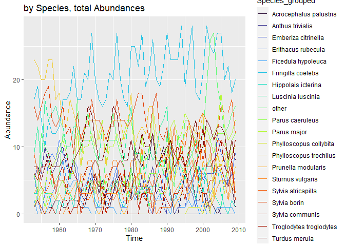<!-- -->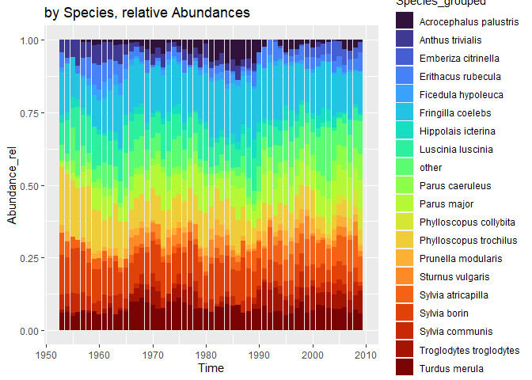<!-- --><!-- --><!-- -->

<br>

## (2)

``` r
study_processing_bioTIME(study_id = 478)
```

    ## 
    ## 
    ## |Column            |Info                                                        |
    ## |:-----------------|:-----------------------------------------------------------|
    ## |STUDY_ID          |478                                                         |
    ## |REALM             |Freshwater                                                  |
    ## |CLIMATE           |Temperate                                                   |
    ## |TAXA              |Freshwater invertebrates                                    |
    ## |TITLE             |Long term study of the stream ecosystems in the Breitenbach |
    ## |AB_BIO            |A                                                           |
    ## |DATA_POINTS       |37                                                          |
    ## |START_YEAR        |1969                                                        |
    ## |END_YEAR          |2005                                                        |
    ## |NUMBER_OF_SPECIES |90                                                          |
    ## |NUMBER_OF_SAMPLES |37                                                          |
    ## |NUMBER_LAT_LONG   |1                                                           |
    ## |TOTAL             |1537                                                        |
    ## |ABUNDANCE_TYPE    |Count                                                       |
    ## |BIOMASS_TYPE      |NA                                                          |

<!-- --><!-- --><!-- --><!-- -->

<br>

## (3)

``` r
study_processing_bioTIME(study_id = 363)
```

    ## 
    ## 
    ## |Column            |Info                                                                                                                                                  |
    ## |:-----------------|:-----------------------------------------------------------------------------------------------------------------------------------------------------|
    ## |STUDY_ID          |363                                                                                                                                                   |
    ## |REALM             |Terrestrial                                                                                                                                           |
    ## |CLIMATE           |Temperate                                                                                                                                             |
    ## |TAXA              |Birds                                                                                                                                                 |
    ## |TITLE             |The 37-year dynamics of a subalpine bird community with special emphasis on the influence of environmental temperature and Epirrita autumnata cycles. |
    ## |AB_BIO            |A                                                                                                                                                     |
    ## |DATA_POINTS       |37                                                                                                                                                    |
    ## |START_YEAR        |1963                                                                                                                                                  |
    ## |END_YEAR          |1999                                                                                                                                                  |
    ## |NUMBER_OF_SPECIES |35                                                                                                                                                    |
    ## |NUMBER_OF_SAMPLES |37                                                                                                                                                    |
    ## |NUMBER_LAT_LONG   |1                                                                                                                                                     |
    ## |TOTAL             |636                                                                                                                                                   |
    ## |ABUNDANCE_TYPE    |Count                                                                                                                                                 |
    ## |BIOMASS_TYPE      |NA                                                                                                                                                    |

<!-- --><!-- --><!-- --><!-- -->

<br>

## other Examples

``` r
study_processing_bioTIME(study_id = 414)
```

    ## 
    ## 
    ## |Column            |Info                                                                                                   |
    ## |:-----------------|:------------------------------------------------------------------------------------------------------|
    ## |STUDY_ID          |414                                                                                                    |
    ## |REALM             |Terrestrial                                                                                            |
    ## |CLIMATE           |Temperate                                                                                              |
    ## |TAXA              |Birds                                                                                                  |
    ## |TITLE             |Bird populations in east central Illinois. Fluctuations variations and development over a half-century |
    ## |AB_BIO            |A                                                                                                      |
    ## |DATA_POINTS       |48                                                                                                     |
    ## |START_YEAR        |1924                                                                                                   |
    ## |END_YEAR          |1976                                                                                                   |
    ## |NUMBER_OF_SPECIES |48                                                                                                     |
    ## |NUMBER_OF_SAMPLES |48                                                                                                     |
    ## |NUMBER_LAT_LONG   |1                                                                                                      |
    ## |TOTAL             |963                                                                                                    |
    ## |ABUNDANCE_TYPE    |Density                                                                                                |
    ## |BIOMASS_TYPE      |NA                                                                                                     |

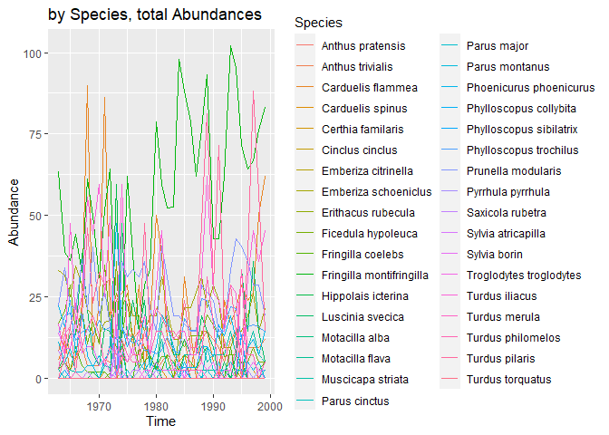<!-- -->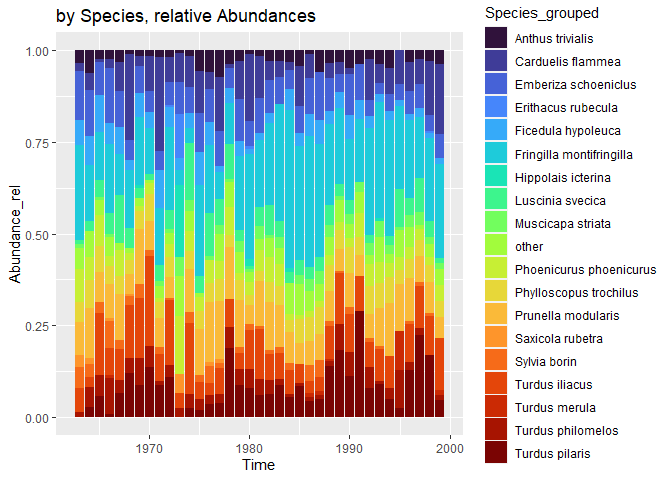<!-- -->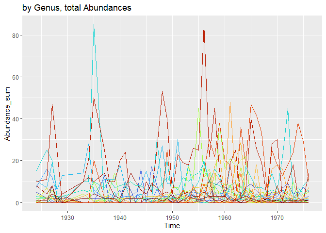<!-- -->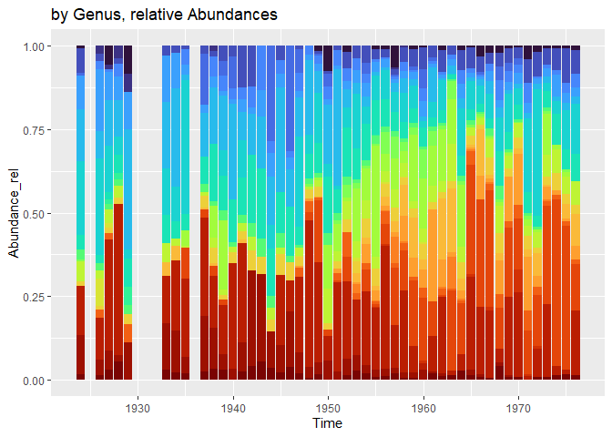<!-- -->

``` r
study_processing_bioTIME(study_id = 46, th_species = 0.01, th_genus = 0.01)
```

    ## 
    ## 
    ## |Column            |Info                      |
    ## |:-----------------|:-------------------------|
    ## |STUDY_ID          |46                        |
    ## |REALM             |Terrestrial               |
    ## |CLIMATE           |Temperate                 |
    ## |TAXA              |Birds                     |
    ## |TITLE             |Skokholm Bird Observatory |
    ## |AB_BIO            |A                         |
    ## |DATA_POINTS       |47                        |
    ## |START_YEAR        |1928                      |
    ## |END_YEAR          |1979                      |
    ## |NUMBER_OF_SPECIES |29                        |
    ## |NUMBER_OF_SAMPLES |47                        |
    ## |NUMBER_LAT_LONG   |1                         |
    ## |TOTAL             |528                       |
    ## |ABUNDANCE_TYPE    |Count                     |
    ## |BIOMASS_TYPE      |NA                        |

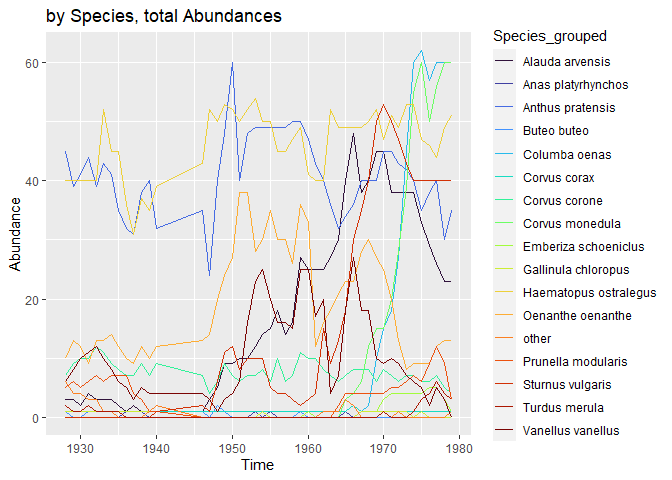<!-- -->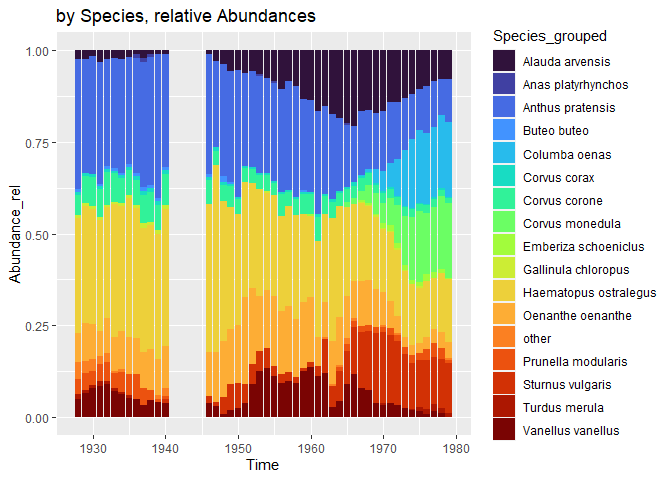<!-- -->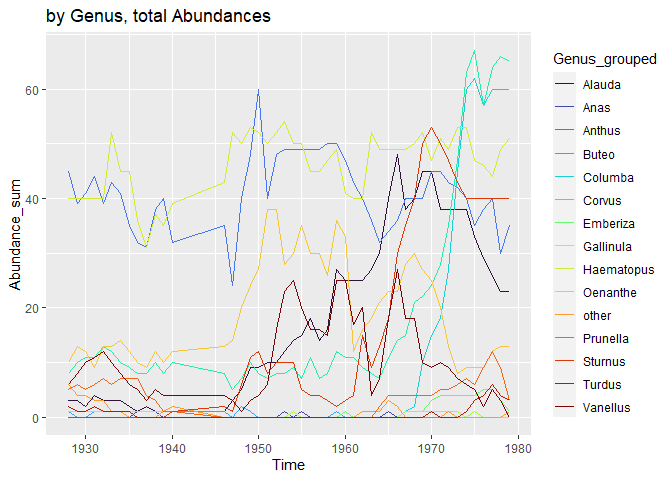<!-- -->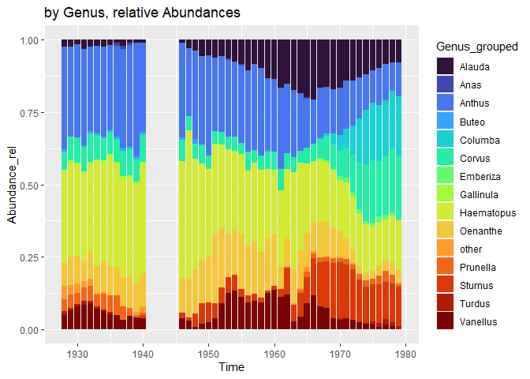<!-- -->

``` r
study_processing_bioTIME(study_id = 39)
```

    ## 
    ## 
    ## |Column            |Info                                                                                      |
    ## |:-----------------|:-----------------------------------------------------------------------------------------|
    ## |STUDY_ID          |39                                                                                        |
    ## |REALM             |Terrestrial                                                                               |
    ## |CLIMATE           |Temperate                                                                                 |
    ## |TAXA              |Birds                                                                                     |
    ## |TITLE             |Bird community dynamics in a temperate deciduous forest Long-term trends at Hubbard Brook |
    ## |AB_BIO            |A                                                                                         |
    ## |DATA_POINTS       |45                                                                                        |
    ## |START_YEAR        |1970                                                                                      |
    ## |END_YEAR          |2015                                                                                      |
    ## |NUMBER_OF_SPECIES |52                                                                                        |
    ## |NUMBER_OF_SAMPLES |45                                                                                        |
    ## |NUMBER_LAT_LONG   |1                                                                                         |
    ## |TOTAL             |959                                                                                       |
    ## |ABUNDANCE_TYPE    |Density                                                                                   |
    ## |BIOMASS_TYPE      |NA                                                                                        |

<!-- -->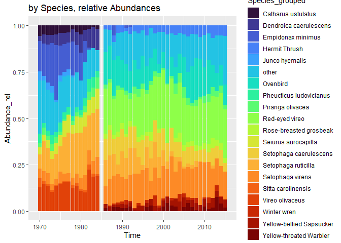<!-- -->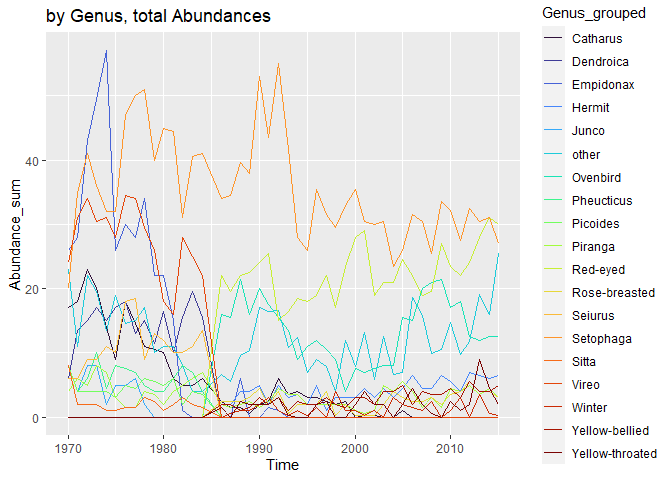<!-- --><!-- -->

``` r
study_processing_bioTIME(study_id = 413, th_species = 0.08, th_genus = 0.08)
```

    ## 
    ## 
    ## |Column            |Info                                                                                                   |
    ## |:-----------------|:------------------------------------------------------------------------------------------------------|
    ## |STUDY_ID          |413                                                                                                    |
    ## |REALM             |Terrestrial                                                                                            |
    ## |CLIMATE           |Temperate                                                                                              |
    ## |TAXA              |Birds                                                                                                  |
    ## |TITLE             |Bird populations in east central Illinois. Fluctuations variations and development over a half-century |
    ## |AB_BIO            |A                                                                                                      |
    ## |DATA_POINTS       |44                                                                                                     |
    ## |START_YEAR        |1927                                                                                                   |
    ## |END_YEAR          |1976                                                                                                   |
    ## |NUMBER_OF_SPECIES |60                                                                                                     |
    ## |NUMBER_OF_SAMPLES |177                                                                                                    |
    ## |NUMBER_LAT_LONG   |1                                                                                                      |
    ## |TOTAL             |1196                                                                                                   |
    ## |ABUNDANCE_TYPE    |Density                                                                                                |
    ## |BIOMASS_TYPE      |NA                                                                                                     |

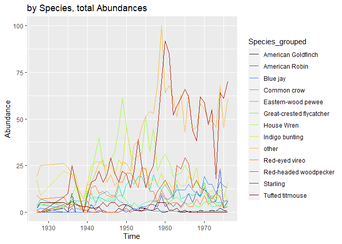<!-- -->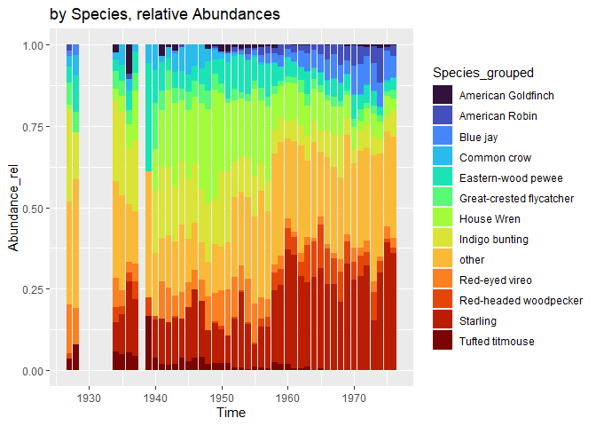<!-- --><!-- --><!-- -->

## Files written

These files have been written to the target directory,
`data/01a-timeseries-BioTIME`:

``` r
projthis::proj_dir_info(path_target())
```

    ## # A tibble: 0 × 4
    ## # ℹ 4 variables: path <fs::path>, type <fct>, size <fs::bytes>,
    ## #   modification_time <dttm>
