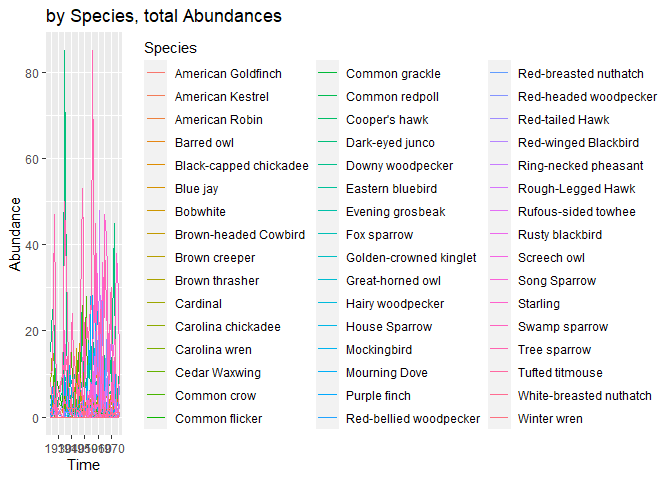
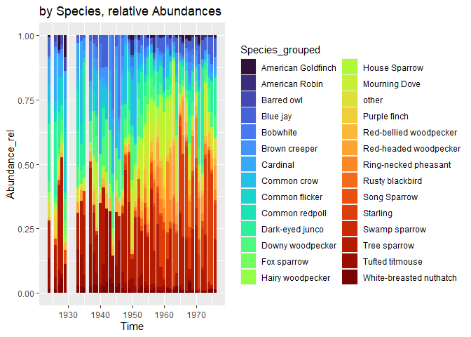
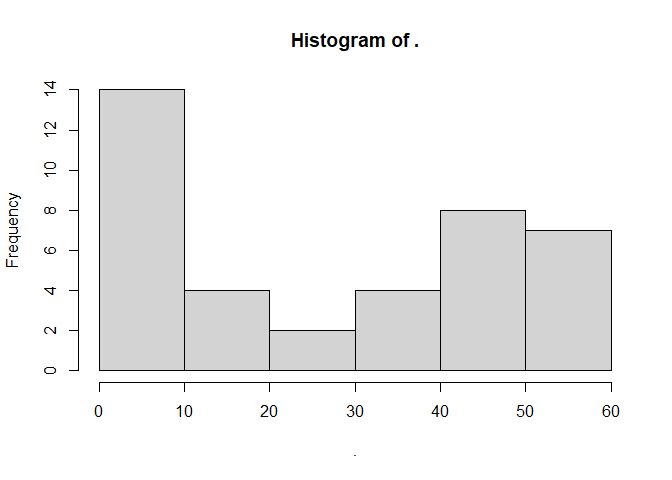
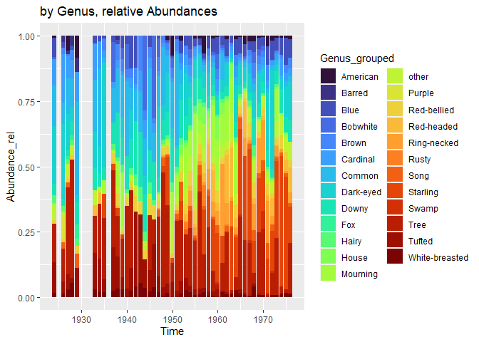
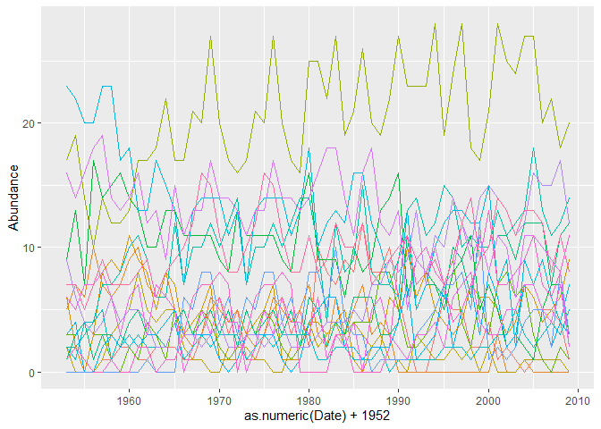
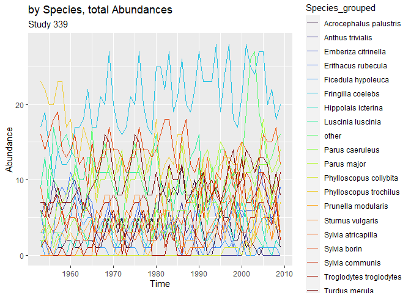
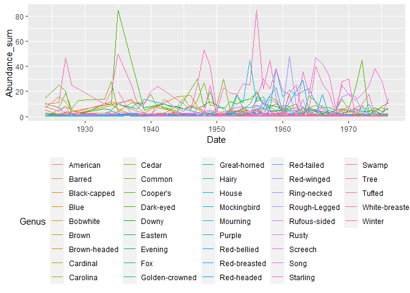
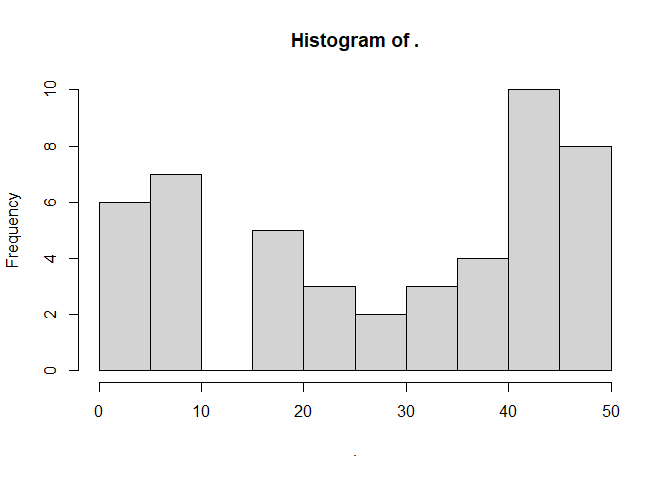
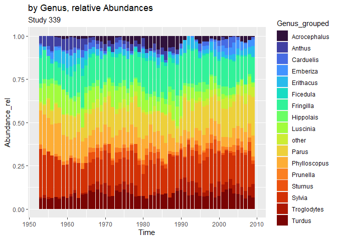

Time series (BioTIME)
================
Compiled at 2023-05-08 12:59:34 UTC

``` r
here::i_am(paste0(params$name, ".Rmd"), uuid = "964cf30c-e7ec-4fee-a704-f01c350f8766")
```

The purpose of this document is to analyse different time series from
the BioTIME database that could be interesting for the further process.

#### Packages

``` r
library("conflicted")
library(dplyr)
library(data.table)
library(ggplot2)
```

``` r
# create or *empty* the target directory, used to write this file's data: 
projthis::proj_create_dir_target(params$name, clean = TRUE)

# function to get path to target directory: path_target("sample.csv")
path_target <- projthis::proj_path_target(params$name)

# function to get path to previous data: path_source("00-import", "sample.csv")
path_source <- projthis::proj_path_source(params$name)
```

## BioTIME

#### Read Data

``` r
#### read the file
dt_fullquery <- 
  fread("data/BioTIME/BioTIMEquery_24_06_2021.csv")

#### read BioTIME Metadata
dt_biotimeMeta <-
  fread("data/00-import-BioTIME-database/BioTIME_Meta_reduced.csv")
```

#### Criteria to select a suitable study

- there should be enough DATA_POINTS (\>50)
- certain Abundance Type (“Count”) –\> not so important
- the samples should be taken from only one location
- the intervals between the time steps should be equal (e.g. one year)

``` r
# Example
dt_biotimeMeta[DATA_POINTS > 35 & NUMBER_LAT_LONG == 1 & AB_BIO %in% c("A", "AB")] %>% 
  .[order(DATA_POINTS)]
```

    ##    STUDY_ID       REALM   CLIMATE                     TAXA
    ## 1:      363 Terrestrial Temperate                    Birds
    ## 2:      478  Freshwater Temperate Freshwater invertebrates
    ## 3:      413 Terrestrial Temperate                    Birds
    ## 4:       39 Terrestrial Temperate                    Birds
    ## 5:       46 Terrestrial Temperate                    Birds
    ## 6:      414 Terrestrial Temperate                    Birds
    ## 7:      339 Terrestrial Temperate                    Birds
    ##                                                                                                                                                    TITLE
    ## 1: The 37-year dynamics of a subalpine bird community with special emphasis on the influence of environmental temperature and Epirrita autumnata cycles.
    ## 2:                                                                                           Long term study of the stream ecosystems in the Breitenbach
    ## 3:                                                Bird populations in east central Illinois. Fluctuations variations and development over a half-century
    ## 4:                                                             Bird community dynamics in a temperate deciduous forest Long-term trends at Hubbard Brook
    ## 5:                                                                                                                             Skokholm Bird Observatory
    ## 6:                                                Bird populations in east central Illinois. Fluctuations variations and development over a half-century
    ## 7:                                  Species trends turnover and composition of a woodland bird community in southern Sweden during a period of 57 years.
    ##    AB_BIO DATA_POINTS START_YEAR END_YEAR NUMBER_OF_SPECIES NUMBER_OF_SAMPLES
    ## 1:      A          37       1963     1999                35                37
    ## 2:      A          37       1969     2005                90                37
    ## 3:      A          44       1927     1976                60               177
    ## 4:      A          45       1970     2015                52                45
    ## 5:      A          47       1928     1979                29                47
    ## 6:      A          48       1924     1976                48                48
    ## 7:      A          57       1953     2009                39                57
    ##    NUMBER_LAT_LONG TOTAL ABUNDANCE_TYPE BIOMASS_TYPE
    ## 1:               1   636          Count         <NA>
    ## 2:               1  1537          Count         <NA>
    ## 3:               1  1196        Density         <NA>
    ## 4:               1   959        Density         <NA>
    ## 5:               1   528          Count         <NA>
    ## 6:               1   963        Density         <NA>
    ## 7:               1  1210          Count         <NA>

<!-- ## Bad Example -->
<!-- with gaps in time and multiple samples on consecutive days -->
<!-- ```{r} -->
<!-- study_id = 152 -->
<!-- # extract data of the specific study -->
<!-- dt_study <- -->
<!--   extract_study(dt_fullquery, ID = study_id) -->
<!-- # summarize over multiple entries in the same year -->
<!-- dt_study_grouped <- -->
<!--   dt_study[, .(Abundance_sum = sum(Abundance)), -->
<!--     by = c("Date", "Genus")] -->
<!-- # plot timeseries -->
<!-- ggplot(dt_study, aes(Date, Abundance)) + -->
<!--   geom_line(aes(col = GENUS_SPECIES))  + -->
<!--   theme(legend.position = "none") -->
<!-- # plot Abundance summed up for same Date -->
<!-- ggplot(dt_study_grouped, aes(Date, Abundance_sum)) + -->
<!--   geom_line(aes(col = Genus))  + -->
<!--   theme(legend.position = "none") -->
<!-- # plot only first part -->
<!-- ggplot(dt_study_grouped[Date < "1990-01-01"], aes(Date, Abundance_sum)) + -->
<!--   geom_line(aes(col = Genus))  -->
<!-- ``` -->
<!-- ```{r} -->
<!-- knitr::kable(dt_study_grouped[Genus == "Fritillaria" & Date > "1982-01-01"] %>% .[order(Date)] %>% head(n=10)) -->
<!-- # multiple values on consecutive days (e.g. 1982-06-XY) -->
<!-- ``` -->
<!-- ## 2nd Example -->
<!-- Example with multiple locations. -->
<!-- ```{r} -->
<!-- study_id = 163 -->
<!-- ``` -->
<!-- #### Information on the study -->
<!-- ```{r, results = "asis", echo = FALSE} -->
<!-- study_Meta <- -->
<!--   dt_biotimeMeta[STUDY_ID == study_id] -->
<!-- table_Meta <- -->
<!--   data.table(Column = colnames(study_Meta), -->
<!--              Info = as.character(study_Meta[1,])) -->
<!-- knitr::kable(table_Meta) -->
<!-- ``` -->
<!-- ### time series plots -->
<!-- ```{r} -->
<!-- # extract data of the specific study -->
<!-- dt_study <- -->
<!--   extract_study(dt_fullquery, ID = study_id) -->
<!-- # summarize over multiple entries in the same year -->
<!-- dt_study_grouped <- -->
<!--   dt_study[, .(Abundance_mean = mean(Abundance)), -->
<!--     by = c("Date", "Genus")] -->
<!-- # plot timeseries -->
<!-- ggplot(dt_study, aes(Date, Abundance)) + -->
<!--   geom_line(aes(col = GENUS_SPECIES))  + -->
<!--   theme(legend.position = "none") -->
<!-- # plot Abundance summed up for same Date -->
<!-- ggplot(dt_study_grouped, aes(Date, Abundance_mean)) + -->
<!--   geom_line(aes(col = Genus))  + -->
<!--   theme(legend.position = "none") -->
<!-- # same plot with y log-scaled -->
<!-- ggplot(dt_study_grouped, aes(Date, Abundance_mean)) + -->
<!--   geom_line(aes(col = Genus))  + -->
<!--   theme(legend.position = "none") + -->
<!--   scale_y_log10() -->
<!-- ``` -->
<!-- ## 3rd Example -->
<!-- ```{r} -->
<!-- study_id = 57 -->
<!-- ``` -->
<!-- #### Information on the study -->
<!-- ```{r, results = "asis", echo = FALSE} -->
<!-- study_Meta <- -->
<!--   dt_biotimeMeta[STUDY_ID == study_id] -->
<!-- table_Meta <- -->
<!--   data.table(Column = colnames(study_Meta), -->
<!--              Info = as.character(study_Meta[1,])) -->
<!-- knitr::kable(table_Meta) -->
<!-- ``` -->
<!-- ### time series plots -->
<!-- ```{r} -->
<!-- # extract data of the specific study -->
<!-- dt_study <- -->
<!--   extract_study(dt_fullquery, ID = study_id) -->
<!-- # summarize over multiple entries in the same year -->
<!-- dt_study_grouped <- -->
<!--   dt_study[, .(Abundance_mean = mean(Abundance)), -->
<!--     by = c("Date", "Genus")] -->
<!-- # number of entries per Date and Genus -->
<!-- dt_study[, .N, by= c("Date", "Genus")] -->
<!-- # number of entries per Date and Species -->
<!-- dt_study[, .N, by= c("Date", "Species")] -->
<!-- # plot timeseries -->
<!-- ggplot(dt_study, aes(Date, Abundance)) + -->
<!--   geom_line(aes(col = GENUS_SPECIES))  + -->
<!--   theme(legend.position = "none") -->
<!-- # plot Abundance summed up for same Date -->
<!-- ggplot(dt_study_grouped, aes(Date, Abundance_mean)) + -->
<!--   geom_line(aes(col = Genus))  + -->
<!--   theme(legend.position = "none") -->
<!-- # same plot with y log-scaled -->
<!-- ggplot(dt_study_grouped, aes(Date, Abundance_mean)) + -->
<!--   geom_line(aes(col = Genus))  + -->
<!--   theme(legend.position = "bottom") + -->
<!--   scale_y_log10() -->
<!-- ``` -->

We need Time Series with at least 50 time steps.

Further Criteria for usefull time series:

- 50 time points

- time steps should be at equal intervals

- 

# Next examples

## (1)

``` r
study_id = 339
```

#### Information on the study

| Column            | Info                                                                                                                 |
|:------------------|:---------------------------------------------------------------------------------------------------------------------|
| STUDY_ID          | 339                                                                                                                  |
| REALM             | Terrestrial                                                                                                          |
| CLIMATE           | Temperate                                                                                                            |
| TAXA              | Birds                                                                                                                |
| TITLE             | Species trends turnover and composition of a woodland bird community in southern Sweden during a period of 57 years. |
| AB_BIO            | A                                                                                                                    |
| DATA_POINTS       | 57                                                                                                                   |
| START_YEAR        | 1953                                                                                                                 |
| END_YEAR          | 2009                                                                                                                 |
| NUMBER_OF_SPECIES | 39                                                                                                                   |
| NUMBER_OF_SAMPLES | 57                                                                                                                   |
| NUMBER_LAT_LONG   | 1                                                                                                                    |
| TOTAL             | 1210                                                                                                                 |
| ABUNDANCE_TYPE    | Count                                                                                                                |
| BIOMASS_TYPE      | NA                                                                                                                   |

### time series plots

``` r
# extract data of the specific study
dt_study <-
  extract_study(dt_fullquery, ID = study_id)

# summarize over multiple entries in the same year
dt_study_grouped <-
  dt_study[, .(Abundance_sum = sum(Abundance)),
    by = c("Date", "Genus")]

# number of entries per Date and Genus
dt_study[, .N, by= c("Date", "Genus")]
```

    ##      Date     Genus N
    ##   1: 1962 Erithacus 1
    ##   2: 1962 Muscicapa 1
    ##   3: 1962     Parus 3
    ##   4: 1953 Erithacus 1
    ##   5: 1953 Muscicapa 1
    ##  ---                 
    ## 897: 1976 Erithacus 1
    ## 898: 1976 Motacilla 1
    ## 899: 1976   Sturnus 1
    ## 900: 1976    Sylvia 3
    ## 901: 1976  Prunella 1

``` r
# number of entries per Date and Species
dt_study[, .N, by= c("Date", "Species")]
```

    ##       Date     Species N
    ##    1: 1962    rubecula 1
    ##    2: 1962     striata 1
    ##    3: 1962   caeruleus 1
    ##    4: 1953    rubecula 1
    ##    5: 1953     striata 1
    ##   ---                   
    ## 1157: 1976    vulgaris 1
    ## 1158: 1976 atricapilla 1
    ## 1159: 1976       borin 1
    ## 1160: 1976   modularis 1
    ## 1161: 1976    communis 1

``` r
# plot timeseries
ggplot(dt_study, aes(Date, Abundance)) +
  geom_line(aes(col = GENUS_SPECIES))  +
  theme(legend.position = "none")
```

<!-- -->

``` r
# plot Abundance summed up for same Date
ggplot(dt_study_grouped, aes(Date, Abundance_sum)) +
  geom_line(aes(col = Genus))  +
  theme(legend.position = "bottom")
```

<!-- -->

``` r
dt_study_ts <-
  dcast(dt_study, GENUS_SPECIES ~ Date, value.var = "Abundance")
dt_study_ts[, num_na := rowSums(is.na(dt_study_ts))]
GEN_SPEC_relevant <- dt_study_ts[num_na < 20]$GENUS_SPECIES

dt_study_ts
```

    ##               GENUS_SPECIES 1953 1954 1955 1956 1957 1958 1959 1960 1961 1962
    ##  1:  Acrocephalus palustris   NA   NA   NA   NA    1    1    2    2    1    1
    ##  2: Acrocephalus scirpaceus   NA   NA   NA   NA   NA   NA   NA   NA   NA   NA
    ##  3:        Anthus trivialis    5    7    6   10    7    6    7    9   10    7
    ##  4:     Carduelis cannabina    1   NA    2    1   NA    1    1    2    4    3
    ##  5:     Carduelis carduelis   NA   NA   NA   NA   NA   NA   NA   NA    1    1
    ##  6:       Carduelis chloris   NA   NA   NA   NA   NA   NA   NA   NA   NA   NA
    ##  7:      Certhia familiaris   NA   NA   NA   NA   NA   NA   NA   NA   NA   NA
    ##  8:     Emberiza citrinella   NA   NA   NA   NA   NA   NA   NA   NA   NA   NA
    ##  9:      Emberiza hortulana    1   NA    4    4    3    2   NA   NA   NA   NA
    ## 10:      Erithacus rubecula    6    2   NA    3    8    9    8   11    9    8
    ## 11:      Ficedula hypoleuca    2   NA   NA   NA    1    3    4    5    8    5
    ## 12:       Fringilla coelebs   17   19   14   10   14   12   12   13   17   17
    ## 13:      Hippolais icterina    3    3    4    3    3    1   NA    2    1    4
    ## 14:       Locustella naevia   NA   NA   NA   NA   NA   NA   NA   NA   NA   NA
    ## 15:       Luscinia luscinia    9   13    7   17   14   15   16   14   13   10
    ## 16:          Motacilla alba   NA   NA   NA   NA   NA   NA   NA   NA   NA   NA
    ## 17:       Muscicapa striata    1    1    1   NA    1   NA   NA   NA   NA    1
    ## 18:         Parus caeruleus    1    3    4    1    3    3    2    4    5    3
    ## 19:             Parus major    2    2    3    4    7    7    8   10   11    9
    ## 20:         Parus palustris    2    1    4    4    5    1    3    2    3    2
    ## 21:       Passer domesticus   NA   NA   NA    1   NA   NA   NA   NA   NA   NA
    ## 22:         Passer montanus   NA   NA   NA   NA   NA   NA   NA   NA   NA   NA
    ## 23: Phoenicurus phoenicurus   NA   NA   NA   NA   NA   NA   NA   NA   NA   NA
    ## 24:  Phylloscopus collybita   NA   NA   NA   NA   NA   NA   NA   NA   NA   NA
    ## 25: Phylloscopus sibilatrix   NA   NA   NA   NA   NA   NA   NA   NA   NA    1
    ## 26:  Phylloscopus trochilus   23   22   20   20   23   23   17   18   13   13
    ## 27:      Prunella modularis    3    4   NA   NA    2    3    2    3    2    3
    ## 28:         Regulus regules   NA   NA   NA   NA   NA   NA   NA   NA   NA   NA
    ## 29:        Saxicola rubetra   NA   NA   NA   NA   NA   NA   NA    1    1   NA
    ## 30:          Sitta europaea   NA   NA   NA   NA   NA   NA   NA   NA   NA   NA
    ## 31:        Sturnus vulgaris   NA   NA   NA   NA   NA   NA   NA   NA   NA    1
    ## 32:      Sylvia atricapilla    9    6    4    3    4    6    4    5    5    4
    ## 33:            Sylvia borin   16   14   16   18   19   14   13   14   16   12
    ## 34:         Sylvia communis    6    5    7    7    8    6    3    6    7    3
    ## 35:          Sylvia curruca    1    1   NA   NA   NA   NA   NA   NA    1   NA
    ## 36: Troglodytes troglodytes    1    2    1   NA   NA    1   NA   NA    2    2
    ## 37:           Turdus merula    7    7    5    7    9    7    7    7    8    9
    ## 38:       Turdus philomelos   NA   NA    1   NA   NA   NA    1    1    2    2
    ## 39:          Turdus pilaris   NA   NA   NA   NA   NA   NA   NA   NA   NA   NA
    ##               GENUS_SPECIES 1953 1954 1955 1956 1957 1958 1959 1960 1961 1962
    ##     1963 1964 1965 1966 1967 1968 1969 1970 1971 1972 1973 1974 1975 1976 1977
    ##  1:    2    2    2    1    1    3    5    6    3    5    1    1    3    5    6
    ##  2:   NA   NA   NA   NA   NA    1   NA   NA   NA   NA   NA   NA    1   NA   NA
    ##  3:    6    8    5    3    2    3    6    5    4    5    3    2    3    6    5
    ##  4:    1    3    3    1   NA    1    1    1   NA   NA    1   NA    1    1    1
    ##  5:   NA    1    2   NA   NA   NA   NA    1   NA   NA   NA   NA   NA   NA    1
    ##  6:   NA    1   NA    3    5    3    2   NA   NA   NA    3    5    3    2   NA
    ##  7:   NA   NA   NA   NA    1   NA   NA   NA   NA   NA   NA    1   NA   NA   NA
    ##  8:   NA   NA   NA   NA   NA   NA   NA   NA   NA   NA   NA   NA   NA   NA   NA
    ##  9:   NA   NA   NA   NA   NA   NA   NA   NA   NA   NA   NA   NA   NA   NA   NA
    ## 10:    5    8    7    3    4    5    7    1    1    1    3    4    5    7    1
    ## 11:    4    5    5    2    1    1   NA   NA    2    2    2    1    1   NA   NA
    ## 12:   18   22   17   17   21   20   27   20   17   16   17   21   20   27   20
    ## 13:    3    1    5    3    3    5    4    2    1    2    3    3    5    4    2
    ## 14:   NA   NA   NA   NA   NA   NA   NA   NA   NA   NA   NA   NA   NA   NA   NA
    ## 15:   10   13   13   11   11   11   11    9    8   13   11   11   11   11    9
    ## 16:    1   NA    2   NA    2    4    1    2    2   NA   NA    2    4    1    2
    ## 17:   NA   NA   NA   NA   NA   NA   NA   NA   NA   NA   NA   NA   NA   NA   NA
    ## 18:    3    2    4    5    3    4    5    3    5    2    5    3    4    5    3
    ## 19:    6    6   12    7   10   10   12   10   12   14    7   10   10   12   10
    ## 20:    2    2    4    1    2    3    2    3    3    3    1    2    3    2    3
    ## 21:   NA   NA   NA   NA   NA   NA    1   NA   NA   NA   NA   NA   NA    1   NA
    ## 22:   NA   NA   NA    1    1    3    4    1   NA   NA    1    1    3    4    1
    ## 23:   NA   NA    1   NA   NA   NA   NA   NA   NA   NA   NA   NA   NA   NA   NA
    ## 24:   NA   NA   NA   NA   NA   NA   NA   NA   NA   NA   NA   NA   NA   NA   NA
    ## 25:   NA   NA    2   NA   NA   NA   NA   NA   NA   NA   NA   NA   NA   NA   NA
    ## 26:   17   15   13    7   13   14   14   14   11   13    7   13   14   14   14
    ## 27:    3    4    5    3    3    3    3    1   NA    1    3    3    3    3    1
    ## 28:   NA   NA   NA   NA   NA   NA   NA   NA   NA   NA   NA   NA   NA   NA   NA
    ## 29:   NA   NA   NA   NA   NA   NA   NA   NA   NA   NA   NA   NA   NA   NA   NA
    ## 30:   NA   NA   NA    2    1   NA   NA    1    1   NA    2    1   NA   NA    1
    ## 31:   NA   NA   NA    6    5    8    8    4    6    3    6    5    8    8    4
    ## 32:    2    2    4    3    3    2    3    4    2    2    3    3    2    3    4
    ## 33:   13    9   15   11   13   13   17   14   14   13   11   13   13   17   14
    ## 34:    7    6    5   NA    2    5    3    6    4    4   NA    2    5    3    6
    ## 35:   NA   NA   NA   NA   NA   NA   NA   NA    1   NA   NA   NA   NA   NA   NA
    ## 36:   NA    1    1    3    6    7    7    8    7   NA    3    6    7    7    8
    ## 37:    6    8    9   10   12   16   15   11    8    8   10   12   16   15   11
    ## 38:    1    2    3    1   NA   NA   NA   NA   NA   NA    1   NA   NA   NA   NA
    ## 39:   NA   NA   NA   NA   NA   NA   NA   NA   NA   NA   NA   NA   NA   NA   NA
    ##     1963 1964 1965 1966 1967 1968 1969 1970 1971 1972 1973 1974 1975 1976 1977
    ##     1978 1979 1980 1981 1982 1983 1984 1985 1986 1987 1988 1989 1990 1991 1992
    ##  1:    3    5    2   10    8    7    9    8   12    8    8   10    6    3   NA
    ##  2:   NA   NA   NA   NA   NA   NA   NA   NA   NA   NA   NA   NA   NA   NA   NA
    ##  3:    4    5    7    3    2    6    3    5    7    3    4    3   NA   NA   NA
    ##  4:   NA   NA    1   NA   NA   NA   NA   NA   NA   NA   NA   NA   NA   NA   NA
    ##  5:   NA   NA   NA   NA   NA   NA   NA   NA   NA   NA   NA   NA    2   NA   NA
    ##  6:   NA   NA    1   NA   NA    2    2   NA    2   NA    1   NA    2   NA   NA
    ##  7:   NA   NA   NA   NA   NA    1   NA   NA   NA    1   NA   NA   NA    1    1
    ##  8:   NA   NA   NA   NA   NA   NA   NA   NA   NA   NA    1    1   NA   NA   NA
    ##  9:   NA   NA   NA   NA   NA   NA   NA   NA   NA   NA   NA   NA   NA   NA   NA
    ## 10:    1    1    4    4    3    4    5    1   NA    2    2    6    5   10    6
    ## 11:    2    2    4    2    3    4    2    4    3    2    3    1    1   NA    3
    ## 12:   17   16   25   25   22   27   19   21   26   20   19   22   27   23   23
    ## 13:    1    2    4    5    2    4    3    4    4    4    8    8    5    2    2
    ## 14:   NA   NA   NA   NA   NA   NA   NA   NA   NA    1   NA   NA   NA   NA   NA
    ## 15:    8   13   16    9    9    9    6   10    8    9   13   14   16    6    9
    ## 16:    2   NA    1   NA    1    1   NA   NA    1    2   NA    1   NA   NA   NA
    ## 17:   NA   NA   NA   NA   NA   NA   NA   NA   NA   NA   NA    1   NA   NA   NA
    ## 18:    5    2    6    5    2    4    3    6    6    6    3    3    4   11    5
    ## 19:   12   14   14   10    4   12    8    9   15    8    7    7    9   13   14
    ## 20:    3    3    3    1    1    2    2    1    1    1    2   NA    1    1    1
    ## 21:   NA   NA   NA   NA   NA   NA   NA   NA   NA   NA   NA   NA   NA   NA   NA
    ## 22:   NA   NA   NA   NA   NA    1   NA   NA   NA   NA   NA   NA   NA   NA   NA
    ## 23:   NA   NA   NA   NA   NA   NA   NA   NA   NA   NA   NA   NA   NA   NA   NA
    ## 24:   NA   NA   NA   NA   NA   NA   NA   NA   NA   NA   NA   NA   NA   NA   NA
    ## 25:   NA   NA   NA   NA   NA   NA   NA   NA   NA   NA   NA   NA   NA   NA   NA
    ## 26:   11   13   18   10   12   13   12   16   16   12   10    7    6   13    5
    ## 27:   NA    1    4    5    6    6    2    2    1    2    2    2    4    7    1
    ## 28:   NA   NA   NA   NA   NA   NA   NA   NA   NA   NA    1   NA   NA   NA   NA
    ## 29:   NA   NA    1    1   NA   NA   NA   NA   NA   NA   NA   NA   NA   NA   NA
    ## 30:    1   NA   NA    1    1    2   NA   NA   NA    1   NA   NA    2    2   NA
    ## 31:    6    3    8    8    5   10    4    3    3   NA    1    1    1    1    3
    ## 32:    2    2    2    3    4    4    4    5    4    7    7    9    8    9   13
    ## 33:   14   13   14   16   18   18   14   11   16   18   12   11   13    5    9
    ## 34:    4    4    3    6    1    3    2    4   NA    5    6    3    2    1    3
    ## 35:    1   NA   NA   NA   NA   NA   NA   NA   NA   NA    1   NA   NA   NA   NA
    ## 36:    7   NA   NA   NA   NA    3    3   NA   NA   NA   NA    2    9   11    9
    ## 37:    8    8   11    8    9   12   10   10   12    7    8    9   10   11    7
    ## 38:   NA   NA   NA   NA   NA   NA   NA   NA   NA    1   NA   NA    1   NA    1
    ## 39:   NA   NA   NA   NA   NA   NA   NA   NA   NA   NA    3    4    4    2    1
    ##     1978 1979 1980 1981 1982 1983 1984 1985 1986 1987 1988 1989 1990 1991 1992
    ##     1993 1994 1995 1996 1997 1998 1999 2000 2001 2002 2003 2004 2005 2006 2007
    ##  1:   NA    3    6    5    5    2    2    4    1    2    1   NA    1    5    5
    ##  2:   NA   NA   NA   NA   NA   NA    1   NA   NA    1   NA   NA   NA   NA   NA
    ##  3:   NA   NA   NA   NA   NA   NA   NA   NA    3   NA   NA    1   NA   NA   NA
    ##  4:   NA   NA   NA   NA   NA   NA   NA   NA   NA   NA   NA   NA   NA   NA   NA
    ##  5:   NA   NA   NA   NA   NA   NA   NA    2    2    4    5    2   NA   NA    1
    ##  6:   NA    1    6    4    4    2    2    3    3    4    4    4    3   NA   NA
    ##  7:    4   NA   NA    1    3    1    1   NA    1   NA   NA    1    1    1   NA
    ##  8:    1    1    1    4    3    1    7    5    6    6    6   12    9    8    4
    ##  9:   NA   NA   NA   NA   NA   NA   NA   NA   NA   NA   NA   NA   NA   NA   NA
    ## 10:    8    5    4    3    4    7    6    6    5    3    4    7    6    4    5
    ## 11:    2    1    1    2    1    2   NA    2   NA   NA   NA    1    1    1    1
    ## 12:   23   28   19   24   28   18   17   21   28   25   24   27   27   20   22
    ## 13:    3    5    7    9    4    2    6    3    7    8    6    7    3    1   NA
    ## 14:   NA   NA   NA   NA   NA   NA   NA   NA   NA   NA   NA   NA   NA   NA   NA
    ## 15:    8    7    5    8    9   11    5    7    5    2    3    2    1    5    7
    ## 16:   NA   NA   NA   NA   NA   NA    1   NA   NA   NA   NA   NA   NA   NA   NA
    ## 17:    3    1   NA    2   NA    1   NA   NA    3    5    4   NA    4    1   NA
    ## 18:    7    7    6   10    9    6   11    8   11   11    9   12   12   12    7
    ## 19:   11   12   15   14   10   11   10   10   13   11   12   13   18   13   11
    ## 20:    1    1    2    2    2    1    2    2    3    3    5    3    2    3    4
    ## 21:   NA   NA   NA   NA   NA   NA   NA   NA   NA   NA   NA   NA   NA   NA   NA
    ## 22:   NA   NA   NA   NA   NA   NA   NA   NA   NA   NA   NA   NA   NA   NA   NA
    ## 23:   NA   NA   NA    1   NA    1   NA   NA    1    2   NA    3    2    1    3
    ## 24:   NA   NA   NA    1    1    1    1   NA    2   NA    6    9    6    3    8
    ## 25:   NA   NA   NA   NA   NA   NA   NA   NA   NA   NA   NA   NA   NA   NA   NA
    ## 26:    7   10   12   13   13   12   12   15    7    9    2    9    7    9    6
    ## 27:    2    3    7    2    5    7    3    8    6    2    3    7    7    5    2
    ## 28:   NA   NA   NA   NA   NA   NA   NA   NA   NA   NA   NA   NA   NA   NA   NA
    ## 29:   NA   NA   NA   NA   NA   NA   NA   NA   NA   NA   NA   NA   NA   NA   NA
    ## 30:    2    1    3    1    3    3    3    4    4    3    3    2    2    6    5
    ## 31:    4    5    7    7    8    5   12    1    2    1    2    4    5    5    2
    ## 32:    7   11   10   14   12   10   14   15   14   13   11   12   16   15   15
    ## 33:    8   10    7    8   12    9   11    8   11   10    6   11   11   10    9
    ## 34:    3    4    2    6    7    8    4    3    3    5    5    7    7    5    4
    ## 35:   NA   NA   NA    1   NA    2   NA   NA   NA   NA   NA    1   NA   NA   NA
    ## 36:   10    8    7    4    5    7    9   13    7    7    8    9   11    7    6
    ## 37:    8    9    7    9   12   14    9   10   14   13   11   13   13   12    8
    ## 38:   NA   NA    1   NA   NA   NA   NA   NA   NA    1    2    2    2   NA   NA
    ## 39:    2    4    2    2   NA   NA    1    1    2    3    4    1   NA   NA   NA
    ##     1993 1994 1995 1996 1997 1998 1999 2000 2001 2002 2003 2004 2005 2006 2007
    ##     2008 2009 num_na
    ##  1:    4    1      7
    ##  2:   NA   NA     53
    ##  3:   NA   NA     18
    ##  4:   NA   NA     37
    ##  5:   NA   NA     44
    ##  6:   NA    2     29
    ##  7:   NA    1     41
    ##  8:    6    5     38
    ##  9:   NA   NA     52
    ## 10:    6    9      2
    ## 11:    1   NA     13
    ## 12:   18   20      0
    ## 13:    2    1      2
    ## 14:   NA   NA     56
    ## 15:    7    3      0
    ## 16:   NA   NA     38
    ## 17:    1   NA     41
    ## 18:   11   12      0
    ## 19:   12   14      0
    ## 20:    3    5      1
    ## 21:   NA   NA     54
    ## 22:   NA   NA     46
    ## 23:    4    4     46
    ## 24:    9   10     45
    ## 25:   NA   NA     55
    ## 26:    4    7      0
    ## 27:    4    3      4
    ## 28:   NA   NA     56
    ## 29:   NA   NA     53
    ## 30:    5    3     26
    ## 31:    8    3     13
    ## 32:   17   12      0
    ## 33:    8    2      0
    ## 34:    7    2      3
    ## 35:    1   NA     47
    ## 36:    8   11     14
    ## 37:   11    8      0
    ## 38:    1    1     37
    ## 39:   NA   NA     42
    ##     2008 2009 num_na

``` r
dt_study_ts$num_na %>% hist()
```

<!-- -->

``` r
dt_study_ts[is.na(dt_study_ts),] <- 0

dt_study_0 <-
  dt_study_ts[, num_na := NULL] %>% 
  melt(., id.vars = "GENUS_SPECIES", 
       value.name = "Abundance", variable.name = "Date")


# plot timeseries
ggplot(dt_study_0,
       aes(as.numeric(Date) + 1952, Abundance)) +
  geom_line(aes(col = GENUS_SPECIES))  +
  theme(legend.position = "none")
```

<!-- -->

``` r
# plot timeseries
ggplot(dt_study_0[GENUS_SPECIES %in% GEN_SPEC_relevant],
       aes(as.numeric(Date) + 1952, Abundance)) +
  geom_line(aes(col = GENUS_SPECIES))  +
  theme(legend.position = "none")
```

<!-- -->

<br>

## (2)

``` r
study_id = 478
```

#### Information on the study

| Column            | Info                                                        |
|:------------------|:------------------------------------------------------------|
| STUDY_ID          | 478                                                         |
| REALM             | Freshwater                                                  |
| CLIMATE           | Temperate                                                   |
| TAXA              | Freshwater invertebrates                                    |
| TITLE             | Long term study of the stream ecosystems in the Breitenbach |
| AB_BIO            | A                                                           |
| DATA_POINTS       | 37                                                          |
| START_YEAR        | 1969                                                        |
| END_YEAR          | 2005                                                        |
| NUMBER_OF_SPECIES | 90                                                          |
| NUMBER_OF_SAMPLES | 37                                                          |
| NUMBER_LAT_LONG   | 1                                                           |
| TOTAL             | 1537                                                        |
| ABUNDANCE_TYPE    | Count                                                       |
| BIOMASS_TYPE      | NA                                                          |

### time series plots

``` r
# extract data of the specific study
dt_study <-
  extract_study(dt_fullquery, ID = study_id)

# summarize over multiple entries in the same year
dt_study_grouped <-
  dt_study[, .(Abundance_sum = sum(Abundance)),
    by = c("Date", "Genus")]

# number of entries per Date and Genus
dt_study[, .N, by= c("Date", "Genus")]
```

    ##       Date        Genus N
    ##    1: 1978  Protonemura 4
    ##    2: 1978  Rhyacophila 1
    ##    3: 1979  Protonemura 4
    ##    4: 1979  Rhyacophila 1
    ##    5: 1979  Sericostoma 1
    ##   ---                    
    ## 1067: 2003         Silo 1
    ## 1068: 2003 Siphonoperla 1
    ## 1069: 2003  Stenophylax 1
    ## 1070: 2003      Tinodes 1
    ## 1071: 2003    Wormaldia 1

``` r
# number of entries per Date and Species
dt_study[, .N, by= c("Date", "Species")]
```

    ##       Date     Species N
    ##    1: 1978      nitida 1
    ##    2: 1978    fasciata 1
    ##    3: 1978      meyeri 1
    ##    4: 1979      meyeri 1
    ##    5: 1979      nitida 1
    ##   ---                   
    ## 1495: 2003    pallipes 1
    ## 1496: 2003  torrentium 1
    ## 1497: 2003   permistus 1
    ## 1498: 2003    rostocki 1
    ## 1499: 2003 occipitalis 1

``` r
# plot timeseries
ggplot(dt_study, aes(Date, Abundance)) +
  geom_line(aes(col = GENUS_SPECIES))  +
  theme(legend.position = "none")
```

<!-- -->

``` r
# ggplot(dt_study[GENUS_SPECIES %in% GEN_SPEC_relevant], aes(Date, Abundance)) +
#   geom_line(aes(col = GENUS_SPECIES))  +
#   theme(legend.position = "none") +
#   scale_y_log10()

# plot Abundance summed up for same Date
ggplot(dt_study_grouped, aes(Date, Abundance_sum)) +
  geom_line(aes(col = Genus))  +
  theme(legend.position = "none")
```

<!-- -->

``` r
# same plot with y log-scaled
ggplot(dt_study_grouped, aes(Date, Abundance_sum)) +
  geom_line(aes(col = Genus))  +
  theme(legend.position = "bottom") +
  scale_y_log10()
```

<!-- -->

``` r
dt_study_ts <-
  dcast(dt_study, GENUS_SPECIES ~ Date, value.var = "Abundance")
dt_study_ts[, num_na := rowSums(is.na(dt_study_ts))]
GEN_SPEC_relevant <- dt_study_ts[num_na < 10]$GENUS_SPECIES

dt_study_ts$num_na %>% hist()
```

<!-- -->

## (3)

``` r
study_id = 363
```

#### Information on the study

| Column            | Info                                                                                                                                                  |
|:------------------|:------------------------------------------------------------------------------------------------------------------------------------------------------|
| STUDY_ID          | 363                                                                                                                                                   |
| REALM             | Terrestrial                                                                                                                                           |
| CLIMATE           | Temperate                                                                                                                                             |
| TAXA              | Birds                                                                                                                                                 |
| TITLE             | The 37-year dynamics of a subalpine bird community with special emphasis on the influence of environmental temperature and Epirrita autumnata cycles. |
| AB_BIO            | A                                                                                                                                                     |
| DATA_POINTS       | 37                                                                                                                                                    |
| START_YEAR        | 1963                                                                                                                                                  |
| END_YEAR          | 1999                                                                                                                                                  |
| NUMBER_OF_SPECIES | 35                                                                                                                                                    |
| NUMBER_OF_SAMPLES | 37                                                                                                                                                    |
| NUMBER_LAT_LONG   | 1                                                                                                                                                     |
| TOTAL             | 636                                                                                                                                                   |
| ABUNDANCE_TYPE    | Count                                                                                                                                                 |
| BIOMASS_TYPE      | NA                                                                                                                                                    |

### time series plots

``` r
# extract data of the specific study
dt_study <-
  extract_study(dt_fullquery, ID = study_id)

# summarize over multiple entries in the same year
dt_study_grouped <-
  dt_study[, .(Abundance_sum = sum(Abundance)),
    by = c("Date", "Genus")]

# number of entries per Date and Genus
dt_study[, .N, by= c("Date", "Genus")]
```

    ##      Date        Genus N
    ##   1: 1963    Carduelis 1
    ##   2: 1963     Emberiza 1
    ##   3: 1963    Fringilla 2
    ##   4: 1963    Muscicapa 1
    ##   5: 1963 Phylloscopus 1
    ##  ---                    
    ## 496: 1999       Turdus 4
    ## 497: 1999       Anthus 1
    ## 498: 1999     Ficedula 1
    ## 499: 1999  Phoenicurus 1
    ## 500: 1999     Luscinia 1

``` r
# number of entries per Date and Species
dt_study[, .N, by= c("Date", "Species")]
```

    ##      Date        Species N
    ##   1: 1963        flammea 1
    ##   2: 1963    schoeniclus 1
    ##   3: 1963        coelebs 1
    ##   4: 1963        striata 1
    ##   5: 1963      trochilus 1
    ##  ---                      
    ## 631: 1999    phoenicurus 1
    ## 632: 1999        iliacus 1
    ## 633: 1999        pilaris 1
    ## 634: 1999 montifringilla 1
    ## 635: 1999        svecica 1

``` r
# plot timeseries
ggplot(dt_study, aes(Date, Abundance)) +
  geom_line(aes(col = GENUS_SPECIES))  +
  theme(legend.position = "none")
```

<!-- -->

``` r
# plot timeseries
ggplot(dt_study, aes(Date, Abundance)) +
  geom_line(aes(col = GENUS_SPECIES))  +
  theme(legend.position = "bottom")
```

<!-- -->

``` r
# plot sum by Genus
ggplot(dt_study_grouped, aes(Date, Abundance_sum)) +
  geom_line(aes(col = Genus))  +
  theme(legend.position = "bottom")
```

<!-- -->

``` r
dt_study_ts <-
  dcast(dt_study_grouped, Genus ~ Date, value.var = "Abundance_sum")
dt_study_ts
```

    ##            Genus 1963 1964 1965 1966 1967  1968 1969  1970 1971 1972 1973 1974
    ##  1:       Anthus  8.3 22.6  6.8  5.7  9.6   3.8  3.8   3.8  5.7  4.8  2.4  4.8
    ##  2:    Carduelis  5.5 11.3  2.3  5.7 23.0  90.0  7.7  23.0 88.1 19.3 23.8 26.2
    ##  3:      Certhia   NA   NA   NA   NA   NA    NA   NA    NA   NA   NA   NA   NA
    ##  4:      Cinclus   NA   NA   NA   NA   NA    NA   NA    NA  1.9   NA   NA   NA
    ##  5:     Emberiza 33.1 31.7 24.9 34.5 28.7  21.1 19.2  13.4 17.2 17.7 26.2 23.8
    ##  6:    Erithacus   NA   NA   NA   NA   NA    NA   NA    NA   NA  1.6 35.7   NA
    ##  7:     Ficedula 16.6 20.4 28.7 13.8 20.8  10.4 17.3  10.4 34.6 15.4  9.5 12.9
    ##  8:    Fringilla 66.3 43.0 38.5 53.7 36.4  63.2 51.7  32.6 53.6 64.3 14.8 24.3
    ##  9:    Hippolais   NA   NA   NA   NA   NA    NA  1.9    NA   NA   NA 59.5   NA
    ## 10:     Luscinia  2.8  6.8 13.6 13.4 38.3  21.1  7.7   3.8 15.3 14.5   NA 47.6
    ## 11:    Motacilla   NA   NA   NA   NA   NA    NA   NA    NA   NA   NA  2.4   NA
    ## 12:    Muscicapa  2.8   NA  2.3  1.9   NA    NA   NA    NA  3.8  3.2 15.5  9.5
    ## 13:        Parus 11.0  4.5  9.0  1.9  1.9   3.8  3.8    NA  5.7  8.0 12.9   NA
    ## 14:  Phoenicurus 22.1 15.8 23.9  6.9 20.8   6.9  3.5   6.9  3.5 10.3 47.6 16.2
    ## 15: Phylloscopus 13.5 21.5 19.9 11.5 14.2  15.1 13.0  17.8 14.8 15.4  2.4 15.5
    ## 16:     Prunella 22.1 33.9 22.6 21.1 36.4  21.1 40.2  19.2 26.8 16.1   NA 35.7
    ## 17:     Pyrrhula   NA   NA   NA   NA   NA    NA   NA    NA   NA   NA  2.4   NA
    ## 18:     Saxicola  8.3  4.5   NA  1.9   NA   1.9   NA    NA   NA   NA 16.2   NA
    ## 19:       Sylvia 13.8  9.0  9.0 17.2  7.7   9.6  9.6   3.8  5.7  1.6  9.5 11.9
    ## 20:  Troglodytes   NA   NA   NA   NA   NA    NA   NA    NA   NA   NA   NA   NA
    ## 21:       Turdus 19.4 27.2 79.1 44.0 53.7 116.9 86.3 105.4 57.4 89.9 19.0 78.5
    ##            Genus 1963 1964 1965 1966 1967  1968 1969  1970 1971 1972 1973 1974
    ##     1975 1976 1977 1978 1979 1980 1981 1982 1983  1984 1985 1986 1987 1988
    ##  1: 14.3 11.9 14.3  9.5  4.8  2.4  4.8  7.1  4.8   7.2 11.9  2.4 11.9 14.3
    ##  2: 28.6  9.5 28.6  2.4 16.7 50.0 40.5 11.9  7.2   9.6 38.2 14.3   NA 14.3
    ##  3:   NA   NA   NA  2.4   NA   NA   NA   NA   NA    NA   NA   NA   NA   NA
    ##  4:   NA   NA   NA   NA   NA   NA   NA   NA   NA    NA   NA   NA   NA   NA
    ##  5: 26.2 19.0 19.0 14.3 19.0 19.0 31.0 21.4 11.9  11.9 21.5 21.5 26.3 31.0
    ##  6:   NA   NA   NA   NA   NA  2.4   NA   NA   NA    NA   NA   NA   NA   NA
    ##  7: 22.7 12.9  3.2  9.7  6.5  3.2  6.5  6.5   NA  12.9  9.7 12.9 12.9 12.9
    ##  8: 61.9 38.1 23.8 33.4 40.4 81.0 61.9 59.5 57.3 100.3 95.5 83.6 64.5 83.6
    ##  9:   NA   NA   NA   NA   NA  4.8   NA   NA   NA   2.4   NA   NA   NA   NA
    ## 10: 11.9 23.8 14.3 23.8  4.8  2.4 16.7 19.0  7.2   7.2 11.9  7.2  7.2 19.1
    ## 11:   NA   NA   NA   NA   NA   NA  2.4  2.4  2.4   2.4   NA  2.4  2.4  2.4
    ## 12:   NA  2.4  4.8  2.4  4.8  2.4 11.9  2.4  4.8    NA  7.2  7.2  7.2 11.9
    ## 13:  2.4   NA  2.4  7.2   NA  2.4  2.4  2.4   NA   2.4  7.2  4.8  4.8   NA
    ## 14:  9.7 12.9  9.7 19.4  3.2  9.7 19.4 16.2  9.7   3.2  3.2  3.2  3.2  9.7
    ## 15: 12.4 10.7 11.7  8.6  8.6  7.4  8.6 12.6  8.4  10.0 20.8 14.6 14.6 24.3
    ## 16: 31.0 33.3 31.0 35.7 21.4 14.3 40.5 31.0 19.1  19.1 16.7 14.3 14.3 28.6
    ## 17:   NA   NA  2.4   NA   NA  2.4   NA   NA   NA   2.4   NA   NA   NA  2.4
    ## 18:   NA  2.4  2.4   NA   NA   NA   NA   NA   NA    NA   NA   NA   NA   NA
    ## 19:  4.8  9.5  2.4   NA  2.4  4.8  2.4  2.4  2.4   7.2   NA  9.5  9.5  4.8
    ## 20:   NA   NA   NA  2.4  2.4   NA   NA   NA   NA    NA   NA   NA   NA  2.4
    ## 21: 23.8 19.0 26.2 80.9 28.5 64.3 78.5 40.5 28.6  28.6 40.6 21.5 21.5 85.9
    ##     1975 1976 1977 1978 1979 1980 1981 1982 1983  1984 1985 1986 1987 1988
    ##      1989 1990 1991 1992  1993 1994 1995 1996  1997 1998 1999
    ##  1:  16.7 14.3 11.9  4.8  11.9 14.3   NA 11.9   9.5  9.5 11.9
    ##  2:  14.3  4.8   NA 23.8  16.7 23.8 28.6 28.6  28.6 50.0 64.3
    ##  3:    NA   NA   NA   NA    NA   NA   NA   NA    NA   NA   NA
    ##  4:    NA   NA   NA   NA    NA   NA   NA   NA    NA   NA   NA
    ##  5:  21.5 28.6 23.8  9.5   9.5 14.3 14.3 19.0  26.2 14.3 21.4
    ##  6:    NA   NA   NA   NA    NA   NA   NA   NA    NA  2.4   NA
    ##  7:  19.4 16.2 12.9  6.5   7.1  7.1  4.8  4.8   9.5  4.8  4.8
    ##  8: 102.6 45.3 45.3 61.9 111.5 95.2 76.2 64.3  66.7 78.6 88.1
    ##  9:    NA   NA   NA   NA   2.4   NA   NA   NA    NA   NA   NA
    ## 10:  14.3  9.5   NA  4.8    NA  7.1 33.3 14.3  35.7 14.3  4.8
    ## 11:   2.4  2.4   NA  2.4    NA  2.4  2.4  2.4    NA  2.4  2.4
    ## 12:   4.8  7.1  7.1  7.1  14.3  7.1  2.4  9.5  14.3  7.1  4.8
    ## 13:  11.9  2.4  7.2  2.4   7.2  2.4  2.4  4.8   2.4  4.8  2.4
    ## 14:   9.7  6.5 16.2 12.9  19.0 11.9 11.9  9.5  11.9  7.1 14.3
    ## 15:  23.9 17.9 12.1 16.0  21.9 21.4 25.2 15.7  16.4 15.7 14.0
    ## 16:  26.3 23.8 14.3 14.3  33.3 42.9 40.5 35.7  28.6 28.6 19.0
    ## 17:    NA   NA   NA   NA    NA   NA   NA  2.4    NA  2.4  2.4
    ## 18:    NA   NA   NA   NA    NA   NA   NA   NA    NA   NA   NA
    ## 19:   2.4  4.8   NA  2.4   4.8   NA   NA  2.4   4.8  2.4   NA
    ## 20:    NA   NA   NA   NA   2.4   NA   NA   NA    NA   NA   NA
    ## 21: 174.2 71.5 97.6 42.9  59.6 50.0 73.7 76.2 140.4 92.8 69.1
    ##      1989 1990 1991 1992  1993 1994 1995 1996  1997 1998 1999

## Files written

These files have been written to the target directory,
`data/01a-timeseries-BioTIME`:

``` r
projthis::proj_dir_info(path_target())
```

    ## # A tibble: 0 × 4
    ## # ℹ 4 variables: path <fs::path>, type <fct>, size <fs::bytes>,
    ## #   modification_time <dttm>
