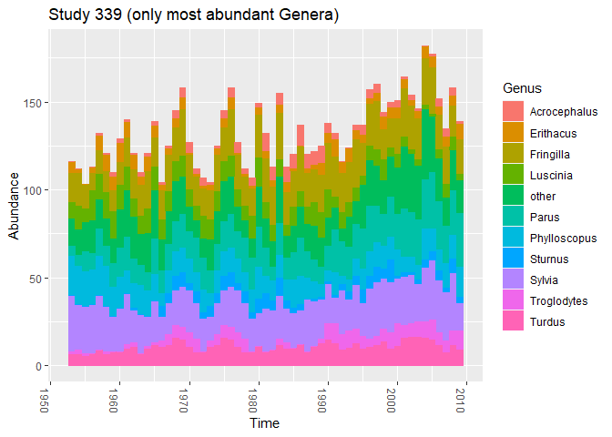
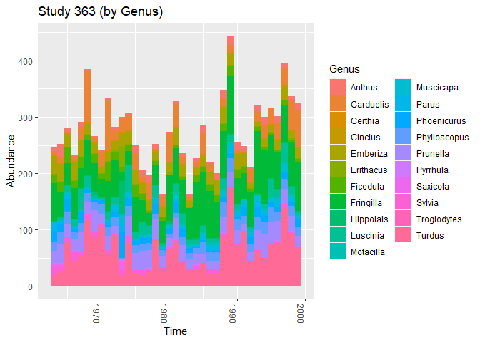
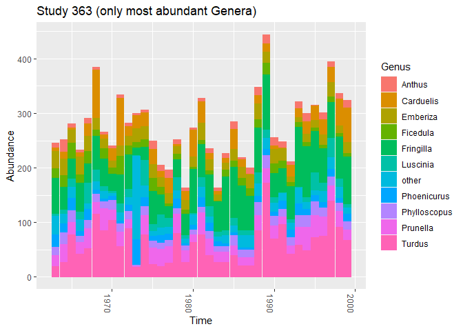
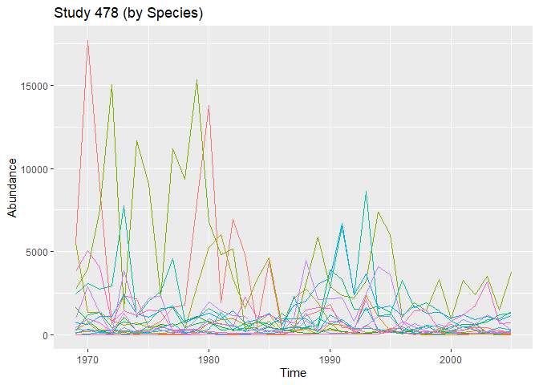
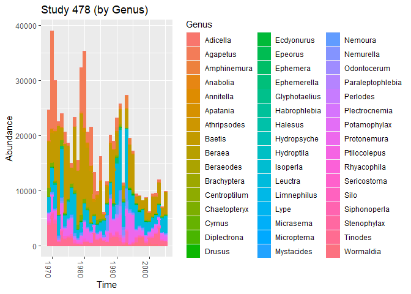
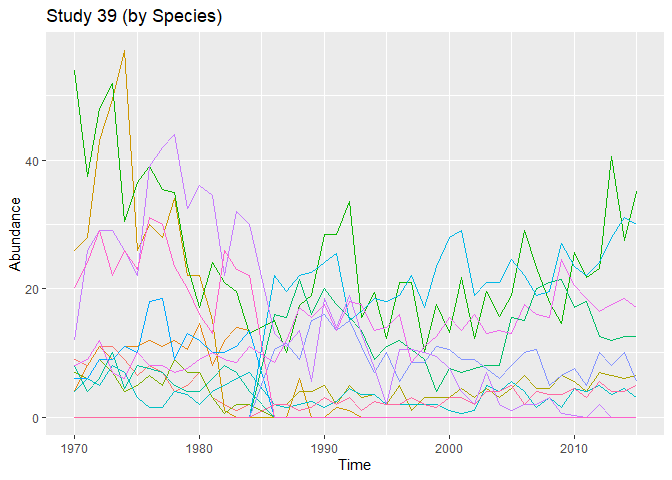
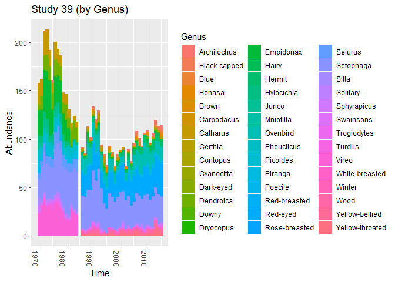
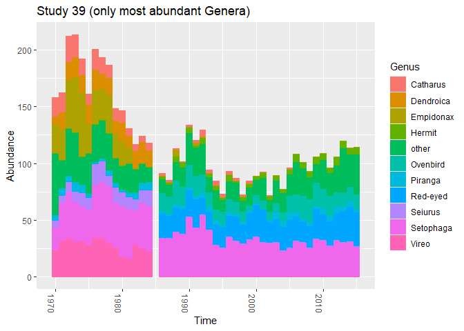

Time series (BioTIME)
================

``` r
here::i_am(paste0(params$name, ".Rmd"), uuid = "964cf30c-e7ec-4fee-a704-f01c350f8766")
```

The purpose of this document is to analyse different time series from
the BioTIME database that could be interesting for the further process.

## Packages

``` r
library("conflicted")
library(dplyr)
library(data.table)
library(ggplot2)
library(viridis) # for color palettes
library(RColorBrewer)
library(phyloseq)
library(microViz)
```

``` r
# create or *empty* the target directory, used to write this file's data: 
projthis::proj_create_dir_target(params$name, clean = TRUE)

# function to get path to target directory: path_target("sample.csv")
path_target <- projthis::proj_path_target(params$name)

# function to get path to previous data: path_source("00-import", "sample.csv")
path_source <- projthis::proj_path_source(params$name)
```

## Read Data

``` r
#### read the file
dt_fullquery <- 
  fread("input_data/BioTIME/BioTIMEquery_24_06_2021.csv")
colnames(dt_fullquery)[1] <- "ID_SAMPLE"

#### read BioTIME Metadata
dt_biotimeMeta <-
  fread("input_data/BioTIME/biotimeMetadata_24_06_2021.csv")
```

## Criteria to select a suitable study

- there should be enough DATA_POINTS (\>50)
- certain Abundance Type (“Count”) –\> not so important
- the samples should be taken from only one location
- the intervals between the time steps should be equal (e.g. one year)

``` r
# select possible IDs
possible_IDs <-
  # dt_biotimeMeta[DATA_POINTS > 35 & NUMBER_LAT_LONG == 1 & AB_BIO %in% c("AB", "A")]$STUDY_ID
  # c(339, 363, 414, 478, 39, 46, 413)
  c(339, 363, 478, 39)
```

``` r
# show available studies
dt_biotimeMeta[DATA_POINTS > 35 & NUMBER_LAT_LONG == 1 & AB_BIO %in% c("AB", "A")] %>%
  .[, YEARS := paste0(START_YEAR, "-", END_YEAR)] %>% 
  # .[, c("TITLE", "AB_BIO", "REALM", "CLIMATE", "START_YEAR", "END_YEAR") := NULL]%>% 
  .[, .(STUDY_ID, REALM, CLIMATE, TAXA, AB_BIO, DATA_POINTS, YEARS,
        NUMBER_OF_SPECIES, NUMBER_OF_SAMPLES, NUMBER_LAT_LONG, TOTAL, 
        ABUNDANCE_TYPE, BIOMASS_TYPE, TITLE)] %>% 
  .[order(-DATA_POINTS)] %>% 
  knitr::kable()
```

| STUDY_ID | REALM       | CLIMATE   | TAXA                     | AB_BIO | DATA_POINTS | YEARS     | NUMBER_OF_SPECIES | NUMBER_OF_SAMPLES | NUMBER_LAT_LONG | TOTAL | ABUNDANCE_TYPE | BIOMASS_TYPE | TITLE                                                                                                                                                 |
|---------:|:------------|:----------|:-------------------------|:-------|------------:|:----------|------------------:|------------------:|----------------:|------:|:---------------|:-------------|:------------------------------------------------------------------------------------------------------------------------------------------------------|
|      339 | Terrestrial | Temperate | Birds                    | A      |          57 | 1953-2009 |                39 |                57 |               1 |  1210 | Count          | NA           | Species trends turnover and composition of a woodland bird community in southern Sweden during a period of 57 years.                                  |
|      414 | Terrestrial | Temperate | Birds                    | A      |          48 | 1924-1976 |                48 |                48 |               1 |   963 | Density        | NA           | Bird populations in east central Illinois. Fluctuations variations and development over a half-century                                                |
|       46 | Terrestrial | Temperate | Birds                    | A      |          47 | 1928-1979 |                29 |                47 |               1 |   528 | Count          | NA           | Skokholm Bird Observatory                                                                                                                             |
|       39 | Terrestrial | Temperate | Birds                    | A      |          45 | 1970-2015 |                52 |                45 |               1 |   959 | Density        | NA           | Bird community dynamics in a temperate deciduous forest Long-term trends at Hubbard Brook                                                             |
|      413 | Terrestrial | Temperate | Birds                    | A      |          44 | 1927-1976 |                60 |               177 |               1 |  1196 | Density        | NA           | Bird populations in east central Illinois. Fluctuations variations and development over a half-century                                                |
|      363 | Terrestrial | Temperate | Birds                    | A      |          37 | 1963-1999 |                35 |                37 |               1 |   636 | Count          | NA           | The 37-year dynamics of a subalpine bird community with special emphasis on the influence of environmental temperature and Epirrita autumnata cycles. |
|      478 | Freshwater  | Temperate | Freshwater invertebrates | A      |          37 | 1969-2005 |                90 |                37 |               1 |  1537 | Count          | NA           | Long term study of the stream ecosystems in the Breitenbach                                                                                           |

## Function to extract one study

``` r
# function to extract one study out of the full query with adjusted Time column
extract_study <- function(data, ID) {
  
  tmp <- data[STUDY_ID == ID]
  
  # check if whole Times are given or only years
  if(tmp[!is.na(DAY) | !is.na(MONTH), .N] != 0) {
    tmp[, Time := as.Date(paste0(YEAR, "-", MONTH, "-", DAY), format = "%Y-%m-%d")]
  } else {
    tmp[, Time := YEAR]
  }
  
  tmp[, .(Time, Abundance = sum.allrawdata.ABUNDANCE, 
          Genus = GENUS, Species = GENUS_SPECIES)]
}
```

## Make phyloseq

``` r
# make phyloseq object for each study in list
for (study_id in possible_IDs) {
  # extract data of the specific study
  dt_study <-
    extract_study(dt_fullquery, ID = study_id)
  
  # create taxonomic table
  dt_tax_table <-
    dt_study[, .(Genus, Species)] %>%
    unique() %>%
    .[, TAX_ID := sprintf("sp-%03d", as.numeric(rownames(.)))]
  
  dt_study <-
    merge(dt_study, dt_tax_table,
          by = c("Genus", "Species"))
  
  dt_tax_table <-
    dt_tax_table %>%
    tibble::column_to_rownames("TAX_ID") %>%
    as.matrix()
  
  # extract sample information
  dt_sample_info <-
    dt_study[, .(Time)] %>%
    unique() %>%
    .[order(Time)] %>%
    .[, SampleID := sprintf("ID-%02d", as.numeric(rownames(.)))]
  
  dt_study <-
    merge(dt_study, dt_sample_info,
          by = c("Time"))
  
  dt_sample_info <- dt_sample_info %>%
    tibble::column_to_rownames("SampleID")
  
  # extract count table
  dt_count_table <-
    dt_study[, .(SampleID, TAX_ID, Abundance)]
  dt_otu_table <-
    dcast(dt_count_table, TAX_ID ~ SampleID, value.var = "Abundance") %>%
    tibble::column_to_rownames("TAX_ID")
  dt_otu_table[is.na(dt_otu_table)] <- 0
  
  # make phyloseq object and assign to ps_study_xy
  assign(paste0("ps_study_", study_id),
         phyloseq(
           otu_table(dt_otu_table, taxa_are_rows = T),
           tax_table(dt_tax_table),
           sample_data(dt_sample_info)
         ))
}
```

## Overview over phyloseq objects

``` r
ps_study_339
```

    ## phyloseq-class experiment-level object
    ## otu_table()   OTU Table:         [ 39 taxa and 57 samples ]
    ## sample_data() Sample Data:       [ 57 samples by 1 sample variables ]
    ## tax_table()   Taxonomy Table:    [ 39 taxa by 2 taxonomic ranks ]

``` r
ps_study_363
```

    ## phyloseq-class experiment-level object
    ## otu_table()   OTU Table:         [ 35 taxa and 37 samples ]
    ## sample_data() Sample Data:       [ 37 samples by 1 sample variables ]
    ## tax_table()   Taxonomy Table:    [ 35 taxa by 2 taxonomic ranks ]

``` r
ps_study_478
```

    ## phyloseq-class experiment-level object
    ## otu_table()   OTU Table:         [ 90 taxa and 37 samples ]
    ## sample_data() Sample Data:       [ 37 samples by 1 sample variables ]
    ## tax_table()   Taxonomy Table:    [ 90 taxa by 2 taxonomic ranks ]

``` r
ps_study_39
```

    ## phyloseq-class experiment-level object
    ## otu_table()   OTU Table:         [ 52 taxa and 45 samples ]
    ## sample_data() Sample Data:       [ 45 samples by 1 sample variables ]
    ## tax_table()   Taxonomy Table:    [ 52 taxa by 2 taxonomic ranks ]

``` r
# ps_study_414
# ps_study_46
# ps_study_413
```

## Transform densities to relative abundances for study 39

``` r
# transform counts to relative abundance
ps_study_39_rel_counts <-
  transform_sample_counts(ps_study_39,
                          function(x) x / sum(x))
```

## Group dataset by Genus

Aggregate the time series by summarizing counts over Genus level.

``` r
for(study_id in possible_IDs) {
  tmp_ps <-
    get(paste0("ps_study_", study_id)) %>%
    # tax_fix(sep = "_") %>%
    # summarize over tax level, include NAs
    tax_glom(taxrank = "Genus", NArm = FALSE) %>%
    speedyseq::transmute_tax_table(Genus, .otu = Genus)
  
  assign(paste0("ps_study_", study_id, "_GenusLevel"),
         tmp_ps)
}
```

## Summarize over 10 most abundant Genera / 15 most abundant species

### Get the 10 most abundant genera and 15 most abundant species

and add pseudo counts of 0.001 to the count table

``` r
for(study_id in possible_IDs){
  ps_raw <- get(paste0("ps_study_", study_id))
  
  data <-
    ps_raw %>% 
    psmelt() %>%
    as_tibble()
  
  # get Genera with highest abundance (sum over all Counts for each Genus)
  most_abundant_genera <-
    data %>%
      group_by(Genus) %>%
      summarise(Sum_Abundance = sum(Abundance)) %>% # another possible criteria would be mean(Abundance)
      arrange(-Sum_Abundance) %>%
      .[1:10, "Genus"] %>% 
    as.vector()

  # Rename genera that are not in most_abundant_genera to "other"
  ps_tmp <- ps_raw %>%
    tax_mutate(Genus = if_else(
      Genus %in% most_abundant_genera$Genus,
      as.character(Genus),
      "other"
    ))
  
  # select only Genus and Species column of tax_table
  tax_table(ps_tmp) <- tax_table(ps_tmp)[, c("Genus", "Species")]
  
  ps_tmp <- ps_tmp %>%
    # summarize over tax level, include NAs
    tax_glom(taxrank = "Genus", NArm = FALSE) %>%
    speedyseq::transmute_tax_table(Genus, .otu = Genus)
  
  # add pseudo counts of 0.001
  otu_table(ps_tmp) <- otu_table(ps_tmp) + 0.001

  assign(paste0("ps_study_", study_id, "_Genus_10_most_abundant"),
         ps_tmp)
  
  #### 15 most abundant Species
   # get Species with highest abundance (sum over all Counts for each Species)
  most_abundant_species <-
    data %>%
      group_by(Species) %>%
      summarise(Sum_Abundance = sum(Abundance)) %>% # another possible criteria would be mean(Abundance)
      arrange(-Sum_Abundance) %>%
      .[1:15, "Species"] %>% 
    as.vector()

  # Rename species that are not in most_abundant_species to "other"
  ps_tmp <- ps_raw %>%
    tax_mutate(Species_grouped = if_else(
      Species %in% most_abundant_species$Species,
      as.character(Species),
      "other"
    )) %>%
    tax_mutate(Species = Species_grouped)
  
  # select only Genus and Species column of tax_table
  tax_table(ps_tmp) <- tax_table(ps_tmp)[, c("Species", "Species_grouped")]
  
  ps_tmp <- ps_tmp %>%
    # summarize over tax level, include NAs
    tax_glom(taxrank = "Species", NArm = FALSE) %>%
    speedyseq::transmute_tax_table(Species, .otu = Species)
  
  # add pseudo counts of 0.001
  otu_table(ps_tmp) <- otu_table(ps_tmp) + 0.001

  assign(paste0("ps_study_", study_id, "_Species_15_most_abundant"),
         ps_tmp)
}
```

## Plot timeseries

``` r
for (study_id in possible_IDs) {
  plt_lines_Species <-
    ggplot(psmelt(get(paste0("ps_study_", study_id, "_Species_15_most_abundant"))),
           aes(x = Time, y = Abundance, col = Species)) +
    geom_line() +
    theme(legend.position = "none") +
      labs(title = paste0("Study ", study_id, " (by Species)"))
  
  plt_bar_Genus <-
    plot_bar(get(paste0("ps_study_", study_id)),
             x = "Time", fill = "Genus") +
    # theme(legend.position = "none") +
    geom_bar(aes(color = Genus, fill = Genus),
             stat = "identity",
             position = "stack") +
    labs(title = paste0("Study ", study_id, " (by Genus)"))
  
  plt_bar_Genus_ma <-
    plot_bar(get(paste0("ps_study_", study_id, "_Genus_10_most_abundant")),
             x = "Time", fill = "Genus") +
    # theme(legend.position = "none") +
    geom_bar(aes(color = Genus, fill = Genus),
             stat = "identity",
             position = "stack") +
    labs(title = paste0("Study ", study_id, " (only most abundant Genera)"))
  
  show(plt_lines_Species)
  show(plt_bar_Genus)
  show(plt_bar_Genus_ma)
}
```

<!-- --><!-- --><!-- --><!-- --><!-- --><!-- --><!-- --><!-- --><!-- --><!-- --><!-- --><!-- -->

## Save Phyloseq Objects

``` r
for (study_id in possible_IDs) {
  # ps on Species level
  saveRDS(get(paste0("ps_study_", study_id)),
          path_target(paste0("ps_study_", study_id, "_SpeciesLevel.rds")))
  # ps on Genus level
  saveRDS(get(paste0("ps_study_", study_id, "_GenusLevel")),
          path_target(paste0("ps_study_", study_id, "_GenusLevel.rds")))
  
  # save most abundant
  # ps on Species level
  saveRDS(get(paste0("ps_study_", study_id, "_Species_15_most_abundant")),
          path_target(paste0("ps_study_", study_id, "_Species_15_most_abundant.rds")))
  # ps on Genus level
  saveRDS(get(paste0("ps_study_", study_id, "_Genus_10_most_abundant")),
          path_target(paste0("ps_study_", study_id, "_Genus_10_most_abundant.rds")))
}

saveRDS(ps_study_39_rel_counts,
        path_target(paste0("ps_study_39_rel_counts.rds")))
```

## Save time series as csv files

``` r
for(study_id in possible_IDs) {
  
  # get the tmp phyloseq object
  ps_obj <- get(paste0("ps_study_", study_id, "_Species_15_most_abundant"))
  
  if(taxa_are_rows(ps_obj)) {
    otu_tmp <- t(otu_table(ps_obj))
  } else {
    otu_tmp <- otu_table(ps_obj)
  }
  # combine count data with time information
  ts_obj <-
    cbind(sample_data(ps_obj)[, "Time"],
          otu_tmp)
  # print(head(ts_obj))
  
  # save time series as csv file
  write.csv(
    ts_obj,
    path_target(paste0("ts_study_", study_id, "_Species_15_most_abundant.csv")),
    row.names = F
  )
    
}
for(study_id in possible_IDs) {
  
  # get the tmp phyloseq object
  ps_obj <- get(paste0("ps_study_", study_id, "_Genus_10_most_abundant"))
  
  if(taxa_are_rows(ps_obj)) {
    otu_tmp <- t(otu_table(ps_obj))
  } else {
    otu_tmp <- otu_table(ps_obj)
  }
  # combine count data with time information
  ts_obj <-
    cbind(sample_data(ps_obj)[, "Time"],
          otu_tmp)
  # print(head(ts_obj))
  
  # save time series as csv file
  write.csv(
    ts_obj,
    path_target(paste0("ts_study_", study_id, "_Genus_10_most_abundant.csv")),
    row.names = F
  )
    
}
```

## Files written

These files have been written to the target directory,
`data/01a-timeseries-BioTIME`:

``` r
projthis::proj_dir_info(path_target())
```

    ## # A tibble: 25 × 4
    ##    path                                      type       size modification_time  
    ##    <fs::path>                                <fct> <fs::byt> <dttm>             
    ##  1 ps_study_339_GenusLevel.rds               file      2.22K 2023-11-09 09:47:54
    ##  2 ps_study_339_Genus_10_most_abundant.rds   file      1.57K 2023-11-09 09:47:54
    ##  3 ps_study_339_SpeciesLevel.rds             file      3.13K 2023-11-09 09:47:54
    ##  4 ps_study_339_Species_15_most_abundant.rds file      1.94K 2023-11-09 09:47:54
    ##  5 ps_study_363_GenusLevel.rds               file      1.85K 2023-11-09 09:47:54
    ##  6 ps_study_363_Genus_10_most_abundant.rds   file      1.71K 2023-11-09 09:47:54
    ##  7 ps_study_363_SpeciesLevel.rds             file      2.57K 2023-11-09 09:47:54
    ##  8 ps_study_363_Species_15_most_abundant.rds file      2.03K 2023-11-09 09:47:54
    ##  9 ps_study_39_GenusLevel.rds                file      2.49K 2023-11-09 09:47:54
    ## 10 ps_study_39_Genus_10_most_abundant.rds    file      1.51K 2023-11-09 09:47:54
    ## # ℹ 15 more rows
