Time series (Compositional Lotka Volterra)
================
Compiled at 2023-05-08 12:59:24 UTC

``` r
here::i_am(paste0(params$name, ".Rmd"), uuid = "fbad9ade-134a-4a83-a801-9900003f3395")
```

The purpose of this document is to have a look at the time series data
used in the Compositional Lotka Volterra paper.

``` r
library("conflicted")
library(dplyr)
library(data.table)
library(ggplot2)
```

``` r
# create or *empty* the target directory, used to write this file's data: 
projthis::proj_create_dir_target(params$name, clean = TRUE)

# function to get path to target directory: path_target("sample.csv")
path_target <- projthis::proj_path_target(params$name)

# function to get path to previous data: path_source("00-import", "sample.csv")
path_source <- projthis::proj_path_source(params$name)
```

## Main

### Bucci

#### Read the data

``` r
#### read the file
dt_bucci_raw <- 
  fread("data/clv/bucci/data_cdiff/counts.txt", header = T)

dt_bucci_long <-
  melt(dt_bucci_raw,
       id.vars = "Species", value.name = "Abundance", variable.name = "Time")
```

#### Plot the data

``` r
ggplot(dt_bucci_long) +
  geom_line(aes(as.numeric(Time), Abundance, col = Species)) +
  theme(legend.position = "none") +
  scale_y_log10()
```

    ## Warning: Transformation introduced infinite values in continuous y-axis

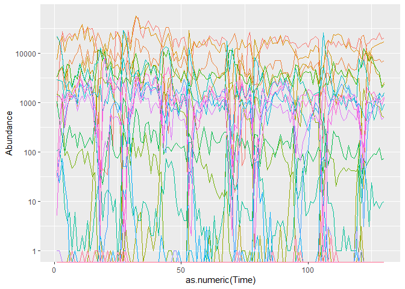<!-- -->

``` r
ggplot(dt_bucci_long) +
  geom_bar(aes(as.numeric(Time), Abundance, fill = Species), stat = "identity") +
  theme(legend.position = "none") +
  labs(x = "Time")
```

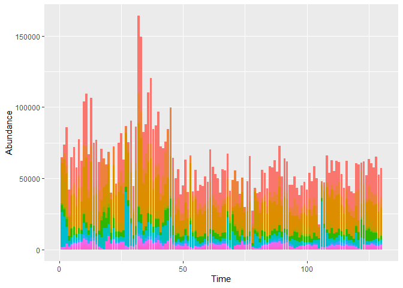<!-- -->

### Stein

#### Read the data

``` r
#### read the file

# # preparation of the data
# dt_stein_raw <-
#   fread("data/clv/stein/raw_data.csv") %>%
#   t() %>%
#   .[, lapply(.SD, as.numeric)]
# 
# write.table(dt_stein_raw,
#           "data/clv/stein/raw_data_transposed.csv",
#           row.names = FALSE)

dt_stein_raw <- 
  fread("data/clv/stein/raw_data_transposed.csv")

dt_stein_long <-
  melt(dt_stein_raw,
       id.vars = c("Population", "Replicate", "ID", "time (in d)", "Clindamycin signal"), 
       variable.name = "Genus")
```

#### List of Genus

``` r
dt_stein_long$Genus %>% unique()
```

    ##  [1] undefined_genus_of_Enterobacteriaceae     
    ##  [2] Blautia                                   
    ##  [3] Barnesiella                               
    ##  [4] undefined_genus_of_unclassified_Mollicutes
    ##  [5] undefined_genus_of_Lachnospiraceae        
    ##  [6] Akkermansia                               
    ##  [7] Clostridium_difficile                     
    ##  [8] unclassified_Lachnospiraceae              
    ##  [9] Coprobacillus                             
    ## [10] Enterococcus                              
    ## [11] Other                                     
    ## 11 Levels: undefined_genus_of_Enterobacteriaceae Blautia ... Other

#### Plot the data

``` r
for (i in 1:9) {
  plot_tmp <-
    ggplot(dt_stein_long[ID == i]) +
      geom_line(aes(`time (in d)`, value, col = Genus)) +
      theme(legend.position = "bottom") +
      ylim(0, 6.2) +
    labs(title = paste("ID =", i))
  
  print(plot_tmp)
}
```

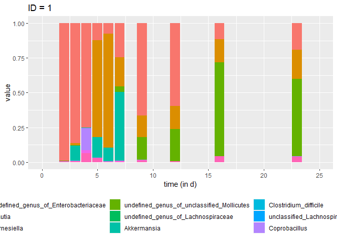<!-- -->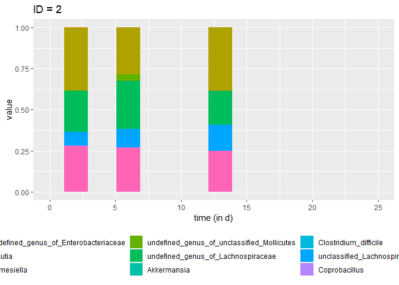<!-- -->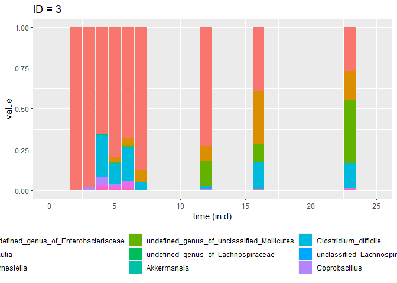<!-- -->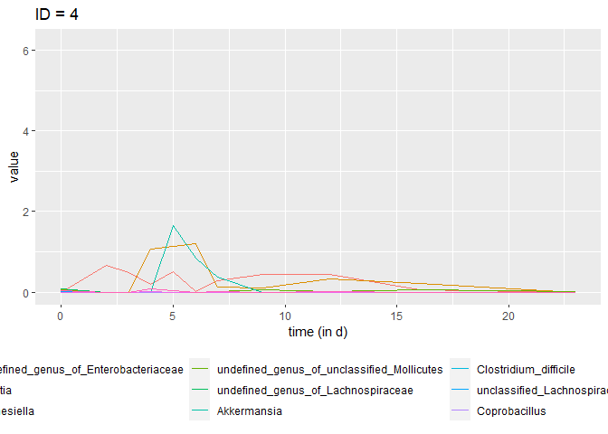<!-- -->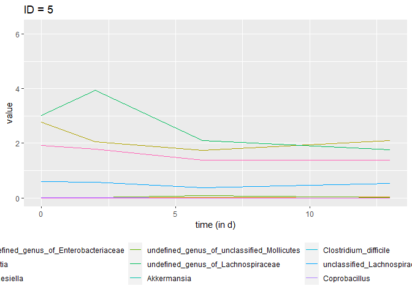<!-- -->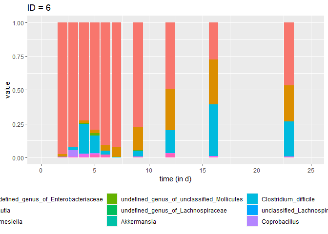<!-- -->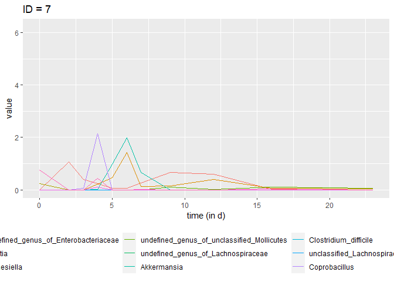<!-- -->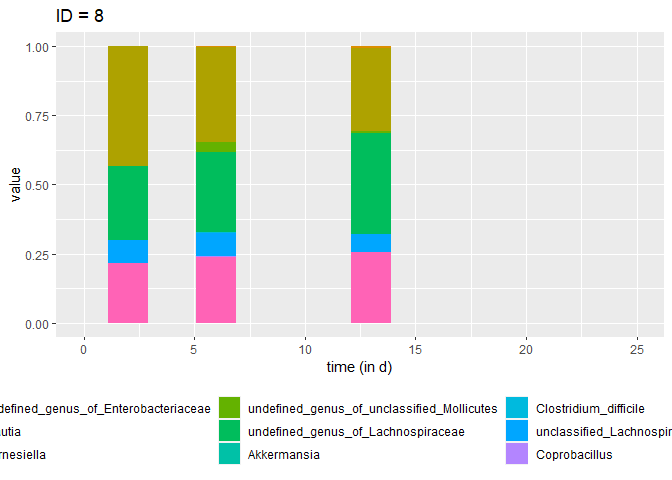<!-- -->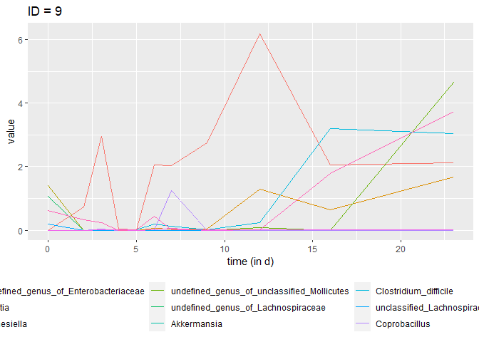<!-- -->

``` r
ggplot(dt_stein_long) +
  geom_bar(aes(`time (in d)`, value, fill = Genus), stat = "identity") +
  theme(legend.position = "none")
```

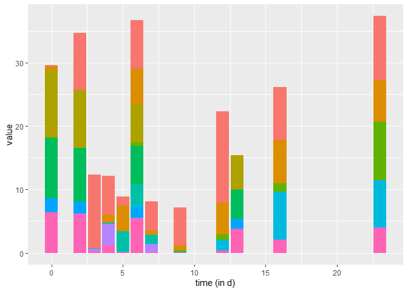<!-- -->

## Files written

These files have been written to the target directory,
`data/01b-timeseries-CLVpaper`:

``` r
projthis::proj_dir_info(path_target())
```

    ## # A tibble: 0 × 4
    ## # ℹ 4 variables: path <fs::path>, type <fct>, size <fs::bytes>,
    ## #   modification_time <dttm>
