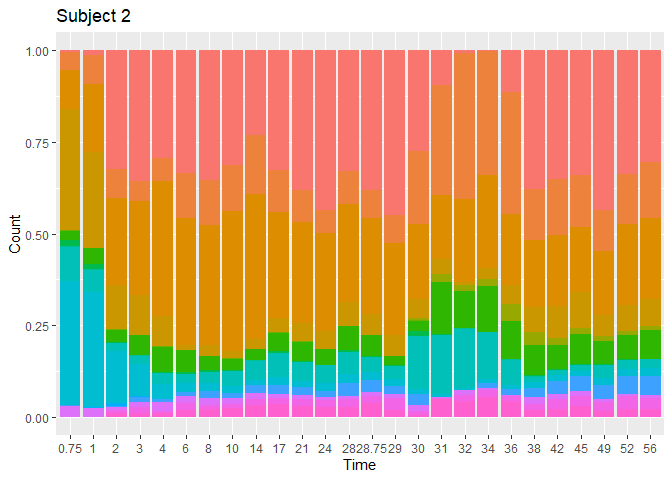
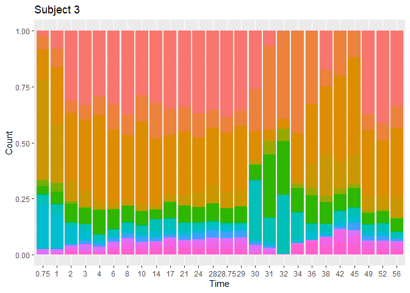
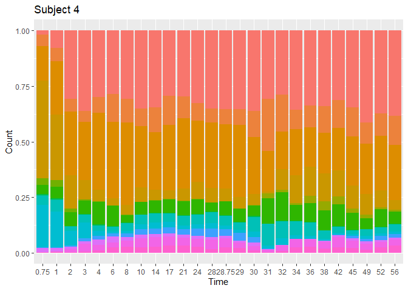
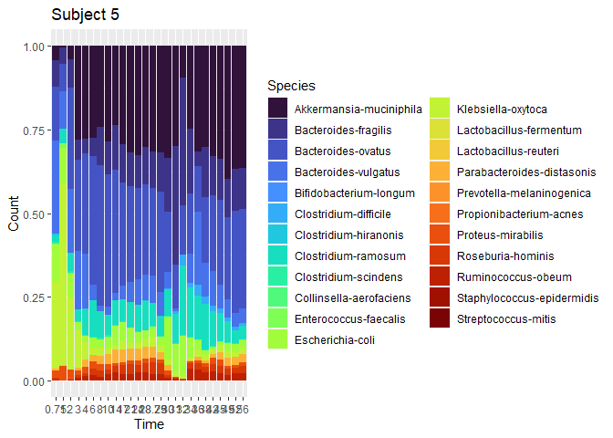

Time series (Compositional Lotka Volterra)
================
Compiled at 2023-05-25 07:32:38 UTC

``` r
here::i_am(paste0(params$name, ".Rmd"), uuid = "fbad9ade-134a-4a83-a801-9900003f3395")
```

The purpose of this document is to have a look at the time series data
used in the Compositional Lotka Volterra paper.

``` r
library("conflicted")
library(tidyverse)
library(data.table)
```

``` r
# create or *empty* the target directory, used to write this file's data: 
projthis::proj_create_dir_target(params$name, clean = TRUE)

# function to get path to target directory: path_target("sample.csv")
path_target <- projthis::proj_path_target(params$name)

# function to get path to previous data: path_source("00-import", "sample.csv")
path_source <- projthis::proj_path_source(params$name)
```

## Main

### Bucci

#### Read data

``` r
#### read the file
dt_bucci_raw <- 
  fread("data/clv/bucci/data_cdiff/counts.txt", header = T)

knitr::kable(head(dt_bucci_raw))
```

| Species                 |    1 |    2 |    3 |   4 |    5 |    6 |    7 |    8 |    9 |   10 |   11 |   12 |   13 |   14 |   15 |  16 |   17 |   18 |   19 |   20 |   21 |   22 |   23 |   24 |   25 |   26 |   27 |   28 |  29 |  30 |   31 |   32 |   33 |   34 |   35 |   36 |   37 |   38 |   39 |   40 |   41 |   42 |   43 |   44 |   45 |   46 |   47 |   48 |   49 |  50 |   51 |  52 |   53 |   54 |  55 |   56 |  57 |   58 |   59 |   60 |   61 |   62 |   63 |   64 |   65 |   66 |   67 |   68 |   69 |   70 |   71 |   72 |   73 |   74 |   75 |   76 |   77 |  78 |   79 |   80 |  81 |  82 |   83 |   84 |   85 |   86 |   87 |   88 |   89 |   90 |  91 |   92 |  93 |  94 |   95 |  96 |  97 |   98 |   99 |  100 |  101 | 102 |  103 |  104 | 105 |  106 |  107 | 108 |  109 |  110 |  111 |  112 |  113 | 114 | 115 |  116 |  117 | 118 | 119 | 120 | 121 |  122 |  123 |  124 |  125 |  126 |  127 |  128 |  129 |  130 |
|:------------------------|-----:|-----:|-----:|----:|-----:|-----:|-----:|-----:|-----:|-----:|-----:|-----:|-----:|-----:|-----:|----:|-----:|-----:|-----:|-----:|-----:|-----:|-----:|-----:|-----:|-----:|-----:|-----:|----:|----:|-----:|-----:|-----:|-----:|-----:|-----:|-----:|-----:|-----:|-----:|-----:|-----:|-----:|-----:|-----:|-----:|-----:|-----:|-----:|----:|-----:|----:|-----:|-----:|----:|-----:|----:|-----:|-----:|-----:|-----:|-----:|-----:|-----:|-----:|-----:|-----:|-----:|-----:|-----:|-----:|-----:|-----:|-----:|-----:|-----:|-----:|----:|-----:|-----:|----:|----:|-----:|-----:|-----:|-----:|-----:|-----:|-----:|-----:|----:|-----:|----:|----:|-----:|----:|----:|-----:|-----:|-----:|-----:|----:|-----:|-----:|----:|-----:|-----:|----:|-----:|-----:|-----:|-----:|-----:|----:|----:|-----:|-----:|----:|----:|----:|----:|-----:|-----:|-----:|-----:|-----:|-----:|-----:|-----:|-----:|
| Collinsella-aerofaciens |    0 |    0 |    0 |   0 |    0 |    0 |    0 |    0 |    0 |    0 |    0 |    0 |    0 |    0 |    0 |   0 |    0 |    0 |    0 |    0 |    0 |    0 |    0 |    0 |    0 |    0 |    0 |    0 |   0 |   0 |    0 |    0 |    0 |    0 |    0 |    0 |    0 |    0 |    0 |    0 |    0 |    0 |    0 |    0 |    0 |    0 |    0 |    0 |    0 |   0 |    0 |   0 |    0 |    0 |   0 |    0 |   0 |    0 |    0 |    0 |    0 |    0 |    0 |    0 |    0 |    0 |    0 |    0 |    0 |    0 |    0 |    0 |    0 |    0 |    0 |    0 |    0 |   0 |    0 |    0 |   0 |   0 |    0 |    0 |    0 |    0 |    0 |    0 |    0 |    0 |   0 |    0 |   0 |   0 |    0 |   0 |   0 |    0 |    0 |    0 |    0 |   0 |    0 |    0 |   0 |    0 |    0 |   0 |    0 |    0 |    0 |    0 |    0 |   0 |   0 |    0 |    0 |   0 |   0 |   0 |   0 |    0 |    0 |    0 |    0 |    0 |    0 |    0 |    0 |    0 |
| Clostridium-hiranonis   | 1483 | 1416 | 1038 |  84 |  101 |   72 |   46 |   55 |   89 |  102 |  115 |   56 |  102 |   57 |   31 |  38 |    0 |    0 |    0 |    0 |    0 |    0 |    0 |    0 |    0 |    0 |  248 |  168 | 120 |  54 |  214 |   74 |  129 |   79 |  121 |  244 |   99 |   36 |   92 |   84 |   33 |   39 |    1 |    0 |    1 |    1 |    0 |    0 |    0 |   0 |    0 |   0 | 1918 | 1536 | 592 |  269 | 108 |   56 |   45 |   57 |   24 |   36 |   21 |   15 |   11 |   15 |   12 |   16 |    1 |    0 |    0 |    0 |    0 |    1 |    1 |    0 |    1 |   0 | 1331 | 1209 | 578 | 304 |  116 |   43 |   57 |   95 |   88 |  115 |  187 |   90 |  65 |   60 |  31 |  39 |    0 |   0 |   0 |    0 |    0 |    0 |    0 |   0 |    0 |    0 | 108 |   13 |   90 | 112 |   76 |   70 |   20 |   33 |   42 |  48 |  40 |   46 |   42 |  41 |  40 |  54 |   0 |    0 |    0 |    0 |    0 |    0 |    0 |    0 |    0 |    0 |
| Clostridium-difficile   |    0 |    0 |    0 |   0 |    0 |    1 |    0 |    0 |    0 |    0 |    0 |    0 |    0 |    3 |   20 | 265 | 2875 | 3204 | 3199 | 2484 | 2598 | 2453 | 1566 |  910 |  629 |  459 |    0 |    3 |   1 |   0 |    0 |    2 |    5 |    6 |    0 |    1 |    3 |    2 |    1 |    2 |   16 |  458 | 1660 | 1416 | 1961 | 2994 | 1778 | 1110 |  667 | 664 |  619 | 483 |    0 |    0 |   0 |    0 |   0 |    0 |    0 |    0 |    0 |    0 |    0 |    2 |    0 |    0 |   11 |  337 | 2403 | 2571 | 1055 | 1498 | 1028 | 1168 |  501 |  440 |  485 | 144 |    0 |    0 |   2 |   0 |    0 |    0 |    0 |    1 |    0 |    0 |    3 |    0 |   0 |    4 |  21 | 109 | 1129 | 435 | 322 | 1360 | 1888 | 1497 | 1048 | 675 |  393 |  393 |   0 |    0 |    0 |   0 |    0 |    0 |    1 |    0 |    0 |   0 |   0 |    0 |    0 |   0 |  20 | 103 | 399 | 1903 |  895 | 1720 | 1420 | 1089 |  882 |  816 |  537 |  503 |
| Proteus-mirabilis       | 1330 | 1327 | 1092 | 726 | 1271 | 1602 | 1290 | 1375 |  670 | 1093 | 1345 | 1025 | 1490 | 1152 |  727 | 926 |  159 |   20 |   72 |  166 |  105 |  600 |  467 |  520 |  512 |  341 | 2605 | 1814 | 832 | 650 | 1931 | 3404 | 2999 | 1256 | 1409 | 1191 | 1207 |  606 |  860 |  999 |  775 | 1156 |  168 | 1129 |  587 |  173 |  862 |  801 |  480 | 435 |  472 | 278 | 1472 |  827 | 738 | 1082 | 757 | 1010 | 1056 |  872 |  720 |  573 |  684 |  909 |  750 | 1096 | 1064 | 2002 |  619 |   56 |  108 |   62 |  143 |  435 |  725 |  465 |  679 | 254 |  880 |  606 | 413 | 736 | 1247 | 1065 | 1043 |  887 |  843 |  778 |  937 |  598 | 651 |  715 | 394 | 661 |  231 | 109 |  65 |  154 |  235 |  414 |  601 | 440 |  548 |  407 | 364 | 2023 | 1396 | 811 | 1067 | 1415 | 1166 |  992 |  523 | 430 | 477 |  722 |  616 | 535 | 442 | 930 |  40 |  110 |  403 |  425 |  618 | 1118 | 1120 |  657 |  449 |  509 |
| Clostridium-scindens    | 1065 |  460 |  199 |  98 |  209 |  343 |  195 |  234 |  120 |  255 |  194 |  120 |  154 |  197 |  144 | 493 |   48 |   43 |   22 |   54 |  154 |  329 |  113 |   79 |   75 |   98 | 1266 | 1009 | 324 |  90 |  210 |  746 |  544 |  166 |  151 |  363 |  408 |  150 |  279 |  256 |  106 |  943 |   88 |  120 |  125 |  102 |  132 |  153 |  130 | 118 |  131 |  63 |  236 |  177 |  94 |   60 | 103 |  182 |  327 |  183 |   87 |  262 |  176 |  153 |  154 |  216 |  254 |  255 |   88 |    9 |   87 |  245 |  124 |  189 |  115 |  169 |   99 |  46 |  223 |  220 |  50 | 123 |  185 |  160 |  132 |  119 |   78 |  122 |  224 |  140 | 160 |  166 | 116 | 330 |   20 |  75 |  67 |   91 |   35 |  104 |   85 |  63 |   80 |  125 |  91 |   37 |  291 |  54 |   93 |  265 |  208 |  208 |  121 |  80 |  68 |  134 |   81 |  72 |  90 | 153 |  23 |   73 |   53 |   68 |   79 |   92 |   88 |  122 |   68 |   72 |
| Ruminococcus-obeum      |   30 |  408 | 1405 | 312 |  754 | 1322 | 1301 | 1931 | 2064 | 3734 | 2338 | 1555 | 1835 | 2094 | 1171 | 210 |  370 |    2 | 4888 | 8381 | 2435 | 3235 | 1791 | 1828 | 2743 | 3213 |    3 |    8 | 834 | 465 |  828 | 2992 | 3278 | 1913 | 2837 | 3848 | 3614 | 2183 | 2326 | 3558 | 1240 |  378 | 3685 | 3719 | 5261 | 2721 |  859 | 1208 | 1085 | 754 | 1374 | 854 |   13 |  137 | 875 |  272 | 322 |  971 | 1269 | 1034 | 2218 | 1902 | 1534 | 1247 | 1062 | 1319 | 1260 |  260 |   28 |    2 | 2340 | 2703 | 1452 | 2893 | 1228 | 1160 | 1316 | 753 |   23 |  194 |  85 | 213 |  497 |  982 | 1578 | 1410 | 1636 | 1724 | 2220 | 1379 | 996 | 1379 | 890 | 433 |   77 | 363 | 947 | 1143 |  829 | 1046 | 1137 | 602 | 1414 | 1542 |  49 |    3 |   73 | 560 |  717 |  984 |  575 | 1125 | 1425 | 993 | 820 | 1385 | 1105 | 736 | 732 | 402 | 203 |  114 | 2056 | 1655 | 1488 | 1636 | 1267 | 1012 | 1102 | 1276 |

``` r
# change format of count data
dt_bucci_long <-
  melt(dt_bucci_raw,
       id.vars = "Species", value.name = "Count", variable.name = "sampleID") %>% 
  .[, sampleID := as.numeric(as.character(sampleID))]

# read metadata file
dt_bucci_meta <-
  fread("data/clv/bucci/data_cdiff/metadata.txt", header = T)

# merge metadata to count data
dt_bucci_long <-
  merge(dt_bucci_long, dt_bucci_meta, by = "sampleID")

# show first rows of table
knitr::kable(head(dt_bucci_long))
```

| sampleID | Species                 | Count | isIncluded | subjectID | measurementid | perturbid | exptblock | intv |
|---------:|:------------------------|------:|-----------:|----------:|--------------:|----------:|----------:|-----:|
|        1 | Collinsella-aerofaciens |     0 |          1 |         1 |          0.75 |         0 |         1 |    0 |
|        1 | Clostridium-hiranonis   |  1483 |          1 |         1 |          0.75 |         0 |         1 |    0 |
|        1 | Clostridium-difficile   |     0 |          1 |         1 |          0.75 |         0 |         1 |    0 |
|        1 | Proteus-mirabilis       |  1330 |          1 |         1 |          0.75 |         0 |         1 |    0 |
|        1 | Clostridium-scindens    |  1065 |          1 |         1 |          0.75 |         0 |         1 |    0 |
|        1 | Ruminococcus-obeum      |    30 |          1 |         1 |          0.75 |         0 |         1 |    0 |

Info about time points: When was the data collected?

Fecal pellets were collected at days 0.75, 1, 2, 3, 4, 6, 8, 10, 14, 17,
21, 24, and 28 of the initial colonization and at days 0.75, 1, 2, 3, 4,
6, 8, 10, 14, 17, 21, 24, and 28 post-infection with C. difficile.

#### Plot data

``` r
ggplot(dt_bucci_long[subjectID == 1], aes(measurementid, Count)) +
    geom_bar(aes(fill = Species), stat = "identity") +
    theme(legend.position = "none") +
    labs(x = "Time",
         title = paste("Subject", 1))
```

<!-- -->

``` r
for(i in 1:5){
  pl <- ggplot(dt_bucci_long[subjectID == i], aes(as.factor(measurementid), Count)) +
    geom_bar(aes(fill = Species), stat = "identity", position = "fill") +
    theme(legend.position = "none") +
    labs(x = "Time",
         title = paste("Subject", i))
  
  print(pl)
}
```

<!-- --><!-- --><!-- --><!-- --><!-- -->

### Stein

#### Read data

``` r
#### read the file

# # preparation of the data
# dt_stein_raw <-
#   fread("data/clv/stein/raw_data.csv") %>%
#   t() %>%
#   .[, lapply(.SD, as.numeric)]
# 
# write.table(dt_stein_raw,
#           "data/clv/stein/raw_data_transposed.csv",
#           row.names = FALSE)

dt_stein_raw <- 
  fread("data/clv/stein/raw_data_transposed.csv")

dt_stein_long <-
  melt(dt_stein_raw,
       id.vars = c("Population", "Replicate", "ID", "time (in d)", "Clindamycin signal"), 
       variable.name = "Genus")
```

#### List of Genus

``` r
dt_stein_long$Genus %>% unique()
```

    ##  [1] undefined_genus_of_Enterobacteriaceae     
    ##  [2] Blautia                                   
    ##  [3] Barnesiella                               
    ##  [4] undefined_genus_of_unclassified_Mollicutes
    ##  [5] undefined_genus_of_Lachnospiraceae        
    ##  [6] Akkermansia                               
    ##  [7] Clostridium_difficile                     
    ##  [8] unclassified_Lachnospiraceae              
    ##  [9] Coprobacillus                             
    ## [10] Enterococcus                              
    ## [11] Other                                     
    ## 11 Levels: undefined_genus_of_Enterobacteriaceae Blautia ... Other

#### Plot data

``` r
for (i in 1:9) {
  plot_tmp <-
    ggplot(dt_stein_long[ID == i]) +
      # geom_line(aes(`time (in d)`, value, col = Genus)) +
      geom_bar(aes(`time (in d)`, value, fill = Genus), 
               stat = "identity", position = "fill") +
      theme(legend.position = "bottom") +
      # ylim(0, 6.2) +
      xlim(0,25) +
    labs(title = paste("ID =", i))
  
  print(plot_tmp)
}
```

    ## Warning: Removed 11 rows containing missing values (`geom_bar()`).

<!-- -->

    ## Warning: Removed 11 rows containing missing values (`geom_bar()`).

<!-- -->

    ## Warning: Removed 11 rows containing missing values (`geom_bar()`).

<!-- -->

    ## Warning: Removed 11 rows containing missing values (`geom_bar()`).

<!-- -->

    ## Warning: Removed 11 rows containing missing values (`geom_bar()`).

<!-- -->

    ## Warning: Removed 11 rows containing missing values (`geom_bar()`).

<!-- -->

    ## Warning: Removed 11 rows containing missing values (`geom_bar()`).

<!-- -->

    ## Warning: Removed 11 rows containing missing values (`geom_bar()`).

<!-- -->

    ## Warning: Removed 11 rows containing missing values (`geom_bar()`).

<!-- -->

## Files written

These files have been written to the target directory,
`data/01b-timeseries-CLVpaper`:

``` r
projthis::proj_dir_info(path_target())
```

    ## # A tibble: 0 × 4
    ## # ℹ 4 variables: path <fs::path>, type <fct>, size <fs::bytes>,
    ## #   modification_time <dttm>
