Time series (miaTime)
================
Compiled at 2023-07-11 13:43:53 UTC

``` r
here::i_am(paste0(params$name, ".Rmd"), uuid = "87d828ae-2f1b-40a8-b559-3784df62c78d")
```

# Packages

``` r
library("conflicted")
library(data.table)
library(tidyverse)
library(viridis) # for color palettes   

# # install the miaTIME package from github
# library(devtools)
# devtools::install_github("microbiome/miaTime")

library(miaTime)
# library(tidySingleCellExperiment)
library(lubridate)
library(TreeSummarizedExperiment)
# library(tidySummarizedExperiment)

library(miaViz)
library(phyloseq)
library(ggtree)
```

``` r
# create or *empty* the target directory, used to write this file's data: 
projthis::proj_create_dir_target(params$name, clean = TRUE)

# function to get path to target directory: path_target("sample.csv")
path_target <- projthis::proj_path_target(params$name)

# function to get path to previous data: path_source("00-import", "sample.csv")
path_source <- projthis::proj_path_source(params$name)
```

# SilvermanAGutData

``` r
# load a dataset from miaTIME

data(SilvermanAGutData)

# SilvermanAGutData@rowLinks
# SilvermanAGutData@colLinks #empty
# 
# cols <- 
#   colData(SilvermanAGutData)
# 
# metadata(SilvermanAGutData) #empty
# 
# referenceSeq(SilvermanAGutData)
```

## Playground TSE

``` r
plotAbundance(SilvermanAGutData, rank = "Order")
```

    ## Warning: useNames = NA is deprecated. Instead, specify either useNames = TRUE
    ## or useNames = TRUE.

    ## Warning: Removed 130 rows containing missing values (`position_stack()`).

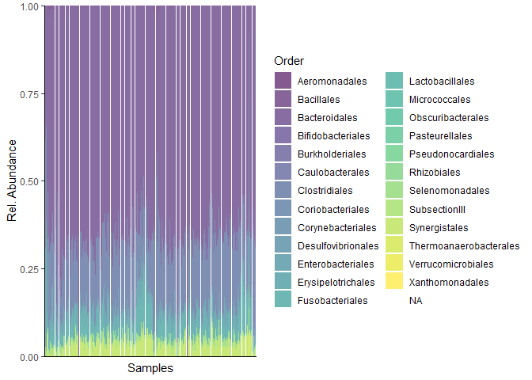<!-- -->

``` r
plotAbundance(SilvermanAGutData, rank = "Order", use_relative = F, layout = "point")
```

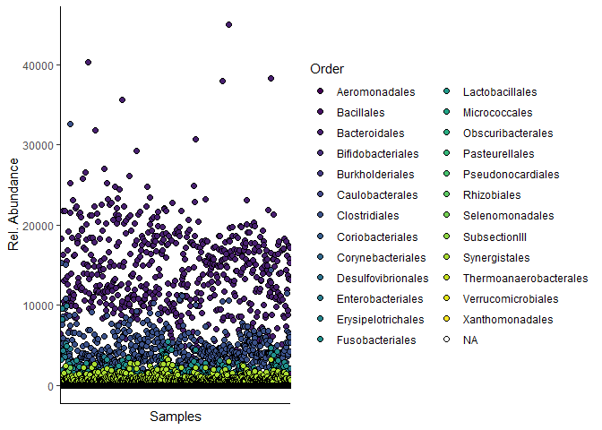<!-- -->

``` r
# # get relative abundances
# counts(relAbundanceCounts(SilvermanAGutData))

# ggtree(rowTree(SilvermanAGutData)) +
#     geom_text2(aes(label = node), color = "darkblue", size = 1) +
#     geom_text2(aes(label = label), color = "darkorange", size = 2) 
```

``` r
colData(SilvermanAGutData) %>% head()
```

    ## DataFrame with 6 rows and 11 columns
    ##                                                     SampleID BarcodeSequence
    ##                                                  <character>     <character>
    ## T..0.V.2.Rep.1..set.3.91..Well.C12    T..0.V.2.Rep.1..set...    TACGAGCCCTAA
    ## T..0.V.3.Rep.1.                              T..0.V.3.Rep.1.    CGATTAGGAATC
    ## T..0.V.4.Rep.1..Set.4.77..WellE10     T..0.V.4.Rep.1..Set...    AACGTAGGCTCT
    ## T..1.Days.V.1.Rep.1..Set.1.54.Well.F7 T..1.Days.V.1.Rep.1...    GCACTTCATTTC
    ## T..1.Days.V.2.Rep.1.                    T..1.Days.V.2.Rep.1.    TCTCGCACTGGA
    ## T..1.Days.V.3.Rep.1..Set.4.68..WellD9 T..1.Days.V.3.Rep.1...    TTAACCTTCCTG
    ##                                         LinkerPrimerSequence    PrimerID
    ##                                                  <character> <character>
    ## T..0.V.2.Rep.1..set.3.91..Well.C12    CAAGCAGAAGACGGCATACG..   806rcbc35
    ## T..0.V.3.Rep.1.                       CAAGCAGAAGACGGCATACG..  806rcbc983
    ## T..0.V.4.Rep.1..Set.4.77..WellE10     CAAGCAGAAGACGGCATACG..  806rcbc173
    ## T..1.Days.V.1.Rep.1..Set.1.54.Well.F7 CAAGCAGAAGACGGCATACG..  806rcbc930
    ## T..1.Days.V.2.Rep.1.                  CAAGCAGAAGACGGCATACG.. 806rcbc1011
    ## T..1.Days.V.3.Rep.1..Set.4.68..WellD9 CAAGCAGAAGACGGCATACG..  806rcbc164
    ##                                           Project DAY_ORDER    Vessel
    ##                                       <character> <integer> <integer>
    ## T..0.V.2.Rep.1..set.3.91..Well.C12          30BR2         0         2
    ## T..0.V.3.Rep.1.                             30BR2         0         3
    ## T..0.V.4.Rep.1..Set.4.77..WellE10           30BR2         0         4
    ## T..1.Days.V.1.Rep.1..Set.1.54.Well.F7       30BR2         1         1
    ## T..1.Days.V.2.Rep.1.                        30BR2         1         2
    ## T..1.Days.V.3.Rep.1..Set.4.68..WellD9       30BR2         1         3
    ##                                        SampleType Pre_Post_Challenge
    ##                                       <character>        <character>
    ## T..0.V.2.Rep.1..set.3.91..Well.C12          Daily      Pre_Challenge
    ## T..0.V.3.Rep.1.                             Daily      Pre_Challenge
    ## T..0.V.4.Rep.1..Set.4.77..WellE10           Daily      Pre_Challenge
    ## T..1.Days.V.1.Rep.1..Set.1.54.Well.F7       Daily      Pre_Challenge
    ## T..1.Days.V.2.Rep.1.                        Daily      Pre_Challenge
    ## T..1.Days.V.3.Rep.1..Set.4.68..WellD9       Daily      Pre_Challenge
    ##                                       Normal_Noise_Sample
    ##                                               <character>
    ## T..0.V.2.Rep.1..set.3.91..Well.C12                 Normal
    ## T..0.V.3.Rep.1.                                    Normal
    ## T..0.V.4.Rep.1..Set.4.77..WellE10                  Normal
    ## T..1.Days.V.1.Rep.1..Set.1.54.Well.F7              Normal
    ## T..1.Days.V.2.Rep.1.                               Normal
    ## T..1.Days.V.3.Rep.1..Set.4.68..WellD9              Normal
    ##                                                  Description
    ##                                                  <character>
    ## T..0.V.2.Rep.1..set.3.91..Well.C12    T_0 V.2 Rep 1  set 3..
    ## T..0.V.3.Rep.1.                               T_0 V.3 Rep 1 
    ## T..0.V.4.Rep.1..Set.4.77..WellE10     T_0 V.4 Rep 1  Set 4..
    ## T..1.Days.V.1.Rep.1..Set.1.54.Well.F7 Wrong Tube T_7 Days ..
    ## T..1.Days.V.2.Rep.1.                  Wrong Tube T_7 Days ..
    ## T..1.Days.V.3.Rep.1..Set.4.68..WellD9 Wrong Tube T_7 Days ..

``` r
SilvermanAGutData$SampleType %>% table()
```

    ## .
    ##  Daily Hourly 
    ##     69    570

``` r
SilvermanAGutData$Vessel %>% table()
```

    ## .
    ##   1   2   3   4 
    ## 160 160 159 160

``` r
tse_ps_Silverman_daily_V1 <- 
  SilvermanAGutData[ , SilvermanAGutData$SampleType == "Daily" & SilvermanAGutData$Vessel == 1]

plotAbundance(tse_ps_Silverman_daily_V1, rank = "Family", add_legend = FALSE)
```

    ## Warning: useNames = NA is deprecated. Instead, specify either useNames = TRUE
    ## or useNames = TRUE.

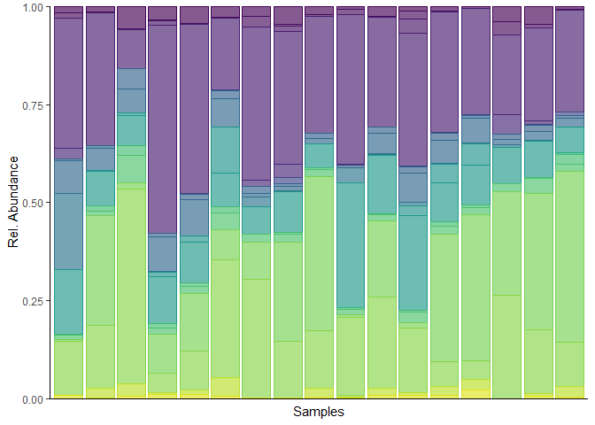<!-- -->

``` r
tse_Silverman_all_V4 <- 
  SilvermanAGutData[ , SilvermanAGutData$Vessel == 4]

plotAbundance(tse_Silverman_all_V4, rank = "Family", add_legend = FALSE,
           order_sample_by = "DAY_ORDER")
```

    ## Warning: useNames = NA is deprecated. Instead, specify either useNames = TRUE
    ## or useNames = TRUE.

    ## Warning: Removed 41 rows containing missing values (`position_stack()`).

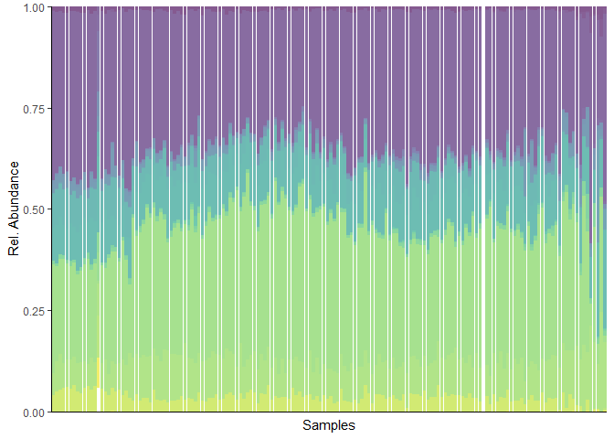<!-- -->

## Make Phyloseq

``` r
ps_Silverman <- makePhyloseqFromTreeSE(SilvermanAGutData)
```

``` r
ntaxa(ps_Silverman)
```

    ## [1] 413

``` r
nsamples(ps_Silverman)
```

    ## [1] 639

``` r
sample_names(ps_Silverman)[1:5]
```

    ## [1] "T..0.V.2.Rep.1..set.3.91..Well.C12"   
    ## [2] "T..0.V.3.Rep.1."                      
    ## [3] "T..0.V.4.Rep.1..Set.4.77..WellE10"    
    ## [4] "T..1.Days.V.1.Rep.1..Set.1.54.Well.F7"
    ## [5] "T..1.Days.V.2.Rep.1."

``` r
rank_names(ps_Silverman)
```

    ## [1] "Kingdom" "Phylum"  "Class"   "Order"   "Family"  "Genus"   "Species"

``` r
sample_variables(ps_Silverman)
```

    ##  [1] "SampleID"             "BarcodeSequence"      "LinkerPrimerSequence"
    ##  [4] "PrimerID"             "Project"              "DAY_ORDER"           
    ##  [7] "Vessel"               "SampleType"           "Pre_Post_Challenge"  
    ## [10] "Normal_Noise_Sample"  "Description"

``` r
otu_table(ps_Silverman)[1:5, 1:5]
```

    ## OTU Table:          [5 taxa and 5 samples]
    ##                      taxa are rows
    ##         T..0.V.2.Rep.1..set.3.91..Well.C12 T..0.V.3.Rep.1.
    ## seq_230                                  0               0
    ## seq_138                                  0               0
    ## seq_69                                   0               0
    ## seq_239                                  0               0
    ## seq_122                                  0               0
    ##         T..0.V.4.Rep.1..Set.4.77..WellE10 T..1.Days.V.1.Rep.1..Set.1.54.Well.F7
    ## seq_230                                 0                                     0
    ## seq_138                                 0                                     0
    ## seq_69                                  0                                     0
    ## seq_239                                 0                                     0
    ## seq_122                                 0                                     0
    ##         T..1.Days.V.2.Rep.1.
    ## seq_230                    0
    ## seq_138                    0
    ## seq_69                     0
    ## seq_239                    0
    ## seq_122                    0

``` r
sample_data(ps_Silverman) %>% head()
```

    ##                                                                    SampleID
    ## T..0.V.2.Rep.1..set.3.91..Well.C12       T..0.V.2.Rep.1..set.3.91..Well.C12
    ## T..0.V.3.Rep.1.                                             T..0.V.3.Rep.1.
    ## T..0.V.4.Rep.1..Set.4.77..WellE10         T..0.V.4.Rep.1..Set.4.77..WellE10
    ## T..1.Days.V.1.Rep.1..Set.1.54.Well.F7 T..1.Days.V.1.Rep.1..Set.1.54.Well.F7
    ## T..1.Days.V.2.Rep.1.                                   T..1.Days.V.2.Rep.1.
    ## T..1.Days.V.3.Rep.1..Set.4.68..WellD9 T..1.Days.V.3.Rep.1..Set.4.68..WellD9
    ##                                       BarcodeSequence     LinkerPrimerSequence
    ## T..0.V.2.Rep.1..set.3.91..Well.C12       TACGAGCCCTAA CAAGCAGAAGACGGCATACGAGAT
    ## T..0.V.3.Rep.1.                          CGATTAGGAATC CAAGCAGAAGACGGCATACGAGAT
    ## T..0.V.4.Rep.1..Set.4.77..WellE10        AACGTAGGCTCT CAAGCAGAAGACGGCATACGAGAT
    ## T..1.Days.V.1.Rep.1..Set.1.54.Well.F7    GCACTTCATTTC CAAGCAGAAGACGGCATACGAGAT
    ## T..1.Days.V.2.Rep.1.                     TCTCGCACTGGA CAAGCAGAAGACGGCATACGAGAT
    ## T..1.Days.V.3.Rep.1..Set.4.68..WellD9    TTAACCTTCCTG CAAGCAGAAGACGGCATACGAGAT
    ##                                          PrimerID Project DAY_ORDER Vessel
    ## T..0.V.2.Rep.1..set.3.91..Well.C12      806rcbc35   30BR2         0      2
    ## T..0.V.3.Rep.1.                        806rcbc983   30BR2         0      3
    ## T..0.V.4.Rep.1..Set.4.77..WellE10      806rcbc173   30BR2         0      4
    ## T..1.Days.V.1.Rep.1..Set.1.54.Well.F7  806rcbc930   30BR2         1      1
    ## T..1.Days.V.2.Rep.1.                  806rcbc1011   30BR2         1      2
    ## T..1.Days.V.3.Rep.1..Set.4.68..WellD9  806rcbc164   30BR2         1      3
    ##                                       SampleType Pre_Post_Challenge
    ## T..0.V.2.Rep.1..set.3.91..Well.C12         Daily      Pre_Challenge
    ## T..0.V.3.Rep.1.                            Daily      Pre_Challenge
    ## T..0.V.4.Rep.1..Set.4.77..WellE10          Daily      Pre_Challenge
    ## T..1.Days.V.1.Rep.1..Set.1.54.Well.F7      Daily      Pre_Challenge
    ## T..1.Days.V.2.Rep.1.                       Daily      Pre_Challenge
    ## T..1.Days.V.3.Rep.1..Set.4.68..WellD9      Daily      Pre_Challenge
    ##                                       Normal_Noise_Sample
    ## T..0.V.2.Rep.1..set.3.91..Well.C12                 Normal
    ## T..0.V.3.Rep.1.                                    Normal
    ## T..0.V.4.Rep.1..Set.4.77..WellE10                  Normal
    ## T..1.Days.V.1.Rep.1..Set.1.54.Well.F7              Normal
    ## T..1.Days.V.2.Rep.1.                               Normal
    ## T..1.Days.V.3.Rep.1..Set.4.68..WellD9              Normal
    ##                                                                            Description
    ## T..0.V.2.Rep.1..set.3.91..Well.C12                   T_0 V.2 Rep 1  set 3 -91 Well C12
    ## T..0.V.3.Rep.1.                                                         T_0 V.3 Rep 1 
    ## T..0.V.4.Rep.1..Set.4.77..WellE10                    T_0 V.4 Rep 1  Set 4 -77 Well-E10
    ## T..1.Days.V.1.Rep.1..Set.1.54.Well.F7 Wrong Tube T_7 Days V.1 Rep 1  Set 1 -54Well -F7
    ## T..1.Days.V.2.Rep.1.                                    Wrong Tube T_7 Days V.2 Rep 1 
    ## T..1.Days.V.3.Rep.1..Set.4.68..WellD9 Wrong Tube T_7 Days V.3 Rep 1  Set 4 -68 Well-D9

### Add date to sample info in phyloseq

``` r
# extract time info from sample names

# create columns for day/hour info
sample_names <- sample_names(ps_Silverman)
sample_cols <- 
  data.table(names = sample_names,
             day = tstrsplit(sample_names, "\\.")[[3]],
             hours = str_extract(sample_names, "[0-9][0-9]h")) %>% 
  # format days and hours as numeric
  .[, day := as.numeric(str_remove(day, "d"))] %>% 
  .[, hours := as.numeric(str_remove(hours, "h"))] %>% 
  # set time to decimal value in days
  .[, time := day + hours/24] %>% 
  .[is.na(hours), time := day]
```

``` r
# Create dataframe including Time (in days) info out of rownames
sam.new <- data.frame(Time = sample_cols$time)
# Mix up the sample names (just for demonstration purposes)
rownames(sam.new) <- sample_cols$names

# Turn into `sample_data` 
sam.new <- sample_data(sam.new)

ps_Silverman <- merge_phyloseq(ps_Silverman, sam.new)
head(sample_data(ps_Silverman))
```

    ##                                                                    SampleID
    ## T..0.V.2.Rep.1..set.3.91..Well.C12       T..0.V.2.Rep.1..set.3.91..Well.C12
    ## T..0.V.3.Rep.1.                                             T..0.V.3.Rep.1.
    ## T..0.V.4.Rep.1..Set.4.77..WellE10         T..0.V.4.Rep.1..Set.4.77..WellE10
    ## T..1.Days.V.1.Rep.1..Set.1.54.Well.F7 T..1.Days.V.1.Rep.1..Set.1.54.Well.F7
    ## T..1.Days.V.2.Rep.1.                                   T..1.Days.V.2.Rep.1.
    ## T..1.Days.V.3.Rep.1..Set.4.68..WellD9 T..1.Days.V.3.Rep.1..Set.4.68..WellD9
    ##                                       BarcodeSequence     LinkerPrimerSequence
    ## T..0.V.2.Rep.1..set.3.91..Well.C12       TACGAGCCCTAA CAAGCAGAAGACGGCATACGAGAT
    ## T..0.V.3.Rep.1.                          CGATTAGGAATC CAAGCAGAAGACGGCATACGAGAT
    ## T..0.V.4.Rep.1..Set.4.77..WellE10        AACGTAGGCTCT CAAGCAGAAGACGGCATACGAGAT
    ## T..1.Days.V.1.Rep.1..Set.1.54.Well.F7    GCACTTCATTTC CAAGCAGAAGACGGCATACGAGAT
    ## T..1.Days.V.2.Rep.1.                     TCTCGCACTGGA CAAGCAGAAGACGGCATACGAGAT
    ## T..1.Days.V.3.Rep.1..Set.4.68..WellD9    TTAACCTTCCTG CAAGCAGAAGACGGCATACGAGAT
    ##                                          PrimerID Project DAY_ORDER Vessel
    ## T..0.V.2.Rep.1..set.3.91..Well.C12      806rcbc35   30BR2         0      2
    ## T..0.V.3.Rep.1.                        806rcbc983   30BR2         0      3
    ## T..0.V.4.Rep.1..Set.4.77..WellE10      806rcbc173   30BR2         0      4
    ## T..1.Days.V.1.Rep.1..Set.1.54.Well.F7  806rcbc930   30BR2         1      1
    ## T..1.Days.V.2.Rep.1.                  806rcbc1011   30BR2         1      2
    ## T..1.Days.V.3.Rep.1..Set.4.68..WellD9  806rcbc164   30BR2         1      3
    ##                                       SampleType Pre_Post_Challenge
    ## T..0.V.2.Rep.1..set.3.91..Well.C12         Daily      Pre_Challenge
    ## T..0.V.3.Rep.1.                            Daily      Pre_Challenge
    ## T..0.V.4.Rep.1..Set.4.77..WellE10          Daily      Pre_Challenge
    ## T..1.Days.V.1.Rep.1..Set.1.54.Well.F7      Daily      Pre_Challenge
    ## T..1.Days.V.2.Rep.1.                       Daily      Pre_Challenge
    ## T..1.Days.V.3.Rep.1..Set.4.68..WellD9      Daily      Pre_Challenge
    ##                                       Normal_Noise_Sample
    ## T..0.V.2.Rep.1..set.3.91..Well.C12                 Normal
    ## T..0.V.3.Rep.1.                                    Normal
    ## T..0.V.4.Rep.1..Set.4.77..WellE10                  Normal
    ## T..1.Days.V.1.Rep.1..Set.1.54.Well.F7              Normal
    ## T..1.Days.V.2.Rep.1.                               Normal
    ## T..1.Days.V.3.Rep.1..Set.4.68..WellD9              Normal
    ##                                                                            Description
    ## T..0.V.2.Rep.1..set.3.91..Well.C12                   T_0 V.2 Rep 1  set 3 -91 Well C12
    ## T..0.V.3.Rep.1.                                                         T_0 V.3 Rep 1 
    ## T..0.V.4.Rep.1..Set.4.77..WellE10                    T_0 V.4 Rep 1  Set 4 -77 Well-E10
    ## T..1.Days.V.1.Rep.1..Set.1.54.Well.F7 Wrong Tube T_7 Days V.1 Rep 1  Set 1 -54Well -F7
    ## T..1.Days.V.2.Rep.1.                                    Wrong Tube T_7 Days V.2 Rep 1 
    ## T..1.Days.V.3.Rep.1..Set.4.68..WellD9 Wrong Tube T_7 Days V.3 Rep 1  Set 4 -68 Well-D9
    ##                                       Time
    ## T..0.V.2.Rep.1..set.3.91..Well.C12       0
    ## T..0.V.3.Rep.1.                          0
    ## T..0.V.4.Rep.1..Set.4.77..WellE10        0
    ## T..1.Days.V.1.Rep.1..Set.1.54.Well.F7    1
    ## T..1.Days.V.2.Rep.1.                     1
    ## T..1.Days.V.3.Rep.1..Set.4.68..WellD9    1

### Subsets

``` r
# transform counts to relative abundance
ps_Silverman_rel <-
  transform_sample_counts(ps_Silverman, function(x) x / sum(x) )

# filter for taxa with abundance mean greater than 1e-3
ps_Silverman_mostAbundant = 
  filter_taxa(ps_Silverman, function(x) mean(x) > 1e-5, TRUE)

# devide into daily and hourly samples

ps_Silverman_daily <- 
  subset_samples(ps_Silverman, SampleType=="Daily")

ps_Silverman_hourly <- 
  subset_samples(ps_Silverman, SampleType=="Hourly")


# devide by Vessels

ps_Silverman_daily_V1 <- 
  subset_samples(ps_Silverman_daily, Vessel==1)
ps_Silverman_hourly_V1 <- 
  subset_samples(ps_Silverman_hourly, Vessel==1 & Time < 28)
  # subset_samples(ps_Silverman_hourly, Vessel==1)

ps_Silverman_daily_V2 <- 
  subset_samples(ps_Silverman_daily, Vessel==2)
ps_Silverman_hourly_V2 <- 
  subset_samples(ps_Silverman_hourly, Vessel==2 & Time < 28)

ps_Silverman_daily_V3 <- 
  subset_samples(ps_Silverman_daily, Vessel==3)
ps_Silverman_hourly_V3 <- 
  subset_samples(ps_Silverman_hourly, Vessel==3 & Time < 28)

ps_Silverman_daily_V4 <- 
  subset_samples(ps_Silverman_daily, Vessel==4)
ps_Silverman_hourly_V4 <- 
  subset_samples(ps_Silverman_hourly, Vessel==4 & Time < 28)
```

There are still some duplicated samples regarding time. These are listed
below:

``` r
# duplicates in Time:

get_duplicates <- function(data_phylo){
  data <- sample_data(data_phylo)
  duplicated_times <-
    data[data$Time %>% duplicated()]$Time
  res <- data[data$Time %in% duplicated_times]
  setorder(res, Time)
  # return(res)
  return(res[, c("DAY_ORDER", "Vessel", "SampleType", "Description", "Time")])
}

#   "SampleID",
#   "BarcodeSequence",
#   "LinkerPrimerSequence",
#   "PrimerID",
#   "Project",
#   "DAY_ORDER",
#   "Vessel",
#   "SampleType",
#   "Pre_Post_Challenge",
#   "Normal_Noise_Sample",
#   "Description",
#   "Time"

get_duplicates(ps_Silverman_hourly_V1)
```

    ##                                                   DAY_ORDER Vessel SampleType
    ## T..20d.23h.00m.V1.Rep1.Set.1.14.Well.F2                  16      1     Hourly
    ## T..20d.23h.00m.V1.Rep1.set.1.74.wellH8                   30      1     Hourly
    ## T..22d.16h.00m.V1.Rep1                                   33      1     Hourly
    ## T..22d.16h.00m.V1.Rep1.PostInnoc.Set.1.15.Well.G2        34      1     Hourly
    ## T..22d.16h.00m.V1.Rep1.PostInnoc.set.1.59.wellC8         55      1     Hourly
    ##                                                                                         Description
    ## T..20d.23h.00m.V1.Rep1.Set.1.14.Well.F2                     T_20d:23h:00m.V1.Rep1 Set 1 -14Well -F2
    ## T..20d.23h.00m.V1.Rep1.set.1.74.wellH8                       T..20d.23h.00m.V1.Rep1.set.1.74.wellH8
    ## T..22d.16h.00m.V1.Rep1                                                        T_22d:16h:00m.V1.Rep1
    ## T..22d.16h.00m.V1.Rep1.PostInnoc.Set.1.15.Well.G2 T_22d:16h:00m.V1.Rep1.PostInnoc Set 1 -15Well -G2
    ## T..22d.16h.00m.V1.Rep1.PostInnoc.set.1.59.wellC8   T..22d.16h.00m.V1.Rep1.PostInnoc.set.1.59.wellC8
    ##                                                       Time
    ## T..20d.23h.00m.V1.Rep1.Set.1.14.Well.F2           20.95833
    ## T..20d.23h.00m.V1.Rep1.set.1.74.wellH8            20.95833
    ## T..22d.16h.00m.V1.Rep1                            22.66667
    ## T..22d.16h.00m.V1.Rep1.PostInnoc.Set.1.15.Well.G2 22.66667
    ## T..22d.16h.00m.V1.Rep1.PostInnoc.set.1.59.wellC8  22.66667

``` r
get_duplicates(ps_Silverman_hourly_V2)
```

    ##                                         DAY_ORDER Vessel SampleType
    ## T..22d.16h.00m.V2.Rep1.PostInnoc               51      2     Hourly
    ## T..22d.16h.00m.V2.Rep1.set.7.42.wellB6         37      2     Hourly
    ## T..22d.18h.00m.V2.Rep1.Set.1.16.Well.H2        53      2     Hourly
    ## T..22d.18h.00m.V2.Rep1.set.1.67.wellF8         38      2     Hourly
    ##                                                                     Description
    ## T..22d.16h.00m.V2.Rep1.PostInnoc                T_22d:16h:00m.V2.Rep1.PostInnoc
    ## T..22d.16h.00m.V2.Rep1.set.7.42.wellB6   T..22d.16h.00m.V2.Rep1.set.7.42.wellB6
    ## T..22d.18h.00m.V2.Rep1.Set.1.16.Well.H2 T_22d:18h:00m.V2.Rep1 Set 1 -16Well -H2
    ## T..22d.18h.00m.V2.Rep1.set.1.67.wellF8   T..22d.18h.00m.V2.Rep1.set.1.67.wellF8
    ##                                             Time
    ## T..22d.16h.00m.V2.Rep1.PostInnoc        22.66667
    ## T..22d.16h.00m.V2.Rep1.set.7.42.wellB6  22.66667
    ## T..22d.18h.00m.V2.Rep1.Set.1.16.Well.H2 22.75000
    ## T..22d.18h.00m.V2.Rep1.set.1.67.wellF8  22.75000

``` r
get_duplicates(ps_Silverman_hourly_V3)
```

    ##                                                   DAY_ORDER Vessel SampleType
    ## T..22d.16h.00m.V3.Rep1.PostInnoc.Set.1.38.Well.F5        47      3     Hourly
    ## T..22d.16h.00m.V3.Rep1.Set.4.1..WellA1                   48      3     Hourly
    ## T..23d.14h.00m.V3.Rep1.Set.1.10.Well.B2                  62      3     Hourly
    ## T..23d.14h.00m.V3.Rep1.set.1.73.wellG8                   47      3     Hourly
    ## T..24d.00h.00m.V3.Rep1.Set.1.12.Well.D2                  67      3     Hourly
    ## T..24d.00h.00m.V3.Rep1.set.1.58.wellB8                   53      3     Hourly
    ##                                                                                         Description
    ## T..22d.16h.00m.V3.Rep1.PostInnoc.Set.1.38.Well.F5 T_22d:16h:00m.V3.Rep1.PostInnoc Set 1 -38Well -F5
    ## T..22d.16h.00m.V3.Rep1.Set.4.1..WellA1                       T_22d:16h:00m.V3.Rep1 Set 4 -1 Well-A1
    ## T..23d.14h.00m.V3.Rep1.Set.1.10.Well.B2                     T_23d:14h:00m.V3.Rep1 Set 1 -10Well -B2
    ## T..23d.14h.00m.V3.Rep1.set.1.73.wellG8                       T..23d.14h.00m.V3.Rep1.set.1.73.wellG8
    ## T..24d.00h.00m.V3.Rep1.Set.1.12.Well.D2                     T_24d:00h:00m.V3.Rep1 Set 1 -12Well -D2
    ## T..24d.00h.00m.V3.Rep1.set.1.58.wellB8                       T..24d.00h.00m.V3.Rep1.set.1.58.wellB8
    ##                                                       Time
    ## T..22d.16h.00m.V3.Rep1.PostInnoc.Set.1.38.Well.F5 22.66667
    ## T..22d.16h.00m.V3.Rep1.Set.4.1..WellA1            22.66667
    ## T..23d.14h.00m.V3.Rep1.Set.1.10.Well.B2           23.58333
    ## T..23d.14h.00m.V3.Rep1.set.1.73.wellG8            23.58333
    ## T..24d.00h.00m.V3.Rep1.Set.1.12.Well.D2           24.00000
    ## T..24d.00h.00m.V3.Rep1.set.1.58.wellB8            24.00000

``` r
get_duplicates(ps_Silverman_hourly_V4)
```

    ##                                                  DAY_ORDER Vessel SampleType
    ## T..20d.21h.00m.V4.Rep1.Set.1.13.Well.E2                 23      4     Hourly
    ## T..20d.21h.00m.V4.Rep1.set.1.66.wellE8                  20      4     Hourly
    ## T..21d.10h.00m.V4.Rep1.Set.1.9.Well.A2                  30      4     Hourly
    ## T..21d.10h.00m.V4.Rep1.set.1.65.wellD8                  27      4     Hourly
    ## T..22d.16h.00m.V4.Rep1.PostInnoc.Set.6.37.wellE5        41      4     Hourly
    ## T..22d.16h.00m.V4.Rep1.set.3.73.Well.A10                40      4     Hourly
    ##                                                                                       Description
    ## T..20d.21h.00m.V4.Rep1.Set.1.13.Well.E2                   T_20d:21h:00m.V4.Rep1 Set 1 -13Well -E2
    ## T..20d.21h.00m.V4.Rep1.set.1.66.wellE8                     T..20d.21h.00m.V4.Rep1.set.1.66.wellE8
    ## T..21d.10h.00m.V4.Rep1.Set.1.9.Well.A2                     T_21d:10h:00m.V4.Rep1 Set 1 -9Well -A2
    ## T..21d.10h.00m.V4.Rep1.set.1.65.wellD8                     T..21d.10h.00m.V4.Rep1.set.1.65.wellD8
    ## T..22d.16h.00m.V4.Rep1.PostInnoc.Set.6.37.wellE5 T..22d.16h.00m.V4.Rep1.PostInnoc.Set.6.37.wellE5
    ## T..22d.16h.00m.V4.Rep1.set.3.73.Well.A10                 T..22d.16h.00m.V4.Rep1.set.3.73.Well.A10
    ##                                                      Time
    ## T..20d.21h.00m.V4.Rep1.Set.1.13.Well.E2          20.87500
    ## T..20d.21h.00m.V4.Rep1.set.1.66.wellE8           20.87500
    ## T..21d.10h.00m.V4.Rep1.Set.1.9.Well.A2           21.41667
    ## T..21d.10h.00m.V4.Rep1.set.1.65.wellD8           21.41667
    ## T..22d.16h.00m.V4.Rep1.PostInnoc.Set.6.37.wellE5 22.66667
    ## T..22d.16h.00m.V4.Rep1.set.3.73.Well.A10         22.66667

``` r
get_duplicates(ps_Silverman_daily_V2)
```

    ##                                      DAY_ORDER Vessel SampleType
    ## T..8.Days.V.2.Rep.1.                         4      2      Daily
    ## T..8.Days.V.2.Rep.1..set.2.57.wellA8         3      2      Daily
    ##                                                               Description Time
    ## T..8.Days.V.2.Rep.1.                                  T_8 Days V.2 Rep 1     8
    ## T..8.Days.V.2.Rep.1..set.2.57.wellA8 T..8.Days.V.2.Rep.1..set.2.57.wellA8    8

### Plots

``` r
# whole dataset
plot_bar(ps_Silverman)
```

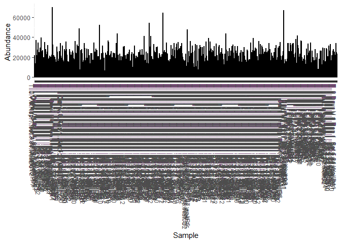<!-- -->

``` r
plot_bar(ps_Silverman_rel, fill = "Phylum") +
  geom_bar(aes(color=Phylum, fill=Phylum), stat="identity", position="stack")
```

    ## Warning: Removed 2065 rows containing missing values (`position_stack()`).
    ## Removed 2065 rows containing missing values (`position_stack()`).

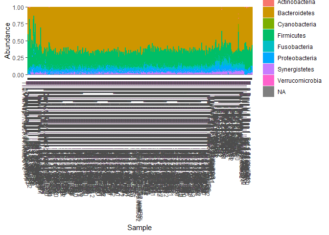<!-- -->

``` r
# plot_bar(ps_Silverman, x = "DAY_ORDER", fill = "Order", facet_grid=~SampleType)
```

``` r
# daily and hourly data
plot_bar(ps_Silverman_daily, x = "DAY_ORDER", fill = "Order", 
         facet_grid =  ~ Vessel, title = "Daily samples grouped by Vessel")
```

<!-- -->

``` r
plot_bar(ps_Silverman_hourly, x = "DAY_ORDER", fill = "Order", 
         facet_grid =  ~ Vessel, title = "Hourly samples grouped by Vessel")
```

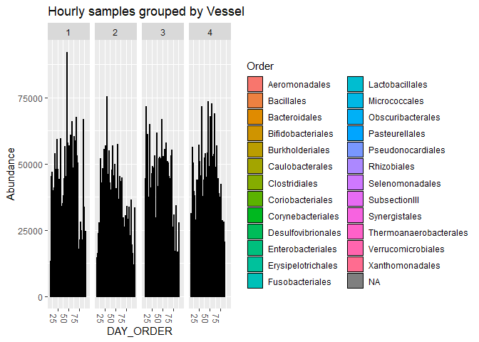<!-- -->

``` r
# daily/hourly data for vessel 1
plot_bar(ps_Silverman_daily_V1, x = "Time", fill = "Family",
         title = "Daily samples of Vessel 1")
```

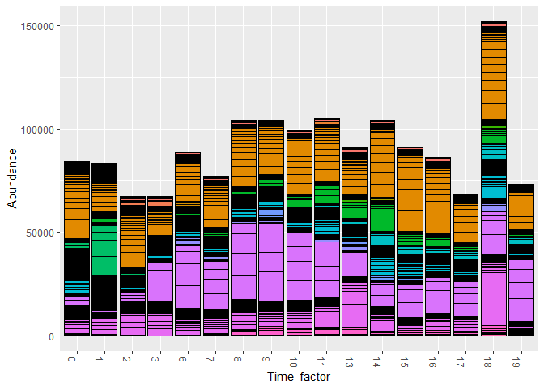<!-- -->

``` r
plot_bar(ps_Silverman_hourly_V1, x = "Time", fill = "Order",
         title = "Hourly samples of Vessel 1")
```

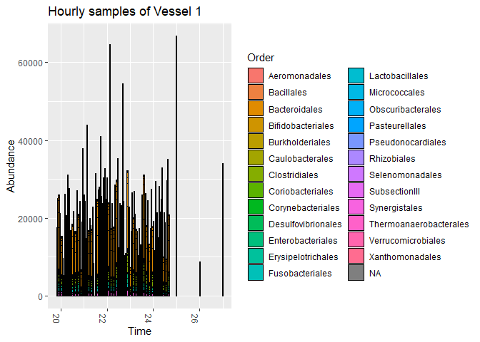<!-- -->

## Manual Analysis

``` r
# extract taxa information
dt_taxonomic_tree <-
  setDT(as.data.frame(rowData(SilvermanAGutData)), keep.rownames = TRUE)

# extract count table
ma_SilvermanAGut_count <-
  assays(SilvermanAGutData)[[1]]

dt_SilvermanAGut_count <- 
  data.table(seq = row.names(ma_SilvermanAGut_count), ma_SilvermanAGut_count) %>% 
  melt(id.vars = "seq", variable.name = "desc", value.name = "count")


# add taxonomic tree to count table
dt_SilvermanAGut_count <-
  merge(dt_SilvermanAGut_count, dt_taxonomic_tree,
        by.x = "seq", by.y = "rn")
```

### Time info

get time info out of count table names

``` r
# extract sample names from count table
sample_names <- 
  ma_SilvermanAGut_count %>% colnames()

# # show all names
# sort(sample_names)

# create columns for day/hour info and vessel number
# extract the infos from sample names
sample_cols <- 
  data.table(names = sample_names,
             day = tstrsplit(sample_names, "\\.")[[3]],
             hours = str_extract(sample_names, "[0-9][0-9]h")) %>% 
  # extract vessel number out of names
  .[, vessel := str_extract(names, "V[0-9]")] %>% 
  .[is.na(vessel), vessel := str_extract(names, "V\\.[0-9]")] %>% 
  .[, vessel := str_remove(vessel, "\\.")] %>% 
  .[day == 28, vessel := str_extract(names, "V[0-9]\\.[0-9][0-9]")] %>% 
  .[day == 28 & is.na(vessel),
    vessel := str_extract(names, "V[0-9]\\.[0-9]")] %>% 
  .[, c("vessel", "number") := tstrsplit(vessel, "\\.")] %>% 
  # format days and hours as numeric
  .[, day := as.numeric(str_remove(day, "d"))] %>% 
  .[, hours := as.numeric(str_remove(hours, "h"))] %>% 
  # set time to decimal value in days
  .[, time := day + hours/24] %>% 
  .[is.na(hours), time := day]

# !! for one time point and one vessel there are still some duplicated rows !!

# detect duplicates
sample_cols[, .(day, hours, vessel)] %>% uniqueN()
```

    ## [1] 551

``` r
sample_cols[duplicated(sample_cols[, .(day, hours, vessel)])]
```

    ##                                                 names day hours vessel number
    ##  1: T..22d.16h.00m.V1.Rep1.PostInnoc.Set.1.15.Well.G2  22    16     V1   <NA>
    ##  2:            T..22d.16h.00m.V3.Rep1.Set.4.1..WellA1  22    16     V3   <NA>
    ##  3:                      T..28.V1.12.Set.4.30..WellF4  28    NA     V1     12
    ##  4:                                       T..28.V1.13  28    NA     V1     13
    ##  5:                       T..28.V1.15.Set.4.5..WellE1  28    NA     V1     15
    ##  6:                     T..28.V1.16.set.3.11..Well.C2  28    NA     V1     16
    ##  7:                      T..28.V1.17.Set.4.21..WellE3  28    NA     V1     17
    ##  8:                      T..28.V1.19.set.3.3..Well.C1  28    NA     V1     19
    ##  9:                      T..28.V1.3.Set.4.88..WellH11  28    NA     V1      3
    ## 10:                                        T..28.V1.4  28    NA     V1      4
    ## 11:                                        T..28.V1.5  28    NA     V1      5
    ## 12:                      T..28.V1.6.Set.4.93..WellE12  28    NA     V1      6
    ## 13:                       T..28.V1.7.Set.4.40..WellH5  28    NA     V1      7
    ## 14:                                        T..28.V1.8  28    NA     V1      8
    ## 15:                       T..28.V1.9.Set.4.36..WellD5  28    NA     V1      9
    ## 16:                                       T..28.V2.11  28    NA     V2     11
    ## 17:                      T..28.V2.12.Set.1.47.Well.G6  28    NA     V2     12
    ## 18:                       T..28.V2.13.Set.4.8..WellH1  28    NA     V2     13
    ## 19:                       T..28.V2.14.Set.4.9..WellA2  28    NA     V2     14
    ## 20:                                       T..28.V2.15  28    NA     V2     15
    ## 21:                      T..28.V2.16.Set.1.30.Well.F4  28    NA     V2     16
    ## 22:                     T..28.V2.17.set.3.23..Well.G3  28    NA     V2     17
    ## 23:                     T..28.V2.19.set.3.12..Well.D2  28    NA     V2     19
    ## 24:                      T..28.V2.3.Set.1.74.Well.B10  28    NA     V2      3
    ## 25:                       T..28.V2.4.Set.1.56.Well.H7  28    NA     V2      4
    ## 26:                      T..28.V2.7.set.3.16..Well.H2  28    NA     V2      7
    ## 27:                       T..28.V2.9.Set.4.16..WellH2  28    NA     V2      9
    ## 28:                       T..28.V3.12.Set.1.2.Well.B1  28    NA     V3     12
    ## 29:                       T..28.V3.13.Set.4.7..WellG1  28    NA     V3     13
    ## 30:                                       T..28.V3.14  28    NA     V3     14
    ## 31:                      T..28.V3.15.Set.1.11.Well.C2  28    NA     V3     15
    ## 32:                      T..28.V3.16.Set.1.37.Well.E5  28    NA     V3     16
    ## 33:                     T..28.V3.18.Set.1.95.Well.G12  28    NA     V3     18
    ## 34:                                        T..28.V3.2  28    NA     V3      2
    ## 35:                      T..28.V3.4.Set.4.78..WellF10  28    NA     V3      4
    ## 36:                                       T..28.V4.14  28    NA     V4     14
    ## 37:                     T..28.V4.17.Set.1.73.Well.A10  28    NA     V4     17
    ## 38:                                       T..28.V4.18  28    NA     V4     18
    ## 39:                      T..28.V4.19.Set.4.41..WellA6  28    NA     V4     19
    ## 40:                      T..28.V4.20.set.3.8..Well.H1  28    NA     V4     20
    ## 41:                     T..28.V4.6.set.3.89..Well.A12  28    NA     V4      6
    ## 42:                      T..28.V4.7.Set.4.81..WellA11  28    NA     V4      7
    ## 43:            T..20d.21h.00m.V4.Rep1.set.1.66.wellE8  20    21     V4   <NA>
    ## 44:            T..20d.23h.00m.V1.Rep1.set.1.74.wellH8  20    23     V1   <NA>
    ## 45:            T..21d.10h.00m.V4.Rep1.set.1.65.wellD8  21    10     V4   <NA>
    ## 46:  T..22d.16h.00m.V1.Rep1.PostInnoc.set.1.59.wellC8  22    16     V1   <NA>
    ## 47:            T..22d.16h.00m.V2.Rep1.set.7.42.wellB6  22    16     V2   <NA>
    ## 48:          T..22d.16h.00m.V4.Rep1.set.3.73.Well.A10  22    16     V4   <NA>
    ## 49:            T..22d.18h.00m.V2.Rep1.set.1.67.wellF8  22    18     V2   <NA>
    ## 50:            T..23d.14h.00m.V3.Rep1.set.1.73.wellG8  23    14     V3   <NA>
    ## 51:            T..24d.00h.00m.V3.Rep1.set.1.58.wellB8  24     0     V3   <NA>
    ## 52:                        T..28.V1.1.set.7.35.wellC5  28    NA     V1      1
    ## 53:                       T..28.V1.10.Set.6.53.wellE7  28    NA     V1     10
    ## 54:                      T..28.V1.14.Set.6.86.wellF11  28    NA     V1     14
    ## 55:                      T..28.V1.18.set.3.45.Well.E6  28    NA     V1     18
    ## 56:                        T..28.V1.2.Set.5.10.WellB2  28    NA     V1      2
    ## 57:                       T..28.V1.20.set.7.27.wellC4  28    NA     V1     20
    ## 58:                       T..28.V2.10.Set.6.50.wellB7  28    NA     V2     10
    ## 59:                     T..28.V2.18.set.3.83.Well.C11  28    NA     V2     18
    ## 60:                        T..28.V2.2.Set.6.13.wellE2  28    NA     V2      2
    ## 61:                        T..28.V2.20.Set.5.3.WellC1  28    NA     V2     20
    ## 62:                       T..28.V2.5.Set.6.93.wellE12  28    NA     V2      5
    ## 63:                        T..28.V2.6.Set.6.48.wellH6  28    NA     V2      6
    ## 64:                        T..28.V2.8.set.7.18.wellB3  28    NA     V2      8
    ## 65:                        T..28.V3.1.set.7.22.wellF3  28    NA     V3      1
    ## 66:                       T..28.V3.11.Set.6.30.wellF4  28    NA     V3     11
    ## 67:                       T..28.V3.17.Set.6.72.wellH9  28    NA     V3     17
    ## 68:                     T..28.V3.19.set.3.87.Well.G11  28    NA     V3     19
    ## 69:                      T..28.V3.20.Set.5.76.WellD10  28    NA     V3     20
    ## 70:                        T..28.V3.3.Set.6.26.wellB4  28    NA     V3      3
    ## 71:                        T..28.V3.5.Set.6.20.wellD3  28    NA     V3      5
    ## 72:                        T..28.V3.6.set.7.24.wellH3  28    NA     V3      6
    ## 73:                      T..28.V3.7.set.3.74.Well.B10  28    NA     V3      7
    ## 74:                       T..28.V3.8.set.3.46.Well.F6  28    NA     V3      8
    ## 75:                       T..28.V3.9.Set.5.90.WellB12  28    NA     V3      9
    ## 76:                        T..28.V4.1.Set.5.72.WellH9  28    NA     V4      1
    ## 77:                       T..28.V4.10.Set.5.35.WellC5  28    NA     V4     10
    ## 78:                       T..28.V4.12.Set.6.55.wellG7  28    NA     V4     12
    ## 79:                       T..28.V4.13.Set.5.60.WellD8  28    NA     V4     13
    ## 80:                       T..28.V4.15.Set.6.23.wellG3  28    NA     V4     15
    ## 81:                       T..28.V4.16.Set.6.46.wellF6  28    NA     V4     16
    ## 82:                        T..28.V4.2.Set.5.49.WellA7  28    NA     V4      2
    ## 83:                        T..28.V4.3.Set.6.33.wellA5  28    NA     V4      3
    ## 84:                        T..28.V4.4.Set.6.44.wellD6  28    NA     V4      4
    ## 85:                       T..28.V4.5.Set.6.89.wellA12  28    NA     V4      5
    ## 86:                       T..28.V4.8.Set.6.83.wellC11  28    NA     V4      8
    ## 87:                       T..28.V4.9.set.3.51.Well.C7  28    NA     V4      9
    ## 88:              T..8.Days.V.2.Rep.1..set.2.57.wellA8   8    NA     V2   <NA>
    ##                                                 names day hours vessel number
    ##         time
    ##  1: 22.66667
    ##  2: 22.66667
    ##  3: 28.00000
    ##  4: 28.00000
    ##  5: 28.00000
    ##  6: 28.00000
    ##  7: 28.00000
    ##  8: 28.00000
    ##  9: 28.00000
    ## 10: 28.00000
    ## 11: 28.00000
    ## 12: 28.00000
    ## 13: 28.00000
    ## 14: 28.00000
    ## 15: 28.00000
    ## 16: 28.00000
    ## 17: 28.00000
    ## 18: 28.00000
    ## 19: 28.00000
    ## 20: 28.00000
    ## 21: 28.00000
    ## 22: 28.00000
    ## 23: 28.00000
    ## 24: 28.00000
    ## 25: 28.00000
    ## 26: 28.00000
    ## 27: 28.00000
    ## 28: 28.00000
    ## 29: 28.00000
    ## 30: 28.00000
    ## 31: 28.00000
    ## 32: 28.00000
    ## 33: 28.00000
    ## 34: 28.00000
    ## 35: 28.00000
    ## 36: 28.00000
    ## 37: 28.00000
    ## 38: 28.00000
    ## 39: 28.00000
    ## 40: 28.00000
    ## 41: 28.00000
    ## 42: 28.00000
    ## 43: 20.87500
    ## 44: 20.95833
    ## 45: 21.41667
    ## 46: 22.66667
    ## 47: 22.66667
    ## 48: 22.66667
    ## 49: 22.75000
    ## 50: 23.58333
    ## 51: 24.00000
    ## 52: 28.00000
    ## 53: 28.00000
    ## 54: 28.00000
    ## 55: 28.00000
    ## 56: 28.00000
    ## 57: 28.00000
    ## 58: 28.00000
    ## 59: 28.00000
    ## 60: 28.00000
    ## 61: 28.00000
    ## 62: 28.00000
    ## 63: 28.00000
    ## 64: 28.00000
    ## 65: 28.00000
    ## 66: 28.00000
    ## 67: 28.00000
    ## 68: 28.00000
    ## 69: 28.00000
    ## 70: 28.00000
    ## 71: 28.00000
    ## 72: 28.00000
    ## 73: 28.00000
    ## 74: 28.00000
    ## 75: 28.00000
    ## 76: 28.00000
    ## 77: 28.00000
    ## 78: 28.00000
    ## 79: 28.00000
    ## 80: 28.00000
    ## 81: 28.00000
    ## 82: 28.00000
    ## 83: 28.00000
    ## 84: 28.00000
    ## 85: 28.00000
    ## 86: 28.00000
    ## 87: 28.00000
    ## 88:  8.00000
    ##         time

``` r
# duplicates examples
sample_cols[day == 8] %>% .[order(vessel)]
```

    ##                                     names day hours vessel number time
    ## 1:                   T..8.Days.V.1.Rep.1.   8    NA     V1   <NA>    8
    ## 2:                   T..8.Days.V.2.Rep.1.   8    NA     V2   <NA>    8
    ## 3:   T..8.Days.V.2.Rep.1..set.2.57.wellA8   8    NA     V2   <NA>    8
    ## 4:   T..8.Days.V.3.Rep.1..Set.6.70.wellF9   8    NA     V3   <NA>    8
    ## 5: T..8.Days.V.4.Rep.1..Set.1.79.Well.G10   8    NA     V4   <NA>    8

``` r
sample_cols[day == 22 & hours == 16] %>% .[order(vessel)]
```

    ##                                                names day hours vessel number
    ## 1:                            T..22d.16h.00m.V1.Rep1  22    16     V1   <NA>
    ## 2: T..22d.16h.00m.V1.Rep1.PostInnoc.Set.1.15.Well.G2  22    16     V1   <NA>
    ## 3:  T..22d.16h.00m.V1.Rep1.PostInnoc.set.1.59.wellC8  22    16     V1   <NA>
    ## 4:                  T..22d.16h.00m.V2.Rep1.PostInnoc  22    16     V2   <NA>
    ## 5:            T..22d.16h.00m.V2.Rep1.set.7.42.wellB6  22    16     V2   <NA>
    ## 6: T..22d.16h.00m.V3.Rep1.PostInnoc.Set.1.38.Well.F5  22    16     V3   <NA>
    ## 7:            T..22d.16h.00m.V3.Rep1.Set.4.1..WellA1  22    16     V3   <NA>
    ## 8:  T..22d.16h.00m.V4.Rep1.PostInnoc.Set.6.37.wellE5  22    16     V4   <NA>
    ## 9:          T..22d.16h.00m.V4.Rep1.set.3.73.Well.A10  22    16     V4   <NA>
    ##        time
    ## 1: 22.66667
    ## 2: 22.66667
    ## 3: 22.66667
    ## 4: 22.66667
    ## 5: 22.66667
    ## 6: 22.66667
    ## 7: 22.66667
    ## 8: 22.66667
    ## 9: 22.66667

``` r
## TODO: remove duplicates 
```

``` r
# add time info to count data.table
dt_SilvermanAGut_count <-
  merge(dt_SilvermanAGut_count, sample_cols,
        by.x = "desc", by.y = "names")
```

### Plots

``` r
# function to create bar plot for data
barplot_Silverman <- 
  function(data, v = "V1", time_type = "day", level = "seq", legend = "none"){
  
    if(v != "all"){
      data <- data[vessel == v]
    }
    
  if(time_type == "day"){
    data <- data[time %% 1 == 0]
  } else if(time_type == "hour"){
    data <- data[time > 19 & time < 25]
  }
  
  pl <-
    ggplot(data, aes(time, count)) +
    geom_bar(aes(fill = get(level)),  stat = "identity", position = "fill") +
    theme(legend.position = legend) +
    labs(title = "SilvermanAGut Data",
         subtitle = paste("Vessel", str_remove(v, "V")),
         x = "time (days)",
         fill = level) +
    scale_fill_viridis(discrete = TRUE, option = "turbo")
  
  print(pl)
}
```

``` r
# plots
barplot_Silverman(dt_SilvermanAGut_count, "V2", "all")
```

    ## Warning: Removed 826 rows containing missing values (`geom_bar()`).

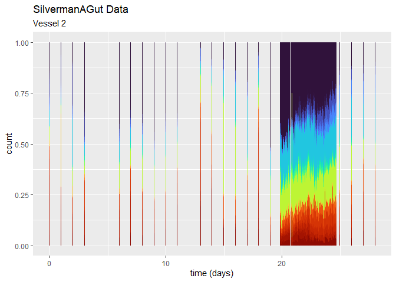<!-- -->

``` r
barplot_Silverman(dt_SilvermanAGut_count, "V1", "day")
```

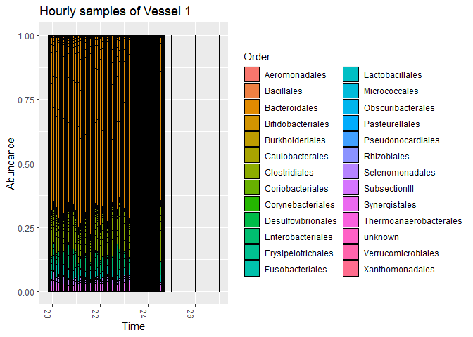<!-- -->

``` r
barplot_Silverman(dt_SilvermanAGut_count, "V2", "day")
```

<!-- -->

``` r
barplot_Silverman(dt_SilvermanAGut_count, "V3", "day")
```

<!-- -->

``` r
barplot_Silverman(dt_SilvermanAGut_count, "V4", "day")
```

<!-- -->

``` r
barplot_Silverman(dt_SilvermanAGut_count, "V1", "hour")
```

    ## Warning: Removed 826 rows containing missing values (`geom_bar()`).

<!-- -->

### Group by Species

``` r
# add category "other" for Species with small count
th_species <- 0.1

dt_species_other <-
  dt_SilvermanAGut_count[, rel_count_species := count/sum(count),
              by = c("time", "vessel")] %>% 
  .[, .(max_count = max(rel_count_species)),
             by = c("Species")] %>% 
      .[max_count < th_species, .(Species)]

dt_SilvermanAGut_count[, Species_grouped := Species] %>% 
  .[Species %in% dt_species_other$Species, Species_grouped := "other"]


# plot for grouped species
barplot_Silverman(dt_SilvermanAGut_count, 
                  "V1", "day", level = "Species_grouped", legend = "right")
```

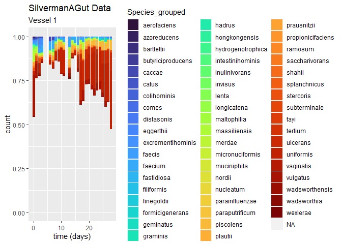<!-- -->

### by Genus

``` r
# rename NAs as unknown
dt_SilvermanAGut_count[is.na(Genus), Genus := "unknown"]

# add threshold for category "other"
th_genus <- 0.1

# find genus with small count/abundances
dt_genus_other <-
  dt_SilvermanAGut_count[, .(rel_count_genus = sum(rel_count_species)),
                         by = c("desc", "Genus", "vessel", "time")] %>%
  .[, .(max_count = max(rel_count_genus, na.rm = T)),
             by = c("Genus")] %>% 
  .[max_count < th_genus, .(Genus)]

# add category other to grouped genus
dt_SilvermanAGut_count[, Genus_grouped := Genus] %>% 
  .[Genus %in% dt_genus_other$Genus, Genus_grouped := "other"]
```

``` r
# plot results
barplot_Silverman(dt_SilvermanAGut_count, 
                  "V1", "day", "Genus_grouped", legend = "right")
```

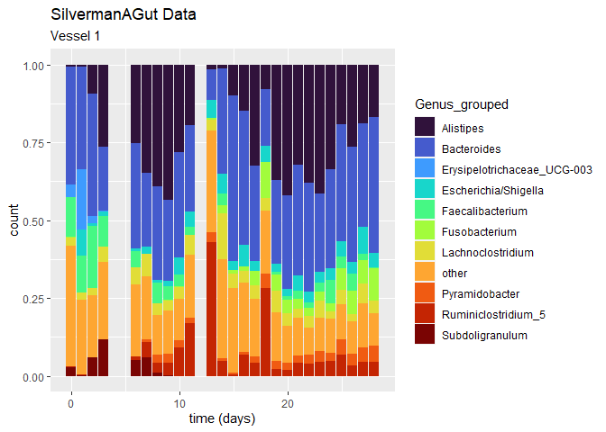<!-- -->

``` r
# plot results
barplot_Silverman(dt_SilvermanAGut_count, 
                  "V2", "hour", "Genus_grouped", legend = "right")
```

    ## Warning: Removed 826 rows containing missing values (`geom_bar()`).

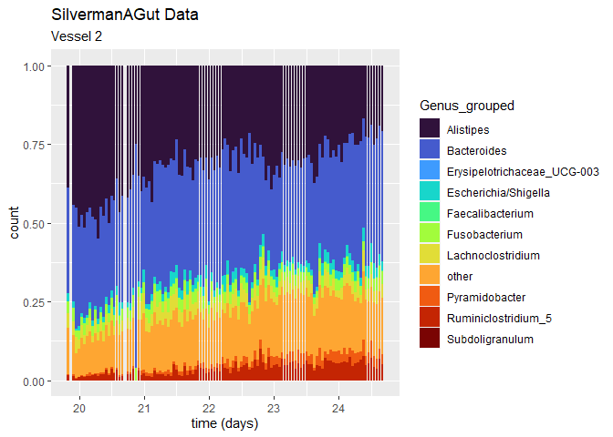<!-- -->

``` r
# list of all genus
dt_SilvermanAGut_count$Genus_grouped %>% unique()
```

    ##  [1] "Alistipes"                   "other"                      
    ##  [3] "Erysipelotrichaceae_UCG-003" "Subdoligranulum"            
    ##  [5] "Lachnoclostridium"           "Faecalibacterium"           
    ##  [7] "Bacteroides"                 "Ruminiclostridium_5"        
    ##  [9] "Fusobacterium"               "Escherichia/Shigella"       
    ## [11] "Pyramidobacter"

### by Family

``` r
# # sum counts over Family
# dt_SilvermanAGut_count_Family <-
#   dt_SilvermanAGut_count[is.na(Family), Family := "unknown"] %>% 
#     .[, .(count = sum(count)),
#       by = c("desc", "Family", "vessel", "time")]

# rename NAs as unknown
dt_SilvermanAGut_count[is.na(Family), Family := "unknown"]

# add threshold for category "other"
th_family <- 0.05

# find family with small count/abundances
dt_family_other <-
  dt_SilvermanAGut_count[, .(rel_count_family = sum(rel_count_species)),
                         by = c("desc", "Family", "vessel", "time")] %>%
  .[, .(max_count = max(rel_count_family, na.rm = T)),
             by = c("Family")] %>% 
  .[max_count < th_family, .(Family)]

# add category other to grouped family
dt_SilvermanAGut_count[, Family_grouped := Family] %>% 
  .[Family %in% dt_family_other$Family, Family_grouped := "other"]
```

``` r
# plot results
barplot_Silverman(dt_SilvermanAGut_count, "V1", "day", "Family")
```

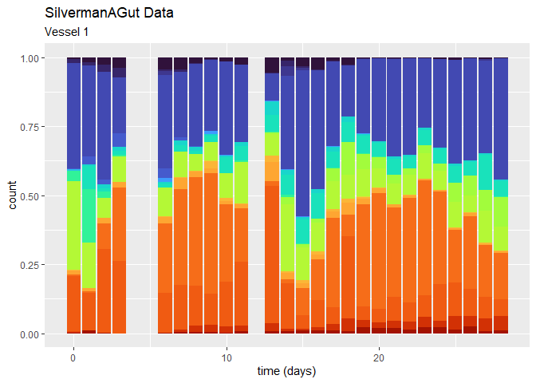<!-- -->

``` r
barplot_Silverman(dt_SilvermanAGut_count, 
                  "V1", "day", "Family_grouped", legend = "right")
```

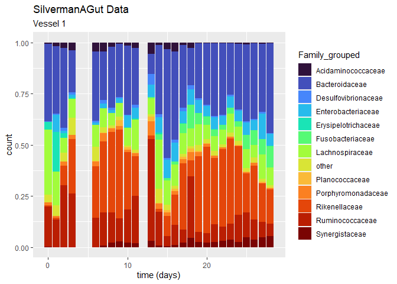<!-- -->

## Analyse over all vessels

group vessels (take mean)

``` r
### test
dt_SilvermanAGut_count[duplicated(dt_SilvermanAGut_count[, .(vessel, time, seq)]) |
                         duplicated(dt_SilvermanAGut_count[, .(vessel, time, seq)], fromLast = TRUE), .N]
```

    ## [1] 42539

``` r
### test

dt_SilvermanAGut_count_mean <-
  dt_SilvermanAGut_count[, .(count = mean(count)),
                         by = c("vessel", "seq", "time")] %>% 
  .[, .(count = mean(count)),  by = c("seq", "time")] %>% 
  merge(., dt_taxonomic_tree,
        by.x = "seq", by.y = "rn")

# remove NAs for species/genus/family
dt_SilvermanAGut_count_mean[is.na(Species), Species := "unknown"] %>% 
  .[is.na(Genus), Genus := "unknown"] %>% 
  .[is.na(Family), Family := "unknown"]

# add category other to grouped genus
dt_SilvermanAGut_count_mean[, Genus_grouped := Genus] %>% 
  .[Genus %in% dt_genus_other$Genus, Genus_grouped := "other"]

# plot
barplot_Silverman(dt_SilvermanAGut_count_mean, v = "all", level = "Genus_grouped")
```

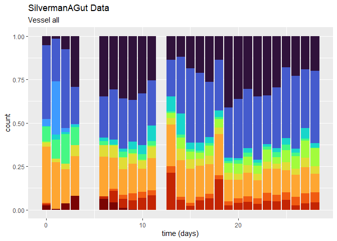<!-- -->

``` r
# ggsave("01c-timeseries-miaTIME_files/figure-gfm/plot_genus_days.jpg",
#        width = 6,
#        height = 5)

barplot_Silverman(dt_SilvermanAGut_count_mean, 
                  v = "all", time_type = "hour", level = "Genus_grouped")
```

<!-- -->

``` r
# ggsave("01c-timeseries-miaTIME_files/figure-gfm/plot_genus_hours.jpg",
#        width = 6,
#        height = 5)
```

## Files written

These files have been written to the target directory,
`data/01c-timeseries-miaTIME`:

``` r
projthis::proj_dir_info(path_target())
```

    ## # A tibble: 0 × 4
    ## # ℹ 4 variables: path <fs::path>, type <fct>, size <fs::bytes>,
    ## #   modification_time <dttm>
