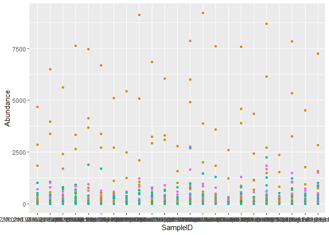
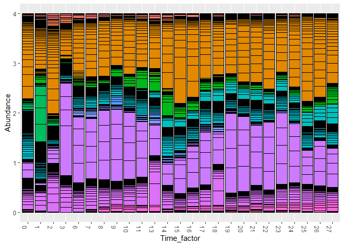
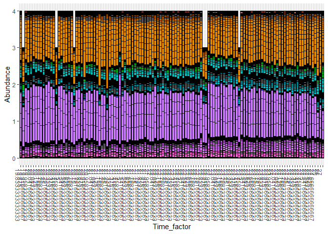
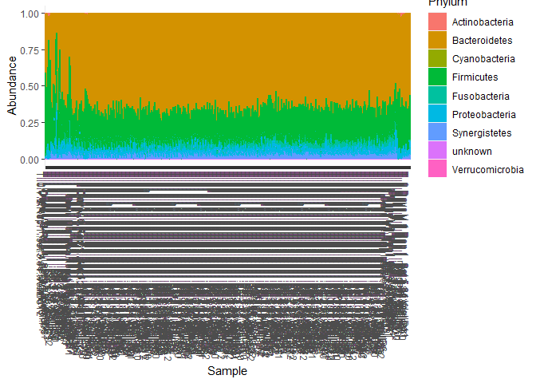
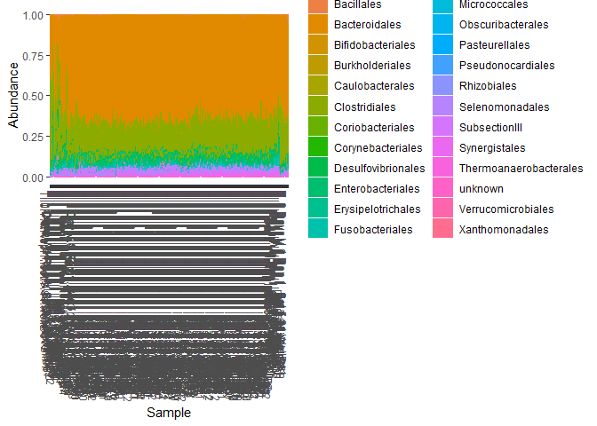
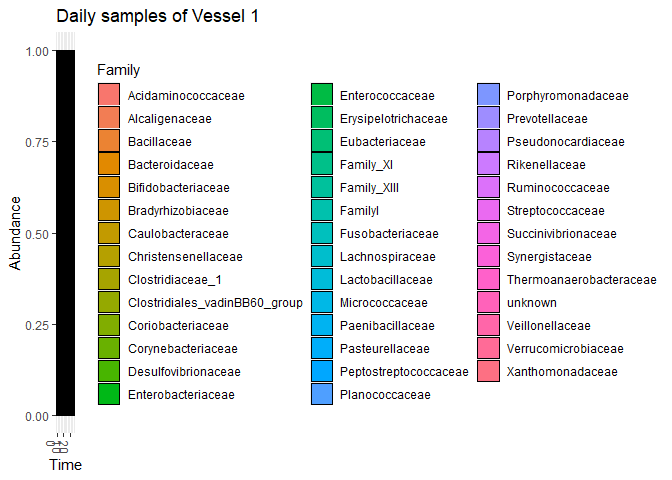
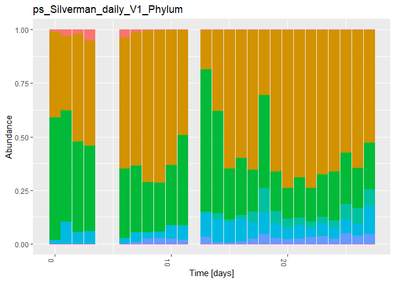
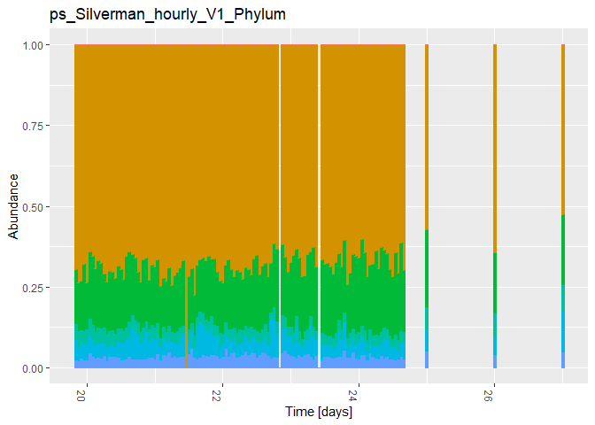

Time series (miaTime)
================
Compiled at 2023-09-06 12:44:18 UTC

``` r
here::i_am(paste0(params$name, ".Rmd"), uuid = "87d828ae-2f1b-40a8-b559-3784df62c78d")
```

# Packages

``` r
library("conflicted")
library(data.table)
library(tidyverse)
library(viridis) # for color palettes 

library(miaTime)
library(mia)

# library(tidySingleCellExperiment)
# library(lubridate)
# library(TreeSummarizedExperiment)
# library(tidySummarizedExperiment)

# library(miaViz)
library(phyloseq)
library(microViz) # for ps_reorder()
library(biomeUtils) # for removeZeros()
library("xlsx")

knitr::opts_chunk$set(message=FALSE)
# options(getClass.msg=FALSE) # to not show the message:
# >> Found more than one class "phylo" in cache; using the first, from namespace 'phyloseq'
# Also defined by ‘tidytree’ <<
```

``` r
# create or *empty* the target directory, used to write this file's data: 
projthis::proj_create_dir_target(params$name, clean = TRUE)

# function to get path to target directory: path_target("sample.csv")
path_target <- projthis::proj_path_target(params$name)

# function to get path to previous data: path_source("00-import", "sample.csv")
path_source <- projthis::proj_path_source(params$name)
```

# SilvermanAGutData

``` r
# load the Silverman artificial gut data set from miaTIME

data(SilvermanAGutData)

# SilvermanAGutData@rowLinks
# SilvermanAGutData@colLinks #empty
# 
# cols <- 
#   colData(SilvermanAGutData)
# 
# metadata(SilvermanAGutData) #empty
# 
# referenceSeq(SilvermanAGutData)
```

## Make Phyloseq

``` r
# make phyloseq object out of TSE object
ps_Silverman <- makePhyloseqFromTreeSE(SilvermanAGutData)
```

``` r
ntaxa(ps_Silverman)
```

    ## [1] 413

``` r
nsamples(ps_Silverman)
```

    ## [1] 639

``` r
sample_names(ps_Silverman)[1:5]
```

    ## [1] "T..0.V.2.Rep.1..set.3.91..Well.C12"   
    ## [2] "T..0.V.3.Rep.1."                      
    ## [3] "T..0.V.4.Rep.1..Set.4.77..WellE10"    
    ## [4] "T..1.Days.V.1.Rep.1..Set.1.54.Well.F7"
    ## [5] "T..1.Days.V.2.Rep.1."

``` r
rank_names(ps_Silverman)
```

    ## [1] "Kingdom" "Phylum"  "Class"   "Order"   "Family"  "Genus"   "Species"

``` r
sample_variables(ps_Silverman)
```

    ##  [1] "SampleID"             "BarcodeSequence"      "LinkerPrimerSequence"
    ##  [4] "PrimerID"             "Project"              "DAY_ORDER"           
    ##  [7] "Vessel"               "SampleType"           "Pre_Post_Challenge"  
    ## [10] "Normal_Noise_Sample"  "Description"

``` r
otu_table(ps_Silverman)[1:5, 1:5]
```

    ## OTU Table:          [5 taxa and 5 samples]
    ##                      taxa are rows
    ##         T..0.V.2.Rep.1..set.3.91..Well.C12 T..0.V.3.Rep.1.
    ## seq_230                                  0               0
    ## seq_138                                  0               0
    ## seq_69                                   0               0
    ## seq_239                                  0               0
    ## seq_122                                  0               0
    ##         T..0.V.4.Rep.1..Set.4.77..WellE10 T..1.Days.V.1.Rep.1..Set.1.54.Well.F7
    ## seq_230                                 0                                     0
    ## seq_138                                 0                                     0
    ## seq_69                                  0                                     0
    ## seq_239                                 0                                     0
    ## seq_122                                 0                                     0
    ##         T..1.Days.V.2.Rep.1.
    ## seq_230                    0
    ## seq_138                    0
    ## seq_69                     0
    ## seq_239                    0
    ## seq_122                    0

``` r
sample_data(ps_Silverman) %>% head()
```

    ##                                                                    SampleID
    ## T..0.V.2.Rep.1..set.3.91..Well.C12       T..0.V.2.Rep.1..set.3.91..Well.C12
    ## T..0.V.3.Rep.1.                                             T..0.V.3.Rep.1.
    ## T..0.V.4.Rep.1..Set.4.77..WellE10         T..0.V.4.Rep.1..Set.4.77..WellE10
    ## T..1.Days.V.1.Rep.1..Set.1.54.Well.F7 T..1.Days.V.1.Rep.1..Set.1.54.Well.F7
    ## T..1.Days.V.2.Rep.1.                                   T..1.Days.V.2.Rep.1.
    ## T..1.Days.V.3.Rep.1..Set.4.68..WellD9 T..1.Days.V.3.Rep.1..Set.4.68..WellD9
    ##                                       BarcodeSequence     LinkerPrimerSequence
    ## T..0.V.2.Rep.1..set.3.91..Well.C12       TACGAGCCCTAA CAAGCAGAAGACGGCATACGAGAT
    ## T..0.V.3.Rep.1.                          CGATTAGGAATC CAAGCAGAAGACGGCATACGAGAT
    ## T..0.V.4.Rep.1..Set.4.77..WellE10        AACGTAGGCTCT CAAGCAGAAGACGGCATACGAGAT
    ## T..1.Days.V.1.Rep.1..Set.1.54.Well.F7    GCACTTCATTTC CAAGCAGAAGACGGCATACGAGAT
    ## T..1.Days.V.2.Rep.1.                     TCTCGCACTGGA CAAGCAGAAGACGGCATACGAGAT
    ## T..1.Days.V.3.Rep.1..Set.4.68..WellD9    TTAACCTTCCTG CAAGCAGAAGACGGCATACGAGAT
    ##                                          PrimerID Project DAY_ORDER Vessel
    ## T..0.V.2.Rep.1..set.3.91..Well.C12      806rcbc35   30BR2         0      2
    ## T..0.V.3.Rep.1.                        806rcbc983   30BR2         0      3
    ## T..0.V.4.Rep.1..Set.4.77..WellE10      806rcbc173   30BR2         0      4
    ## T..1.Days.V.1.Rep.1..Set.1.54.Well.F7  806rcbc930   30BR2         1      1
    ## T..1.Days.V.2.Rep.1.                  806rcbc1011   30BR2         1      2
    ## T..1.Days.V.3.Rep.1..Set.4.68..WellD9  806rcbc164   30BR2         1      3
    ##                                       SampleType Pre_Post_Challenge
    ## T..0.V.2.Rep.1..set.3.91..Well.C12         Daily      Pre_Challenge
    ## T..0.V.3.Rep.1.                            Daily      Pre_Challenge
    ## T..0.V.4.Rep.1..Set.4.77..WellE10          Daily      Pre_Challenge
    ## T..1.Days.V.1.Rep.1..Set.1.54.Well.F7      Daily      Pre_Challenge
    ## T..1.Days.V.2.Rep.1.                       Daily      Pre_Challenge
    ## T..1.Days.V.3.Rep.1..Set.4.68..WellD9      Daily      Pre_Challenge
    ##                                       Normal_Noise_Sample
    ## T..0.V.2.Rep.1..set.3.91..Well.C12                 Normal
    ## T..0.V.3.Rep.1.                                    Normal
    ## T..0.V.4.Rep.1..Set.4.77..WellE10                  Normal
    ## T..1.Days.V.1.Rep.1..Set.1.54.Well.F7              Normal
    ## T..1.Days.V.2.Rep.1.                               Normal
    ## T..1.Days.V.3.Rep.1..Set.4.68..WellD9              Normal
    ##                                                                            Description
    ## T..0.V.2.Rep.1..set.3.91..Well.C12                   T_0 V.2 Rep 1  set 3 -91 Well C12
    ## T..0.V.3.Rep.1.                                                         T_0 V.3 Rep 1 
    ## T..0.V.4.Rep.1..Set.4.77..WellE10                    T_0 V.4 Rep 1  Set 4 -77 Well-E10
    ## T..1.Days.V.1.Rep.1..Set.1.54.Well.F7 Wrong Tube T_7 Days V.1 Rep 1  Set 1 -54Well -F7
    ## T..1.Days.V.2.Rep.1.                                    Wrong Tube T_7 Days V.2 Rep 1 
    ## T..1.Days.V.3.Rep.1..Set.4.68..WellD9 Wrong Tube T_7 Days V.3 Rep 1  Set 4 -68 Well-D9

### Remove NAs in tax_table

``` r
tax_table(ps_Silverman)[is.na(tax_table(ps_Silverman))] <- 
  "unknown"
```

### Add date to sample info in phyloseq

``` r
# extract time info from sample names

# create columns for day/hour info
sample_names <- sample_names(ps_Silverman)
sample_cols <- 
  data.table(names = sample_names,
             day = tstrsplit(sample_names, "\\.")[[3]],
             hours = str_extract(sample_names, "[0-9][0-9]h")) %>% 
  # format days and hours as numeric
  .[, day := as.numeric(str_remove(day, "d"))] %>% 
  .[, hours := as.numeric(str_remove(hours, "h"))] %>% 
  # set time to decimal value in days
  .[, time := day + hours/24] %>% 
  .[is.na(hours), time := day]
```

``` r
# Create dataframe including Time (in days) info out of rownames
sam.new <- data.frame(Time = sample_cols$time)
# Mix up the sample names (just for demonstration purposes)
rownames(sam.new) <- sample_cols$names

# Turn into `sample_data` 
sam.new <- sample_data(sam.new)

ps_Silverman <- merge_phyloseq(ps_Silverman, sam.new)
head(sample_data(ps_Silverman))
```

    ##                                                                    SampleID
    ## T..0.V.2.Rep.1..set.3.91..Well.C12       T..0.V.2.Rep.1..set.3.91..Well.C12
    ## T..0.V.3.Rep.1.                                             T..0.V.3.Rep.1.
    ## T..0.V.4.Rep.1..Set.4.77..WellE10         T..0.V.4.Rep.1..Set.4.77..WellE10
    ## T..1.Days.V.1.Rep.1..Set.1.54.Well.F7 T..1.Days.V.1.Rep.1..Set.1.54.Well.F7
    ## T..1.Days.V.2.Rep.1.                                   T..1.Days.V.2.Rep.1.
    ## T..1.Days.V.3.Rep.1..Set.4.68..WellD9 T..1.Days.V.3.Rep.1..Set.4.68..WellD9
    ##                                       BarcodeSequence     LinkerPrimerSequence
    ## T..0.V.2.Rep.1..set.3.91..Well.C12       TACGAGCCCTAA CAAGCAGAAGACGGCATACGAGAT
    ## T..0.V.3.Rep.1.                          CGATTAGGAATC CAAGCAGAAGACGGCATACGAGAT
    ## T..0.V.4.Rep.1..Set.4.77..WellE10        AACGTAGGCTCT CAAGCAGAAGACGGCATACGAGAT
    ## T..1.Days.V.1.Rep.1..Set.1.54.Well.F7    GCACTTCATTTC CAAGCAGAAGACGGCATACGAGAT
    ## T..1.Days.V.2.Rep.1.                     TCTCGCACTGGA CAAGCAGAAGACGGCATACGAGAT
    ## T..1.Days.V.3.Rep.1..Set.4.68..WellD9    TTAACCTTCCTG CAAGCAGAAGACGGCATACGAGAT
    ##                                          PrimerID Project DAY_ORDER Vessel
    ## T..0.V.2.Rep.1..set.3.91..Well.C12      806rcbc35   30BR2         0      2
    ## T..0.V.3.Rep.1.                        806rcbc983   30BR2         0      3
    ## T..0.V.4.Rep.1..Set.4.77..WellE10      806rcbc173   30BR2         0      4
    ## T..1.Days.V.1.Rep.1..Set.1.54.Well.F7  806rcbc930   30BR2         1      1
    ## T..1.Days.V.2.Rep.1.                  806rcbc1011   30BR2         1      2
    ## T..1.Days.V.3.Rep.1..Set.4.68..WellD9  806rcbc164   30BR2         1      3
    ##                                       SampleType Pre_Post_Challenge
    ## T..0.V.2.Rep.1..set.3.91..Well.C12         Daily      Pre_Challenge
    ## T..0.V.3.Rep.1.                            Daily      Pre_Challenge
    ## T..0.V.4.Rep.1..Set.4.77..WellE10          Daily      Pre_Challenge
    ## T..1.Days.V.1.Rep.1..Set.1.54.Well.F7      Daily      Pre_Challenge
    ## T..1.Days.V.2.Rep.1.                       Daily      Pre_Challenge
    ## T..1.Days.V.3.Rep.1..Set.4.68..WellD9      Daily      Pre_Challenge
    ##                                       Normal_Noise_Sample
    ## T..0.V.2.Rep.1..set.3.91..Well.C12                 Normal
    ## T..0.V.3.Rep.1.                                    Normal
    ## T..0.V.4.Rep.1..Set.4.77..WellE10                  Normal
    ## T..1.Days.V.1.Rep.1..Set.1.54.Well.F7              Normal
    ## T..1.Days.V.2.Rep.1.                               Normal
    ## T..1.Days.V.3.Rep.1..Set.4.68..WellD9              Normal
    ##                                                                            Description
    ## T..0.V.2.Rep.1..set.3.91..Well.C12                   T_0 V.2 Rep 1  set 3 -91 Well C12
    ## T..0.V.3.Rep.1.                                                         T_0 V.3 Rep 1 
    ## T..0.V.4.Rep.1..Set.4.77..WellE10                    T_0 V.4 Rep 1  Set 4 -77 Well-E10
    ## T..1.Days.V.1.Rep.1..Set.1.54.Well.F7 Wrong Tube T_7 Days V.1 Rep 1  Set 1 -54Well -F7
    ## T..1.Days.V.2.Rep.1.                                    Wrong Tube T_7 Days V.2 Rep 1 
    ## T..1.Days.V.3.Rep.1..Set.4.68..WellD9 Wrong Tube T_7 Days V.3 Rep 1  Set 4 -68 Well-D9
    ##                                       Time
    ## T..0.V.2.Rep.1..set.3.91..Well.C12       0
    ## T..0.V.3.Rep.1.                          0
    ## T..0.V.4.Rep.1..Set.4.77..WellE10        0
    ## T..1.Days.V.1.Rep.1..Set.1.54.Well.F7    1
    ## T..1.Days.V.2.Rep.1.                     1
    ## T..1.Days.V.3.Rep.1..Set.4.68..WellD9    1

``` r
# remove samples of day 28 from analysis
ps_Silverman <-
  subset_samples(ps_Silverman, Time < 28)
```

### Duplicates

There are still some duplicated samples regarding time. These are listed
below:

``` r
# duplicates in Time/Vessel/SampleType:
get_all_duplicates <- function(data_phylo){
  data <- sample_data(data_phylo) # %>% subset(data, Time < 28)
  data_TVS <-
    data[, c("Time", "Vessel", "SampleType")]
  res <-
    data[duplicated(data_TVS) |
           duplicated(data_TVS, fromLast = T)]
  setorder(res, Vessel, Time)
  return(res)
}

# vector with all duplicated SampleIDs
duplicated_samples_ID <-
  get_all_duplicates(ps_Silverman)$SampleID

# subset of data set only including duplicates
ps_Silverman_duplicates <-
  subset_samples(ps_Silverman, SampleID %in% duplicated_samples_ID) %>% 
  ps_reorder(duplicated_samples_ID)

# plot abundances of duplicates
# plot_bar(ps_Silverman_duplicates, fill = "Species") + 
#   theme(legend.position = "none",
#         axis.text.x = element_blank())
ggplot(psmelt(ps_Silverman_duplicates),
       aes(x = SampleID, y = Abundance, col = Genus)) +
  geom_point() + 
  theme(legend.position = "none")
```

<!-- -->

``` r
# # show otu table of all duplicates (zero entries excluded)
# removeZeros(ps_Silverman_duplicates) %>% otu_table() %>% view()

write.xlsx(
  otu_table(removeZeros(ps_Silverman_duplicates)),
  paste0(path_target(), "/duplicated_samples.xlsx"),
  sheetName = "Sheet1",
  col.names = TRUE,
  row.names = TRUE,
  append = FALSE
)

# subset of data set not including duplicated samples
ps_Silverman_unique <-
  subset_samples(ps_Silverman, !(SampleID %in% duplicated_samples_ID))
```

#### Get mean for duplicates

``` r
# load this R script which slightly modifies the merge_sample function of phyloseq package
source("../R/merge-methods-modified.R")
```

Generate another phyloseq object (“ps_Silverman_noDuplicates”)
containing all samples of SilvermanAGutData (all counts for unique
samples and for the duplicates the mean counts).

``` r
# add group for merging
# therefor only use first part of sampleID name which is the same for each duplicates
sample_data(ps_Silverman_duplicates)$SampleID_new <-
  sample_data(ps_Silverman_duplicates)$SampleID %>%
  gsub("Rep1.*", "Rep1", .) %>%
  gsub("Rep.1.*", "Rep.1", .) %>%
  paste0(".merged")

# define the function how to merge the sample data
# for numeric values: take mean
# for other values: unique and paste values (separated by ;)
merge_fun <- function(x, fun = mean){
  if(is.numeric(x)){
    fun(x)
  } else {
    paste(unique(x), collapse = ";")
    # if(uniqueN(x) > 1){
    #   return(NA)
    # } else{
    #   return(unique(x))
    # }
  }
}

# use modified version of merge_samples to merge all duplicates and set mean count in otu table
ps_Silverman_merged <-
  modmerge_samples(ps_Silverman_duplicates,
                group = "SampleID_new",
                fun = merge_fun)

# redefine SampleID and remove SampleID_new
sample_data(ps_Silverman_merged)$SampleID <- 
  sample_data(ps_Silverman_merged)$SampleID_new
sample_data(ps_Silverman_merged)$SampleID_new <- NULL

# merge mean values of duplicates to unique values of Silverman data set
ps_Silverman_noDuplicates <-
  merge_phyloseq(ps_Silverman_unique, ps_Silverman_merged)
```

``` r
# replace duplicates with mean entries in original data set
ps_Silverman <- 
  ps_Silverman_noDuplicates

# add time as.factor for plots
sample_data(ps_Silverman)$Time_factor <-
  ordered(sample_data(ps_Silverman)$Time)
```

### Subsets

Create subsets for each vessel and for daily/hourly samples separately.

``` r
# transform counts to relative abundance
ps_Silverman <-
  transform_sample_counts(ps_Silverman,
                          function(x) x / sum(x))
# set resulting NAs to zero
otu_table(ps_Silverman)[is.na(otu_table(ps_Silverman))] <- 0

# # filter for taxa with abundance mean greater than 1e-3
# ps_Silverman_mostAbundant = 
#   filter_taxa(ps_Silverman, function(x) mean(x) > 1e-5, TRUE)

# devide into daily and hourly samples

ps_Silverman_daily <- 
  # subset_samples(ps_Silverman, SampleType=="Daily")
  subset_samples(ps_Silverman, Time == as.integer(Time))

ps_Silverman_hourly <- 
  subset_samples(ps_Silverman, SampleType=="Hourly")


# devide by Vessels

for(vessel in 1:4){
  assign(paste0("ps_Silverman_V", vessel),
         subset_samples(ps_Silverman, 
                        Vessel == vessel & Time < 28))
  assign(paste0("ps_Silverman_daily_V", vessel),
         subset_samples(ps_Silverman_daily, 
                        Vessel == vessel))
  assign(paste0("ps_Silverman_hourly_V", vessel),
         subset_samples(ps_Silverman_hourly, 
                        Vessel == vessel & Time < 28))
}
```

<!-- ### Mean subsets -->
<!-- ```{r} -->
<!-- ps_Silverman_mean <- -->
<!--   merge_samples(ps_Silverman_rel, group = "Time", -->
<!--                    fun = sum) -->
<!-- # remove unnecessary columns -->
<!-- sample_data(ps_Silverman_mean) <-  -->
<!--   sample_data(ps_Silverman_mean)[, c("Project", "SampleType", "Pre_Post_Challenge", "Normal_Noise_Sample", "Time", "Time_factor")] -->
<!-- ps_Silverman_mean_daily <- -->
<!--   subset_samples(ps_Silverman_mean, SampleType == "Daily") -->
<!-- ps_Silverman_mean_hourly <- -->
<!--   subset_samples(ps_Silverman_mean, SampleType == "Hourly") -->
<!-- ``` -->

### Plots

``` r
# whole daily dataset
plot_bar(ps_Silverman_daily, x = "Time_factor", fill = "Family") +
  theme(legend.position = "none")
```

<!-- -->

``` r
# whole hourly dataset
plot_bar(ps_Silverman_hourly, x = "Time_factor", fill = "Family") +
  theme(legend.position = "none")
```

<!-- -->

``` r
# plot whole dataset by taxonomic levels

# Phylum
plot_bar(ps_Silverman, fill = "Phylum") +
  geom_bar(aes(color=Phylum, fill=Phylum), stat="identity", position="stack")
```

<!-- -->

``` r
# plot_bar(ps_Silverman, x = "DAY_ORDER", fill = "Order", facet_grid=~SampleType)

# Order
plot_bar(ps_Silverman, fill = "Order") +
  geom_bar(aes(color = Order, fill = Order), stat = "identity", position = "stack")
```

<!-- -->

``` r
# daily and hourly data
plot_bar(ps_Silverman_daily, x = "DAY_ORDER", fill = "Order",
         facet_grid =  ~ Vessel, title = "Daily samples grouped by Vessel") +
  geom_bar(aes(color=Order, fill=Order), stat="identity", position="stack")
```

<!-- -->

``` r
plot_bar(ps_Silverman_hourly, x = "DAY_ORDER", fill = "Order",
         facet_grid =  ~ Vessel, title = "Hourly samples grouped by Vessel")
```

<!-- -->

``` r
# daily/hourly data for vessel 1
plot_bar(ps_Silverman_daily_V1, x = "Time", fill = "Family",
         title = "Daily samples of Vessel 1")
```

<!-- -->

``` r
plot_bar(ps_Silverman_hourly_V1, x = "Time", fill = "Order",
         title = "Hourly samples of Vessel 1")
```

<!-- -->

## Summarize counts per taxonomic level

Aggregate the timeseries by summarizing counts over a taxonomic level.

### Pyhlum level

``` r
tax_level = "Phylum"


for(timetype in c("daily", "hourly")){
  for(vessel in 1:4){
    tmp_ps <-
      get(paste0("ps_Silverman_", timetype, "_V", vessel)) %>%
      # summarize over Phylum, include NAs
      tax_glom(taxrank = tax_level, NArm = FALSE) %>% 
      # tax_fix(sep = "_") %>% 
      speedyseq::transmute_tax_table(Kingdom, Phylum, .otu = get(tax_level))
    
    assign(paste0("ps_Silverman_", timetype, "_V", vessel, "_", tax_level),
           tmp_ps)
  }
}
```

``` r
# bar plot phyloseq objects
for(timetype in c("daily", "hourly")){
  vessel = 1
  plt_tmp <-
    plot_bar(get(paste0("ps_Silverman_", timetype, "_V", vessel, "_", tax_level)),
             x = "Time",
             fill = tax_level) +
    geom_bar(aes(color = get(tax_level), fill = get(tax_level)), 
             stat = "identity", position = "stack") +
    theme(legend.position = "none") +
    labs(title = paste0("ps_Silverman_", timetype, "_V", vessel, "_", tax_level),
         x = "Time [days]")
  print(plt_tmp)
}
```

<!-- --><!-- -->

``` r
ps_Silverman_daily_V1_Phylum
```

    ## phyloseq-class experiment-level object
    ## otu_table()   OTU Table:          [ 9 taxa and 25 samples ]:
    ## sample_data() Sample Data:        [ 25 samples by 13 sample variables ]:
    ## tax_table()   Taxonomy Table:     [ 9 taxa by 2 taxonomic ranks ]:
    ## phy_tree()    Phylogenetic Tree:  [ 9 tips and 8 internal nodes ]:
    ## refseq()      DNAStringSet:       [ 9 reference sequences ]
    ## taxa are rows

``` r
ps_Silverman_hourly_V2_Phylum
```

    ## phyloseq-class experiment-level object
    ## otu_table()   OTU Table:          [ 9 taxa and 120 samples ]:
    ## sample_data() Sample Data:        [ 120 samples by 13 sample variables ]:
    ## tax_table()   Taxonomy Table:     [ 9 taxa by 2 taxonomic ranks ]:
    ## phy_tree()    Phylogenetic Tree:  [ 9 tips and 8 internal nodes ]:
    ## refseq()      DNAStringSet:       [ 9 reference sequences ]
    ## taxa are rows

### Class level

``` r
tax_level = "Class"

for(timetype in c("daily", "hourly")) {
  for (vessel in 1:4) {
    tmp_ps <-
      get(paste0("ps_Silverman_", timetype, "_V", vessel)) %>%
      # summarize over Class, include NAs
      tax_glom(taxrank = tax_level, NArm = FALSE) %>%
      tax_fix(sep = "_") %>%
      speedyseq::transmute_tax_table(Kingdom, Phylum, Class, .otu = get(tax_level))
    
    assign(paste0("ps_Silverman_", timetype, "_V", vessel, "_", tax_level),
           tmp_ps)
  }
}
```

``` r
ps_Silverman_daily_V1_Class
```

    ## phyloseq-class experiment-level object
    ## otu_table()   OTU Table:          [ 19 taxa and 25 samples ]:
    ## sample_data() Sample Data:        [ 25 samples by 13 sample variables ]:
    ## tax_table()   Taxonomy Table:     [ 19 taxa by 3 taxonomic ranks ]:
    ## phy_tree()    Phylogenetic Tree:  [ 19 tips and 18 internal nodes ]:
    ## refseq()      DNAStringSet:       [ 19 reference sequences ]
    ## taxa are rows

``` r
ps_Silverman_hourly_V2_Class
```

    ## phyloseq-class experiment-level object
    ## otu_table()   OTU Table:          [ 19 taxa and 120 samples ]:
    ## sample_data() Sample Data:        [ 120 samples by 13 sample variables ]:
    ## tax_table()   Taxonomy Table:     [ 19 taxa by 3 taxonomic ranks ]:
    ## phy_tree()    Phylogenetic Tree:  [ 19 tips and 18 internal nodes ]:
    ## refseq()      DNAStringSet:       [ 19 reference sequences ]
    ## taxa are rows

### For all taxonomic levels

``` r
tax_levels = c("Phylum", "Class", "Order", "Family", "Genus")

for(tax_level in tax_levels) {
  for (vessel in 1:4) {
    tmp_ps <-
      get(paste0("ps_Silverman_V", vessel)) %>%
      # summarize over Phylum, include NAs
      tax_glom(taxrank = tax_level, NArm = FALSE) %>%
      tax_fix(sep = "_")
    
    if (tax_level == "Phylum") {
      tmp_ps <- speedyseq::transmute_tax_table(tmp_ps, Kingdom, Phylum,
                                               .otu = get(tax_level))
    } else if (tax_level == "Class") {
      tmp_ps <- speedyseq::transmute_tax_table(tmp_ps,
                                               Kingdom, Phylum, Class,
                                               .otu = get(tax_level))
    } else if (tax_level == "Order") {
      tmp_ps <- speedyseq::transmute_tax_table(tmp_ps, Kingdom, Phylum,
                                               Class, Order,
                                               .otu = get(tax_level))
    } else if (tax_level == "Family") {
      tmp_ps <- speedyseq::transmute_tax_table(tmp_ps, Kingdom, Phylum,
                                               Class, Order, Family,
                                               .otu = get(tax_level))
    } else if (tax_level == "Genus") {
      tmp_ps <- speedyseq::transmute_tax_table(tmp_ps, Kingdom, Phylum, Class,
                                               Order, Family, Genus,
                                               .otu = get(tax_level))
    } else {
      tmp_ps <-
        speedyseq::transmute_tax_table(tmp_ps, Kingdom, Phylum, Class, Order,
                                       Family, Genus, Species,
                                       .otu = Species)
    }
    
    assign(paste0("ps_Silverman_V", vessel, "_", tax_level),
           tmp_ps)
  }
}
```

### Devided by time type (daily and hourly)

``` r
tax_level = "Class"

for(vessel in 1:4){
  assign(paste0("ps_Silverman_daily_V", vessel, "_", tax_level),
         subset_samples(get(paste0("ps_Silverman_V", vessel, "_", tax_level)), 
                        Vessel == vessel))
  assign(paste0("ps_Silverman_hourly_V", vessel, "_", tax_level),
         subset_samples(get(paste0("ps_Silverman_V", vessel, "_", tax_level)), 
                        Vessel == vessel & Time < 28))
}
```

## Save phyloseq objects as csv file

``` r
tax_level = "Class"

for(timetype in c("daily", "hourly")) {
  for (vessel in 1:4) {
    # get time info
    tmp_time <-
      sample_data(get(paste0("ps_Silverman_", timetype, 
                             "_V", vessel, "_", tax_level)))[,"Time"]
    # get otu table
    tmp_otu <-
      t(otu_table(get(paste0("ps_Silverman_", timetype, 
                             "_V", vessel, "_", tax_level))))
    
    # merge time column to otu table by sample name (row.names)
    tmp_output <-
      merge(tmp_time, tmp_otu, by = "row.names", all = T) %>% 
      .[, !(names(.) %in% c("Row.names"))]
    
    # safe tmp_output as csv file
    write.csv(
      tmp_output,
      paste0(
        path_target(),
        "/ts_Silverman_", timetype, "_V", vessel, 
        "_", tax_level, "_rel_count.csv"
      ),
      row.names = F
    )
  }
}
```

## Files written

These files have been written to the target directory,
`data/01c-timeseries-miaTIME`:

``` r
projthis::proj_dir_info(path_target())
```

    ## # A tibble: 9 × 4
    ##   path                                       type       size modification_time  
    ##   <fs::path>                                 <fct> <fs::byt> <dttm>             
    ## 1 duplicated_samples.xlsx                    file      13.8K 2023-09-06 12:46:18
    ## 2 ts_Silverman_daily_V1_Class_rel_count.csv  file      28.4K 2023-09-06 12:48:16
    ## 3 ts_Silverman_daily_V2_Class_rel_count.csv  file      29.5K 2023-09-06 12:48:16
    ## 4 ts_Silverman_daily_V3_Class_rel_count.csv  file      29.3K 2023-09-06 12:48:16
    ## 5 ts_Silverman_daily_V4_Class_rel_count.csv  file        30K 2023-09-06 12:48:16
    ## 6 ts_Silverman_hourly_V1_Class_rel_count.csv file      28.4K 2023-09-06 12:48:16
    ## 7 ts_Silverman_hourly_V2_Class_rel_count.csv file      29.5K 2023-09-06 12:48:16
    ## 8 ts_Silverman_hourly_V3_Class_rel_count.csv file      29.3K 2023-09-06 12:48:16
    ## 9 ts_Silverman_hourly_V4_Class_rel_count.csv file        30K 2023-09-06 12:48:16
