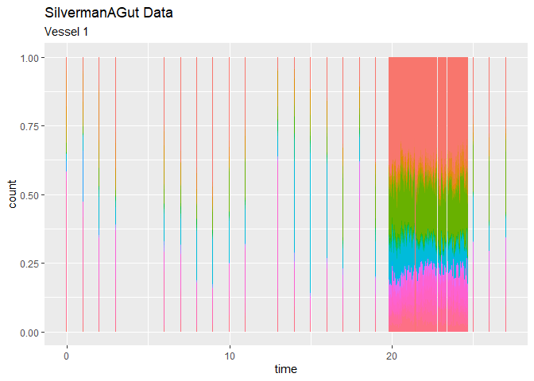
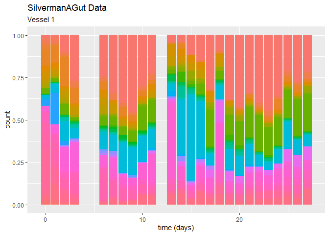
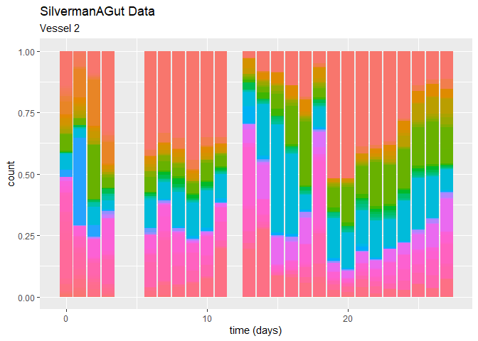
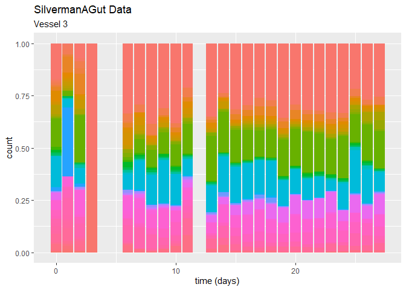
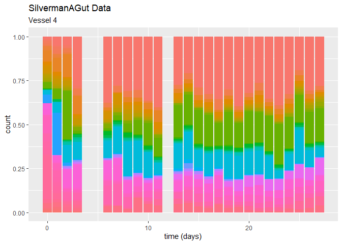
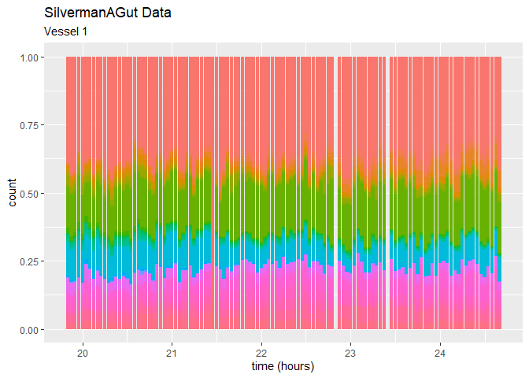
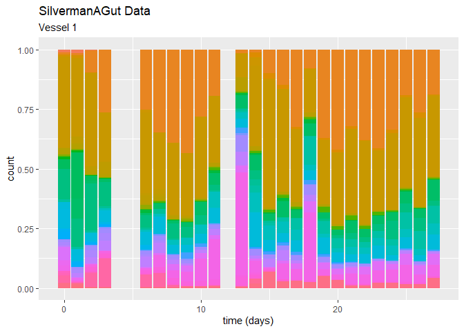
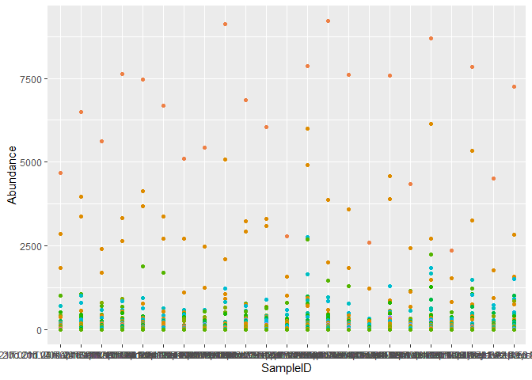
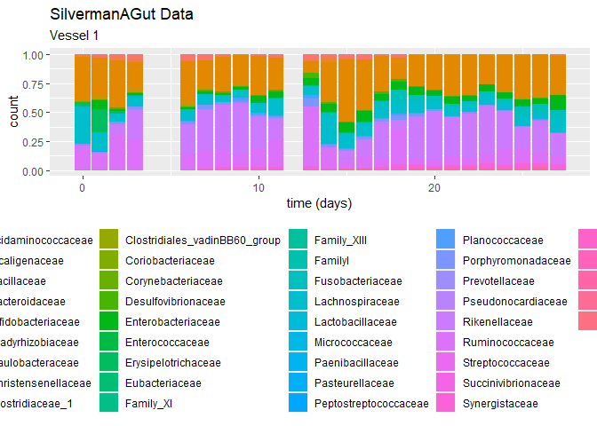

Time series (miaTIME)
================
Compiled at 2023-05-24 14:40:07 UTC

``` r
here::i_am(paste0(params$name, ".Rmd"), uuid = "87d828ae-2f1b-40a8-b559-3784df62c78d")
```

The purpose of this document is …

``` r
library("conflicted")
library(data.table)
library(tidyverse)

# # install the miaTIME package from github
# library(devtools)
# devtools::install_github("microbiome/miaTime")

library(miaTime)
# library(tidySingleCellExperiment)
library(lubridate)
library(TreeSummarizedExperiment)
# library(tidySummarizedExperiment)
```

``` r
# create or *empty* the target directory, used to write this file's data: 
projthis::proj_create_dir_target(params$name, clean = TRUE)

# function to get path to target directory: path_target("sample.csv")
path_target <- projthis::proj_path_target(params$name)

# function to get path to previous data: path_source("00-import", "sample.csv")
path_source <- projthis::proj_path_source(params$name)
```

## SilvermanAGutData

``` r
# load a dataset from miaTIME

data(SilvermanAGutData)

# SilvermanAGutData@rowLinks
# SilvermanAGutData@colLinks #empty
# 
# cols <- 
#   colData(SilvermanAGutData)
# 
# metadata(SilvermanAGutData) #empty
# 
# referenceSeq(SilvermanAGutData)


# extract taxa information
dt_taxonomic_tree <-
  setDT(as.data.frame(rowData(SilvermanAGutData)), keep.rownames = TRUE)

# extract count table
ma_SilvermanAGut_count <-
  assays(SilvermanAGutData)[[1]]

dt_SilvermanAGut_count <- 
  data.table(seq = row.names(ma_SilvermanAGut_count), ma_SilvermanAGut_count) %>% 
  melt(id.vars = "seq", variable.name = "desc", value.name = "count")


# add taxonomic tree to count table
dt_SilvermanAGut_count <-
  merge(dt_SilvermanAGut_count, dt_taxonomic_tree,
        by.x = "seq", by.y = "rn")
```

### Time info

get time info out of count table names

``` r
# extract sample names from count table
sample_names <- 
  ma_SilvermanAGut_count %>% colnames()

# show all names
sort(sample_names)
```

    ##   [1] "T..0.V.1.Rep.1..set.7.44.wellD6"                  
    ##   [2] "T..0.V.2.Rep.1..set.3.91..Well.C12"               
    ##   [3] "T..0.V.3.Rep.1."                                  
    ##   [4] "T..0.V.4.Rep.1..Set.4.77..WellE10"                
    ##   [5] "T..1.Days.V.1.Rep.1..Set.1.54.Well.F7"            
    ##   [6] "T..1.Days.V.2.Rep.1."                             
    ##   [7] "T..1.Days.V.3.Rep.1..Set.4.68..WellD9"            
    ##   [8] "T..1.Days.V.4.Rep.1..Set.1.7.Well.G1"             
    ##   [9] "T..10.Days.V.1.Rep.1..Set.4.55..WellG7"           
    ##  [10] "T..10.Days.V.2.Rep.1..set.7.26.wellB4"            
    ##  [11] "T..10.Days.V.3.Rep.1."                            
    ##  [12] "T..10.Days.V.4.Rep.1..set.3.14..Well.F2"          
    ##  [13] "T..11.Days.V.1.Rep.1..Set.6.80.wellH10"           
    ##  [14] "T..11.Days.V.2.Rep.1."                            
    ##  [15] "T..11.Days.V.3.Rep.1..Set.4.92..WellD12"          
    ##  [16] "T..11.Days.V.4.Rep.1."                            
    ##  [17] "T..13.Days.V.1.Rep.1."                            
    ##  [18] "T..13.Days.V.2.Rep.1."                            
    ##  [19] "T..13.Days.V.3.Rep.1..set.3.64.Well.H8"           
    ##  [20] "T..13.Days.V.4.Rep.1..set.3.38..Well.F5"          
    ##  [21] "T..14.Days.V.1.Rep.1..set.3.58.Well.B8"           
    ##  [22] "T..14.Days.V.2.Rep.1..Set.4.67..WellC9"           
    ##  [23] "T..14.Days.V.3.Rep.1..Set.1.44.Well.D6"           
    ##  [24] "T..14.Days.V.4.Rep.1..Set.6.76.wellD10"           
    ##  [25] "T..15.Days.V.1.Rep.1."                            
    ##  [26] "T..15.Days.V.2.Rep.1."                            
    ##  [27] "T..15.Days.V.3.Rep.1..set.3.62.Well.F8"           
    ##  [28] "T..15.Days.V.4.Rep.1..Set.4.71..WellG9"           
    ##  [29] "T..16.Days.V.1.Rep.1..Set.4.2..WellB1"            
    ##  [30] "T..16.Days.V.2.Rep.1."                            
    ##  [31] "T..16.Days.V.3.Rep.1..set.3.15..Well.G2"          
    ##  [32] "T..16.Days.V.4.Rep.1..set.3.70.Well.F9"           
    ##  [33] "T..17.Days.V.1.Rep.1..set.3.56.Well.H7"           
    ##  [34] "T..17.Days.V.2.Rep.1..Set.1.58.Well.B8"           
    ##  [35] "T..17.Days.V.3.Rep.1..set.7.20.wellD3"            
    ##  [36] "T..17.Days.V.4.Rep.1..Set.5.4.WellD1"             
    ##  [37] "T..18.Days.V.1.Rep.1..Set.1.42.Well.B6"           
    ##  [38] "T..18.Days.V.2.Rep.1..Set.4.87..WellG11"          
    ##  [39] "T..18.Days.V.3.Rep.1..Set.6.64.wellH8"            
    ##  [40] "T..18.Days.V.4.Rep.1..Set.4.73..WellA10"          
    ##  [41] "T..19.Days.V.1.Rep.1..Set.6.90.wellB12"           
    ##  [42] "T..19.Days.V.2.Rep.1..set.3.85.Well.E11"          
    ##  [43] "T..19.Days.V.3.Rep.1..set.3.7..Well.G1"           
    ##  [44] "T..19.Days.V.4.Rep.1..set.3.92..Well.D12"         
    ##  [45] "T..19d.20h.00m.V1.Rep1.Set.6.88.wellH11"          
    ##  [46] "T..19d.20h.00m.V2.Rep1.Set.6.14.wellF2"           
    ##  [47] "T..19d.20h.00m.V3.Rep1.Set.1.53.Well.E7"          
    ##  [48] "T..19d.20h.00m.V4.Rep1.Set.4.52..WellD7"          
    ##  [49] "T..19d.21h.00m.V1.Rep1.set.7.32.wellH4"           
    ##  [50] "T..19d.21h.00m.V2.Rep1.set.3.10..Well.B2"         
    ##  [51] "T..19d.21h.00m.V3.Rep1"                           
    ##  [52] "T..19d.21h.00m.V4.Rep1"                           
    ##  [53] "T..19d.22h.00m.V1.Rep1.Set.6.7.wellG1"            
    ##  [54] "T..19d.22h.00m.V2.Rep1.Set.6.11.wellC2"           
    ##  [55] "T..19d.22h.00m.V3.Rep1.Set.5.81.WellA11"          
    ##  [56] "T..19d.22h.00m.V4.Rep1.Set.4.49..WellA7"          
    ##  [57] "T..19d.23h.00m.V1.Rep1.Set.5.48.WellH6"           
    ##  [58] "T..19d.23h.00m.V2.Rep1"                           
    ##  [59] "T..19d.23h.00m.V3.Rep1"                           
    ##  [60] "T..19d.23h.00m.V4.Rep1.Set.6.94.wellF12"          
    ##  [61] "T..2.Day.V.1.Rep.1..set.3.26..Well.B4"            
    ##  [62] "T..2.Day.V.2.Rep.1..Set.1.59.Well.C8"             
    ##  [63] "T..2.Day.V.3.Rep.1..Set.5.7.WellG1"               
    ##  [64] "T..2.Day.V.4.Rep.1..Set.4.14..WellF2"             
    ##  [65] "T..20d.00h.00m.V1.Rep1.Set.1.78.Well.F10"         
    ##  [66] "T..20d.00h.00m.V2.Rep1"                           
    ##  [67] "T..20d.00h.00m.V3.Rep1.Set.4.23..WellG3"          
    ##  [68] "T..20d.00h.00m.V4.Rep1.Set.6.77.wellE10"          
    ##  [69] "T..20d.01h.00m.V1.Rep1.Set.5.85.WellE11"          
    ##  [70] "T..20d.01h.00m.V2.Rep1.set.7.9.wellA2"            
    ##  [71] "T..20d.01h.00m.V3.Rep1.Set.1.77.Well.E10"         
    ##  [72] "T..20d.01h.00m.V4.Rep1.Set.5.22.WellF3"           
    ##  [73] "T..20d.02h.00m.V1.Rep1.Set.5.88.WellH11"          
    ##  [74] "T..20d.02h.00m.V2.Rep1.Set.1.84.Well.D11"         
    ##  [75] "T..20d.02h.00m.V3.Rep1.Set.6.81.wellA11"          
    ##  [76] "T..20d.02h.00m.V4.Rep1.Set.6.38.wellF5"           
    ##  [77] "T..20d.03h.00m.V1.Rep1.Set.5.16.WellH2"           
    ##  [78] "T..20d.03h.00m.V2.Rep1"                           
    ##  [79] "T..20d.03h.00m.V3.Rep1.Set.6.2.wellB1"            
    ##  [80] "T..20d.03h.00m.V4.Rep1"                           
    ##  [81] "T..20d.04h.00m.V1.Rep1.Set.6.95.wellG12"          
    ##  [82] "T..20d.04h.00m.V2.Rep1"                           
    ##  [83] "T..20d.04h.00m.V3.Rep1.set.3.19..Well.C3"         
    ##  [84] "T..20d.04h.00m.V4.Rep1"                           
    ##  [85] "T..20d.05h.00m.V1.Rep1.Set.5.59.WellC8"           
    ##  [86] "T..20d.05h.00m.V2.Rep1.Set.1.18.Well.B3"          
    ##  [87] "T..20d.05h.00m.V3.Rep1.set.3.44.Well.D6"          
    ##  [88] "T..20d.05h.00m.V4.Rep1.Set.6.71.wellG9"           
    ##  [89] "T..20d.06h.00m.V1.Rep1.set.3.69.Well.E9"          
    ##  [90] "T..20d.06h.00m.V2.Rep1.set.7.39.wellG5"           
    ##  [91] "T..20d.06h.00m.V3.Rep1.Set.4.79..WellG10"         
    ##  [92] "T..20d.06h.00m.V4.Rep1"                           
    ##  [93] "T..20d.07h.00m.V1.Rep1.Set.6.92.wellD12"          
    ##  [94] "T..20d.07h.00m.V2.Rep1.Set.4.72..WellH9"          
    ##  [95] "T..20d.07h.00m.V3.Rep1.Set.6.36.wellD5"           
    ##  [96] "T..20d.07h.00m.V4.Rep1.set.3.2..Well.B1"          
    ##  [97] "T..20d.08h.00m.V1.Rep1.Set.5.8.WellH1"            
    ##  [98] "T..20d.08h.00m.V2.Rep1.Set.4.58..WellB8"          
    ##  [99] "T..20d.08h.00m.V3.Rep1.Set.1.21.Well.E3"          
    ## [100] "T..20d.08h.00m.V4.Rep1.Set.5.53.WellE7"           
    ## [101] "T..20d.09h.00m.V1.Rep1"                           
    ## [102] "T..20d.09h.00m.V2.Rep1"                           
    ## [103] "T..20d.09h.00m.V3.Rep1.Set.5.43.WellC6"           
    ## [104] "T..20d.09h.00m.V4.Rep1.Set.6.39.wellG5"           
    ## [105] "T..20d.10h.00m.V1.Rep1"                           
    ## [106] "T..20d.10h.00m.V2.Rep1.Set.4.35..WellC5"          
    ## [107] "T..20d.10h.00m.V3.Rep1.Set.6.9.wellA2"            
    ## [108] "T..20d.10h.00m.V4.Rep1.set.3.13..Well.E2"         
    ## [109] "T..20d.11h.00m.V1.Rep1.Set.5.77.WellE10"          
    ## [110] "T..20d.11h.00m.V2.Rep1.set.3.90..Well.B12"        
    ## [111] "T..20d.11h.00m.V3.Rep1.Set.4.85..WellE11"         
    ## [112] "T..20d.11h.00m.V4.Rep1"                           
    ## [113] "T..20d.12h.00m.V1.Rep1.Set.6.79.wellG10"          
    ## [114] "T..20d.12h.00m.V2.Rep1.Set.6.4.wellD1"            
    ## [115] "T..20d.12h.00m.V3.Rep1.Set.5.73.WellA10"          
    ## [116] "T..20d.12h.00m.V4.Rep1.Set.5.21.WellE3"           
    ## [117] "T..20d.13h.00m.V1.Rep1.Set.6.68.wellD9"           
    ## [118] "T..20d.13h.00m.V2.Rep1.Set.1.26.Well.B4"          
    ## [119] "T..20d.13h.00m.V3.Rep1.Set.1.8.Well.H1"           
    ## [120] "T..20d.13h.00m.V4.Rep1"                           
    ## [121] "T..20d.14h.00m.V1.Rep1.Set.5.63.WellG8"           
    ## [122] "T..20d.14h.00m.V2.Rep1.Set.6.73.wellA10"          
    ## [123] "T..20d.14h.00m.V3.Rep1.Set.5.82.WellB11"          
    ## [124] "T..20d.14h.00m.V4.Rep1.set.7.8.wellH1"            
    ## [125] "T..20d.15h.00m.V1.Rep1.Set.6.57.wellA8"           
    ## [126] "T..20d.15h.00m.V2.Rep1.Set.4.45..WellE6"          
    ## [127] "T..20d.15h.00m.V3.Rep1.Set.1.52.Well.D7"          
    ## [128] "T..20d.15h.00m.V4.Rep1.Set.5.33.WellA5"           
    ## [129] "T..20d.16h.00m.V1.Rep1.Set.6.16.wellH2"           
    ## [130] "T..20d.16h.00m.V2.Rep1"                           
    ## [131] "T..20d.16h.00m.V3.Rep1"                           
    ## [132] "T..20d.16h.00m.V4.Rep1.Set.1.20.Well.D3"          
    ## [133] "T..20d.17h.00m.V1.Rep1.Set.6.74.wellB10"          
    ## [134] "T..20d.17h.00m.V2.Rep1.Set.4.86..WellF11"         
    ## [135] "T..20d.17h.00m.V3.Rep1"                           
    ## [136] "T..20d.17h.00m.V4.Rep1.set.3.81.Well.A11"         
    ## [137] "T..20d.18h.00m.V1.Rep1.Set.1.87.Well.G11"         
    ## [138] "T..20d.18h.00m.V2.Rep1.set.3.24..Well.H3"         
    ## [139] "T..20d.18h.00m.V3.Rep1"                           
    ## [140] "T..20d.18h.00m.V4.Rep1.Set.1.46.Well.F6"          
    ## [141] "T..20d.19h.00m.V1.Rep1"                           
    ## [142] "T..20d.19h.00m.V2.Rep1.Set.1.49.Well.A7"          
    ## [143] "T..20d.19h.00m.V3.Rep1.Set.5.40.WellH5"           
    ## [144] "T..20d.19h.00m.V4.Rep1.Set.4.26..WellB4"          
    ## [145] "T..20d.20h.00m.V1.Rep1.Set.4.39..WellG5"          
    ## [146] "T..20d.20h.00m.V2.Rep1.Set.5.27.WellC4"           
    ## [147] "T..20d.20h.00m.V3.Rep1.Set.1.75.Well.C10"         
    ## [148] "T..20d.20h.00m.V4.Rep1.set.7.29.wellE4"           
    ## [149] "T..20d.21h.00m.V1.Rep1.Set.5.56.WellH7"           
    ## [150] "T..20d.21h.00m.V2.Rep1.Set.5.20.WellD3"           
    ## [151] "T..20d.21h.00m.V3.Rep1.Set.6.31.wellG4"           
    ## [152] "T..20d.21h.00m.V4.Rep1.Set.1.13.Well.E2"          
    ## [153] "T..20d.21h.00m.V4.Rep1.set.1.66.wellE8"           
    ## [154] "T..20d.22h.00m.V1.Rep1"                           
    ## [155] "T..20d.22h.00m.V2.Rep1.set.7.46.wellF6"           
    ## [156] "T..20d.22h.00m.V3.Rep1.set.3.42.Well.B6"          
    ## [157] "T..20d.22h.00m.V4.Rep1.Set.4.90..WellB12"         
    ## [158] "T..20d.23h.00m.V1.Rep1.Set.1.14.Well.F2"          
    ## [159] "T..20d.23h.00m.V1.Rep1.set.1.74.wellH8"           
    ## [160] "T..20d.23h.00m.V2.Rep1.Set.5.13.WellE2"           
    ## [161] "T..20d.23h.00m.V3.Rep1.Set.1.92.Well.D12"         
    ## [162] "T..20d.23h.00m.V4.Rep1.set.7.47.wellG6"           
    ## [163] "T..21d.00h.00m.V1.Rep1.Set.6.6.wellF1"            
    ## [164] "T..21d.00h.00m.V2.Rep1.Set.5.83.WellC11"          
    ## [165] "T..21d.00h.00m.V3.Rep1.set.3.80.Well.H10"         
    ## [166] "T..21d.00h.00m.V4.Rep1.Set.5.69.WellE9"           
    ## [167] "T..21d.01h.00m.V1.Rep1.Set.6.24.wellH3"           
    ## [168] "T..21d.01h.00m.V2.Rep1"                           
    ## [169] "T..21d.01h.00m.V3.Rep1"                           
    ## [170] "T..21d.01h.00m.V4.Rep1.Set.6.62.wellF8"           
    ## [171] "T..21d.02h.00m.V1.Rep1"                           
    ## [172] "T..21d.02h.00m.V2.Rep1.Set.1.27.Well.C4"          
    ## [173] "T..21d.02h.00m.V3.Rep1.Set.4.44..WellD6"          
    ## [174] "T..21d.02h.00m.V4.Rep1"                           
    ## [175] "T..21d.03h.00m.V1.Rep1.Set.4.66..WellB9"          
    ## [176] "T..21d.03h.00m.V2.Rep1.set.3.75.Well.C10"         
    ## [177] "T..21d.03h.00m.V3.Rep1.set.3.40..Well.H5"         
    ## [178] "T..21d.03h.00m.V4.Rep1.Set.6.25.wellA4"           
    ## [179] "T..21d.04h.00m.V1.Rep1.set.3.39..Well.G5"         
    ## [180] "T..21d.04h.00m.V2.Rep1.Set.6.19.wellC3"           
    ## [181] "T..21d.04h.00m.V3.Rep1.set.3.41.Well.A6"          
    ## [182] "T..21d.04h.00m.V4.Rep1.set.7.6.wellF1"            
    ## [183] "T..21d.05h.00m.V1.Rep1.Set.1.25.Well.A4"          
    ## [184] "T..21d.05h.00m.V2.Rep1.Set.1.24.Well.H3"          
    ## [185] "T..21d.05h.00m.V3.Rep1.set.3.36..Well.D5"         
    ## [186] "T..21d.05h.00m.V4.Rep1.set.7.14.wellF2"           
    ## [187] "T..21d.06h.00m.V1.Rep1.set.3.61.Well.E8"          
    ## [188] "T..21d.06h.00m.V2.Rep1.Set.4.54..WellF7"          
    ## [189] "T..21d.06h.00m.V3.Rep1.set.3.31..Well.G4"         
    ## [190] "T..21d.06h.00m.V4.Rep1.Set.4.6..WellF1"           
    ## [191] "T..21d.07h.00m.V1.Rep1.set.3.49.Well.A7"          
    ## [192] "T..21d.07h.00m.V2.Rep1.Set.1.66.Well.B9"          
    ## [193] "T..21d.07h.00m.V3.Rep1.set.3.34..Well.B5"         
    ## [194] "T..21d.07h.00m.V4.Rep1.set.3.96..Well.H12"        
    ## [195] "T..21d.08h.00m.V1.Rep1.Set.6.22.wellF3"           
    ## [196] "T..21d.08h.00m.V2.Rep1.set.3.50.Well.B7"          
    ## [197] "T..21d.08h.00m.V3.Rep1.set.3.54.Well.F7"          
    ## [198] "T..21d.08h.00m.V4.Rep1.Set.1.17.Well.A3"          
    ## [199] "T..21d.09h.00m.V1.Rep1.Set.5.52.WellD7"           
    ## [200] "T..21d.09h.00m.V2.Rep1"                           
    ## [201] "T..21d.09h.00m.V3.Rep1.set.7.50.wellB7"           
    ## [202] "T..21d.09h.00m.V4.Rep1"                           
    ## [203] "T..21d.10h.00m.V1.Rep1.Set.5.47.WellG6"           
    ## [204] "T..21d.10h.00m.V2.Rep1.Set.5.24.WellH3"           
    ## [205] "T..21d.10h.00m.V3.Rep1.Set.5.29.WellE4"           
    ## [206] "T..21d.10h.00m.V4.Rep1.set.1.65.wellD8"           
    ## [207] "T..21d.10h.00m.V4.Rep1.Set.1.9.Well.A2"           
    ## [208] "T..21d.11h.00m.V1.Rep1.Set.5.86.WellF11"          
    ## [209] "T..21d.11h.00m.V2.Rep1.Set.5.38.WellF5"           
    ## [210] "T..21d.11h.00m.V3.Rep1.Set.1.36.Well.D5"          
    ## [211] "T..21d.11h.00m.V4.Rep1.Set.5.80.WellH10"          
    ## [212] "T..21d.12h.00m.V1.Rep1.Set.4.61..WellE8"          
    ## [213] "T..21d.12h.00m.V2.Rep1.Set.5.41.WellA6"           
    ## [214] "T..21d.12h.00m.V3.Rep1.Set.1.83.Well.C11"         
    ## [215] "T..21d.12h.00m.V4.Rep1.Set.5.6.WellF1"            
    ## [216] "T..21d.13h.00m.V1.Rep1.Set.5.1.WellA1"            
    ## [217] "T..21d.13h.00m.V2.Rep1.set.3.71.Well.G9"          
    ## [218] "T..21d.13h.00m.V3.Rep1.Set.6.67.wellC9"           
    ## [219] "T..21d.13h.00m.V4.Rep1.set.3.35..Well.C5"         
    ## [220] "T..21d.14h.00m.V1.Rep1"                           
    ## [221] "T..21d.14h.00m.V2.Rep1.set.3.67.Well.C9"          
    ## [222] "T..21d.14h.00m.V3.Rep1.Set.1.88.Well.H11"         
    ## [223] "T..21d.14h.00m.V4.Rep1.Set.6.75.wellC10"          
    ## [224] "T..21d.15h.00m.V1.Rep1.Set.6.84.wellD11"          
    ## [225] "T..21d.15h.00m.V2.Rep1.Set.5.91.WellC12"          
    ## [226] "T..21d.15h.00m.V3.Rep1.set.3.94..Well.F12"        
    ## [227] "T..21d.15h.00m.V4.Rep1.set.3.37..Well.E5"         
    ## [228] "T..21d.16h.00m.V1.Rep1.Set.6.61.wellE8"           
    ## [229] "T..21d.16h.00m.V2.Rep1.set.3.28..Well.D4"         
    ## [230] "T..21d.16h.00m.V3.Rep1.Set.5.32.WellH4"           
    ## [231] "T..21d.16h.00m.V4.Rep1.set.7.10.wellB2"           
    ## [232] "T..21d.17h.00m.V1.Rep1.Set.4.65..WellA9"          
    ## [233] "T..21d.17h.00m.V2.Rep1.Set.5.65.WellA9"           
    ## [234] "T..21d.17h.00m.V3.Rep1.set.3.5..Well.E1"          
    ## [235] "T..21d.17h.00m.V4.Rep1"                           
    ## [236] "T..21d.18h.00m.V1.Rep1.set.7.3.wellC1"            
    ## [237] "T..21d.18h.00m.V2.Rep1.set.3.47.Well.G6"          
    ## [238] "T..21d.18h.00m.V3.Rep1.Set.1.71.Well.G9"          
    ## [239] "T..21d.18h.00m.V4.Rep1.Set.1.39.Well.G5"          
    ## [240] "T..21d.19h.00m.V1.Rep1.Set.6.3.wellC1"            
    ## [241] "T..21d.19h.00m.V2.Rep1.Set.1.69.Well.E9"          
    ## [242] "T..21d.19h.00m.V3.Rep1.Set.5.68.WellD9"           
    ## [243] "T..21d.19h.00m.V4.Rep1.Set.5.87.WellG11"          
    ## [244] "T..21d.20h.00m.V1.Rep1.Set.4.64..WellH8"          
    ## [245] "T..21d.20h.00m.V2.Rep1.set.7.52.wellD7"           
    ## [246] "T..21d.20h.00m.V3.Rep1.Set.4.19..WellC3"          
    ## [247] "T..21d.20h.00m.V4.Rep1.Set.1.86.Well.F11"         
    ## [248] "T..21d.21h.00m.V1.Rep1.set.7.5.wellE1"            
    ## [249] "T..21d.21h.00m.V2.Rep1.Set.1.48.Well.H6"          
    ## [250] "T..21d.21h.00m.V3.Rep1.Set.6.15.wellG2"           
    ## [251] "T..21d.21h.00m.V4.Rep1.Set.5.51.WellC7"           
    ## [252] "T..21d.22h.00m.V1.Rep1.Set.4.31..WellG4"          
    ## [253] "T..21d.22h.00m.V2.Rep1.Set.1.90.Well.B12"         
    ## [254] "T..21d.22h.00m.V3.Rep1.Set.6.18.wellB3"           
    ## [255] "T..21d.22h.00m.V4.Rep1.Set.1.57.Well.A8"          
    ## [256] "T..21d.23h.00m.V1.Rep1"                           
    ## [257] "T..21d.23h.00m.V2.Rep1.Set.5.2.WellB1"            
    ## [258] "T..21d.23h.00m.V3.Rep1.Set.6.82.wellB11"          
    ## [259] "T..21d.23h.00m.V4.Rep1.set.7.33.wellA5"           
    ## [260] "T..22d.00h.00m.V1.Rep1.Set.4.38..WellF5"          
    ## [261] "T..22d.00h.00m.V2.Rep1"                           
    ## [262] "T..22d.00h.00m.V3.Rep1.set.3.27..Well.C4"         
    ## [263] "T..22d.00h.00m.V4.Rep1.Set.1.68.Well.D9"          
    ## [264] "T..22d.01h.00m.V1.Rep1.set.3.68.Well.D9"          
    ## [265] "T..22d.01h.00m.V2.Rep1.set.7.12.wellD2"           
    ## [266] "T..22d.01h.00m.V3.Rep1.set.3.79.Well.G10"         
    ## [267] "T..22d.01h.00m.V4.Rep1.Set.5.17.WellA3"           
    ## [268] "T..22d.02h.00m.V1.Rep1.Set.5.36.WellD5"           
    ## [269] "T..22d.02h.00m.V2.Rep1.Set.5.11.WellC2"           
    ## [270] "T..22d.02h.00m.V3.Rep1"                           
    ## [271] "T..22d.02h.00m.V4.Rep1.Set.5.62.WellF8"           
    ## [272] "T..22d.03h.00m.V1.Rep1.set.7.40.wellH5"           
    ## [273] "T..22d.03h.00m.V2.Rep1.set.7.48.wellH6"           
    ## [274] "T..22d.03h.00m.V3.Rep1.Set.5.19.WellC3"           
    ## [275] "T..22d.03h.00m.V4.Rep1.Set.5.44.WellD6"           
    ## [276] "T..22d.04h.00m.V1.Rep1.Set.1.93.Well.E12"         
    ## [277] "T..22d.04h.00m.V2.Rep1.set.7.38.wellF5"           
    ## [278] "T..22d.04h.00m.V3.Rep1.Set.5.5.WellE1"            
    ## [279] "T..22d.04h.00m.V4.Rep1.Set.4.82..WellB11"         
    ## [280] "T..22d.05h.00m.V1.Rep1.set.7.4.wellD1"            
    ## [281] "T..22d.05h.00m.V2.Rep1.Set.6.85.wellE11"          
    ## [282] "T..22d.05h.00m.V3.Rep1.Set.5.67.WellC9"           
    ## [283] "T..22d.05h.00m.V4.Rep1.Set.1.62.Well.F8"          
    ## [284] "T..22d.06h.00m.V1.Rep1.Set.1.67.Well.C9"          
    ## [285] "T..22d.06h.00m.V2.Rep1.Set.1.61.Well.E8"          
    ## [286] "T..22d.06h.00m.V3.Rep1.Set.1.19.Well.C3"          
    ## [287] "T..22d.06h.00m.V4.Rep1.set.7.1.wellA1"            
    ## [288] "T..22d.07h.00m.V1.Rep1.set.3.21..Well.E3"         
    ## [289] "T..22d.07h.00m.V2.Rep1.Set.4.89..WellA12"         
    ## [290] "T..22d.07h.00m.V3.Rep1"                           
    ## [291] "T..22d.07h.00m.V4.Rep1.set.3.52.Well.D7"          
    ## [292] "T..22d.08h.00m.V1.Rep1.Set.6.58.wellB8"           
    ## [293] "T..22d.08h.00m.V2.Rep1.set.3.20..Well.D3"         
    ## [294] "T..22d.08h.00m.V3.Rep1.Set.1.41.Well.A6"          
    ## [295] "T..22d.08h.00m.V4.Rep1.Set.4.84..WellD11"         
    ## [296] "T..22d.09h.00m.V1.Rep1.Set.6.43.wellC6"           
    ## [297] "T..22d.09h.00m.V2.Rep1.Set.1.6.Well.F1"           
    ## [298] "T..22d.09h.00m.V3.Rep1.set.3.77.Well.E10"         
    ## [299] "T..22d.09h.00m.V4.Rep1.set.3.18..Well.B3"         
    ## [300] "T..22d.10h.00m.V1.Rep1.Set.4.60..WellD8"          
    ## [301] "T..22d.10h.00m.V2.Rep1.Set.4.18..WellB3"          
    ## [302] "T..22d.10h.00m.V3.Rep1.Set.4.22..WellF3"          
    ## [303] "T..22d.10h.00m.V4.Rep1"                           
    ## [304] "T..22d.11h.00m.V1.Rep1.Set.4.76..WellD10"         
    ## [305] "T..22d.11h.00m.V2.Rep1"                           
    ## [306] "T..22d.11h.00m.V3.Rep1"                           
    ## [307] "T..22d.11h.00m.V4.Rep1"                           
    ## [308] "T..22d.12h.00m.V1.Rep1.Set.5.61.WellE8"           
    ## [309] "T..22d.12h.00m.V2.Rep1.Set.4.74..WellB10"         
    ## [310] "T..22d.12h.00m.V3.Rep1"                           
    ## [311] "T..22d.12h.00m.V4.Rep1.Set.4.47..WellG6"          
    ## [312] "T..22d.13h.00m.V1.Rep1.set.7.28.wellD4"           
    ## [313] "T..22d.13h.00m.V2.Rep1.Set.1.4.Well.D1"           
    ## [314] "T..22d.13h.00m.V3.Rep1.Set.5.26.WellB4"           
    ## [315] "T..22d.13h.00m.V4.Rep1"                           
    ## [316] "T..22d.14h.00m.V1.Rep1.set.7.7.wellG1"            
    ## [317] "T..22d.14h.00m.V2.Rep1.Set.6.91.wellC12"          
    ## [318] "T..22d.14h.00m.V3.Rep1.Set.1.28.Well.D4"          
    ## [319] "T..22d.14h.00m.V4.Rep1.set.3.95..Well.G12"        
    ## [320] "T..22d.15h.00m.V1.Rep1.set.3.65.Well.A9"          
    ## [321] "T..22d.15h.00m.V2.Rep1"                           
    ## [322] "T..22d.15h.00m.V3.Rep1.Set.5.95.WellG12"          
    ## [323] "T..22d.15h.00m.V4.Rep1.set.3.30..Well.F4"         
    ## [324] "T..22d.16h.00m.V1.Rep1"                           
    ## [325] "T..22d.16h.00m.V1.Rep1.PostInnoc.Set.1.15.Well.G2"
    ## [326] "T..22d.16h.00m.V1.Rep1.PostInnoc.set.1.59.wellC8" 
    ## [327] "T..22d.16h.00m.V2.Rep1.PostInnoc"                 
    ## [328] "T..22d.16h.00m.V2.Rep1.set.7.42.wellB6"           
    ## [329] "T..22d.16h.00m.V3.Rep1.PostInnoc.Set.1.38.Well.F5"
    ## [330] "T..22d.16h.00m.V3.Rep1.Set.4.1..WellA1"           
    ## [331] "T..22d.16h.00m.V4.Rep1.PostInnoc.Set.6.37.wellE5" 
    ## [332] "T..22d.16h.00m.V4.Rep1.set.3.73.Well.A10"         
    ## [333] "T..22d.17h.00m.V1.Rep1.set.7.54.wellF7"           
    ## [334] "T..22d.17h.00m.V2.Rep1.Set.4.24..WellH3"          
    ## [335] "T..22d.17h.00m.V3.Rep1"                           
    ## [336] "T..22d.17h.00m.V4.Rep1"                           
    ## [337] "T..22d.18h.00m.V1.Rep1.Set.1.72.Well.H9"          
    ## [338] "T..22d.18h.00m.V2.Rep1.Set.1.16.Well.H2"          
    ## [339] "T..22d.18h.00m.V2.Rep1.set.1.67.wellF8"           
    ## [340] "T..22d.18h.00m.V3.Rep1.Set.4.56..WellH7"          
    ## [341] "T..22d.18h.00m.V4.Rep1.Set.5.93.WellE12"          
    ## [342] "T..22d.19h.00m.V1.Rep1.Set.5.94.WellF12"          
    ## [343] "T..22d.19h.00m.V2.Rep1.Set.4.3..WellC1"           
    ## [344] "T..22d.19h.00m.V3.Rep1.Set.5.70.WellF9"           
    ## [345] "T..22d.19h.00m.V4.Rep1.Set.6.8.wellH1"            
    ## [346] "T..22d.20h.00m.V1.Rep1.set.3.9..Well.A2"          
    ## [347] "T..22d.20h.00m.V2.Rep1.Set.5.89.WellA12"          
    ## [348] "T..22d.20h.00m.V3.Rep1.Set.5.92.WellD12"          
    ## [349] "T..22d.20h.00m.V4.Rep1.Set.6.78.wellF10"          
    ## [350] "T..22d.21h.00m.V1.Rep1.Set.6.51.wellC7"           
    ## [351] "T..22d.21h.00m.V2.Rep1"                           
    ## [352] "T..22d.21h.00m.V4.Rep1.Set.6.27.wellC4"           
    ## [353] "T..22d.22h.00m.V1.Rep1.set.3.86.Well.F11"         
    ## [354] "T..22d.22h.00m.V2.Rep1.Set.6.96.wellH12"          
    ## [355] "T..22d.22h.00m.V3.Rep1.Set.5.45.WellE6"           
    ## [356] "T..22d.22h.00m.V4.Rep1"                           
    ## [357] "T..22d.23h.00m.V1.Rep1.set.3.60.Well.D8"          
    ## [358] "T..22d.23h.00m.V2.Rep1"                           
    ## [359] "T..22d.23h.00m.V3.Rep1.set.7.41.wellA6"           
    ## [360] "T..22d.23h.00m.V4.Rep1.Set.1.5.Well.E1"           
    ## [361] "T..23d.00h.00m.V1.Rep1.Set.5.15.WellG2"           
    ## [362] "T..23d.00h.00m.V2.Rep1.Set.1.22.Well.F3"          
    ## [363] "T..23d.00h.00m.V3.Rep1.Set.4.11..WellC2"          
    ## [364] "T..23d.00h.00m.V4.Rep1.Set.6.45.wellE6"           
    ## [365] "T..23d.01h.00m.V1.Rep1.set.7.25.wellA4"           
    ## [366] "T..23d.01h.00m.V2.Rep1.Set.1.35.Well.C5"          
    ## [367] "T..23d.01h.00m.V3.Rep1.Set.1.82.Well.B11"         
    ## [368] "T..23d.01h.00m.V4.Rep1.Set.4.15..WellG2"          
    ## [369] "T..23d.02h.00m.V1.Rep1.Set.6.54.wellF7"           
    ## [370] "T..23d.02h.00m.V2.Rep1"                           
    ## [371] "T..23d.02h.00m.V3.Rep1.Set.4.13..WellE2"          
    ## [372] "T..23d.02h.00m.V4.Rep1.set.7.19.wellC3"           
    ## [373] "T..23d.03h.00m.V1.Rep1.Set.6.35.wellC5"           
    ## [374] "T..23d.03h.00m.V2.Rep1.Set.6.56.wellH7"           
    ## [375] "T..23d.03h.00m.V3.Rep1.set.3.22..Well.F3"         
    ## [376] "T..23d.03h.00m.V4.Rep1.set.7.51.wellC7"           
    ## [377] "T..23d.04h.00m.V1.Rep1.Set.4.25..WellA4"          
    ## [378] "T..23d.04h.00m.V2.Rep1"                           
    ## [379] "T..23d.04h.00m.V3.Rep1.set.7.13.wellE2"           
    ## [380] "T..23d.04h.00m.V4.Rep1.Set.5.46.WellF6"           
    ## [381] "T..23d.05h.00m.V1.Rep1.set.3.53.Well.E7"          
    ## [382] "T..23d.05h.00m.V2.Rep1"                           
    ## [383] "T..23d.05h.00m.V3.Rep1.Set.1.40.Well.H5"          
    ## [384] "T..23d.05h.00m.V4.Rep1.set.7.31.wellG4"           
    ## [385] "T..23d.06h.00m.V1.Rep1.Set.1.89.Well.A12"         
    ## [386] "T..23d.06h.00m.V2.Rep1.Set.1.65.Well.A9"          
    ## [387] "T..23d.06h.00m.V3.Rep1"                           
    ## [388] "T..23d.06h.00m.V4.Rep1"                           
    ## [389] "T..23d.07h.00m.V1.Rep1.Set.1.96.Well.H12"         
    ## [390] "T..23d.07h.00m.V2.Rep1.Set.6.49.wellA7"           
    ## [391] "T..23d.07h.00m.V3.Rep1.Set.4.48..WellH6"          
    ## [392] "T..23d.07h.00m.V4.Rep1"                           
    ## [393] "T..23d.08h.00m.V1.Rep1.Set.5.64.WellH8"           
    ## [394] "T..23d.08h.00m.V2.Rep1.set.7.37.wellE5"           
    ## [395] "T..23d.08h.00m.V3.Rep1.set.7.55.wellG7"           
    ## [396] "T..23d.08h.00m.V4.Rep1.set.7.49.wellA7"           
    ## [397] "T..23d.09h.00m.V1.Rep1"                           
    ## [398] "T..23d.09h.00m.V2.Rep1.set.7.45.wellE6"           
    ## [399] "T..23d.09h.00m.V3.Rep1.Set.5.50.WellB7"           
    ## [400] "T..23d.09h.00m.V4.Rep1.Set.5.18.WellB3"           
    ## [401] "T..23d.10h.00m.V1.Rep1.set.3.48.Well.H6"          
    ## [402] "T..23d.10h.00m.V2.Rep1.set.3.29..Well.E4"         
    ## [403] "T..23d.10h.00m.V3.Rep1.Set.1.1.Well.A1"           
    ## [404] "T..23d.10h.00m.V4.Rep1.Set.4.91..WellC12"         
    ## [405] "T..23d.11h.00m.V1.Rep1.Set.1.55.Well.G7"          
    ## [406] "T..23d.11h.00m.V2.Rep1.Set.4.50..WellB7"          
    ## [407] "T..23d.11h.00m.V3.Rep1.Set.1.63.Well.G8"          
    ## [408] "T..23d.11h.00m.V4.Rep1.Set.6.40.wellH5"           
    ## [409] "T..23d.12h.00m.V1.Rep1.set.7.43.wellC6"           
    ## [410] "T..23d.12h.00m.V2.Rep1.Set.5.30.WellF4"           
    ## [411] "T..23d.12h.00m.V3.Rep1.set.7.36.wellD5"           
    ## [412] "T..23d.12h.00m.V4.Rep1.Set.6.42.wellB6"           
    ## [413] "T..23d.13h.00m.V1.Rep1.set.7.56.wellH7"           
    ## [414] "T..23d.13h.00m.V2.Rep1.Set.5.66.WellB9"           
    ## [415] "T..23d.13h.00m.V3.Rep1.Set.4.70..WellF9"          
    ## [416] "T..23d.13h.00m.V4.Rep1.Set.6.32.wellH4"           
    ## [417] "T..23d.14h.00m.V1.Rep1.Set.4.34..WellB5"          
    ## [418] "T..23d.14h.00m.V2.Rep1.Set.1.85.Well.E11"         
    ## [419] "T..23d.14h.00m.V3.Rep1.Set.1.10.Well.B2"          
    ## [420] "T..23d.14h.00m.V3.Rep1.set.1.73.wellG8"           
    ## [421] "T..23d.14h.00m.V4.Rep1.Set.6.29.wellE4"           
    ## [422] "T..23d.15h.00m.V1.Rep1.set.3.17..Well.A3"         
    ## [423] "T..23d.15h.00m.V2.Rep1.set.3.1..Well.A1"          
    ## [424] "T..23d.15h.00m.V3.Rep1.Set.6.47.wellG6"           
    ## [425] "T..23d.15h.00m.V4.Rep1.Set.6.12.wellD2"           
    ## [426] "T..23d.16h.00m.V1.Rep1.set.7.16.wellH2"           
    ## [427] "T..23d.16h.00m.V2.Rep1.Set.5.9.WellA2"            
    ## [428] "T..23d.16h.00m.V3.Rep1"                           
    ## [429] "T..23d.16h.00m.V4.Rep1.Set.4.57..WellA8"          
    ## [430] "T..23d.17h.00m.V1.Rep1.Set.6.60.wellD8"           
    ## [431] "T..23d.17h.00m.V2.Rep1.Set.4.69..WellE9"          
    ## [432] "T..23d.17h.00m.V3.Rep1.Set.5.54.WellF7"           
    ## [433] "T..23d.17h.00m.V4.Rep1"                           
    ## [434] "T..23d.18h.00m.V1.Rep1"                           
    ## [435] "T..23d.18h.00m.V2.Rep1.set.3.76.Well.D10"         
    ## [436] "T..23d.18h.00m.V3.Rep1.set.7.53.wellE7"           
    ## [437] "T..23d.18h.00m.V4.Rep1.Set.4.63..WellG8"          
    ## [438] "T..23d.19h.00m.V1.Rep1.Set.5.74.WellB10"          
    ## [439] "T..23d.19h.00m.V2.Rep1.Set.5.55.WellG7"           
    ## [440] "T..23d.19h.00m.V3.Rep1"                           
    ## [441] "T..23d.19h.00m.V4.Rep1.Set.6.59.wellC8"           
    ## [442] "T..23d.20h.00m.V1.Rep1"                           
    ## [443] "T..23d.20h.00m.V2.Rep1.Set.4.75..WellC10"         
    ## [444] "T..23d.20h.00m.V3.Rep1.Set.1.29.Well.E4"          
    ## [445] "T..23d.20h.00m.V4.Rep1.Set.5.23.WellG3"           
    ## [446] "T..23d.21h.00m.V1.Rep1.set.3.93..Well.E12"        
    ## [447] "T..23d.21h.00m.V2.Rep1.Set.1.91.Well.C12"         
    ## [448] "T..23d.21h.00m.V3.Rep1.Set.5.39.WellG5"           
    ## [449] "T..23d.21h.00m.V4.Rep1.Set.1.50.Well.B7"          
    ## [450] "T..23d.22h.00m.V1.Rep1.Set.4.32..WellH4"          
    ## [451] "T..23d.22h.00m.V2.Rep1.Set.6.52.wellD7"           
    ## [452] "T..23d.22h.00m.V3.Rep1.Set.1.70.Well.F9"          
    ## [453] "T..23d.22h.00m.V4.Rep1.Set.1.32.Well.H4"          
    ## [454] "T..23d.23h.00m.V1.Rep1.set.3.82.Well.B11"         
    ## [455] "T..23d.23h.00m.V2.Rep1.Set.1.80.Well.H10"         
    ## [456] "T..23d.23h.00m.V3.Rep1.set.3.59.Well.C8"          
    ## [457] "T..23d.23h.00m.V4.Rep1.Set.4.53..WellE7"          
    ## [458] "T..24d.00h.00m.V1.Rep1.Set.1.34.Well.B5"          
    ## [459] "T..24d.00h.00m.V2.Rep1.Set.1.45.Well.E6"          
    ## [460] "T..24d.00h.00m.V3.Rep1.Set.1.12.Well.D2"          
    ## [461] "T..24d.00h.00m.V3.Rep1.set.1.58.wellB8"           
    ## [462] "T..24d.00h.00m.V4.Rep1.Set.4.10..WellB2"          
    ## [463] "T..24d.01h.00m.V1.Rep1.Set.5.75.WellC10"          
    ## [464] "T..24d.01h.00m.V2.Rep1.Set.4.62..WellF8"          
    ## [465] "T..24d.01h.00m.V3.Rep1.set.7.21.wellE3"           
    ## [466] "T..24d.01h.00m.V4.Rep1.set.3.66.Well.B9"          
    ## [467] "T..24d.02h.00m.V1.Rep1.Set.4.51..WellC7"          
    ## [468] "T..24d.02h.00m.V2.Rep1.Set.6.69.wellE9"           
    ## [469] "T..24d.02h.00m.V3.Rep1.Set.4.29..WellE4"          
    ## [470] "T..24d.02h.00m.V4.Rep1.Set.1.33.Well.A5"          
    ## [471] "T..24d.03h.00m.V1.Rep1"                           
    ## [472] "T..24d.03h.00m.V2.Rep1.Set.5.96.WellH12"          
    ## [473] "T..24d.03h.00m.V3.Rep1.Set.1.60.Well.D8"          
    ## [474] "T..24d.03h.00m.V4.Rep1.Set.4.80..WellH10"         
    ## [475] "T..24d.04h.00m.V1.Rep1.set.3.63.Well.G8"          
    ## [476] "T..24d.04h.00m.V2.Rep1.Set.5.34.WellB5"           
    ## [477] "T..24d.04h.00m.V3.Rep1.Set.4.12..WellD2"          
    ## [478] "T..24d.04h.00m.V4.Rep1"                           
    ## [479] "T..24d.05h.00m.V1.Rep1"                           
    ## [480] "T..24d.05h.00m.V2.Rep1.Set.4.96..WellH12"         
    ## [481] "T..24d.05h.00m.V3.Rep1.Set.4.27..WellC4"          
    ## [482] "T..24d.05h.00m.V4.Rep1.Set.6.1.wellA1"            
    ## [483] "T..24d.06h.00m.V1.Rep1.Set.6.17.wellA3"           
    ## [484] "T..24d.06h.00m.V2.Rep1"                           
    ## [485] "T..24d.06h.00m.V3.Rep1.Set.5.14.WellF2"           
    ## [486] "T..24d.06h.00m.V4.Rep1.Set.6.34.wellB5"           
    ## [487] "T..24d.07h.00m.V1.Rep1.Set.5.37.WellE5"           
    ## [488] "T..24d.07h.00m.V2.Rep1.set.7.30.wellF4"           
    ## [489] "T..24d.07h.00m.V3.Rep1.Set.4.28..WellD4"          
    ## [490] "T..24d.07h.00m.V4.Rep1.Set.5.57.WellA8"           
    ## [491] "T..24d.08h.00m.V1.Rep1.Set.6.28.wellD4"           
    ## [492] "T..24d.08h.00m.V2.Rep1.Set.1.3.Well.C1"           
    ## [493] "T..24d.08h.00m.V3.Rep1.Set.1.81.Well.A11"         
    ## [494] "T..24d.08h.00m.V4.Rep1.Set.5.79.WellG10"          
    ## [495] "T..24d.09h.00m.V1.Rep1.Set.4.17..WellA3"          
    ## [496] "T..24d.09h.00m.V2.Rep1.Set.4.94..WellF12"         
    ## [497] "T..24d.09h.00m.V3.Rep1.Set.6.65.wellA9"           
    ## [498] "T..24d.09h.00m.V4.Rep1.Set.4.37..WellE5"          
    ## [499] "T..24d.10h.00m.V1.Rep1.Set.5.31.WellG4"           
    ## [500] "T..24d.10h.00m.V2.Rep1"                           
    ## [501] "T..24d.10h.00m.V3.Rep1.set.7.23.wellG3"           
    ## [502] "T..24d.10h.00m.V4.Rep1.set.7.2.wellB1"            
    ## [503] "T..24d.11h.00m.V1.Rep1.set.7.11.wellC2"           
    ## [504] "T..24d.11h.00m.V2.Rep1.Set.6.63.wellG8"           
    ## [505] "T..24d.11h.00m.V3.Rep1.Set.1.64.Well.H8"          
    ## [506] "T..24d.11h.00m.V4.Rep1"                           
    ## [507] "T..24d.12h.00m.V1.Rep1"                           
    ## [508] "T..24d.12h.00m.V2.Rep1.Set.4.46..WellF6"          
    ## [509] "T..24d.12h.00m.V3.Rep1"                           
    ## [510] "T..24d.12h.00m.V4.Rep1.set.3.43.Well.C6"          
    ## [511] "T..24d.13h.00m.V1.Rep1.Set.5.71.WellG9"           
    ## [512] "T..24d.13h.00m.V2.Rep1.set.3.78.Well.F10"         
    ## [513] "T..24d.13h.00m.V3.Rep1.set.3.4..Well.D1"          
    ## [514] "T..24d.13h.00m.V4.Rep1.set.7.34.wellB5"           
    ## [515] "T..24d.14h.00m.V1.Rep1.Set.4.33..WellA5"          
    ## [516] "T..24d.14h.00m.V2.Rep1.set.3.72.Well.H9"          
    ## [517] "T..24d.14h.00m.V3.Rep1.Set.4.43..WellC6"          
    ## [518] "T..24d.14h.00m.V4.Rep1.Set.4.59..WellC8"          
    ## [519] "T..24d.15h.00m.V1.Rep1.Set.4.20..WellD3"          
    ## [520] "T..24d.15h.00m.V2.Rep1.Set.6.41.wellA6"           
    ## [521] "T..24d.15h.00m.V3.Rep1.Set.1.43.Well.C6"          
    ## [522] "T..24d.15h.00m.V4.Rep1.Set.1.94.Well.F12"         
    ## [523] "T..24d.16h.00m.V1.Rep1"                           
    ## [524] "T..24d.16h.00m.V2.Rep1"                           
    ## [525] "T..24d.16h.00m.V3.Rep1.Set.6.66.wellB9"           
    ## [526] "T..24d.16h.00m.V4.Rep1.Set.5.42.WellB6"           
    ## [527] "T..25.Days.V1.Rep1.Set.6.87.wellG11"              
    ## [528] "T..25.Days.V2.Rep1"                               
    ## [529] "T..25.Days.V3.Rep1.Set.5.12.WellD2"               
    ## [530] "T..25.Days.V4.Rep1.set.7.17.wellA3"               
    ## [531] "T..26.Days.V1.Rep1.Set.1.23.Well.G3"              
    ## [532] "T..26.Days.V2.Rep1"                               
    ## [533] "T..26.Days.V3.Rep1.set.3.6..Well.F1"              
    ## [534] "T..26.Days.V4.Rep1.set.3.88.Well.H11"             
    ## [535] "T..27.Days.V1.Rep1.Set.4.83..WellC11"             
    ## [536] "T..27.Days.V2.Rep1.Set.4.4..WellD1"               
    ## [537] "T..27.Days.V3.Rep1.Set.5.28.WellD4"               
    ## [538] "T..27.Days.V4.Rep1.set.3.57.Well.A8"              
    ## [539] "T..28.V1.1.set.7.35.wellC5"                       
    ## [540] "T..28.V1.10.Set.6.53.wellE7"                      
    ## [541] "T..28.V1.11"                                      
    ## [542] "T..28.V1.12.Set.4.30..WellF4"                     
    ## [543] "T..28.V1.13"                                      
    ## [544] "T..28.V1.14.Set.6.86.wellF11"                     
    ## [545] "T..28.V1.15.Set.4.5..WellE1"                      
    ## [546] "T..28.V1.16.set.3.11..Well.C2"                    
    ## [547] "T..28.V1.17.Set.4.21..WellE3"                     
    ## [548] "T..28.V1.18.set.3.45.Well.E6"                     
    ## [549] "T..28.V1.19.set.3.3..Well.C1"                     
    ## [550] "T..28.V1.2.Set.5.10.WellB2"                       
    ## [551] "T..28.V1.20.set.7.27.wellC4"                      
    ## [552] "T..28.V1.3.Set.4.88..WellH11"                     
    ## [553] "T..28.V1.4"                                       
    ## [554] "T..28.V1.5"                                       
    ## [555] "T..28.V1.6.Set.4.93..WellE12"                     
    ## [556] "T..28.V1.7.Set.4.40..WellH5"                      
    ## [557] "T..28.V1.8"                                       
    ## [558] "T..28.V1.9.Set.4.36..WellD5"                      
    ## [559] "T..28.V2.1"                                       
    ## [560] "T..28.V2.10.Set.6.50.wellB7"                      
    ## [561] "T..28.V2.11"                                      
    ## [562] "T..28.V2.12.Set.1.47.Well.G6"                     
    ## [563] "T..28.V2.13.Set.4.8..WellH1"                      
    ## [564] "T..28.V2.14.Set.4.9..WellA2"                      
    ## [565] "T..28.V2.15"                                      
    ## [566] "T..28.V2.16.Set.1.30.Well.F4"                     
    ## [567] "T..28.V2.17.set.3.23..Well.G3"                    
    ## [568] "T..28.V2.18.set.3.83.Well.C11"                    
    ## [569] "T..28.V2.19.set.3.12..Well.D2"                    
    ## [570] "T..28.V2.2.Set.6.13.wellE2"                       
    ## [571] "T..28.V2.20.Set.5.3.WellC1"                       
    ## [572] "T..28.V2.3.Set.1.74.Well.B10"                     
    ## [573] "T..28.V2.4.Set.1.56.Well.H7"                      
    ## [574] "T..28.V2.5.Set.6.93.wellE12"                      
    ## [575] "T..28.V2.6.Set.6.48.wellH6"                       
    ## [576] "T..28.V2.7.set.3.16..Well.H2"                     
    ## [577] "T..28.V2.8.set.7.18.wellB3"                       
    ## [578] "T..28.V2.9.Set.4.16..WellH2"                      
    ## [579] "T..28.V3.1.set.7.22.wellF3"                       
    ## [580] "T..28.V3.10.set.3.33..Well.A5"                    
    ## [581] "T..28.V3.11.Set.6.30.wellF4"                      
    ## [582] "T..28.V3.12.Set.1.2.Well.B1"                      
    ## [583] "T..28.V3.13.Set.4.7..WellG1"                      
    ## [584] "T..28.V3.14"                                      
    ## [585] "T..28.V3.15.Set.1.11.Well.C2"                     
    ## [586] "T..28.V3.16.Set.1.37.Well.E5"                     
    ## [587] "T..28.V3.17.Set.6.72.wellH9"                      
    ## [588] "T..28.V3.18.Set.1.95.Well.G12"                    
    ## [589] "T..28.V3.19.set.3.87.Well.G11"                    
    ## [590] "T..28.V3.2"                                       
    ## [591] "T..28.V3.20.Set.5.76.WellD10"                     
    ## [592] "T..28.V3.3.Set.6.26.wellB4"                       
    ## [593] "T..28.V3.4.Set.4.78..WellF10"                     
    ## [594] "T..28.V3.5.Set.6.20.wellD3"                       
    ## [595] "T..28.V3.6.set.7.24.wellH3"                       
    ## [596] "T..28.V3.7.set.3.74.Well.B10"                     
    ## [597] "T..28.V3.8.set.3.46.Well.F6"                      
    ## [598] "T..28.V3.9.Set.5.90.WellB12"                      
    ## [599] "T..28.V4.1.Set.5.72.WellH9"                       
    ## [600] "T..28.V4.10.Set.5.35.WellC5"                      
    ## [601] "T..28.V4.11.Set.1.31.Well.G4"                     
    ## [602] "T..28.V4.12.Set.6.55.wellG7"                      
    ## [603] "T..28.V4.13.Set.5.60.WellD8"                      
    ## [604] "T..28.V4.14"                                      
    ## [605] "T..28.V4.15.Set.6.23.wellG3"                      
    ## [606] "T..28.V4.16.Set.6.46.wellF6"                      
    ## [607] "T..28.V4.17.Set.1.73.Well.A10"                    
    ## [608] "T..28.V4.18"                                      
    ## [609] "T..28.V4.19.Set.4.41..WellA6"                     
    ## [610] "T..28.V4.2.Set.5.49.WellA7"                       
    ## [611] "T..28.V4.20.set.3.8..Well.H1"                     
    ## [612] "T..28.V4.3.Set.6.33.wellA5"                       
    ## [613] "T..28.V4.4.Set.6.44.wellD6"                       
    ## [614] "T..28.V4.5.Set.6.89.wellA12"                      
    ## [615] "T..28.V4.6.set.3.89..Well.A12"                    
    ## [616] "T..28.V4.7.Set.4.81..WellA11"                     
    ## [617] "T..28.V4.8.Set.6.83.wellC11"                      
    ## [618] "T..28.V4.9.set.3.51.Well.C7"                      
    ## [619] "T..3.Days.V.1.Rep.1..Set.6.10.wellB2"             
    ## [620] "T..3.Days.V.2.Rep.1..set.7.15.wellG2"             
    ## [621] "T..3.Days.V.3.Rep.1..set.3.32..Well.H4"           
    ## [622] "T..3.Days.V.4.Rep.1..Set.6.5.wellE1"              
    ## [623] "T..6.Days.V.1.Rep.1..Set.1.51.Well.C7"            
    ## [624] "T..6.Days.V.2.Rep.1."                             
    ## [625] "T..6.Days.V.3.Rep.1..Set.4.95..WellG12"           
    ## [626] "T..6.Days.V.4.Rep.1..Set.1.76.Well.D10"           
    ## [627] "T..7.Days.V.1.Rep.1..Set.5.78.WellF10"            
    ## [628] "T..7.Days.V.2.Rep.1..set.3.55.Well.G7"            
    ## [629] "T..7.Days.V.3.Rep.1..Set.5.58.WellB8"             
    ## [630] "T..7.Days.V.4.Rep.1..Set.6.21.wellE3"             
    ## [631] "T..8.Days.V.1.Rep.1."                             
    ## [632] "T..8.Days.V.2.Rep.1."                             
    ## [633] "T..8.Days.V.2.Rep.1..set.2.57.wellA8"             
    ## [634] "T..8.Days.V.3.Rep.1..Set.6.70.wellF9"             
    ## [635] "T..8.Days.V.4.Rep.1..Set.1.79.Well.G10"           
    ## [636] "T..9.Days.V.1.Rep.1..set.3.84.Well.D11"           
    ## [637] "T..9.Days.V.2.Rep.1..Set.4.42..WellB6"            
    ## [638] "T..9.Days.V.3.Rep.1..Set.5.25.WellA4"             
    ## [639] "T..9.Days.V.4.Rep.1..Set.5.84.WellD11"

``` r
# create columns for day/hour info and vessel number
# extract the infos from sample names
sample_cols <- 
  data.table(names = sample_names,
             day = tstrsplit(sample_names, "\\.")[[3]],
             hours = str_extract(sample_names, "[0-9][0-9]h")) %>% 
  # extract vessel number out of names
  .[, vessel := str_extract(names, "V[0-9]")] %>% 
  .[is.na(vessel), vessel := str_extract(names, "V\\.[0-9]")] %>% 
  .[, vessel := str_remove(vessel, "\\.")] %>% 
  .[day == 28, vessel := str_extract(names, "V[0-9]\\.[0-9][0-9]")] %>% 
  .[day == 28 & is.na(vessel),
    vessel := str_extract(names, "V[0-9]\\.[0-9]")] %>% 
  # format days and hours as numeric
  .[, day := as.numeric(str_remove(day, "d"))] %>% 
  .[, hours := as.numeric(str_remove(hours, "h"))] %>% 
  # set time to decimal value in days
  .[, time := day + hours/24] %>% 
  .[is.na(hours), time := day]

# !! for one time point and one vessel there are still some duplicated rows !!

# detect duplicates
sample_cols[, .(day, hours, vessel)] %>% uniqueN()
```

    ## [1] 627

``` r
sample_cols[duplicated(sample_cols[, .(day, hours, vessel)])]
```

    ##                                                 names day hours vessel     time
    ##  1: T..22d.16h.00m.V1.Rep1.PostInnoc.Set.1.15.Well.G2  22    16     V1 22.66667
    ##  2:            T..22d.16h.00m.V3.Rep1.Set.4.1..WellA1  22    16     V3 22.66667
    ##  3:            T..20d.21h.00m.V4.Rep1.set.1.66.wellE8  20    21     V4 20.87500
    ##  4:            T..20d.23h.00m.V1.Rep1.set.1.74.wellH8  20    23     V1 20.95833
    ##  5:            T..21d.10h.00m.V4.Rep1.set.1.65.wellD8  21    10     V4 21.41667
    ##  6:  T..22d.16h.00m.V1.Rep1.PostInnoc.set.1.59.wellC8  22    16     V1 22.66667
    ##  7:            T..22d.16h.00m.V2.Rep1.set.7.42.wellB6  22    16     V2 22.66667
    ##  8:          T..22d.16h.00m.V4.Rep1.set.3.73.Well.A10  22    16     V4 22.66667
    ##  9:            T..22d.18h.00m.V2.Rep1.set.1.67.wellF8  22    18     V2 22.75000
    ## 10:            T..23d.14h.00m.V3.Rep1.set.1.73.wellG8  23    14     V3 23.58333
    ## 11:            T..24d.00h.00m.V3.Rep1.set.1.58.wellB8  24     0     V3 24.00000
    ## 12:              T..8.Days.V.2.Rep.1..set.2.57.wellA8   8    NA     V2  8.00000

``` r
# duplicates examples
sample_cols[day == 8] %>% .[order(vessel)]
```

    ##                                     names day hours vessel time
    ## 1:                   T..8.Days.V.1.Rep.1.   8    NA     V1    8
    ## 2:                   T..8.Days.V.2.Rep.1.   8    NA     V2    8
    ## 3:   T..8.Days.V.2.Rep.1..set.2.57.wellA8   8    NA     V2    8
    ## 4:   T..8.Days.V.3.Rep.1..Set.6.70.wellF9   8    NA     V3    8
    ## 5: T..8.Days.V.4.Rep.1..Set.1.79.Well.G10   8    NA     V4    8

``` r
sample_cols[day == 22 & hours == 16] %>% .[order(vessel)]
```

    ##                                                names day hours vessel     time
    ## 1:                            T..22d.16h.00m.V1.Rep1  22    16     V1 22.66667
    ## 2: T..22d.16h.00m.V1.Rep1.PostInnoc.Set.1.15.Well.G2  22    16     V1 22.66667
    ## 3:  T..22d.16h.00m.V1.Rep1.PostInnoc.set.1.59.wellC8  22    16     V1 22.66667
    ## 4:                  T..22d.16h.00m.V2.Rep1.PostInnoc  22    16     V2 22.66667
    ## 5:            T..22d.16h.00m.V2.Rep1.set.7.42.wellB6  22    16     V2 22.66667
    ## 6: T..22d.16h.00m.V3.Rep1.PostInnoc.Set.1.38.Well.F5  22    16     V3 22.66667
    ## 7:            T..22d.16h.00m.V3.Rep1.Set.4.1..WellA1  22    16     V3 22.66667
    ## 8:  T..22d.16h.00m.V4.Rep1.PostInnoc.Set.6.37.wellE5  22    16     V4 22.66667
    ## 9:          T..22d.16h.00m.V4.Rep1.set.3.73.Well.A10  22    16     V4 22.66667

``` r
# add time info to count data.table
dt_SilvermanAGut_count <-
  merge(dt_SilvermanAGut_count, sample_cols,
        by.x = "desc", by.y = "names")
```

### Plots

``` r
# function to create bar plot for data
barplot_Silverman <- 
  function(data, v = "V1", time_type = "day", level = "seq", legend = "none"){
  data <- data[vessel == v]
  if(time_type == "day"){
    data <- data[time %% 1 == 0]
    time_name <- "time (days)"
  } else if(time_type == "hour"){
    data <- data[time > 19 & time < 25]
    time_name = "time (hours)"
  } else if(time_type == "all"){
    time_name = "time"
  }
  
  pl <-
    ggplot(data, aes(time, count)) +
    geom_bar(aes(fill = get(level)),  stat = "identity", position = "fill") +
    theme(legend.position = legend) +
    labs(title = "SilvermanAGut Data",
         subtitle = paste("Vessel", str_remove(v, "V")),
         x = time_name)
  
  print(pl)
}
```

``` r
# plots
barplot_Silverman(dt_SilvermanAGut_count, "V1", "all")
```

    ## Warning: Removed 826 rows containing missing values (`geom_bar()`).

<!-- -->

``` r
barplot_Silverman(dt_SilvermanAGut_count, "V1", "day")
```

<!-- -->

``` r
barplot_Silverman(dt_SilvermanAGut_count, "V2", "day")
```

<!-- -->

``` r
barplot_Silverman(dt_SilvermanAGut_count, "V3", "day")
```

<!-- -->

``` r
barplot_Silverman(dt_SilvermanAGut_count, "V4", "day")
```

<!-- -->

``` r
barplot_Silverman(dt_SilvermanAGut_count, "V1", "hour")
```

    ## Warning: Removed 826 rows containing missing values (`geom_bar()`).

<!-- -->

### Analysis by genus

``` r
# sum counts over genus
dt_SilvermanAGut_count_genus <-
  dt_SilvermanAGut_count[is.na(Genus), Genus := "unknown"] %>% 
    .[, .(count = sum(count)),
      by = c("desc", "Genus", "vessel", "time")]
```

``` r
# plot results
barplot_Silverman(dt_SilvermanAGut_count_genus, "V1", "day", "Genus")
```

<!-- -->

``` r
# list of all genus
dt_SilvermanAGut_count_genus$Genus %>% unique()
```

    ##   [1] "Alistipes"                            
    ##   [2] "Hungatella"                           
    ##   [3] "Paenibacillus"                        
    ##   [4] "Ruminococcus_2"                       
    ##   [5] "Lachnospiraceae_ND3007_group"         
    ##   [6] "Anaerotruncus"                        
    ##   [7] "Erysipelotrichaceae_UCG-003"          
    ##   [8] "Roseburia"                            
    ##   [9] "Blautia"                              
    ##  [10] "Bifidobacterium"                      
    ##  [11] "Subdoligranulum"                      
    ##  [12] "Peptoniphilus"                        
    ##  [13] "Lachnoclostridium"                    
    ##  [14] "[Eubacterium]_coprostanoligenes_group"
    ##  [15] "Ruminococcaceae_UCG-005"              
    ##  [16] "Coprococcus_1"                        
    ##  [17] "Lachnospiraceae_UCG-010"              
    ##  [18] "Lachnospira"                          
    ##  [19] "Family_XIII_AD3011_group"             
    ##  [20] "Ruminiclostridium"                    
    ##  [21] "Faecalibacterium"                     
    ##  [22] "Eisenbergiella"                       
    ##  [23] "Clostridium_sensu_stricto_1"          
    ##  [24] "unknown"                              
    ##  [25] "Anaerostipes"                         
    ##  [26] "Lachnospiraceae_UCG-004"              
    ##  [27] "Bacteroides"                          
    ##  [28] "Bacillus"                             
    ##  [29] "Ruminiclostridium_5"                  
    ##  [30] "Lachnospiraceae_NK4A136_group"        
    ##  [31] "Lachnospiraceae_UCG-005"              
    ##  [32] "Collinsella"                          
    ##  [33] "Ruminiclostridium_9"                  
    ##  [34] "Parabacteroides"                      
    ##  [35] "Ruminococcaceae_UCG-013"              
    ##  [36] "[Ruminococcus]_gauvreauii_group"      
    ##  [37] "Veillonella"                          
    ##  [38] "Ruminococcaceae_UCG-008"              
    ##  [39] "Dialister"                            
    ##  [40] "Eubacterium"                          
    ##  [41] "Phascolarctobacterium"                
    ##  [42] "Intestinibacter"                      
    ##  [43] "Coprococcus_3"                        
    ##  [44] "Dorea"                                
    ##  [45] "Family_XIII_UCG-001"                  
    ##  [46] "Candidatus_Soleaferrea"               
    ##  [47] "Streptococcus"                        
    ##  [48] "Holdemania"                           
    ##  [49] "[Eubacterium]_hallii_group"           
    ##  [50] "Odoribacter"                          
    ##  [51] "Romboutsia"                           
    ##  [52] "Barnesiella"                          
    ##  [53] "Parasutterella"                       
    ##  [54] "Fusobacterium"                        
    ##  [55] "Lactonifactor"                        
    ##  [56] "Flavonifractor"                       
    ##  [57] "Haemophilus"                          
    ##  [58] "Catabacter"                           
    ##  [59] "Lachnospiraceae_UCG-001"              
    ##  [60] "Fusicatenibacter"                     
    ##  [61] "Gelria"                               
    ##  [62] "Anaerococcus"                         
    ##  [63] "Tyzzerella"                           
    ##  [64] "Ruminococcaceae_UCG-002"              
    ##  [65] "Lactococcus"                          
    ##  [66] "Akkermansia"                          
    ##  [67] "Dielma"                               
    ##  [68] "Bilophila"                            
    ##  [69] "Acetanaerobacterium"                  
    ##  [70] "Succinivibrio"                        
    ##  [71] "Phormidium"                           
    ##  [72] "Ezakiella"                            
    ##  [73] "Prevotella_6"                         
    ##  [74] "Escherichia/Shigella"                 
    ##  [75] "Prevotella_7"                         
    ##  [76] "Lachnospiraceae_FCS020_group"         
    ##  [77] "Stenotrophomonas"                     
    ##  [78] "Lactobacillus"                        
    ##  [79] "Corynebacterium_1"                    
    ##  [80] "Domibacillus"                         
    ##  [81] "Ruminococcaceae_UCG-003"              
    ##  [82] "Enterococcus"                         
    ##  [83] "Sutterella"                           
    ##  [84] "Ruminococcaceae_UCG-004"              
    ##  [85] "Kocuria"                              
    ##  [86] "Alloprevotella"                       
    ##  [87] "Lysinibacillus"                       
    ##  [88] "Eggerthella"                          
    ##  [89] "Incertae_Sedis"                       
    ##  [90] "Erysipelatoclostridium"               
    ##  [91] "Megasphaera"                          
    ##  [92] "Bradyrhizobium"                       
    ##  [93] "Clostridium_sensu_stricto_13"         
    ##  [94] "Pyramidobacter"                       
    ##  [95] "Viridibacillus"                       
    ##  [96] "Anaerofilum"                          
    ##  [97] "Oscillibacter"                        
    ##  [98] "Anaeroglobus"                         
    ##  [99] "Desulfovibrio"                        
    ## [100] "Christensenellaceae_R-7_group"        
    ## [101] "Oscillospira"                         
    ## [102] "Intestinimonas"                       
    ## [103] "Pseudobutyrivibrio"                   
    ## [104] "[Eubacterium]_ventriosum_group"

### Analysis by family

``` r
# sum counts over Family
dt_SilvermanAGut_count_Family <-
  dt_SilvermanAGut_count[is.na(Family), Family := "unknown"] %>% 
    .[, .(count = sum(count)),
      by = c("desc", "Family", "vessel", "time")]
```

``` r
# plot results
barplot_Silverman(dt_SilvermanAGut_count_Family, "V1", "day", "Family")
```

<!-- -->

``` r
barplot_Silverman(dt_SilvermanAGut_count_Family, "V1", "day", "Family", legend = "bottom")
```

<!-- -->

## hitchip1006 Data

### miaTIME tutorial

<https://microbiome.github.io/miaTime/articles/manipulation.html>

<!-- ```{r} -->
<!-- data("hitchip1006") -->
<!-- tse <- hitchip1006 -->
<!-- tse2 <- tse %>% tidySingleCellExperiment::arrange(subject, time) -->
<!-- ``` -->

``` r
# Load demo data
data(hitchip1006)
tse <- hitchip1006

# Time is given in days in the demo data.
# Convert days to seconds
time_in_seconds <- 60*60*24*colData(tse)[,"time"]
# Convert the time data to period class
Seconds <- as.period(time_in_seconds, unit="sec")
# Check the output
Seconds[1140:1151]
```

    ##  [1] "492480S" "198720S" "673920S" "198720S" "198720S" "708480S" "198720S"
    ##  [8] "699840S" "198720S" "708480S" "181440S" "682560S"

``` r
Hours <- as.period(Seconds, unit = "hour")
Hours[1140:1151]
```

    ##  [1] "136H 48M 0S"                "55H 11M 59.9999999999709S" 
    ##  [3] "187H 12M 0S"                "55H 11M 59.9999999999709S" 
    ##  [5] "55H 11M 59.9999999999709S"  "196H 47M 59.9999999998836S"
    ##  [7] "55H 11M 59.9999999999709S"  "194H 24M 0S"               
    ##  [9] "55H 11M 59.9999999999709S"  "196H 47M 59.9999999998836S"
    ## [11] "50H 24M 0S"                 "189H 36M 0S"

``` r
colData(tse)$timeSec <- Seconds
colData(tse)
```

    ## DataFrame with 1151 rows and 11 columns
    ##                   age      sex nationality DNA_extraction_method  project
    ##             <integer> <factor>    <factor>              <factor> <factor>
    ## Sample-1           28   male            US                    NA        1
    ## Sample-2           24   female          US                    NA        1
    ## Sample-3           52   male            US                    NA        1
    ## Sample-4           22   female          US                    NA        1
    ## Sample-5           25   female          US                    NA        1
    ## ...               ...      ...         ...                   ...      ...
    ## Sample-1168        50   female Scandinavia                     r       40
    ## Sample-1169        31   female Scandinavia                     r       40
    ## Sample-1170        31   female Scandinavia                     r       40
    ## Sample-1171        52   male   Scandinavia                     r       40
    ## Sample-1172        52   male   Scandinavia                     r       40
    ##             diversity   bmi_group  subject      time      sample  timeSec
    ##             <numeric>    <factor> <factor> <numeric> <character> <Period>
    ## Sample-1         5.76 severeobese        1         0    Sample-1       0S
    ## Sample-2         6.06 obese              2         0    Sample-2       0S
    ## Sample-3         5.50 lean               3         0    Sample-3       0S
    ## Sample-4         5.87 underweight        4         0    Sample-4       0S
    ## Sample-5         5.89 lean               5         0    Sample-5       0S
    ## ...               ...         ...      ...       ...         ...      ...
    ## Sample-1168      5.87 severeobese      244       8.1 Sample-1168  699840S
    ## Sample-1169      5.87 overweight       245       2.3 Sample-1169  198720S
    ## Sample-1170      5.92 overweight       245       8.2 Sample-1170  708480S
    ## Sample-1171      6.04 overweight       246       2.1 Sample-1171  181440S
    ## Sample-1172      5.74 overweight       246       7.9 Sample-1172  682560S

``` r
Duration <- as.duration(Seconds)
Duration[1140:1151]
```

    ##  [1] "492480s (~5.7 days)"   "198720s (~2.3 days)"   "673920s (~1.11 weeks)"
    ##  [4] "198720s (~2.3 days)"   "198720s (~2.3 days)"   "708480s (~1.17 weeks)"
    ##  [7] "198720s (~2.3 days)"   "699840s (~1.16 weeks)" "198720s (~2.3 days)"  
    ## [10] "708480s (~1.17 weeks)" "181440s (~2.1 days)"   "682560s (~1.13 weeks)"

``` r
Timediff <- diff(Duration)
Timediff <- c(NA, Timediff)
Timediff[1140:1151]
```

    ##  [1] -216000 -293760  475200 -475200       0  509760 -509760  501120 -501120
    ## [10]  509760 -527040  501120

``` r
base <- Hours - Hours[1] #distance from starting point
base[1140:1151]
```

    ##  [1] "136H 48M 0S"                "55H 11M 59.9999999999709S" 
    ##  [3] "187H 12M 0S"                "55H 11M 59.9999999999709S" 
    ##  [5] "55H 11M 59.9999999999709S"  "196H 47M 59.9999999998836S"
    ##  [7] "55H 11M 59.9999999999709S"  "194H 24M 0S"               
    ##  [9] "55H 11M 59.9999999999709S"  "196H 47M 59.9999999998836S"
    ## [11] "50H 24M 0S"                 "189H 36M 0S"

``` r
base_1140 <- Seconds - Seconds[1140]
base_1140[1140:1151]
```

    ##  [1] "0S"       "-293760S" "181440S"  "-293760S" "-293760S" "216000S" 
    ##  [7] "-293760S" "207360S"  "-293760S" "216000S"  "-311040S" "190080S"

``` r
colData(tse)$rank <- rank(colData(tse)$time)
colData(tse)
```

    ## DataFrame with 1151 rows and 12 columns
    ##                   age      sex nationality DNA_extraction_method  project
    ##             <integer> <factor>    <factor>              <factor> <factor>
    ## Sample-1           28   male            US                    NA        1
    ## Sample-2           24   female          US                    NA        1
    ## Sample-3           52   male            US                    NA        1
    ## Sample-4           22   female          US                    NA        1
    ## Sample-5           25   female          US                    NA        1
    ## ...               ...      ...         ...                   ...      ...
    ## Sample-1168        50   female Scandinavia                     r       40
    ## Sample-1169        31   female Scandinavia                     r       40
    ## Sample-1170        31   female Scandinavia                     r       40
    ## Sample-1171        52   male   Scandinavia                     r       40
    ## Sample-1172        52   male   Scandinavia                     r       40
    ##             diversity   bmi_group  subject      time      sample  timeSec
    ##             <numeric>    <factor> <factor> <numeric> <character> <Period>
    ## Sample-1         5.76 severeobese        1         0    Sample-1       0S
    ## Sample-2         6.06 obese              2         0    Sample-2       0S
    ## Sample-3         5.50 lean               3         0    Sample-3       0S
    ## Sample-4         5.87 underweight        4         0    Sample-4       0S
    ## Sample-5         5.89 lean               5         0    Sample-5       0S
    ## ...               ...         ...      ...       ...         ...      ...
    ## Sample-1168      5.87 severeobese      244       8.1 Sample-1168  699840S
    ## Sample-1169      5.87 overweight       245       2.3 Sample-1169  198720S
    ## Sample-1170      5.92 overweight       245       8.2 Sample-1170  708480S
    ## Sample-1171      6.04 overweight       246       2.1 Sample-1171  181440S
    ## Sample-1172      5.74 overweight       246       7.9 Sample-1172  682560S
    ##                  rank
    ##             <numeric>
    ## Sample-1        503.5
    ## Sample-2        503.5
    ## Sample-3        503.5
    ## Sample-4        503.5
    ## Sample-5        503.5
    ## ...               ...
    ## Sample-1168    1128.5
    ## Sample-1169    1077.0
    ## Sample-1170    1132.5
    ## Sample-1171    1067.0
    ## Sample-1172    1127.0

``` r
colData(tse) <- colData(tse) %>%
   as.data.frame() %>%
   group_by(subject) %>%
   mutate(rank = rank(time, ties.method="average")) %>%
   DataFrame()
```

<!-- ```{r} -->
<!-- # Pick samples with time point 0 -->
<!-- tse <- hitchip1006 |> filter(time == 0) -->
<!-- # Or: tse <- tse[, tse$time==0] -->
<!-- # Sample with the smallest time point within each subject -->
<!-- colData(tse) <- colData(tse) %>% -->
<!--    as.data.frame() %>% -->
<!--    group_by(subject) %>% -->
<!--    mutate(rank = rank(time, ties.method="average")) %>% -->
<!--    DataFrame -->
<!-- # Pick the subset including first time point per subject -->
<!-- tse1 <- tse[, tse$rank == 1] -->
<!-- ``` -->

### further analysis

``` r
dt_tse <- as.data.table(colData(tse))
```

## Files written

These files have been written to the target directory,
`data/01c-timeseries-miaTIME`:

``` r
projthis::proj_dir_info(path_target())
```

    ## # A tibble: 0 × 4
    ## # ℹ 4 variables: path <fs::path>, type <fct>, size <fs::bytes>,
    ## #   modification_time <dttm>
