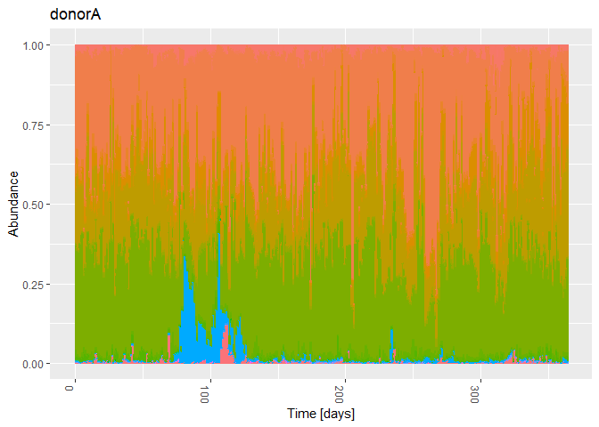
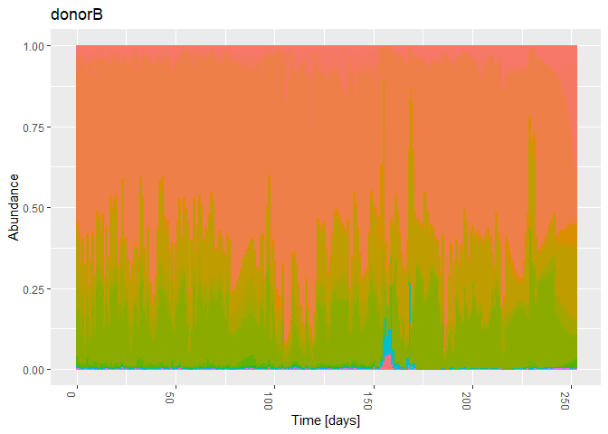
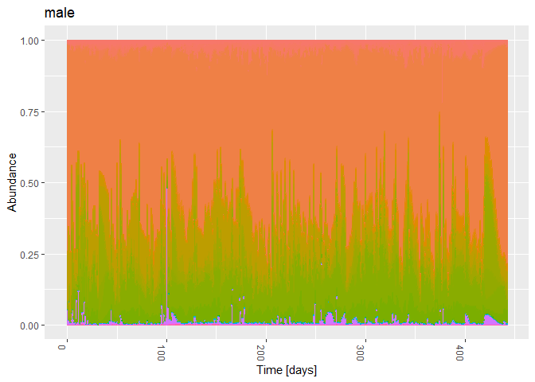
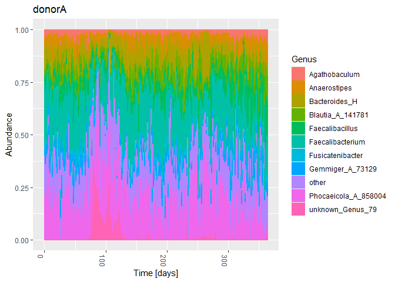
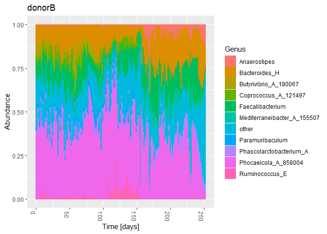
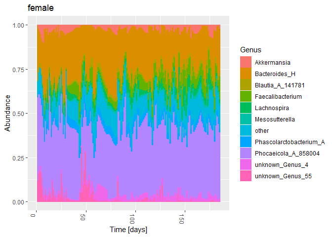

01d-timeseries-HumanGutData-Karwowska-paper
================
Compiled at 2023-10-11 16:42:55 UTC

``` r
here::i_am(paste0(params$name, ".Rmd"), uuid = "4435c437-d4bf-4c0c-a851-45bef7011c59")
```

The purpose of this document is to import the four human gut microbiome
time series datasets that were already pre-processed in the paper “”
from Karwowska et.al.

``` r
library("conflicted")
library(tidyverse)
library(data.table)
library(phyloseq)
library(microViz)
```

``` r
# create or *empty* the target directory, used to write this file's data: 
projthis::proj_create_dir_target(params$name, clean = TRUE)

# function to get path to target directory: path_target("sample.csv")
path_target <- projthis::proj_path_target(params$name)

# function to get path to previous data: path_source("00-import", "sample.csv")
path_source <- projthis::proj_path_source(params$name)
```

## Read data sets

``` r
# set path to the folder where the data files are in
filepath_data <- 
  "C:/Users/Maria/Documents/Masterstudium/Masterarbeit/Literatur/Code/dynamo/data/data/"

# vector of all four subject names
four_subjects <-
  c("donorA", "donorB", "male", "female")

# read data files (otu tables - interpolated)
# extract abundance info into otu_table and Time info into sample_table
for(subject in four_subjects){
  tmp_dt <- 
    fread(paste0(filepath_data, "ready_files/", subject,
                 "_rarefied_18000_interpolated_pchip.tsv"),
          header = T)
  # write sample names in format "ID-001"
  tmp_names <- 
    sprintf("ID-%03d", as.numeric(colnames(tmp_dt)[2:length(tmp_dt)]))

  # create sample info table with columns "SampleID" and "Time"
  tmp_sample <-
    data.table(SampleID = tmp_names,
               Time = as.numeric(colnames(tmp_dt)[2:length(tmp_dt)]))
  
  # update sample names in otu table
  colnames(tmp_dt)[2:length(tmp_dt)] <- tmp_names
  tmp_otu <-
    as.matrix(tmp_dt, rownames = 1) %>% 
    otu_table(taxa_are_rows = T)
  
  assign(paste0("otu_", subject),
         tmp_otu) 
  assign(paste0("sample_", subject),
         tmp_sample)
}

# read taxonomic tables
for(subject in four_subjects){
  if(subject %in% c("donorA", "donorB")){
    tmp <- 
      fread(paste0(filepath_data, "taxonomy/2202_taxonomy.tsv"), header = T)
  } else {
    tmp <- 
      fread(paste0(filepath_data, "taxonomy/", subject, "_taxonomy.tsv"), 
            header = T)
  }
  
  tax_cols <-
    c("Kingdom", "Phylum", "Class", "Order", "Family", "Genus", "Species")
  tmp[, (tax_cols) := tstrsplit(Taxon, ";")] %>%
    # remove "d__", "p__", etc. in front of taxonomic ranks
    .[, (tax_cols) := lapply(.SD, sub, pattern = ".*__", replacement = ""),
      .SDcols =  tax_cols] %>%
    # remove columns that contain listed taxonomic ranks and confidence value
    .[, c("Taxon", "Confidence") := NULL]
  # replace NAs with "unknown"
  tmp[is.na(tmp) | tmp == ""] <- "unknown"
  
  assign(paste0("tax_", subject),
         tmp)
}

# read additional metadata for donorA and donorB
metadata <-
  fread(paste0(filepath_data, "raw_files/2202_metadata.tsv"))

# 
metadata_donorAStool <-
  subset(metadata, description == "DonorA Stool") %>% 
  .[!duplicated(collection_day)]
metadata_donorBStool <-
  subset(metadata, description == "DonorB Stool") %>% 
  .[!duplicated(collection_day)]

# add additional metadata for 
sample_donorA <-
  merge(sample_donorA, metadata_donorAStool,
        by.x = "Time", by.y = "collection_day", all.x = T)
sample_donorB <-
  merge(sample_donorB, metadata_donorBStool,
        by.x = "Time", by.y = "collection_day", all.x = T)

# bring sample_data tables in the right format
for(subject in four_subjects) {
  tmp <- get(paste0("sample_", subject)) %>%
    tibble::column_to_rownames("SampleID")
  
  assign(paste0("sample_", subject), sample_data(tmp))
}
```

## Make Phyloseq

``` r
# make phyloseq objects out of otu and tax tables

for(subject in four_subjects){
  tmp_tax <- 
    get(paste0("tax_", subject)) %>%
    tibble::column_to_rownames("Feature ID") %>%
    as.matrix() %>%
    tax_table()

  assign(paste0("ps_", subject),
         phyloseq(get(paste0("otu_", subject)),
                  tmp_tax,
                  get(paste0("sample_", subject))))
}
```

<!-- ```{r} -->
<!-- # summarize number of unique levels are available for each taxonomic rank -->
<!-- # (for overview table) -->
<!-- for(subject in four_subjects){ -->
<!--   cat("----------------------------------") -->
<!--   cat("\n") -->
<!--   cat(subject, "\n") -->
<!--   cat("----------------------------------\n") -->
<!--   for(tax_rank in c("Kingdom", "Phylum", "Class", "Order", "Family", "Genus", "Species")) { -->
<!--     cat(tax_rank, ": \t") -->
<!--     cat(" uniqueN:   ", tax_table(get(paste0("ps_", subject)))[, tax_rank] %>% uniqueN(), "\n") -->
<!--     cat("\t\t NAs:       ", (sum(tax_table(get(paste0("ps_", subject)))[, tax_rank] == "unknown")), "\n") -->
<!--   } -->
<!--   cat("\n") -->
<!-- } -->
<!-- ``` -->

## Rename unknown taxonomic ranks

For Species/Genus/etc. were the name is unknown, we set the to
“unknown_Level_count”, where Level is the taxonomic level and count
counts threw the number of unknowns at this rank. In the Species column
for example the unknowns would have names like “unknown_Species_1”,
“unknown_Species_2”, etc.

``` r
for(subject in four_subjects){
  physeq <- get(paste0("ps_", subject))

  # Access the taxonomy table from the phyloseq object
  taxonomy_table <- tax_table(physeq)
  
  # Function to rename unknown taxa at a specific level
  rename_unknown_taxa <- function(taxonomy, level) {
    unknown_taxa <- grepl("unknown", taxonomy[, level], ignore.case = TRUE)
    num_unknown_taxa <- sum(unknown_taxa)
    renamed_taxa <- character(num_unknown_taxa)
    
    for (i in 1:num_unknown_taxa) {
      renamed_taxa[i] <- paste("unknown_", level, "_", i, sep = "")
    }
    
    taxonomy[unknown_taxa, level] <- renamed_taxa
    return(taxonomy)
  }
  
  # List of taxonomic levels to rename
  taxonomic_levels <- c("Kingdom", "Phylum", "Class", "Order", "Family", "Genus", "Species")
  
  # Iterate through taxonomic levels and rename unknown taxa
  for (level in taxonomic_levels) {
    taxonomy_table <- rename_unknown_taxa(taxonomy_table, level)
  }
  
  # Assign the updated taxonomy table back to the phyloseq object
  tax_table(physeq) <- taxonomy_table
  
  # Assign phyloseq object back to original ps
  assign(paste0("ps_", subject), physeq)
}
```

## Overview Phyloseq Objects

``` r
ps_donorA
```

    ## phyloseq-class experiment-level object
    ## otu_table()   OTU Table:         [ 1524 taxa and 365 samples ]
    ## sample_data() Sample Data:       [ 365 samples by 57 sample variables ]
    ## tax_table()   Taxonomy Table:    [ 1524 taxa by 7 taxonomic ranks ]

``` r
ps_donorB
```

    ## phyloseq-class experiment-level object
    ## otu_table()   OTU Table:         [ 1569 taxa and 253 samples ]
    ## sample_data() Sample Data:       [ 253 samples by 57 sample variables ]
    ## tax_table()   Taxonomy Table:    [ 1569 taxa by 7 taxonomic ranks ]

``` r
ps_male
```

    ## phyloseq-class experiment-level object
    ## otu_table()   OTU Table:         [ 1253 taxa and 443 samples ]
    ## sample_data() Sample Data:       [ 443 samples by 1 sample variables ]
    ## tax_table()   Taxonomy Table:    [ 1253 taxa by 7 taxonomic ranks ]

``` r
ps_female
```

    ## phyloseq-class experiment-level object
    ## otu_table()   OTU Table:         [ 551 taxa and 185 samples ]
    ## sample_data() Sample Data:       [ 185 samples by 1 sample variables ]
    ## tax_table()   Taxonomy Table:    [ 551 taxa by 7 taxonomic ranks ]

## Transform counts to relative abundances

``` r
ps_donorA_rel_counts <-
  transform_sample_counts(ps_donorA, function(x) x / sum(x) )

ps_donorB_rel_counts <-
  transform_sample_counts(ps_donorB, function(x) x / sum(x) )

ps_male_rel_counts <-
  transform_sample_counts(ps_male, function(x) x / sum(x) )

ps_female_rel_counts <-
  transform_sample_counts(ps_female, function(x) x / sum(x) )
```

## Plot Phyloseq objects (relative counts) on Family level

``` r
# plot all subjects on Family level
for(subject in four_subjects){
  plt_tmp <-
    plot_bar(get(paste0("ps_", subject, "_rel_counts")),
             x = "Time", fill = "Family") +
    theme(legend.position = "none") +
    labs(title = subject,
         x = "Time [days]") +
    geom_bar(aes(color = Family, fill = Family),
             stat = "identity",
             position = "stack")
  print(plt_tmp)
}
```

<!-- --><!-- --><!-- --><!-- -->

## Save Phyloseq Objects

``` r
for(subject in four_subjects){
  # save ps with absolute counts
  saveRDS(get(paste0("ps_", subject)),
          path_target(paste0("ps_", subject, ".rds")))
  # save ps with relative counts
  saveRDS(get(paste0("ps_", subject, "_rel_counts")),
          path_target(paste0("ps_", subject, "_rel_counts.rds")))
}
```

## Summarize over 10 most abundant Genera

### Check what the most abundant taxa are

``` r
for(subject in four_subjects){
  ps_tmp <- get(paste0("ps_", subject))
  
  data <-
    ps_tmp %>% 
    psmelt() %>%
    as_tibble()
  
  # get Genera with highest abundance (sum over all Counts for each Genus)
  most_abundant_genera <-
    data %>%
      group_by(Genus) %>%
      summarise(Sum_Abundance = sum(Abundance)) %>% # another possible criteria would be mean(Abundance)
      arrange(-Sum_Abundance) %>%
      .[1:10, "Genus"] %>% 
    as.vector()

  # Rename genera that are not in most_abundant_genera to "other"
  ps_tmp <- ps_tmp %>%
    tax_mutate(Genus = if_else(
      Genus %in% most_abundant_genera$Genus,
      as.character(Genus),
      "other"
    ))
  
  # select only Genus and Species column of tax_table
  tax_table(ps_tmp) <- tax_table(ps_tmp)[, c("Genus", "Species")]
  
  ps_tmp <- ps_tmp %>%
    # summarize over tax level, include NAs
    tax_glom(taxrank = "Genus", NArm = FALSE) %>%
    speedyseq::transmute_tax_table(Genus, .otu = Genus)

  assign(paste0("ps_", subject, "_Genus_10_most_abundant"),
         ps_tmp)
}
```

### Transform counts to relative abundances

``` r
ps_donorA_Genus_10_most_abundant_rel_counts <-
  transform_sample_counts(ps_donorA_Genus_10_most_abundant,
                          function(x) x / sum(x) )

ps_donorB_Genus_10_most_abundant_rel_counts <-
  transform_sample_counts(ps_donorB_Genus_10_most_abundant,
                          function(x) x / sum(x) )

ps_male_Genus_10_most_abundant_rel_counts <-
  transform_sample_counts(ps_male_Genus_10_most_abundant,
                          function(x) x / sum(x) )

ps_female_Genus_10_most_abundant_rel_counts <-
  transform_sample_counts(ps_female_Genus_10_most_abundant, 
                          function(x) x / sum(x) )
```

### Plot Phyloseq objects (relative counts)

``` r
# plot all subjects on Family level
for(subject in four_subjects){
  plt_tmp <-
    plot_bar(get(paste0("ps_", subject, "_Genus_10_most_abundant_rel_counts")),
             x = "Time", fill = "Genus") +
    # theme(legend.position = "none") +
    labs(title = subject,
         x = "Time [days]") +
    geom_bar(aes(color = Genus, fill = Genus),
             stat = "identity",
             position = "stack")
  print(plt_tmp)
}
```

<!-- --><!-- --><!-- --><!-- -->

### Save these time series as csv files

``` r
for(subject in four_subjects) { 
  
  # get the tmp phyloseq object
  ps_tmp <- get(paste0("ps_", subject, "_Genus_10_most_abundant"))
  
  ps_tmp <- subset_taxa(ps_tmp, !grepl("other", taxa_names(ps_tmp)))
  
  if(taxa_are_rows(ps_tmp)) {
    otu_tmp <- t(otu_table(ps_tmp))
  } else {
    otu_tmp <- otu_table(ps_tmp)
  }
  # combine count data with time information
  ts_tmp <-
    cbind(sample_data(ps_tmp)[, "Time"],
          otu_tmp)
  
  # save time series as csv file
  write.csv(
    ts_tmp,
    path_target(paste0("ts_", subject, "_Genus_10_most_abundant.csv")),
    row.names = F
  )
}
```

``` r
for(subject in four_subjects) { 
  
  # get the tmp phyloseq object
  ps_tmp <- get(paste0("ps_", subject, "_Genus_10_most_abundant_rel_counts"))
  
  if(taxa_are_rows(ps_tmp)) {
    otu_tmp <- t(otu_table(ps_tmp))
  } else {
    otu_tmp <- otu_table(ps_tmp)
  }
  # combine count data with time information
  ts_tmp <-
    cbind(sample_data(ps_tmp)[, "Time"],
          otu_tmp)
  print(head(ts_tmp))
  
  # save time series as csv file
  write.csv(
    ts_tmp,
    path_target(paste0("ts_", subject, "_Genus_10_most_abundant_rel_counts.csv")),
    row.names = F
  )
}
```

    ##        Time Phocaeicola_A_858004 Faecalibacterium Gemmiger_A_73129 Anaerostipes
    ## ID-000    0            0.2157222        0.2991667       0.02783333   0.03244444
    ## ID-001    1            0.1967222        0.2684444       0.05505556   0.06316667
    ## ID-002    2            0.2342222        0.2695000       0.05750000   0.04922222
    ## ID-003    3            0.2635105        0.3058140       0.04933555   0.03875969
    ## ID-004    4            0.2787222        0.3388333       0.04250000   0.03377778
    ## ID-005    5            0.2579444        0.2967778       0.07561111   0.04666667
    ##        Fusicatenibacter Blautia_A_141781 Faecalibacillus Bacteroides_H
    ## ID-000       0.01633333       0.03066667     0.029777778    0.12177778
    ## ID-001       0.02583333       0.04355556     0.050111111    0.10583333
    ## ID-002       0.02200000       0.03633333     0.037833333    0.10150000
    ## ID-003       0.01771872       0.03859358     0.018549280    0.09501661
    ## ID-004       0.01472222       0.04116667     0.006222222    0.08644444
    ## ID-005       0.01361111       0.02788889     0.014722222    0.07105556
    ##            other Agathobaculum unknown_Genus_79
    ## ID-000 0.1892222    0.03633333     0.0007222222
    ## ID-001 0.1661111    0.02477778     0.0003888889
    ## ID-002 0.1577778    0.03388889     0.0002222222
    ## ID-003 0.1444075    0.02812846     0.0001661130
    ## ID-004 0.1356111    0.02183333     0.0001666667
    ## ID-005 0.1747222    0.02061111     0.0003888889
    ##        Time Phocaeicola_A_858004 Anaerostipes Faecalibacterium
    ## ID-000    0            0.3682222 0.0041666667       0.08688889
    ## ID-001    1            0.3924444 0.0013333333       0.11244444
    ## ID-002    2            0.4950556 0.0005555556       0.07538889
    ## ID-003    3            0.4468333 0.0027777778       0.10922222
    ## ID-004    4            0.4987778 0.0002777778       0.02944444
    ## ID-005    5            0.3799444 0.0018333333       0.08116667
    ##        Coprococcus_A_121497 Mediterraneibacter_A_155507 Butyrivibrio_A_180067
    ## ID-000          0.013277778                 0.004722222            0.07505556
    ## ID-001          0.025888889                 0.003222222            0.05338889
    ## ID-002          0.016944444                 0.001722222            0.07238889
    ## ID-003          0.017611111                 0.002222222            0.08883333
    ## ID-004          0.007055556                 0.001222222            0.14300000
    ## ID-005          0.026888889                 0.005777778            0.06394444
    ##        Bacteroides_H     other Phascolarctobacterium_A Paramuribaculum
    ## ID-000    0.09422222 0.3004444              0.02205556      0.03094444
    ## ID-001    0.14433333 0.2133333              0.03116667      0.02244444
    ## ID-002    0.14055556 0.1435556              0.02211111      0.03172222
    ## ID-003    0.09738889 0.1832222              0.02188889      0.03000000
    ## ID-004    0.11527778 0.1456111              0.02561111      0.03283333
    ## ID-005    0.10927778 0.2663889              0.02705556      0.03455556
    ##        Ruminococcus_E
    ## ID-000   0.0000000000
    ## ID-001   0.0000000000
    ## ID-002   0.0000000000
    ## ID-003   0.0000000000
    ## ID-004   0.0008888889
    ## ID-005   0.0031666667
    ##        Time Phocaeicola_A_858004 Bacteroides_H Faecalibacterium Paramuribaculum
    ## ID-000    0            0.4481111     0.2770556     0.0002222222    0.0001111111
    ## ID-001    1            0.3461667     0.2896667     0.0008888889    0.0002777778
    ## ID-002    2            0.3482222     0.3178333     0.0002777778    0.0071666667
    ## ID-003    3            0.3992778     0.3072222     0.0068333333    0.0006111111
    ## ID-004    4            0.1964444     0.1650556     0.0160000000    0.0043333333
    ## ID-005    5            0.2381111     0.0895000     0.0231111111    0.0040555556
    ##        Lachnospira     other Parabacteroides_B_862066 Phascolarctobacterium_A
    ## ID-000 0.021222222 0.2414444             0.0000000000              0.01066667
    ## ID-001 0.025666667 0.3237222             0.0000000000              0.01155556
    ## ID-002 0.015777778 0.2963889             0.0000000000              0.01244444
    ## ID-003 0.035888889 0.2141667             0.0000000000              0.03105556
    ## ID-004 0.009388889 0.5340000             0.0000000000              0.01355556
    ## ID-005 0.002833333 0.4084444             0.0008888889              0.01505556
    ##        Ruminococcus_E Gemmiger_A_73129   Prevotella
    ## ID-000              0     0.0006666667 0.0005000000
    ## ID-001              0     0.0015000000 0.0005555556
    ## ID-002              0     0.0017777778 0.0001111111
    ## ID-003              0     0.0049444444 0.0000000000
    ## ID-004              0     0.0097777778 0.0514444444
    ## ID-005              0     0.0045000000 0.2135000000
    ##        Time Phocaeicola_A_858004 Faecalibacterium Bacteroides_H Lachnospira
    ## ID-001    1            0.4736111      0.000000000     0.3084444 0.000000000
    ## ID-002    2            0.4369819      0.000000000     0.2303944 0.000000000
    ## ID-003    3            0.4102244      0.000000000     0.1809680 0.000000000
    ## ID-004    4            0.3877222      0.000000000     0.1692222 0.000000000
    ## ID-005    5            0.3842705      0.001549701     0.1911667 0.002490591
    ## ID-006    6            0.3922424      0.006398641     0.2334655 0.008720272
    ##        unknown_Genus_4 Phascolarctobacterium_A Mesosutterella Blautia_A_141781
    ## ID-001    0.0005555556            0.0003333333              0      0.007444444
    ## ID-002    0.0124915976            0.0085144522              0      0.017196953
    ## ID-003    0.0207435956            0.0185898889              0      0.023067332
    ## ID-004    0.0232222222            0.0293888889              0      0.024555556
    ## ID-005    0.0198140359            0.0458268762              0      0.019592650
    ## ID-006    0.0140430351            0.0659116648              0      0.011155153
    ##        Akkermansia unknown_Genus_55      other
    ## ID-001 0.001722222       0.11950000 0.08838889
    ## ID-002 0.019101501       0.15942191 0.11589738
    ## ID-003 0.036613013       0.17734074 0.13245296
    ## ID-004 0.052555556       0.17683333 0.13650000
    ## ID-005 0.072061103       0.14312597 0.12010184
    ## ID-006 0.093657984       0.07893545 0.09546999

## Files written

These files have been written to the target directory,
`data/01d-timeseries-HumanGutData-Karwowska-paper`:

``` r
projthis::proj_dir_info(path_target())
```

    ## # A tibble: 16 × 4
    ##    path                                        type     size modification_time  
    ##    <fs::path>                                  <fct> <fs::b> <dttm>             
    ##  1 ps_donorA.rds                               file  188.94K 2023-10-11 16:48:17
    ##  2 ps_donorA_rel_counts.rds                    file  258.04K 2023-10-11 16:48:17
    ##  3 ps_donorB.rds                               file   164.2K 2023-10-11 16:48:17
    ##  4 ps_donorB_rel_counts.rds                    file   210.4K 2023-10-11 16:48:17
    ##  5 ps_female.rds                               file   68.39K 2023-10-11 16:48:18
    ##  6 ps_female_rel_counts.rds                    file   89.98K 2023-10-11 16:48:18
    ##  7 ps_male.rds                                 file  221.51K 2023-10-11 16:48:17
    ##  8 ps_male_rel_counts.rds                      file   299.9K 2023-10-11 16:48:18
    ##  9 ts_donorA_Genus_10_most_abundant.csv        file   16.97K 2023-10-11 16:49:00
    ## 10 …norA_Genus_10_most_abundant_rel_counts.csv file   70.05K 2023-10-11 16:49:00
    ## 11 ts_donorB_Genus_10_most_abundant.csv        file   10.75K 2023-10-11 16:49:00
    ## 12 …norB_Genus_10_most_abundant_rel_counts.csv file   42.34K 2023-10-11 16:49:00
    ## 13 ts_female_Genus_10_most_abundant.csv        file    8.39K 2023-10-11 16:49:00
    ## 14 …male_Genus_10_most_abundant_rel_counts.csv file   34.78K 2023-10-11 16:49:00
    ## 15 ts_male_Genus_10_most_abundant.csv          file   19.92K 2023-10-11 16:49:00
    ## 16 …male_Genus_10_most_abundant_rel_counts.csv file   83.81K 2023-10-11 16:49:00
