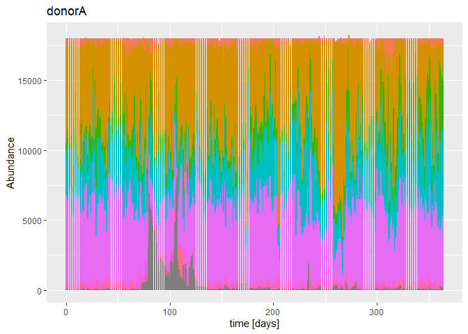
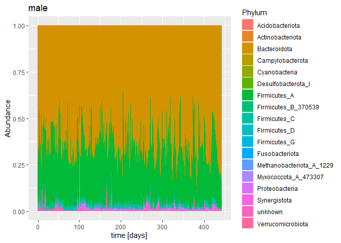
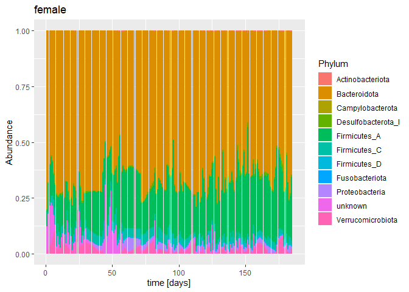
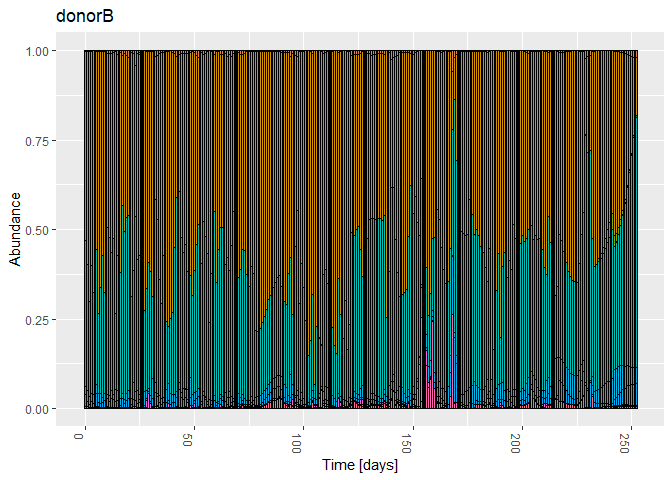
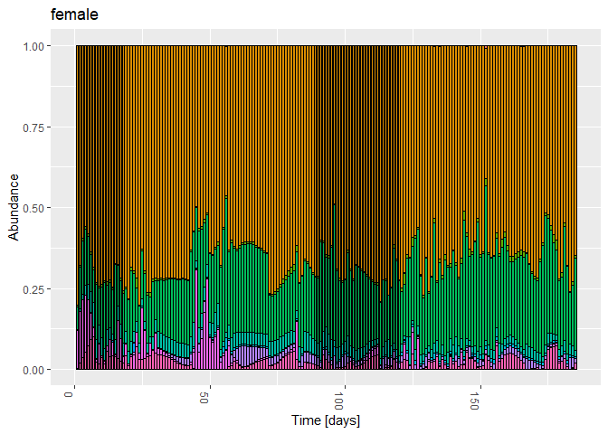

01d-timeseries-HumanGutData-Karwowska-paper
================
Compiled at 2023-08-24 07:13:58 UTC

``` r
here::i_am(paste0(params$name, ".Rmd"), uuid = "4435c437-d4bf-4c0c-a851-45bef7011c59")
```

The purpose of this document is to import the four human gut microbiome
time series datasets that were already pre-processed in the paper “”
from Karwowska et.al.

``` r
library("conflicted")
library(tidyverse)
library(data.table)
library(phyloseq)
library(microViz)
```

``` r
# create or *empty* the target directory, used to write this file's data: 
projthis::proj_create_dir_target(params$name, clean = TRUE)

# function to get path to target directory: path_target("sample.csv")
path_target <- projthis::proj_path_target(params$name)

# function to get path to previous data: path_source("00-import", "sample.csv")
path_source <- projthis::proj_path_source(params$name)
```

## Read data sets

``` r
# set path to the folder where the data files are in
filepath_data <- 
  "C:/Users/Maria/Documents/Masterstudium/Masterarbeit/Literatur/Code/dynamo/data/data/"

# vector of all four subject names
four_subjects <-
  c("donorA", "donorB", "male", "female")

# read data files (otu tables - interpolated)
for(subject in four_subjects){
  tmp <- 
    as.matrix(fread(paste0(filepath_data, "ready_files/", subject,
                      "_rarefied_18000_interpolated_pchip.tsv"),
               header = T), rownames = 1) %>% 
    otu_table(taxa_are_rows = T)
  
  assign(paste0("otu_", subject),
         tmp)
}

# read taxonomic tables
for(subject in four_subjects){
  if(subject %in% c("donorA", "donorB")){
    tmp <- 
      fread(paste0(filepath_data, "taxonomy/2202_taxonomy.tsv"), header = T)
  } else {
    tmp <- 
      fread(paste0(filepath_data, "taxonomy/", subject, "_taxonomy.tsv"), 
            header = T)
  }
  
  tax_cols <-
    c("Kingdom", "Phylum", "Class", "Order", "Family", "Genus", "Species")
  tmp[, (tax_cols) := tstrsplit(Taxon, ";")] %>%
    # remove "d__", "p__", etc. in front of taxonomic ranks
    .[, (tax_cols) := lapply(.SD, sub, pattern = ".*__", replacement = ""),
      .SDcols =  tax_cols] %>%
    # remove columns that contain listed taxonomic ranks and confidence value
    .[, c("Taxon", "Confidence") := NULL]
  # replace NAs with "unknown"
  tmp[is.na(tmp)] <- "unknown"
  
  assign(paste0("tax_", subject),
         tmp)
}

# read metadata
metadata <-
  fread(paste0(filepath_data, "raw_files/2202_metadata.tsv"))

# # set time for sample data
# for(subject in four_subjects){
#   tmp <- colnames(get(paste0("otu_", subject))) %>% 
#     data.frame(ID = ., Time = as.numeric(.)) %>% 
#     tibble::column_to_rownames("ID")
#   assign(paste0("sample_", subject),
#          tmp)
# }
```

## Make Phyloseq

``` r
# make phyloseq objects out of otu and tax tables

for(subject in four_subjects){
  tmp_tax <- 
    get(paste0("tax_", subject)) %>%
    tibble::column_to_rownames("Feature ID") %>%
    as.matrix() %>%
    tax_table()

  assign(paste0("ps_", subject),
         phyloseq(get(paste0("otu_", subject)),
                  tmp_tax))
}
```

``` r
ps_donorA
```

    ## phyloseq-class experiment-level object
    ## otu_table()   OTU Table:         [ 1524 taxa and 365 samples ]
    ## tax_table()   Taxonomy Table:    [ 1524 taxa by 7 taxonomic ranks ]

``` r
ps_donorB
```

    ## phyloseq-class experiment-level object
    ## otu_table()   OTU Table:         [ 1569 taxa and 253 samples ]
    ## tax_table()   Taxonomy Table:    [ 1569 taxa by 7 taxonomic ranks ]

``` r
ps_male
```

    ## phyloseq-class experiment-level object
    ## otu_table()   OTU Table:         [ 1253 taxa and 443 samples ]
    ## tax_table()   Taxonomy Table:    [ 1253 taxa by 7 taxonomic ranks ]

``` r
ps_female
```

    ## phyloseq-class experiment-level object
    ## otu_table()   OTU Table:         [ 551 taxa and 185 samples ]
    ## tax_table()   Taxonomy Table:    [ 551 taxa by 7 taxonomic ranks ]

## Transform counts to relative abundances

``` r
ps_donorA <-
  transform_sample_counts(ps_donorA, function(x) x / sum(x) )

ps_donorB <-
  transform_sample_counts(ps_donorB, function(x) x / sum(x) )

ps_male <-
  transform_sample_counts(ps_male, function(x) x / sum(x) )

ps_female <-
  transform_sample_counts(ps_female, function(x) x / sum(x) )
```

## Plot Phyloseq

``` r
# bar plot phyloseq objects
for(subject in four_subjects){
  plt_tmp <-
    ggplot(psmelt(get(paste0("ps_", subject))),
           aes(as.numeric(Sample), Abundance, fill = Phylum)) +
    geom_bar(stat = "identity")  +
    # theme(legend.position = "none") +
    labs(title = subject,
         x = "time [days]")
  print(plt_tmp)
}
```

<!-- --><!-- --><!-- --><!-- -->

``` r
# # alternative way of plotting
# for(subject in four_subjects){
#   plt_tmp <-
#     plot_bar(get(paste0("ps_", subject)), x = "as.numeric(Sample)", fill = "Family") +
#     theme(legend.position = "none") +
#     labs(title = subject,
#          x = "Time [days]")
#   print(plt_tmp)
# }
```

## Summarize counts per taxonomic level

Aggregate the timeseries by summarizing counts over a taxonomic level.

### Pyhlum level

``` r
tax_level = "Phylum"

for(subject in four_subjects){
  tmp_ps <-
    get(paste0("ps_", subject)) %>%
    # summarize over Phylum, include NAs
    tax_glom(taxrank = tax_level, NArm = FALSE) %>% 
    # tax_fix(sep = "_") %>% 
    speedyseq::transmute_tax_table(Kingdom, Phylum, .otu = get(tax_level))
  
  assign(paste0("ps_", subject, "_", tax_level),
         tmp_ps)
}
```

``` r
# bar plot phyloseq objects
for(subject in four_subjects){
# subject = "female"
  plt_tmp <-
    plot_bar(get(paste0("ps_", subject, "_", tax_level)),
             x = "as.numeric(Sample)",
             fill = tax_level) +
    theme(legend.position = "none") +
    labs(title = subject,
         x = "Time [days]")
  print(plt_tmp)
}
```

<!-- --><!-- --><!-- --><!-- -->

``` r
ps_donorA_Phylum
```

    ## phyloseq-class experiment-level object
    ## otu_table()   OTU Table:          [ 27 taxa and 365 samples ]:
    ## tax_table()   Taxonomy Table:     [ 27 taxa by 2 taxonomic ranks ]:
    ## taxa are rows

``` r
ps_donorB_Phylum
```

    ## phyloseq-class experiment-level object
    ## otu_table()   OTU Table:          [ 25 taxa and 253 samples ]:
    ## tax_table()   Taxonomy Table:     [ 25 taxa by 2 taxonomic ranks ]:
    ## taxa are rows

``` r
ps_male_Phylum
```

    ## phyloseq-class experiment-level object
    ## otu_table()   OTU Table:          [ 18 taxa and 443 samples ]:
    ## tax_table()   Taxonomy Table:     [ 18 taxa by 2 taxonomic ranks ]:
    ## taxa are rows

``` r
ps_female_Phylum
```

    ## phyloseq-class experiment-level object
    ## otu_table()   OTU Table:          [ 11 taxa and 185 samples ]:
    ## tax_table()   Taxonomy Table:     [ 11 taxa by 2 taxonomic ranks ]:
    ## taxa are rows

### Class level

``` r
tax_level = "Class"

for(subject in four_subjects){
  tmp_ps <-
    get(paste0("ps_", subject)) %>%
    # summarize over Phylum, include NAs
    tax_glom(taxrank = tax_level, NArm = FALSE) %>% 
    tax_fix(sep = "_") %>%
    speedyseq::transmute_tax_table(Kingdom, Phylum, Class, .otu = get(tax_level))
  
  assign(paste0("ps_", subject, "_", tax_level),
         tmp_ps)
}
```

## Save phyloseq objects as csv file

``` r
for(subject in four_subjects) {
  tmp_output <-
    t(otu_table(get(paste0("ps_", subject, "_Phylum"))))
  write.csv(
    data.frame(Time = as.numeric(rownames(tmp_output)), tmp_output),
    paste0(
      path_target(),
      "/ts_",
      subject,
      "_Phylumlevel_rel_count.csv"
    ),
    row.names = F
  )
}
```

## Files written

These files have been written to the target directory,
`data/01d-timeseries-HumanGutData-Karwowska-paper`:

``` r
projthis::proj_dir_info(path_target())
```

    ## # A tibble: 4 × 4
    ##   path                                type         size modification_time  
    ##   <fs::path>                          <fct> <fs::bytes> <dttm>             
    ## 1 ts_donorA_Phylumlevel_rel_count.csv file        69.9K 2023-08-24 07:15:07
    ## 2 ts_donorB_Phylumlevel_rel_count.csv file        48.5K 2023-08-24 07:15:07
    ## 3 ts_female_Phylumlevel_rel_count.csv file        31.2K 2023-08-24 07:15:07
    ## 4 ts_male_Phylumlevel_rel_count.csv   file        87.4K 2023-08-24 07:15:07
