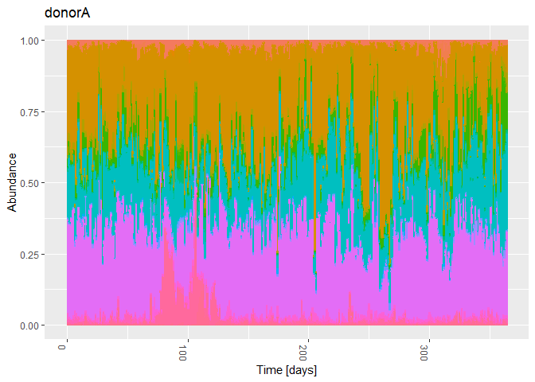
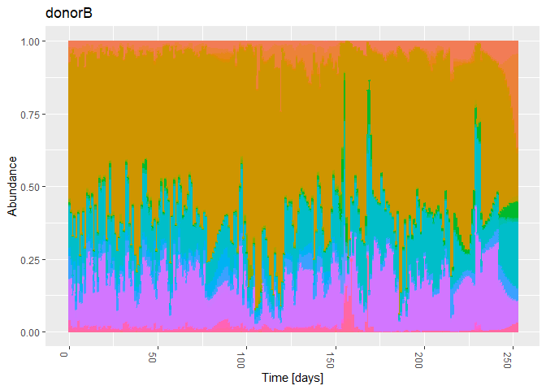
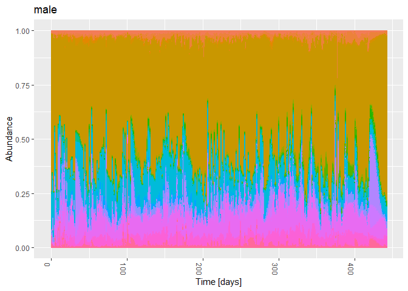
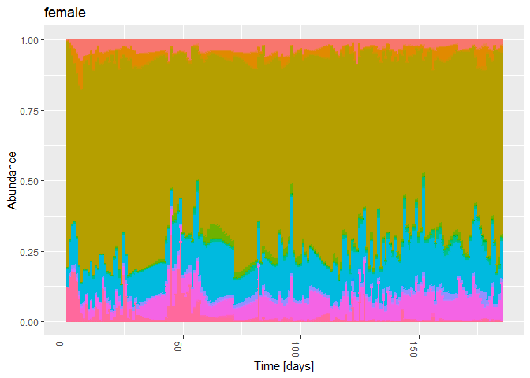

01d-timeseries-HumanGutData-Karwowska-paper
================
Compiled at 2023-09-24 17:55:19 UTC

``` r
here::i_am(paste0(params$name, ".Rmd"), uuid = "4435c437-d4bf-4c0c-a851-45bef7011c59")
```

The purpose of this document is to import the four human gut microbiome
time series datasets that were already pre-processed in the paper “”
from Karwowska et.al.

``` r
library("conflicted")
library(tidyverse)
library(data.table)
library(phyloseq)
library(microViz)
```

``` r
# create or *empty* the target directory, used to write this file's data: 
projthis::proj_create_dir_target(params$name, clean = TRUE)

# function to get path to target directory: path_target("sample.csv")
path_target <- projthis::proj_path_target(params$name)

# function to get path to previous data: path_source("00-import", "sample.csv")
path_source <- projthis::proj_path_source(params$name)
```

## Read data sets

``` r
# set path to the folder where the data files are in
filepath_data <- 
  "C:/Users/Maria/Documents/Masterstudium/Masterarbeit/Literatur/Code/dynamo/data/data/"

# vector of all four subject names
four_subjects <-
  c("donorA", "donorB", "male", "female")

# read data files (otu tables - interpolated)
# extract abundance info into otu_table and Time info into sample_table
for(subject in four_subjects){
  tmp_dt <- 
    fread(paste0(filepath_data, "ready_files/", subject,
                 "_rarefied_18000_interpolated_pchip.tsv"),
          header = T)
  # write sample names in format "ID-001"
  tmp_names <- 
    sprintf("ID-%03d", as.numeric(colnames(tmp_dt)[2:length(tmp_dt)]))

  # create sample info table with columns "SampleID" and "Time"
  tmp_sample <-
    data.table(SampleID = tmp_names,
               Time = as.numeric(colnames(tmp_dt)[2:length(tmp_dt)]))
  
  # update sample names in otu table
  colnames(tmp_dt)[2:length(tmp_dt)] <- tmp_names
  tmp_otu <-
    as.matrix(tmp_dt, rownames = 1) %>% 
    otu_table(taxa_are_rows = T)
  
  assign(paste0("otu_", subject),
         tmp_otu) 
  assign(paste0("sample_", subject),
         tmp_sample)
}

# read taxonomic tables
for(subject in four_subjects){
  if(subject %in% c("donorA", "donorB")){
    tmp <- 
      fread(paste0(filepath_data, "taxonomy/2202_taxonomy.tsv"), header = T)
  } else {
    tmp <- 
      fread(paste0(filepath_data, "taxonomy/", subject, "_taxonomy.tsv"), 
            header = T)
  }
  
  tax_cols <-
    c("Kingdom", "Phylum", "Class", "Order", "Family", "Genus", "Species")
  tmp[, (tax_cols) := tstrsplit(Taxon, ";")] %>%
    # remove "d__", "p__", etc. in front of taxonomic ranks
    .[, (tax_cols) := lapply(.SD, sub, pattern = ".*__", replacement = ""),
      .SDcols =  tax_cols] %>%
    # remove columns that contain listed taxonomic ranks and confidence value
    .[, c("Taxon", "Confidence") := NULL]
  # replace NAs with "unknown"
  tmp[is.na(tmp)] <- "unknown"
  
  assign(paste0("tax_", subject),
         tmp)
}

# read additional metadata for donorA and donorB
metadata <-
  fread(paste0(filepath_data, "raw_files/2202_metadata.tsv"))

# 
metadata_donorAStool <-
  subset(metadata, description == "DonorA Stool") %>% 
  .[!duplicated(collection_day)]
metadata_donorBStool <-
  subset(metadata, description == "DonorB Stool") %>% 
  .[!duplicated(collection_day)]

# add additional metadata for 
sample_donorA <-
  merge(sample_donorA, metadata_donorAStool,
        by.x = "Time", by.y = "collection_day", all.x = T)
sample_donorB <-
  merge(sample_donorB, metadata_donorBStool,
        by.x = "Time", by.y = "collection_day", all.x = T)

# bring sample_data tables in the right format
for(subject in four_subjects) {
  tmp <- get(paste0("sample_", subject)) %>%
    tibble::column_to_rownames("SampleID")
  
  assign(paste0("sample_", subject), sample_data(tmp))
}
```

## Make Phyloseq

``` r
# make phyloseq objects out of otu and tax tables

for(subject in four_subjects){
  tmp_tax <- 
    get(paste0("tax_", subject)) %>%
    tibble::column_to_rownames("Feature ID") %>%
    as.matrix() %>%
    tax_table()

  assign(paste0("ps_", subject),
         phyloseq(get(paste0("otu_", subject)),
                  tmp_tax,
                  get(paste0("sample_", subject))))
}
```

<!-- ```{r} -->
<!-- # summarize number of unique levels are available for each taxonomic rank -->
<!-- # (for overview table) -->
<!-- for(subject in four_subjects){ -->
<!--   cat("----------------------------------") -->
<!--   cat("\n") -->
<!--   cat(subject, "\n") -->
<!--   cat("----------------------------------\n") -->
<!--   for(tax_rank in c("Kingdom", "Phylum", "Class", "Order", "Family", "Genus", "Species")) { -->
<!--     cat(tax_rank, ": \t") -->
<!--     cat(" uniqueN:   ", tax_table(get(paste0("ps_", subject)))[, tax_rank] %>% uniqueN(), "\n") -->
<!--     cat("\t\t NAs:       ", (sum(tax_table(get(paste0("ps_", subject)))[, tax_rank] == "unknown")), "\n") -->
<!--   } -->
<!--   cat("\n") -->
<!-- } -->
<!-- ``` -->

## Overview Phyloseq Objects

``` r
ps_donorA
```

    ## phyloseq-class experiment-level object
    ## otu_table()   OTU Table:         [ 1524 taxa and 365 samples ]
    ## sample_data() Sample Data:       [ 365 samples by 57 sample variables ]
    ## tax_table()   Taxonomy Table:    [ 1524 taxa by 7 taxonomic ranks ]

``` r
ps_donorB
```

    ## phyloseq-class experiment-level object
    ## otu_table()   OTU Table:         [ 1569 taxa and 253 samples ]
    ## sample_data() Sample Data:       [ 253 samples by 57 sample variables ]
    ## tax_table()   Taxonomy Table:    [ 1569 taxa by 7 taxonomic ranks ]

``` r
ps_male
```

    ## phyloseq-class experiment-level object
    ## otu_table()   OTU Table:         [ 1253 taxa and 443 samples ]
    ## sample_data() Sample Data:       [ 443 samples by 1 sample variables ]
    ## tax_table()   Taxonomy Table:    [ 1253 taxa by 7 taxonomic ranks ]

``` r
ps_female
```

    ## phyloseq-class experiment-level object
    ## otu_table()   OTU Table:         [ 551 taxa and 185 samples ]
    ## sample_data() Sample Data:       [ 185 samples by 1 sample variables ]
    ## tax_table()   Taxonomy Table:    [ 551 taxa by 7 taxonomic ranks ]

## Transform counts to relative abundances

``` r
ps_donorA_rel_counts <-
  transform_sample_counts(ps_donorA, function(x) x / sum(x) )

ps_donorB_rel_counts <-
  transform_sample_counts(ps_donorB, function(x) x / sum(x) )

ps_male_rel_counts <-
  transform_sample_counts(ps_male, function(x) x / sum(x) )

ps_female_rel_counts <-
  transform_sample_counts(ps_female, function(x) x / sum(x) )
```

## Plot Phyloseq objects (relative counts)

``` r
# plot all subjects on Family level
for(subject in four_subjects){
  plt_tmp <-
    plot_bar(get(paste0("ps_", subject, "_rel_counts")),
             x = "Time", fill = "Family") +
    theme(legend.position = "none") +
    labs(title = subject,
         x = "Time [days]") +
    geom_bar(aes(color = Family, fill = Family),
             stat = "identity",
             position = "stack")
  print(plt_tmp)
}
```

<!-- --><!-- --><!-- --><!-- -->

## Save Phyloseq Objects

``` r
for(subject in four_subjects){
  # save ps with absolute counts
  saveRDS(get(paste0("ps_", subject)),
          path_target(paste0("ps_", subject, ".rds")))
}
```

## Check what the most abundant taxa are

``` r
data <-
  ps_donorA %>% 
  psmelt() %>%
  as_tibble()

# highest abundance: all samples pooled together
data %>%
  group_by(Family) %>%
  summarise(Abundance = max(Abundance)) %>%
  arrange(-Abundance)
```

    ## # A tibble: 140 × 2
    ##    Family                       Abundance
    ##    <chr>                            <int>
    ##  1 Ruminococcaceae                   8132
    ##  2 unknown                           8058
    ##  3 Bacteroidaceae                    6291
    ##  4 Coprobacillaceae                  4933
    ##  5 Lachnospiraceae                   3485
    ##  6 Enterobacteriaceae_A              2898
    ##  7 Pasteurellaceae                   2817
    ##  8 Clostridiaceae_222000             2725
    ##  9 Peptostreptococcaceae_256921      2488
    ## 10 Acutalibacteraceae                2149
    ## # ℹ 130 more rows

``` r
# number of samples with abundance != 0
data %>%
  group_by(Order, Sample) %>%
  summarise(Abundance = sum(Abundance)) %>% 
  group_by(Order) %>% 
  summarise(Abundance = sum(Abundance > 0.0001)) %>%
  arrange(-Abundance)
```

    ## `summarise()` has grouped output by 'Order'. You can override using the
    ## `.groups` argument.

    ## # A tibble: 82 × 2
    ##    Order                Abundance
    ##    <chr>                    <int>
    ##  1 Acidaminococcales          365
    ##  2 Bacteroidales              365
    ##  3 Coriobacteriales           365
    ##  4 Erysipelotrichales         365
    ##  5 Lachnospirales             365
    ##  6 Lactobacillales            365
    ##  7 Oscillospirales            365
    ##  8 unknown                    365
    ##  9 Peptostreptococcales       362
    ## 10 Veillonellales             360
    ## # ℹ 72 more rows

## Files written

These files have been written to the target directory,
`data/01d-timeseries-HumanGutData-Karwowska-paper`:

``` r
projthis::proj_dir_info(path_target())
```

    ## # A tibble: 4 × 4
    ##   path          type         size modification_time  
    ##   <fs::path>    <fct> <fs::bytes> <dttm>             
    ## 1 ps_donorA.rds file       181.8K 2023-09-24 18:00:35
    ## 2 ps_donorB.rds file         156K 2023-09-24 18:00:35
    ## 3 ps_female.rds file        66.6K 2023-09-24 18:00:35
    ## 4 ps_male.rds   file       215.8K 2023-09-24 18:00:35
