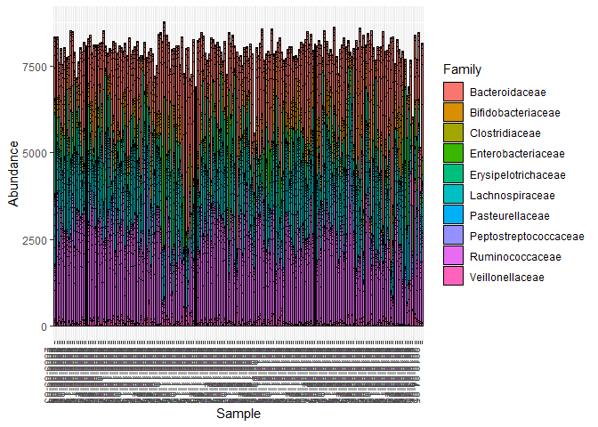
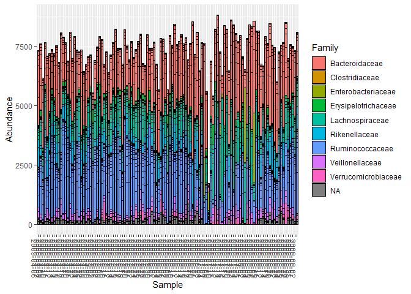

01d-timeseries-HumanGutData
================
Compiled at 2023-06-21 09:00:19 UTC

``` r
here::i_am(paste0(params$name, ".Rmd"), uuid = "ef03442e-6668-45e6-a996-ddeefaf133f7")
```

The purpose of this document is …

## Packages

``` r
library("conflicted")
library(tidyverse)
library(data.table)
library(phyloseq)
```

``` r
# create or *empty* the target directory, used to write this file's data: 
projthis::proj_create_dir_target(params$name, clean = TRUE)

# function to get path to target directory: path_target("sample.csv")
path_target <- projthis::proj_path_target(params$name)

# function to get path to previous data: path_source("00-import", "sample.csv")
path_source <- projthis::proj_path_source(params$name)
```

## Four Datasets from the Gibbons paper

Read the four datasets

- DA (David, Subject A)
- DB (David, Subject B)
- F4 (Caporaso)
- M3 (Caporaso)

from the Gibbons data and transform the time series to a phyloseq
object.

``` r
filepath <- 
  "C:/Users/Maria/Documents/Masterstudium/Masterarbeit/Data/data_files_sVAR/"
```

``` r
dt_count_DA <-
  fread(paste0(filepath, "sparse_var/DA_99_T_int_pchip_t50.txt"), header = T) %>%
  tibble::column_to_rownames("V1")

dt_count_DB <-
  fread(paste0(filepath, "sparse_var/DB_99_T_int_pchip_t50.txt"), header = T) %>%
  tibble::column_to_rownames("V1")

dt_count_F4 <-
  fread(paste0(filepath, "sparse_var/F4_99_T_int_pchip_t50.txt"), header = T) %>%
  tibble::column_to_rownames("V1")

dt_count_M3 <-
  fread(paste0(filepath, "sparse_var/M3_99_T_int_pchip_t50.txt"), header = T) %>%
  tibble::column_to_rownames("V1")


otu_mat_DA <- t(as.matrix(dt_count_DA))
otu_mat_DB <- t(as.matrix(dt_count_DB))
otu_mat_F4 <- t(as.matrix(dt_count_F4))
otu_mat_M3 <- t(as.matrix(dt_count_M3))
```

``` r
# sample format (rownames): 2009-09-03 %Y-%m-%d

dt_meta_DA <-
  fread(paste0(filepath, "data_files/huge.mapping_DA_nodups_filt.txt"), header = T) 

dt_meta_DB <-
  fread(paste0(filepath, "data_files/huge.mapping_DB_nodups_filt.txt"), header = T)

dt_meta_F4 <-
  fread(paste0(filepath, "data_files/david_caporaso_combined_mapping_F4_filt.txt"), header = T)

dt_meta_M3 <-
  fread(paste0(filepath, "data_files/david_caporaso_combined_mapping_fecal_M3_filt.txt"), header = T)


# add date index to sample info data
dt_meta_DA[, DateID := as.Date(str_remove(date, "date"), format = "%m%d%Y")]
dt_meta_DB[, DateID := as.Date(str_remove(date, "date"), format = "%m%d%Y")]

dt_meta_F4[, DateID := as.Date(COLLECTION_DATE, format = "%m/%d/%y")]
dt_meta_M3[, DateID := as.Date(COLLECTION_DATE, format = "%m/%d/%y")]

# set Date to rownames and use only entries that are also present in count table
dt_meta_DA <- 
  dt_meta_DA[DateID %in% as.Date(rownames(dt_count_DA))] %>%
  tibble::column_to_rownames("DateID") 

dt_meta_DB <- 
  dt_meta_DB[DateID %in% as.Date(rownames(dt_count_DB))] %>%
  tibble::column_to_rownames("DateID") 

dt_meta_F4 <- 
  dt_meta_F4[DateID %in% as.Date(rownames(dt_count_F4))] %>%
  tibble::column_to_rownames("DateID") 

dt_meta_M3 <- 
  dt_meta_M3[DateID %in% as.Date(rownames(dt_count_M3))] %>%
  tibble::column_to_rownames("DateID") 
```

``` r
read_tax_table <- function(filename) {
  tmp_data <-
    fread(filename, header = T) %>%
    .[, c("0", "1") := NULL] %>%
    tibble::column_to_rownames("2")
  
  colnames(tmp_data) <-
    c("Kingdom", "Phylum", "Class", "Order", "Family", "Genus", "Species", "color")
  
  tmp_data[] <- lapply(tmp_data, sub, pattern = "[a-z]__", replacement = "")
  
  tmp_data[tmp_data == ""] <- NA 
  
  return(tmp_data)
}

dt_tax_DA <-
  read_tax_table(paste0(filepath, "data_files/da_svar_variance_explained_t50.txt"))

dt_tax_DB <-
  read_tax_table(paste0(filepath, "data_files/db_svar_variance_explained_t50.txt"))

dt_tax_F4 <-
  read_tax_table(paste0(filepath, "data_files/f4_svar_variance_explained_t50.txt"))

dt_tax_M3 <-
  read_tax_table(paste0(filepath, "data_files/m3_svar_variance_explained_t50.txt"))
```

## create phyloseq objects

``` r
# DA
OTU_DA = otu_table(otu_mat_DA, taxa_are_rows = TRUE)
TAX_DA = tax_table(as.matrix(dt_tax_DA))
samples_DA = sample_data(dt_meta_DA)

phylo_DA <- phyloseq(OTU_DA, TAX_DA, samples_DA)

# DB
OTU_DB = otu_table(otu_mat_DB, taxa_are_rows = TRUE)
TAX_DB = tax_table(as.matrix(dt_tax_DB))
samples_DB = sample_data(dt_meta_DB)

phylo_DB <- phyloseq(OTU_DB, TAX_DB, samples_DB)

# F4
OTU_F4 = otu_table(otu_mat_F4, taxa_are_rows = TRUE)
TAX_F4 = tax_table(as.matrix(dt_tax_F4))
samples_F4 = sample_data(dt_meta_F4)

phylo_F4 <- phyloseq(OTU_F4, TAX_F4, samples_F4)

# M3
OTU_M3 = otu_table(otu_mat_M3, taxa_are_rows = TRUE)
TAX_M3 = tax_table(as.matrix(dt_tax_M3))
samples_M3 = sample_data(dt_meta_M3)

phylo_M3 <- phyloseq(OTU_M3, TAX_M3, samples_M3)
```

## Info on phyloseq objects of the four time series

``` r
phylo_DA
```

    ## phyloseq-class experiment-level object
    ## otu_table()   OTU Table:         [ 49 taxa and 189 samples ]
    ## sample_data() Sample Data:       [ 189 samples by 15 sample variables ]
    ## tax_table()   Taxonomy Table:    [ 49 taxa by 8 taxonomic ranks ]

``` r
phylo_DB
```

    ## phyloseq-class experiment-level object
    ## otu_table()   OTU Table:         [ 47 taxa and 115 samples ]
    ## sample_data() Sample Data:       [ 115 samples by 13 sample variables ]
    ## tax_table()   Taxonomy Table:    [ 47 taxa by 8 taxonomic ranks ]

``` r
phylo_F4
```

    ## phyloseq-class experiment-level object
    ## otu_table()   OTU Table:         [ 50 taxa and 131 samples ]
    ## sample_data() Sample Data:       [ 131 samples by 10 sample variables ]
    ## tax_table()   Taxonomy Table:    [ 50 taxa by 8 taxonomic ranks ]

``` r
phylo_M3
```

    ## phyloseq-class experiment-level object
    ## otu_table()   OTU Table:         [ 49 taxa and 332 samples ]
    ## sample_data() Sample Data:       [ 332 samples by 11 sample variables ]
    ## tax_table()   Taxonomy Table:    [ 49 taxa by 8 taxonomic ranks ]

## Plots

``` r
# Basic bar graph based on Division

# DA
plot_bar(phylo_DA, fill = "Family")
```

<!-- -->

``` r
# DB
plot_bar(phylo_DB, fill = "Family")
```

<!-- -->

``` r
# F4
plot_bar(phylo_F4, fill = "Family")
```

<!-- -->

``` r
# M3
plot_bar(phylo_M3, fill = "Family")
```

<!-- -->

## Files written

These files have been written to the target directory,
`data/01d-timeseries-HumanGutData`:

``` r
projthis::proj_dir_info(path_target())
```

    ## # A tibble: 0 × 4
    ## # ℹ 4 variables: path <fs::path>, type <fct>, size <fs::bytes>,
    ## #   modification_time <dttm>
