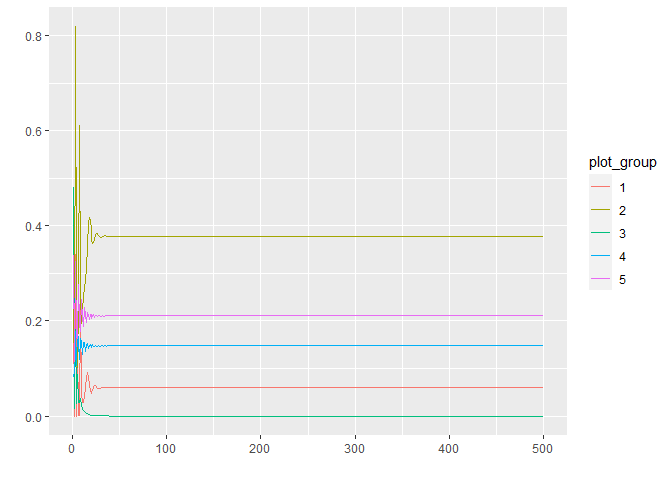
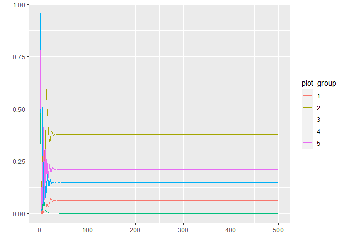
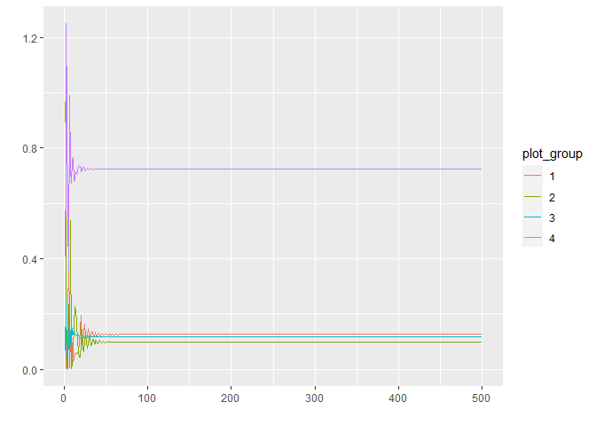
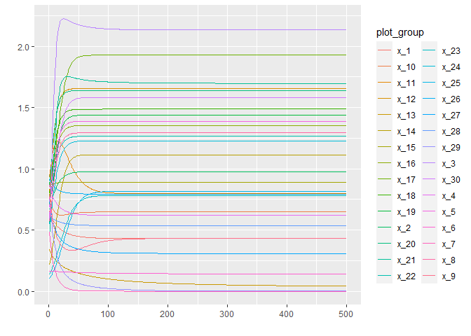
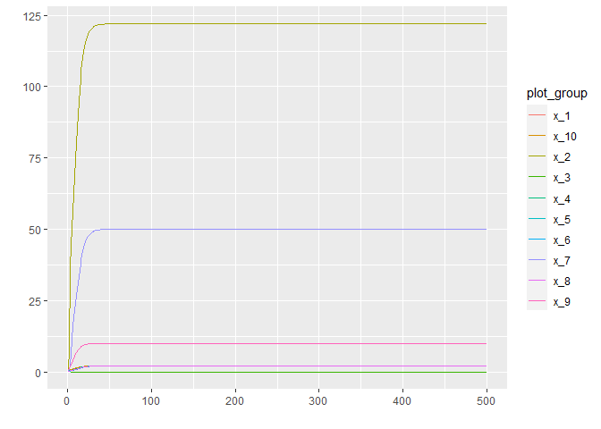
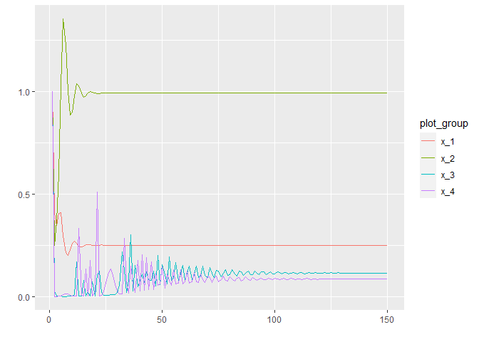
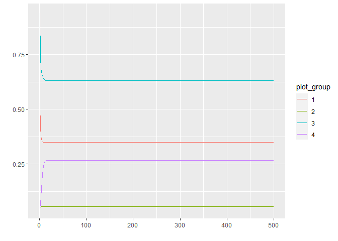
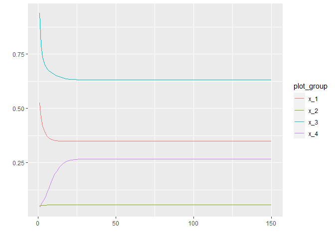
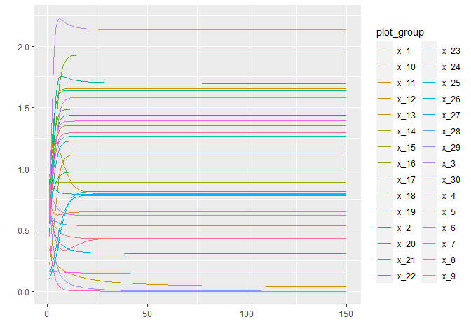
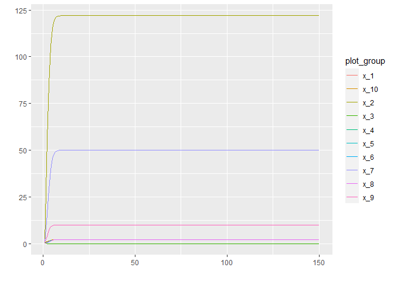

Simulation of synthetic time series with second order interactions
(miaSim)
================
Compiled at 2023-07-11 14:06:23 UTC

``` r
here::i_am(paste0(params$name, ".Rmd"), uuid = "097d888c-3dd7-4302-ad02-3bed36ed3cfe")
```

The purpose of this document is to simulate some synthetic time series
datasets with different numbers of species and some 2nd order
interactions (using the miaSim package). These can then be used for
testing the DeePyMoD algorithm.

# Packages

``` r
library("conflicted")
library(tidyverse)
library(data.table)

# BiocManager::install("miaSim")
library(miaSim)
library(miaViz)

library(deSolve)
library(R.matlab)

library(ggfortify) # to autoplot time series
```

``` r
# create or *empty* the target directory, used to write this file's data: 
projthis::proj_create_dir_target(params$name, clean = TRUE)

# function to get path to target directory: path_target("sample.csv")
path_target <- projthis::proj_path_target(params$name)

# function to get path to previous data: path_source("00-import", "sample.csv")
path_source <- projthis::proj_path_source(params$name)
```

# miaSim Shiny App

``` r
# library(miaSimShiny)
# ## run the shiny app for miaSim
# miaSimShiny::run_app()
```

# miaSim manual Simulation

## Function to simulate, save and plot GLV

``` r
# simulates generalized Lotka Volterra with miaSim (dx/dt = x(b + Ax))
# for t = 1,...,500
# saves the glv time series as .mat file
# plots the glv time series
# sim_name: give the simulation a name, e.g. "_oscillating"

save_and_plot_glv <-
  function(n_species, A_matrix, growth_rates = NULL, x0 = NULL, sim_name = "") {
    if(is.null(growth_rates)){
      growth_rates <- runif(n_species)
    }
    if(is.null(x0)){
      x0 <- runif(n_species)
    }
      
    # simulate GLV
    glv_tmp <-
      simulateGLV(
        n_species = n_species,
        A = A_matrix,
        x = x0,
        b = growth_rates,
        t_start = 0,
        t_store = 500
      )
    
    # write .mat file for python
    glv_tmp_mat <- data.matrix(cbind(1:500, t(glv_tmp)))
    writeMat(paste0(path_target(),"/miaSim_GLV_", n_species, "species",
                    sim_name, ".mat"),
             ts_glv = glv_tmp_mat)
    
    autoplot(ts(glv_tmp_mat[, 1:n_species+1]), facets = F)
  }
```

## Simple Examples for simulating GLV with 2 Species

### a)

``` r
# Generate random interaction matrix for GLV (2 Species)
# A_matrix <- randomA(n_species = 2)
A_matrix <- matrix(c(-1, 4/3, 1, -1), nrow = 2)
A_matrix
```

    ##           [,1] [,2]
    ## [1,] -1.000000    1
    ## [2,]  1.333333   -1

``` r
growth_rates <- c(2/3, 1)

A_matrix <- matrix(c(-0.5, 0, 0.1, -0.5), nrow = 2)
# A_matrix
# growth_rates <- c(0.5, 0.3)

save_and_plot_glv(A_matrix, growth_rates, 
                  n_species = 2, sim_name = "_V1")
```

<!-- -->

### b)

``` r
# Generate random interaction matrix for GLV (2 Species)
A_matrix <- matrix(c(-0.5, 2, 0, -0.5), nrow = 2)
A_matrix
```

    ##      [,1] [,2]
    ## [1,] -0.5  0.0
    ## [2,]  2.0 -0.5

``` r
growth_rates = c(1, 2)

set.seed(321)


save_and_plot_glv(n_species = 2, A_matrix, growth_rates, 
                  sim_name = "_V3")
```

<!-- -->

## General gLV for arbitrary number n of species

### a.1) 5 Species

``` r
n = 5

# Generate interaction matrix for GLV (5 Species)
A_matrix <- matrix(c(-0.5, 20, 0, 0, 0,
                     -28, -0.5, 0, 0, 0,
                     0, 0, -0.5, 0, 0,
                     0, 0, 0, -0.5, 40,
                     0, 0, -20, -60, -0.5), nrow = n)
A_matrix
```

    ##      [,1]  [,2] [,3] [,4]  [,5]
    ## [1,] -0.5 -28.0  0.0  0.0   0.0
    ## [2,] 20.0  -0.5  0.0  0.0   0.0
    ## [3,]  0.0   0.0 -0.5  0.0 -20.0
    ## [4,]  0.0   0.0  0.0 -0.5 -60.0
    ## [5,]  0.0   0.0  0.0 40.0  -0.5

``` r
# specify growth rates or use rep(1, n) by default
growth_rates = c(10, -1, 4, 10, -10)
growth_rates
```

    ## [1]  10  -1   4  10 -10

``` r
save_and_plot_glv(n_species = n, A_matrix, growth_rates, 
                  sim_name = "_fewInteractions")
```

<!-- -->

### a.2) 5 Species

``` r
n = 5

# # Generate random interaction matrix for GLV (5 Species)
# set.seed(246)
# A_matrix <- randomA(n_species = n)
A_matrix <- matrix(c(-0.5, 20, 0, 0, 0,
                     -28, -0.5, -3, 0, 0,
                     0, 10, -0.5, 0, 0,
                     -3, 0, 0, -0.5, 7.5,
                     5, 0, 0, -4.4, -0.5), nrow = n)
A_matrix
```

    ##      [,1]  [,2] [,3] [,4] [,5]
    ## [1,] -0.5 -28.0  0.0 -3.0  5.0
    ## [2,] 20.0  -0.5 10.0  0.0  0.0
    ## [3,]  0.0  -3.0 -0.5  0.0  0.0
    ## [4,]  0.0   0.0  0.0 -0.5 -4.4
    ## [5,]  0.0   0.0  0.0  7.5 -0.5

``` r
# specify growth rates or use rep(1, n) by default
growth_rates = c(10, -1, 1, 1, -1)
growth_rates
```

    ## [1] 10 -1  1  1 -1

``` r
save_and_plot_glv(n_species = n, A_matrix, growth_rates, 
                  sim_name = "_manyInteractions")
```

<!-- -->

### b) 2 species

``` r
n = 2

# Generate random interaction matrix for GLV (3 Species)
set.seed(246)
A_matrix <- randomA(n_species = n)
A_matrix <- matrix(c(-0.5, 15,
                     -30, -0.5), nrow = n)
A_matrix
```

    ##      [,1]  [,2]
    ## [1,] -0.5 -30.0
    ## [2,] 15.0  -0.5

``` r
# specify growth rates or use rep(1, n) by default
growth_rates = c(2/3, -1)

save_and_plot_glv(n_species = n, A_matrix, growth_rates, 
                  sim_name = "_oscillating")
```

<!-- -->

### c) 3 Species

``` r
n = 3

# Generate random interaction matrix for GLV (3 Species)
set.seed(246)
A_matrix <- randomA(n_species = n)
A_matrix <- matrix(c(-0.5, 5, 2,
                     -3, -0.5, 3,
                     0, 0, -0.5), nrow = n)
A_matrix
```

    ##      [,1] [,2] [,3]
    ## [1,] -0.5 -3.0  0.0
    ## [2,]  5.0 -0.5  0.0
    ## [3,]  2.0  3.0 -0.5

``` r
# specify growth rates or use rep(1, n) by default
growth_rates = c(2/3, -1, -0.7)


save_and_plot_glv(n_species = n, A_matrix, growth_rates, 
                  sim_name = "_oscillating")
```

<!-- -->

### c.1) 4 Species

``` r
n = 4

# Generate random interaction matrix for GLV
A_matrix <- matrix(c(-0.5, 80, 0, 0,
                     -50, -0.5, 3, 0,
                     0, 0, -0.5, 20,
                     0, 0, -10, -0.5), nrow = n)
A_matrix
```

    ##      [,1]  [,2] [,3]  [,4]
    ## [1,] -0.5 -50.0  0.0   0.0
    ## [2,] 80.0  -0.5  0.0   0.0
    ## [3,]  0.0   3.0 -0.5 -10.0
    ## [4,]  0.0   0.0 20.0  -0.5

``` r
# specify growth rates or use rep(1, n) by default
growth_rates = c(5, -10, 7, -2)


save_and_plot_glv(n_species = n, A_matrix, growth_rates, 
                  sim_name = "_oscillating_three")
```

<!-- -->

### c.2) 4 Species

``` r
n = 4

# Generate random interaction matrix for GLV
A_matrix <- matrix(c(-0.5, 80, 0, 0,
                     -50, -0.5, 0, 0,
                     0, 0, -0.5, 20,
                     0, 0, -10, -0.5), nrow = n)
A_matrix
```

    ##      [,1]  [,2] [,3]  [,4]
    ## [1,] -0.5 -50.0  0.0   0.0
    ## [2,] 80.0  -0.5  0.0   0.0
    ## [3,]  0.0   0.0 -0.5 -10.0
    ## [4,]  0.0   0.0 20.0  -0.5

``` r
# specify growth rates or use rep(1, n) by default
growth_rates = c(5, -10, 7, -2)


save_and_plot_glv(n_species = n, A_matrix, growth_rates, 
                  sim_name = "_oscillating_zero")
```

<!-- -->

### d) 4 Species

``` r
n = 4

# Generate random interaction matrix for GLV
A_matrix <- matrix(c(-0.5, 30, 0, 0,
                     0, -0.5, -15, 0,
                     0, 0, -0.5, 20,
                     -10, 0, 0, -0.5), nrow = n)
A_matrix
```

    ##      [,1]  [,2] [,3]  [,4]
    ## [1,] -0.5   0.0  0.0 -10.0
    ## [2,] 30.0  -0.5  0.0   0.0
    ## [3,]  0.0 -15.0 -0.5   0.0
    ## [4,]  0.0   0.0 20.0  -0.5

``` r
# specify growth rates or use rep(1, n) by default
growth_rates = c(5, -10, 7, 0.5)

x0 = c(5,5,5,5)

save_and_plot_glv(n_species = n, A_matrix, growth_rates, x0, 
                  sim_name = "_Vd")
```

<!-- -->

## Example with 4 species

``` r
n = 4

# Interaction matrix with Power-Law network adjacency matrix (from tutorial)
set.seed(321)
A_normal <- powerlawA(n_species = n, alpha = 3)
A_normal
```

    ##             1           2    3           4
    ## 1 -1.00000000 -0.01610725  0.0  0.01223536
    ## 2 -0.04811147 -1.00000000  0.0  0.00000000
    ## 3  0.00000000  0.00000000 -1.0  0.00000000
    ## 4  0.00000000  0.00000000  0.1 -1.00000000

``` r
# simulate GLV
set.seed(123)
save_and_plot_glv(n_species = n, A_matrix = A_normal)
```

<!-- -->

``` r
A <- miaSim::powerlawA(4, alpha = 1.01)
A
```

    ##    1           2           3          4
    ## 1 -1  0.00000000  0.00000000  0.0000000
    ## 2  0 -1.00000000  0.06302926  0.0000000
    ## 3  0  0.00000000 -1.00000000 -0.2455873
    ## 4  0 -0.07523968  0.00000000 -1.0000000

``` r
save_and_plot_glv(n_species = 4, A_matrix = A)
```

<!-- -->

## Large Example for simulating GLV

### a) with 30 Species

``` r
n = 30

# Generate random interaction matrix for GLV (2 Species)
set.seed(12)
A_matrix <- randomA(n_species = 30)
A_matrix
```

    ##       [,1] [,2] [,3]       [,4] [,5] [,6] [,7]       [,8]        [,9] [,10]
    ##  [1,] -0.5  0.0  0.0  0.0000000  0.0  0.0  0.0  0.0000000  0.00000000   0.0
    ##  [2,]  0.0 -0.5  0.0  0.0000000  0.0  0.0  0.0  0.0000000  0.00000000   0.0
    ##  [3,]  0.0  0.0 -0.5  0.0000000  0.0  0.0  0.0  0.0000000  0.00000000   0.0
    ##  [4,]  0.0  0.0  0.0 -0.5000000  0.0  0.0  0.0  0.0000000  0.00000000   0.0
    ##  [5,]  0.0  0.0  0.0  0.0000000 -0.5  0.0  0.0  0.0000000  0.00000000   0.0
    ##  [6,]  0.0  0.0  0.0  0.0000000  0.0 -0.5  0.0  0.0000000  0.00000000   0.0
    ##  [7,]  0.0  0.0  0.0  0.0000000  0.0  0.0 -0.5  0.0000000  0.00000000   0.0
    ##  [8,]  0.0  0.0  0.0  0.0000000  0.0  0.0  0.0 -0.5000000  0.00000000   0.0
    ##  [9,]  0.0  0.0  0.0  0.0000000  0.0  0.0  0.0  0.0000000 -0.50000000   0.0
    ## [10,]  0.0  0.0  0.0  0.0000000  0.0  0.0  0.0  0.0000000  0.00000000  -0.5
    ## [11,]  0.0  0.0  0.0  0.0000000  0.0  0.0  0.0  0.0000000  0.00000000   0.0
    ## [12,]  0.0  0.0  0.0  0.0000000  0.0  0.0  0.0  0.0000000  0.00000000   0.0
    ## [13,]  0.0  0.0  0.0  0.0000000  0.0  0.0  0.0  0.0000000 -0.08681138   0.0
    ## [14,]  0.0  0.0  0.0  0.3605173  0.0  0.0  0.0  0.0000000  0.00000000   0.0
    ## [15,]  0.0  0.0  0.0  0.0000000  0.0  0.0  0.0  0.0000000  0.00000000   0.0
    ## [16,]  0.0  0.0  0.0  0.0000000  0.0  0.0  0.0  0.0000000  0.00000000   0.0
    ## [17,]  0.0  0.0  0.0  0.0000000  0.0  0.0  0.0  0.0000000  0.00000000   0.0
    ## [18,]  0.0  0.0  0.0  0.0000000  0.0  0.0  0.0  0.0000000  0.00000000   0.0
    ## [19,]  0.0  0.0  0.0  0.0000000  0.0  0.0  0.0  0.0000000  0.00000000   0.0
    ## [20,]  0.0  0.0  0.0  0.0000000  0.0  0.0  0.0  0.0000000  0.00000000   0.0
    ## [21,]  0.0  0.0  0.0  0.0000000  0.0  0.0  0.0  0.0000000  0.00000000   0.0
    ## [22,]  0.0  0.0  0.0  0.0000000  0.0  0.0  0.0  0.0000000  0.00000000   0.0
    ## [23,]  0.0  0.0  0.0  0.0000000  0.0  0.0  0.0  0.0000000  0.00000000   0.0
    ## [24,]  0.0  0.0  0.0  0.0000000  0.0  0.0  0.0  0.0000000  0.00000000   0.0
    ## [25,]  0.0  0.0  0.0  0.0000000  0.0  0.0  0.0  0.0000000  0.00000000   0.0
    ## [26,]  0.0  0.0  0.0  0.0000000  0.0  0.0  0.0  0.0000000  0.00000000   0.0
    ## [27,]  0.0  0.0  0.0  0.0000000  0.0  0.0  0.0  0.1014232  0.00000000   0.0
    ## [28,]  0.0  0.0  0.0  0.0000000  0.0  0.0  0.0  0.0000000  0.00000000   0.0
    ## [29,]  0.0  0.0  0.0  0.0000000  0.0  0.0  0.0  0.0000000  0.00000000   0.0
    ## [30,]  0.0  0.0  0.0  0.0000000  0.0  0.0  0.0  0.3039954  0.00000000   0.0
    ##            [,11] [,12]      [,13] [,14]      [,15] [,16]       [,17]      [,18]
    ##  [1,]  0.0000000   0.0  0.0000000   0.0  0.0000000   0.0  0.00000000  0.0000000
    ##  [2,]  0.0000000   0.0  0.0000000   0.0  0.0000000   0.0  0.00000000  0.0000000
    ##  [3,]  0.0000000   0.0  0.0000000   0.0  0.0000000   0.0  0.00000000  0.0000000
    ##  [4,]  0.0000000   0.0  0.0000000   0.0  0.0000000   0.0  0.00000000  0.0000000
    ##  [5,]  0.0000000   0.0  0.0000000   0.0  0.0000000   0.0  0.00000000  0.0000000
    ##  [6,]  0.0000000   0.0  0.0000000   0.0  0.0000000   0.0  0.00000000  0.0000000
    ##  [7,] -0.1968155   0.0 -0.1431925   0.0 -0.3488258   0.0  0.00000000  0.0000000
    ##  [8,]  0.0000000   0.0  0.0000000   0.0  0.0000000   0.0  0.00000000  0.0000000
    ##  [9,]  0.0000000   0.0  0.0000000   0.0  0.0000000   0.0  0.00000000  0.0000000
    ## [10,]  0.0000000   0.0  0.0000000   0.0  0.0000000   0.0  0.00000000  0.1692787
    ## [11,] -0.5000000   0.0  0.0000000   0.0  0.0000000   0.0  0.00000000  0.0000000
    ## [12,]  0.0000000  -0.5  0.0000000   0.0  0.0000000   0.0  0.00000000  0.0000000
    ## [13,]  0.0000000   0.0 -0.5000000   0.0  0.0000000   0.0  0.00000000  0.0000000
    ## [14,]  0.0000000   0.0  0.0000000  -0.5  0.0000000   0.0  0.00000000  0.0000000
    ## [15,]  0.0000000   0.0  0.0000000   0.0 -0.5000000   0.0  0.00000000  0.0000000
    ## [16,]  0.0000000   0.0  0.0000000   0.0  0.0000000  -0.5  0.00000000  0.0000000
    ## [17,]  0.0000000   0.0  0.0000000   0.0  0.0000000   0.0 -0.50000000  0.0000000
    ## [18,]  0.0000000   0.0  0.0000000   0.0  0.0000000   0.0  0.00000000 -0.5000000
    ## [19,]  0.0000000   0.0  0.0000000   0.0  0.0000000   0.0  0.00000000  0.0000000
    ## [20,]  0.0000000   0.0  0.0000000   0.0  0.0000000   0.0  0.00000000  0.0000000
    ## [21,]  0.0000000   0.0  0.0000000   0.0  0.0000000   0.0  0.00000000  0.0000000
    ## [22,]  0.0000000   0.0  0.0000000   0.0  0.0000000   0.0  0.00000000  0.0000000
    ## [23,]  0.0000000   0.0  0.0000000   0.0  0.0000000   0.0 -0.03521835  0.0000000
    ## [24,]  0.0000000   0.0  0.0000000   0.0  0.0000000   0.0  0.00000000  0.0000000
    ## [25,]  0.0000000   0.0  0.0000000   0.0  0.0000000   0.0  0.00000000  0.0000000
    ## [26,]  0.0000000   0.0  0.0000000   0.0  0.0000000   0.0  0.00000000  0.0000000
    ## [27,]  0.0000000   0.0  0.0000000   0.0  0.0000000   0.0  0.00000000  0.0000000
    ## [28,]  0.0000000   0.0  0.0000000   0.0  0.0000000   0.0  0.00000000  0.0000000
    ## [29,] -0.2124377   0.0  0.0000000   0.0  0.0000000   0.0  0.00000000  0.0000000
    ## [30,]  0.0000000   0.0  0.0000000   0.0  0.0000000   0.0  0.00000000  0.0000000
    ##       [,19]        [,20] [,21]      [,22]      [,23] [,24]      [,25] [,26]
    ##  [1,]   0.0  0.000000000   0.0  0.0000000  0.0000000   0.0  0.0000000   0.0
    ##  [2,]   0.0  0.000000000   0.0  0.0000000  0.0000000   0.0  0.0000000   0.0
    ##  [3,]   0.0  0.000000000   0.0  0.0000000  0.0000000   0.0  0.0000000   0.0
    ##  [4,]   0.0  0.000000000   0.0  0.0000000  0.0000000   0.0  0.0000000   0.0
    ##  [5,]   0.0  0.000000000   0.0  0.0000000  0.0000000   0.0  0.0000000   0.0
    ##  [6,]   0.0  0.000000000   0.0  0.0000000  0.0000000   0.0  0.0000000   0.0
    ##  [7,]   0.0  0.000000000   0.0  0.0000000  0.0000000   0.0  0.0000000   0.0
    ##  [8,]   0.0  0.000000000   0.0 -0.0620346  0.0000000   0.0  0.0000000   0.0
    ##  [9,]   0.0  0.000000000   0.0  0.0000000  0.0000000   0.0  0.2343713   0.0
    ## [10,]   0.0  0.000000000   0.0  0.0000000  0.0000000   0.0  0.0000000   0.0
    ## [11,]   0.0  0.000000000   0.0  0.0000000 -0.4746995   0.0  0.0000000   0.0
    ## [12,]   0.0  0.000000000   0.0  0.0000000  0.0000000   0.0  0.0000000   0.0
    ## [13,]   0.0  0.000000000   0.0  0.0000000  0.0000000   0.0  0.0000000   0.0
    ## [14,]   0.0  0.000000000   0.0  0.0000000  0.0000000   0.0  0.0000000   0.0
    ## [15,]   0.0 -0.008088039   0.0  0.0000000  0.0000000   0.0  0.0000000   0.0
    ## [16,]   0.0  0.000000000   0.0  0.0000000  0.0000000   0.0  0.0000000   0.0
    ## [17,]   0.0  0.000000000   0.0  0.0000000  0.0000000   0.0  0.0000000   0.0
    ## [18,]   0.0  0.000000000   0.0  0.0000000  0.0000000   0.0  0.0000000   0.0
    ## [19,]  -0.5  0.000000000   0.0  0.0000000  0.0000000   0.0  0.0000000   0.0
    ## [20,]   0.0 -0.500000000   0.0  0.0000000  0.0000000   0.0  0.0000000   0.0
    ## [21,]   0.0  0.000000000  -0.5  0.0000000  0.0000000   0.0  0.0000000   0.0
    ## [22,]   0.0  0.000000000   0.0 -0.5000000  0.0000000   0.0  0.0000000   0.0
    ## [23,]   0.0  0.000000000   0.0  0.0000000 -0.5000000   0.0  0.0000000   0.0
    ## [24,]   0.0  0.000000000   0.0  0.0000000  0.0000000  -0.5  0.0000000   0.0
    ## [25,]   0.0  0.000000000   0.0  0.0000000  0.0000000   0.0 -0.5000000   0.0
    ## [26,]   0.0  0.000000000   0.0  0.0000000  0.0000000   0.0  0.0000000  -0.5
    ## [27,]   0.0  0.000000000   0.0  0.0000000  0.0000000   0.0  0.0000000   0.0
    ## [28,]   0.0  0.000000000   0.0  0.0000000  0.0000000   0.0  0.0000000   0.0
    ## [29,]   0.0  0.000000000   0.0  0.0000000  0.0000000   0.0  0.0000000   0.0
    ## [30,]   0.0  0.000000000   0.0  0.0000000  0.0000000   0.0  0.0000000   0.0
    ##            [,27] [,28]      [,29]      [,30]
    ##  [1,] -0.0118843   0.0  0.0000000  0.0000000
    ##  [2,]  0.0000000   0.0  0.0000000  0.0000000
    ##  [3,]  0.4952616   0.0  0.0000000  0.0000000
    ##  [4,]  0.0000000   0.0  0.0000000  0.0000000
    ##  [5,]  0.0000000   0.0  0.0000000  0.0000000
    ##  [6,]  0.0000000   0.0  0.0000000  0.0000000
    ##  [7,]  0.0000000   0.0  0.0000000  0.0000000
    ##  [8,]  0.0000000   0.0  0.0000000  0.0000000
    ##  [9,]  0.0000000   0.0  0.0000000  0.0000000
    ## [10,]  0.0000000   0.0  0.0000000  0.0000000
    ## [11,]  0.0000000   0.0  0.0000000  0.0000000
    ## [12,]  0.0000000   0.0  0.0000000  0.0000000
    ## [13,]  0.0000000   0.0  0.0000000  0.0000000
    ## [14,]  0.0000000   0.0  0.0000000  0.0000000
    ## [15,]  0.0000000   0.0  0.0000000  0.0000000
    ## [16,]  0.0000000   0.0  0.0000000  0.0000000
    ## [17,]  0.0000000   0.0  0.0000000  0.3773864
    ## [18,]  0.0000000   0.0  0.0000000  0.0000000
    ## [19,]  0.0000000   0.0  0.0000000  0.0000000
    ## [20,]  0.0000000   0.0  0.0000000  0.0000000
    ## [21,]  0.0000000   0.0  0.2354447  0.0000000
    ## [22,]  0.0000000   0.0  0.0000000  0.0000000
    ## [23,]  0.0000000   0.0  0.0000000  0.0000000
    ## [24,]  0.0000000   0.0  0.0000000  0.0000000
    ## [25,]  0.0000000   0.0  0.0000000  0.0000000
    ## [26,]  0.0000000   0.0  0.0000000  0.0000000
    ## [27,] -0.5000000   0.0  0.0000000  0.0000000
    ## [28,]  0.0000000  -0.5  0.0000000  0.0000000
    ## [29,]  0.0000000   0.0 -0.5000000  0.0000000
    ## [30,]  0.0000000   0.0  0.0000000 -0.5000000

``` r
# simulate GLV
save_and_plot_glv(n_species = n, A_matrix)
```

<!-- -->

### b) with 10 Species

``` r
n = 10

# Generate random interaction matrix for GLV (2 Species)
# set.seed(2)
# A_matrix <- randomA(n_species = n)
A_matrix <- matrix(c(-0.5, 30, 0, 0, 0, 0, 0, 0, 0, 0,
                     0, -0.5, 0, 0, 0, 0, 0, 0, 0, 0,
                     0, 0, -0.5, 0, 0, 0, 0, 0, 0, 0,
                     0, 0, 0, -0.5, 0, 0, 12, 0, 0, 0,
                     0, 0, 0, 0, -0.5, 0, 0, 0, 0, 0,
                     0, 0, 0, 0, 0, -0.5, 0, 0, 0, 0,
                     0, 0, -15, 0, 0, 0, -0.5, 0, 0, 0,
                     0, 0, 0, 0, 0, 0, 0, -0.5, 0, 0,
                     0, 0, 0, 0, 0, 0, 0, 0, -0.5, 0,
                     0, 0, 0, 0, 0, 0, 0, 0, 2, -0.5),
                   nrow = n)
A_matrix
```

    ##       [,1] [,2] [,3] [,4] [,5] [,6]  [,7] [,8] [,9] [,10]
    ##  [1,] -0.5  0.0  0.0  0.0  0.0  0.0   0.0  0.0  0.0   0.0
    ##  [2,] 30.0 -0.5  0.0  0.0  0.0  0.0   0.0  0.0  0.0   0.0
    ##  [3,]  0.0  0.0 -0.5  0.0  0.0  0.0 -15.0  0.0  0.0   0.0
    ##  [4,]  0.0  0.0  0.0 -0.5  0.0  0.0   0.0  0.0  0.0   0.0
    ##  [5,]  0.0  0.0  0.0  0.0 -0.5  0.0   0.0  0.0  0.0   0.0
    ##  [6,]  0.0  0.0  0.0  0.0  0.0 -0.5   0.0  0.0  0.0   0.0
    ##  [7,]  0.0  0.0  0.0 12.0  0.0  0.0  -0.5  0.0  0.0   0.0
    ##  [8,]  0.0  0.0  0.0  0.0  0.0  0.0   0.0 -0.5  0.0   0.0
    ##  [9,]  0.0  0.0  0.0  0.0  0.0  0.0   0.0  0.0 -0.5   2.0
    ## [10,]  0.0  0.0  0.0  0.0  0.0  0.0   0.0  0.0  0.0  -0.5

``` r
growth_rates = rep(1, n)
growth_rates
```

    ##  [1] 1 1 1 1 1 1 1 1 1 1

``` r
save_and_plot_glv(n_species = n, A_matrix, growth_rates)
```

<!-- -->

## Files written

These files have been written to the target directory,
`data/01e-timeseries-miaSim`:

``` r
projthis::proj_dir_info(path_target())
```

    ## # A tibble: 12 × 4
    ##    path                                      type       size modification_time  
    ##    <fs::path>                                <fct> <fs::byt> <dttm>             
    ##  1 miaSim_GLV_10species.mat                  file      43.2K 2023-07-11 14:06:54
    ##  2 miaSim_GLV_2species_oscillating.mat       file      11.9K 2023-07-11 14:06:41
    ##  3 miaSim_GLV_2species_V1.mat                file      11.9K 2023-07-11 14:06:36
    ##  4 miaSim_GLV_2species_V3.mat                file      11.9K 2023-07-11 14:06:38
    ##  5 miaSim_GLV_30species.mat                  file     121.3K 2023-07-11 14:06:50
    ##  6 miaSim_GLV_3species_oscillating.mat       file      15.8K 2023-07-11 14:06:42
    ##  7 miaSim_GLV_4species.mat                   file      19.7K 2023-07-11 14:06:49
    ##  8 miaSim_GLV_4species_oscillating_three.mat file      19.7K 2023-07-11 14:06:43
    ##  9 miaSim_GLV_4species_oscillating_zero.mat  file      19.7K 2023-07-11 14:06:43
    ## 10 miaSim_GLV_4species_Vd.mat                file      19.7K 2023-07-11 14:06:47
    ## 11 miaSim_GLV_5species_fewInteractions.mat   file      23.6K 2023-07-11 14:06:39
    ## 12 miaSim_GLV_5species_manyInteractions.mat  file      23.6K 2023-07-11 14:06:40
