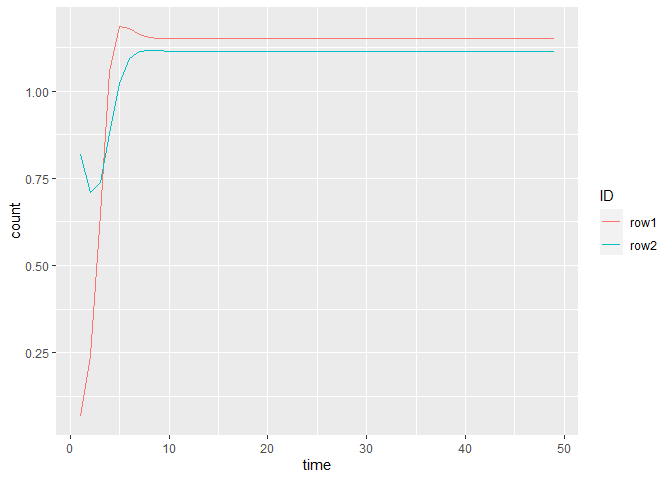
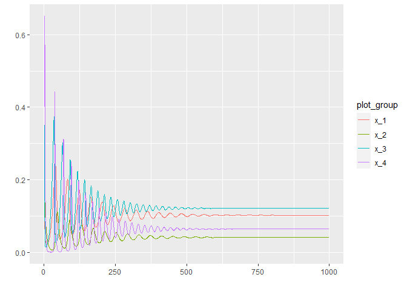
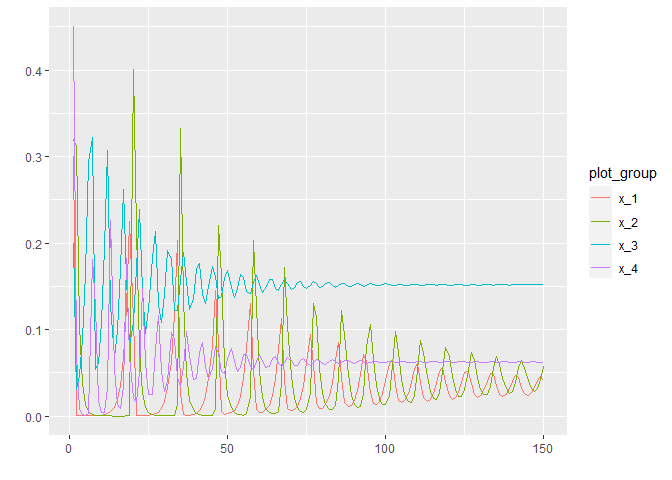
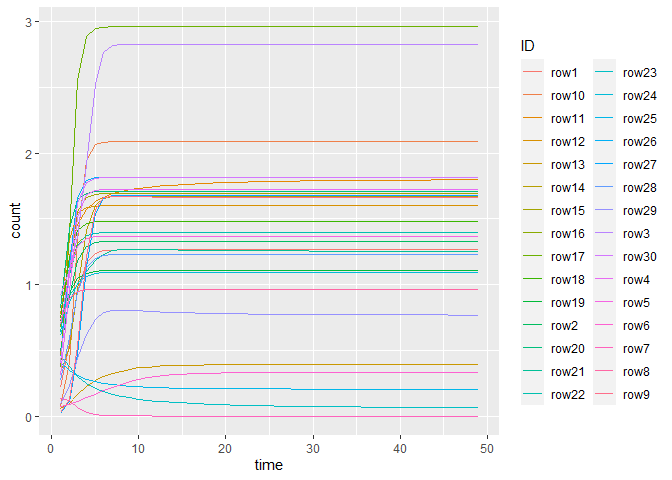

Simulation of synthetic time series with second order interactions
(miaSim)
================
Compiled at 2023-06-26 14:26:56 UTC

``` r
here::i_am(paste0(params$name, ".Rmd"), uuid = "097d888c-3dd7-4302-ad02-3bed36ed3cfe")
```

The purpose of this document is to simulate some synthetic time series
datasets with different numbers of species and some 2nd order
interactions (using the miaSim package). These can then be used for
testing the DeePyMoD algorithm.

``` r
library("conflicted")
library(tidyverse)
library(data.table)

# BiocManager::install("miaSim")
library(miaSim)
library(miaViz)

library(deSolve)
library(R.matlab)
```

``` r
# create or *empty* the target directory, used to write this file's data: 
projthis::proj_create_dir_target(params$name, clean = TRUE)

# function to get path to target directory: path_target("sample.csv")
path_target <- projthis::proj_path_target(params$name)

# function to get path to previous data: path_source("00-import", "sample.csv")
path_source <- projthis::proj_path_source(params$name)
```

# miaSim Simulation

## Simple Example for simulating GLV with 2 Species

``` r
# Generate random interaction matrix for GLV (2 Species)
set.seed(12)
# A_matrix <- randomA(n_species = 2)
A_matrix <- matrix(c(-0.5, 0.25, -0.33, -0.5), nrow = 2)
A_matrix
```

    ##       [,1]  [,2]
    ## [1,] -0.50 -0.33
    ## [2,]  0.25 -0.50

``` r
# simulate GLV
ts_glv_2 <-
  simulateGLV(
    n_species = 2,
    A = A_matrix,
    t_start = 0,
    t_store = 500
  )

# write .mat file for python
ts_glv_2_mat <- data.matrix(cbind(1:500, t(ts_glv_2)))
writeMat("miaSim_GLV_2species.mat", ts_glv = ts_glv_2_mat)

# reshape time series matrix to long data.table
rownames(ts_glv_2) <- paste0("row", 1:nrow(ts_glv_2))
colnames(ts_glv_2) <- paste0(1:ncol(ts_glv_2))

dt_ts_glv <-
  as.data.table(as.table(ts_glv_2)) %>% 
  melt %>% 
  .[, ID := V1] %>% 
  .[, time := as.numeric(V2)] %>% 
  .[, count := value] %>% 
  .[, c("variable", "value", "V1", "V2") := NULL]
```

    ## Warning in melt.data.table(.): id.vars and measure.vars are internally guessed
    ## when both are 'NULL'. All non-numeric/integer/logical type columns are
    ## considered id.vars, which in this case are columns [V1, V2]. Consider providing
    ## at least one of 'id' or 'measure' vars in future.

``` r
# plot time series
ggplot(dt_ts_glv[time < 50], aes(time, count)) +
  geom_line(aes(col = ID))
```

<!-- -->

## Example for simulating GLV with 3 Species

``` r
# Generate random interaction matrix for GLV (3 Species)
set.seed(321)
A_matrix <- randomA(n_species = 3)
A_matrix
```

    ##      [,1] [,2]       [,3]
    ## [1,] -0.5  0.0  0.0000000
    ## [2,]  0.0 -0.5 -0.2100672
    ## [3,]  0.0  0.0 -0.5000000

``` r
# simulate GLV
ts_glv_3 <-
  simulateGLV(
    n_species = 3,
    A = A_matrix,
    t_start = 0,
    t_store = 500
  )

# write .mat file for python
ts_glv_3_mat <- data.matrix(cbind(1:500, t(ts_glv_3)))
writeMat("miaSim_GLV_3species.mat", ts_glv = ts_glv_3_mat)

# reshape time series matrix to long data.table
rownames(ts_glv_3) <- paste0("row", 1:nrow(ts_glv_3))
colnames(ts_glv_3) <- paste0(1:ncol(ts_glv_3))

dt_ts_glv <-
  as.data.table(as.table(ts_glv_3)) %>% 
  melt %>% 
  .[, ID := V1] %>% 
  .[, time := as.numeric(V2)] %>% 
  .[, count := value] %>% 
  .[, c("variable", "value", "V1", "V2") := NULL]
```

    ## Warning in melt.data.table(.): id.vars and measure.vars are internally guessed
    ## when both are 'NULL'. All non-numeric/integer/logical type columns are
    ## considered id.vars, which in this case are columns [V1, V2]. Consider providing
    ## at least one of 'id' or 'measure' vars in future.

``` r
# plot time series
ggplot(dt_ts_glv[time < 50], aes(time, count)) +
  geom_line(aes(col = ID))
```

<!-- -->

## Example with 4 species

``` r
# Interaction matrix with Power-Law network adjacency matrix (from tutorial)
set.seed(321)
A_normal <- powerlawA(n_species = 4, alpha = 3)

# simulate GLV
set.seed(123)
ts_glv <- simulateGLV(n_species = 4,
                      A = A_normal,
                      t_start = 0, 
                      t_store = 1000)

# save glv as csv
write_csv(x = as.data.frame(t(ts_glv)),
          file = "miaSim_GLV_test.csv")

# save glv as .mat file
ts_glv = data.matrix(read.csv('miaSim_GLV_test.csv'))
writeMat("miaSim_GLV_test.mat", ts_glv = ts_glv)

# transform matrix to python array
reticulate::r_to_py(t(ts_glv))
```

    ## array([[2.87577520e-01, 4.99245952e-01, 7.01972469e-01, ...,
    ##         9.52018249e-01, 9.52018265e-01, 9.52018281e-01],
    ##        [7.88305135e-01, 4.49919137e-01, 3.14561412e-01, ...,
    ##         8.84386138e-04, 8.83387106e-04, 8.82390083e-04],
    ##        [4.08976922e-01, 4.50687879e-01, 4.79529043e-01, ...,
    ##         5.28105488e-01, 5.28105488e-01, 5.28105488e-01],
    ##        [8.83017404e-01, 9.14375487e-01, 9.29363105e-01, ...,
    ##         9.45229593e-01, 9.45229593e-01, 9.45229593e-01]])

``` r
# reshape time series matrix to long data.table
rownames(ts_glv) <- paste0(1:nrow(ts_glv))
colnames(ts_glv) <- paste0(1:ncol(ts_glv))

dt_ts_glv <-
  as.data.table(as.table(t(ts_glv))) %>% 
  melt %>% 
  .[, ID := V1] %>% 
  .[, time := as.numeric(V2)] %>% 
  .[, count := value] %>% 
  .[, c("variable", "value", "V1", "V2") := NULL]
```

    ## Warning in melt.data.table(.): id.vars and measure.vars are internally guessed
    ## when both are 'NULL'. All non-numeric/integer/logical type columns are
    ## considered id.vars, which in this case are columns [V1, V2]. Consider providing
    ## at least one of 'id' or 'measure' vars in future.

``` r
# plot time series
ggplot(dt_ts_glv[time < 100], aes(time, count)) +
  geom_line(aes(col = ID))
```

<!-- -->

## Large Example for simulating GLV with 50 Species

``` r
# Generate random interaction matrix for GLV (2 Species)
set.seed(12)
A_matrix <- randomA(n_species = 30)
A_matrix
```

    ##       [,1] [,2] [,3]       [,4] [,5] [,6] [,7]       [,8]        [,9] [,10]
    ##  [1,] -0.5  0.0  0.0  0.0000000  0.0  0.0  0.0  0.0000000  0.00000000   0.0
    ##  [2,]  0.0 -0.5  0.0  0.0000000  0.0  0.0  0.0  0.0000000  0.00000000   0.0
    ##  [3,]  0.0  0.0 -0.5  0.0000000  0.0  0.0  0.0  0.0000000  0.00000000   0.0
    ##  [4,]  0.0  0.0  0.0 -0.5000000  0.0  0.0  0.0  0.0000000  0.00000000   0.0
    ##  [5,]  0.0  0.0  0.0  0.0000000 -0.5  0.0  0.0  0.0000000  0.00000000   0.0
    ##  [6,]  0.0  0.0  0.0  0.0000000  0.0 -0.5  0.0  0.0000000  0.00000000   0.0
    ##  [7,]  0.0  0.0  0.0  0.0000000  0.0  0.0 -0.5  0.0000000  0.00000000   0.0
    ##  [8,]  0.0  0.0  0.0  0.0000000  0.0  0.0  0.0 -0.5000000  0.00000000   0.0
    ##  [9,]  0.0  0.0  0.0  0.0000000  0.0  0.0  0.0  0.0000000 -0.50000000   0.0
    ## [10,]  0.0  0.0  0.0  0.0000000  0.0  0.0  0.0  0.0000000  0.00000000  -0.5
    ## [11,]  0.0  0.0  0.0  0.0000000  0.0  0.0  0.0  0.0000000  0.00000000   0.0
    ## [12,]  0.0  0.0  0.0  0.0000000  0.0  0.0  0.0  0.0000000  0.00000000   0.0
    ## [13,]  0.0  0.0  0.0  0.0000000  0.0  0.0  0.0  0.0000000 -0.08681138   0.0
    ## [14,]  0.0  0.0  0.0  0.3605173  0.0  0.0  0.0  0.0000000  0.00000000   0.0
    ## [15,]  0.0  0.0  0.0  0.0000000  0.0  0.0  0.0  0.0000000  0.00000000   0.0
    ## [16,]  0.0  0.0  0.0  0.0000000  0.0  0.0  0.0  0.0000000  0.00000000   0.0
    ## [17,]  0.0  0.0  0.0  0.0000000  0.0  0.0  0.0  0.0000000  0.00000000   0.0
    ## [18,]  0.0  0.0  0.0  0.0000000  0.0  0.0  0.0  0.0000000  0.00000000   0.0
    ## [19,]  0.0  0.0  0.0  0.0000000  0.0  0.0  0.0  0.0000000  0.00000000   0.0
    ## [20,]  0.0  0.0  0.0  0.0000000  0.0  0.0  0.0  0.0000000  0.00000000   0.0
    ## [21,]  0.0  0.0  0.0  0.0000000  0.0  0.0  0.0  0.0000000  0.00000000   0.0
    ## [22,]  0.0  0.0  0.0  0.0000000  0.0  0.0  0.0  0.0000000  0.00000000   0.0
    ## [23,]  0.0  0.0  0.0  0.0000000  0.0  0.0  0.0  0.0000000  0.00000000   0.0
    ## [24,]  0.0  0.0  0.0  0.0000000  0.0  0.0  0.0  0.0000000  0.00000000   0.0
    ## [25,]  0.0  0.0  0.0  0.0000000  0.0  0.0  0.0  0.0000000  0.00000000   0.0
    ## [26,]  0.0  0.0  0.0  0.0000000  0.0  0.0  0.0  0.0000000  0.00000000   0.0
    ## [27,]  0.0  0.0  0.0  0.0000000  0.0  0.0  0.0  0.1014232  0.00000000   0.0
    ## [28,]  0.0  0.0  0.0  0.0000000  0.0  0.0  0.0  0.0000000  0.00000000   0.0
    ## [29,]  0.0  0.0  0.0  0.0000000  0.0  0.0  0.0  0.0000000  0.00000000   0.0
    ## [30,]  0.0  0.0  0.0  0.0000000  0.0  0.0  0.0  0.3039954  0.00000000   0.0
    ##            [,11] [,12]      [,13] [,14]      [,15] [,16]       [,17]      [,18]
    ##  [1,]  0.0000000   0.0  0.0000000   0.0  0.0000000   0.0  0.00000000  0.0000000
    ##  [2,]  0.0000000   0.0  0.0000000   0.0  0.0000000   0.0  0.00000000  0.0000000
    ##  [3,]  0.0000000   0.0  0.0000000   0.0  0.0000000   0.0  0.00000000  0.0000000
    ##  [4,]  0.0000000   0.0  0.0000000   0.0  0.0000000   0.0  0.00000000  0.0000000
    ##  [5,]  0.0000000   0.0  0.0000000   0.0  0.0000000   0.0  0.00000000  0.0000000
    ##  [6,]  0.0000000   0.0  0.0000000   0.0  0.0000000   0.0  0.00000000  0.0000000
    ##  [7,] -0.1968155   0.0 -0.1431925   0.0 -0.3488258   0.0  0.00000000  0.0000000
    ##  [8,]  0.0000000   0.0  0.0000000   0.0  0.0000000   0.0  0.00000000  0.0000000
    ##  [9,]  0.0000000   0.0  0.0000000   0.0  0.0000000   0.0  0.00000000  0.0000000
    ## [10,]  0.0000000   0.0  0.0000000   0.0  0.0000000   0.0  0.00000000  0.1692787
    ## [11,] -0.5000000   0.0  0.0000000   0.0  0.0000000   0.0  0.00000000  0.0000000
    ## [12,]  0.0000000  -0.5  0.0000000   0.0  0.0000000   0.0  0.00000000  0.0000000
    ## [13,]  0.0000000   0.0 -0.5000000   0.0  0.0000000   0.0  0.00000000  0.0000000
    ## [14,]  0.0000000   0.0  0.0000000  -0.5  0.0000000   0.0  0.00000000  0.0000000
    ## [15,]  0.0000000   0.0  0.0000000   0.0 -0.5000000   0.0  0.00000000  0.0000000
    ## [16,]  0.0000000   0.0  0.0000000   0.0  0.0000000  -0.5  0.00000000  0.0000000
    ## [17,]  0.0000000   0.0  0.0000000   0.0  0.0000000   0.0 -0.50000000  0.0000000
    ## [18,]  0.0000000   0.0  0.0000000   0.0  0.0000000   0.0  0.00000000 -0.5000000
    ## [19,]  0.0000000   0.0  0.0000000   0.0  0.0000000   0.0  0.00000000  0.0000000
    ## [20,]  0.0000000   0.0  0.0000000   0.0  0.0000000   0.0  0.00000000  0.0000000
    ## [21,]  0.0000000   0.0  0.0000000   0.0  0.0000000   0.0  0.00000000  0.0000000
    ## [22,]  0.0000000   0.0  0.0000000   0.0  0.0000000   0.0  0.00000000  0.0000000
    ## [23,]  0.0000000   0.0  0.0000000   0.0  0.0000000   0.0 -0.03521835  0.0000000
    ## [24,]  0.0000000   0.0  0.0000000   0.0  0.0000000   0.0  0.00000000  0.0000000
    ## [25,]  0.0000000   0.0  0.0000000   0.0  0.0000000   0.0  0.00000000  0.0000000
    ## [26,]  0.0000000   0.0  0.0000000   0.0  0.0000000   0.0  0.00000000  0.0000000
    ## [27,]  0.0000000   0.0  0.0000000   0.0  0.0000000   0.0  0.00000000  0.0000000
    ## [28,]  0.0000000   0.0  0.0000000   0.0  0.0000000   0.0  0.00000000  0.0000000
    ## [29,] -0.2124377   0.0  0.0000000   0.0  0.0000000   0.0  0.00000000  0.0000000
    ## [30,]  0.0000000   0.0  0.0000000   0.0  0.0000000   0.0  0.00000000  0.0000000
    ##       [,19]        [,20] [,21]      [,22]      [,23] [,24]      [,25] [,26]
    ##  [1,]   0.0  0.000000000   0.0  0.0000000  0.0000000   0.0  0.0000000   0.0
    ##  [2,]   0.0  0.000000000   0.0  0.0000000  0.0000000   0.0  0.0000000   0.0
    ##  [3,]   0.0  0.000000000   0.0  0.0000000  0.0000000   0.0  0.0000000   0.0
    ##  [4,]   0.0  0.000000000   0.0  0.0000000  0.0000000   0.0  0.0000000   0.0
    ##  [5,]   0.0  0.000000000   0.0  0.0000000  0.0000000   0.0  0.0000000   0.0
    ##  [6,]   0.0  0.000000000   0.0  0.0000000  0.0000000   0.0  0.0000000   0.0
    ##  [7,]   0.0  0.000000000   0.0  0.0000000  0.0000000   0.0  0.0000000   0.0
    ##  [8,]   0.0  0.000000000   0.0 -0.0620346  0.0000000   0.0  0.0000000   0.0
    ##  [9,]   0.0  0.000000000   0.0  0.0000000  0.0000000   0.0  0.2343713   0.0
    ## [10,]   0.0  0.000000000   0.0  0.0000000  0.0000000   0.0  0.0000000   0.0
    ## [11,]   0.0  0.000000000   0.0  0.0000000 -0.4746995   0.0  0.0000000   0.0
    ## [12,]   0.0  0.000000000   0.0  0.0000000  0.0000000   0.0  0.0000000   0.0
    ## [13,]   0.0  0.000000000   0.0  0.0000000  0.0000000   0.0  0.0000000   0.0
    ## [14,]   0.0  0.000000000   0.0  0.0000000  0.0000000   0.0  0.0000000   0.0
    ## [15,]   0.0 -0.008088039   0.0  0.0000000  0.0000000   0.0  0.0000000   0.0
    ## [16,]   0.0  0.000000000   0.0  0.0000000  0.0000000   0.0  0.0000000   0.0
    ## [17,]   0.0  0.000000000   0.0  0.0000000  0.0000000   0.0  0.0000000   0.0
    ## [18,]   0.0  0.000000000   0.0  0.0000000  0.0000000   0.0  0.0000000   0.0
    ## [19,]  -0.5  0.000000000   0.0  0.0000000  0.0000000   0.0  0.0000000   0.0
    ## [20,]   0.0 -0.500000000   0.0  0.0000000  0.0000000   0.0  0.0000000   0.0
    ## [21,]   0.0  0.000000000  -0.5  0.0000000  0.0000000   0.0  0.0000000   0.0
    ## [22,]   0.0  0.000000000   0.0 -0.5000000  0.0000000   0.0  0.0000000   0.0
    ## [23,]   0.0  0.000000000   0.0  0.0000000 -0.5000000   0.0  0.0000000   0.0
    ## [24,]   0.0  0.000000000   0.0  0.0000000  0.0000000  -0.5  0.0000000   0.0
    ## [25,]   0.0  0.000000000   0.0  0.0000000  0.0000000   0.0 -0.5000000   0.0
    ## [26,]   0.0  0.000000000   0.0  0.0000000  0.0000000   0.0  0.0000000  -0.5
    ## [27,]   0.0  0.000000000   0.0  0.0000000  0.0000000   0.0  0.0000000   0.0
    ## [28,]   0.0  0.000000000   0.0  0.0000000  0.0000000   0.0  0.0000000   0.0
    ## [29,]   0.0  0.000000000   0.0  0.0000000  0.0000000   0.0  0.0000000   0.0
    ## [30,]   0.0  0.000000000   0.0  0.0000000  0.0000000   0.0  0.0000000   0.0
    ##            [,27] [,28]      [,29]      [,30]
    ##  [1,] -0.0118843   0.0  0.0000000  0.0000000
    ##  [2,]  0.0000000   0.0  0.0000000  0.0000000
    ##  [3,]  0.4952616   0.0  0.0000000  0.0000000
    ##  [4,]  0.0000000   0.0  0.0000000  0.0000000
    ##  [5,]  0.0000000   0.0  0.0000000  0.0000000
    ##  [6,]  0.0000000   0.0  0.0000000  0.0000000
    ##  [7,]  0.0000000   0.0  0.0000000  0.0000000
    ##  [8,]  0.0000000   0.0  0.0000000  0.0000000
    ##  [9,]  0.0000000   0.0  0.0000000  0.0000000
    ## [10,]  0.0000000   0.0  0.0000000  0.0000000
    ## [11,]  0.0000000   0.0  0.0000000  0.0000000
    ## [12,]  0.0000000   0.0  0.0000000  0.0000000
    ## [13,]  0.0000000   0.0  0.0000000  0.0000000
    ## [14,]  0.0000000   0.0  0.0000000  0.0000000
    ## [15,]  0.0000000   0.0  0.0000000  0.0000000
    ## [16,]  0.0000000   0.0  0.0000000  0.0000000
    ## [17,]  0.0000000   0.0  0.0000000  0.3773864
    ## [18,]  0.0000000   0.0  0.0000000  0.0000000
    ## [19,]  0.0000000   0.0  0.0000000  0.0000000
    ## [20,]  0.0000000   0.0  0.0000000  0.0000000
    ## [21,]  0.0000000   0.0  0.2354447  0.0000000
    ## [22,]  0.0000000   0.0  0.0000000  0.0000000
    ## [23,]  0.0000000   0.0  0.0000000  0.0000000
    ## [24,]  0.0000000   0.0  0.0000000  0.0000000
    ## [25,]  0.0000000   0.0  0.0000000  0.0000000
    ## [26,]  0.0000000   0.0  0.0000000  0.0000000
    ## [27,] -0.5000000   0.0  0.0000000  0.0000000
    ## [28,]  0.0000000  -0.5  0.0000000  0.0000000
    ## [29,]  0.0000000   0.0 -0.5000000  0.0000000
    ## [30,]  0.0000000   0.0  0.0000000 -0.5000000

``` r
# simulate GLV
ts_glv_30 <-
  simulateGLV(
    n_species = 30,
    A = A_matrix,
    t_start = 0,
    t_store = 500
  )

# reshape time series matrix to long data.table
rownames(ts_glv_30) <- paste0("row", 1:nrow(ts_glv_30))
colnames(ts_glv_30) <- paste0(1:ncol(ts_glv_30))

dt_ts_glv <-
  as.data.table(as.table(ts_glv_30)) %>% 
  melt %>% 
  .[, ID := V1] %>% 
  .[, time := as.numeric(V2)] %>% 
  .[, count := value] %>% 
  .[, c("variable", "value", "V1", "V2") := NULL]
```

    ## Warning in melt.data.table(.): id.vars and measure.vars are internally guessed
    ## when both are 'NULL'. All non-numeric/integer/logical type columns are
    ## considered id.vars, which in this case are columns [V1, V2]. Consider providing
    ## at least one of 'id' or 'measure' vars in future.

``` r
# plot time series
ggplot(dt_ts_glv[time < 50], aes(time, count)) +
  geom_line(aes(col = ID))
```

<!-- -->

## Files written

These files have been written to the target directory,
`data/01e-timeseries-miaSim`:

``` r
projthis::proj_dir_info(path_target())
```

    ## # A tibble: 0 × 4
    ## # ℹ 4 variables: path <fs::path>, type <fct>, size <fs::bytes>,
    ## #   modification_time <dttm>
