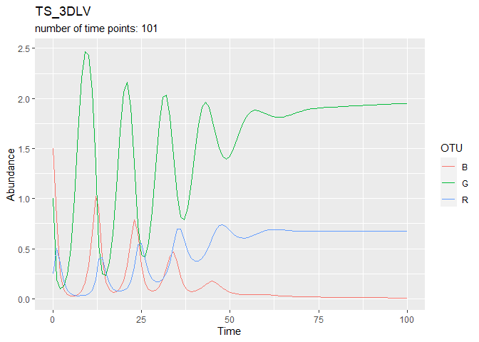
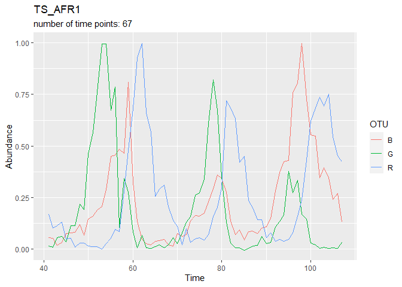
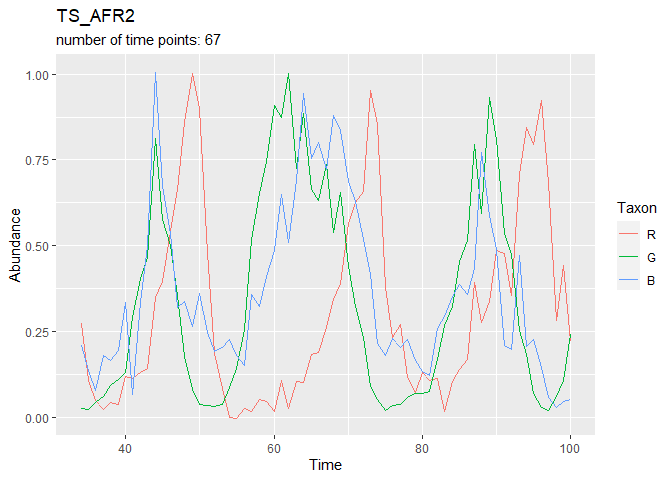
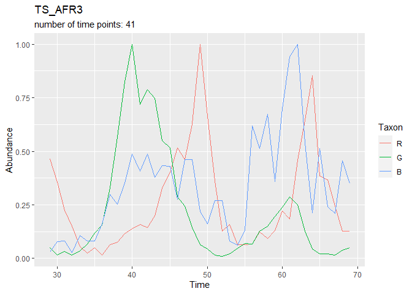
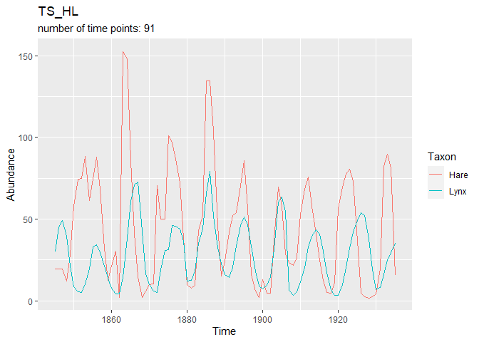
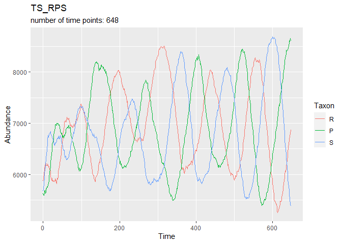
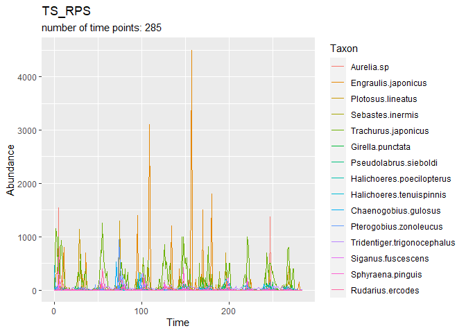

01f-timeseries-NODEBNGMpaper
================
Compiled at 2023-09-28 09:47:44 UTC

``` r
here::i_am(paste0(params$name, ".Rmd"), uuid = "9506fa44-f8a3-401c-aa4c-950659e05f3f")
```

The purpose of this document is …

``` r
library("conflicted")
library(data.table)
library(dplyr)
library(ggplot2)
library(phyloseq)
```

``` r
# create or *empty* the target directory, used to write this file's data: 
projthis::proj_create_dir_target(params$name, clean = TRUE)

# function to get path to target directory: path_target("sample.csv")
path_target <- projthis::proj_path_target(params$name)

# function to get path to previous data: path_source("00-import", "sample.csv")
path_source <- projthis::proj_path_source(params$name)
```

## Read Data and make Phyloseq objects

``` r
folderpath_data <-
  "C:/Users/Maria/Documents/Masterstudium/Masterarbeit/Literatur/Code/NODEBNGM/data/"

files <- c("TS_3DLV",
           "TS_AFR1",
           "TS_AFR2",
           "TS_AFR3",
           "TS_RPS")

for(ts_name in files) {
  tmp <-
    fread(paste0(folderpath_data, ts_name, ".csv"), header = T) %>%
    .[, SampleID := sprintf("ID-%03d", t)] %>%
    tibble::column_to_rownames("SampleID") %>%
    rename(Time = t)
  
  assign(paste0("dt_", ts_name),
         tmp)
}

dt_TS_HL <-
  fread(paste0(folderpath_data, "TS_HL.csv"), header = T) %>%
    .[, SampleID := sprintf("ID-%03d", as.numeric(row.names(.)))] %>%
    tibble::column_to_rownames("SampleID") %>%
    rename(Time = Year)

files <- c(files, "TS_HL")

# convert to phyloseq after reading the data
for(ts_name in files) {
  tmp_otu <-
    get(paste0("dt_", ts_name)) %>% 
    subset(select = -Time) %>% 
    t() %>% 
    otu_table(taxa_are_rows = T)
  
  tmp_sample <-
    get(paste0("dt_", ts_name)) %>% 
    subset(select = Time) %>% 
    sample_data()

  assign(paste0("ps_", ts_name),
         phyloseq(tmp_otu, tmp_sample))
}

rm(tmp, tmp_otu, tmp_sample)
```

``` r
# special case (including more sample info): TS_Ushio
dt_TS_Ushio_raw <-
  fread(paste0(folderpath_data, "TS_Ushio.csv")) %>%
  .[, SampleID := sprintf("ID-%03d", time_step)] %>%
  tibble::column_to_rownames("SampleID")

dt_TS_Ushio <-
  dt_TS_Ushio_raw %>% select(
    "Aurelia.sp",
    "Engraulis.japonicus",
    "Plotosus.lineatus",
    "Sebastes.inermis",
    "Trachurus.japonicus",
    "Girella.punctata",
    "Pseudolabrus.sieboldi",
    "Halichoeres.poecilopterus",
    "Halichoeres.tenuispinnis",
    "Chaenogobius.gulosus",
    "Pterogobius.zonoleucus",
    "Tridentiger.trigonocephalus",
    "Siganus.fuscescens",
    "Sphyraena.pinguis",
    "Rudarius.ercodes"
  )

otu_TS_Ushio <-
  copy(dt_TS_Ushio) %>% 
  t() %>% 
  otu_table(taxa_are_rows = T)

samples_TS_Ushio <-
  dt_TS_Ushio_raw %>%
  select("date_tag", "surf.t", "bot.t", "Y", "M", "D", "time_step")
samples_TS_Ushio$Time <-
  as.Date(paste0(samples_TS_Ushio$Y, "-", samples_TS_Ushio$M, "-", 
                 samples_TS_Ushio$D), 
          format = "%Y-%m-%d")

ps_TS_Ushio <-
  phyloseq(otu_TS_Ushio, sample_data(samples_TS_Ushio))

files <- c(files, "TS_Ushio")
```

### Overview over the phyloseq objects

``` r
for(ts_name in files) {
  cat(ts_name, "\n")
  print(get(paste0("ps_", ts_name)))
  cat("\n")
}
```

    ## TS_3DLV 
    ## phyloseq-class experiment-level object
    ## otu_table()   OTU Table:         [ 3 taxa and 101 samples ]
    ## sample_data() Sample Data:       [ 101 samples by 1 sample variables ]
    ## 
    ## TS_AFR1 
    ## phyloseq-class experiment-level object
    ## otu_table()   OTU Table:         [ 3 taxa and 67 samples ]
    ## sample_data() Sample Data:       [ 67 samples by 1 sample variables ]
    ## 
    ## TS_AFR2 
    ## phyloseq-class experiment-level object
    ## otu_table()   OTU Table:         [ 3 taxa and 67 samples ]
    ## sample_data() Sample Data:       [ 67 samples by 1 sample variables ]
    ## 
    ## TS_AFR3 
    ## phyloseq-class experiment-level object
    ## otu_table()   OTU Table:         [ 3 taxa and 41 samples ]
    ## sample_data() Sample Data:       [ 41 samples by 1 sample variables ]
    ## 
    ## TS_RPS 
    ## phyloseq-class experiment-level object
    ## otu_table()   OTU Table:         [ 3 taxa and 648 samples ]
    ## sample_data() Sample Data:       [ 648 samples by 1 sample variables ]
    ## 
    ## TS_HL 
    ## phyloseq-class experiment-level object
    ## otu_table()   OTU Table:         [ 2 taxa and 91 samples ]
    ## sample_data() Sample Data:       [ 91 samples by 1 sample variables ]
    ## 
    ## TS_Ushio 
    ## phyloseq-class experiment-level object
    ## otu_table()   OTU Table:         [ 15 taxa and 285 samples ]
    ## sample_data() Sample Data:       [ 285 samples by 8 sample variables ]

## Plot Datasets

``` r
for(ts_name in files) {
  ps_tmp <-
      psmelt(get(paste0("ps_", ts_name)))
  plt_tmp <-
    ggplot(ps_tmp, aes(x = Time, y = Abundance, col = OTU)) +
    geom_line() +
    labs(title = ts_name,
         subtitle = paste0("number of time points: ", uniqueN(ps_tmp[,1])),
         x = "Time")
  print(plt_tmp)
}
```

<!-- --><!-- --><!-- --><!-- --><!-- --><!-- --><!-- -->

<!-- ### Plot relative abundances for TS_Ushio -->
<!-- ```{r} -->
<!-- # calculcate relative abundances -->
<!-- ps_TS_Ushio_rel <- -->
<!--   transform_sample_counts(ps_TS_Ushio, function(x) x / sum(x)) -->
<!-- # bar plot phyloseq objects -->
<!-- plot_bar(ps_TS_Ushio_rel, x = "Time", fill = "OTU") + -->
<!--   geom_bar(aes(color = OTU, fill = OTU), stat = "identity", position = "stack") + -->
<!--   labs(title = "TS_Ushio relative Abundances", -->
<!--        x = "Time") -->
<!-- ``` -->

## Save Phyloseq Objects

``` r
for (ts_name in files) {
  saveRDS(get(paste0("ps_", ts_name)),
          path_target(paste0("ps_", ts_name, ".rds")))
}
```

## Files written

These files have been written to the target directory,
`data/01f-timeseries-NODEBNGMpaper`:

``` r
projthis::proj_dir_info(path_target())
```

    ## # A tibble: 7 × 4
    ##   path            type         size modification_time  
    ##   <fs::path>      <fct> <fs::bytes> <dttm>             
    ## 1 ps_TS_3DLV.rds  file        3.12K 2023-09-28 09:47:51
    ## 2 ps_TS_AFR1.rds  file         2.2K 2023-09-28 09:47:51
    ## 3 ps_TS_AFR2.rds  file        1.63K 2023-09-28 09:47:51
    ## 4 ps_TS_AFR3.rds  file        1.49K 2023-09-28 09:47:51
    ## 5 ps_TS_HL.rds    file        1.44K 2023-09-28 09:47:51
    ## 6 ps_TS_RPS.rds   file        7.99K 2023-09-28 09:47:51
    ## 7 ps_TS_Ushio.rds file       11.06K 2023-09-28 09:47:51
