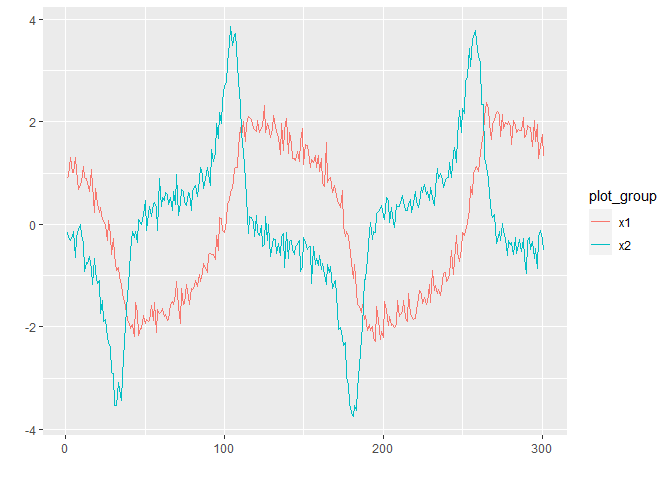
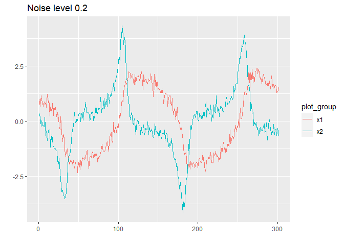
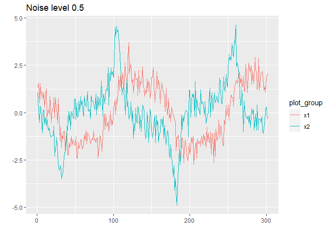
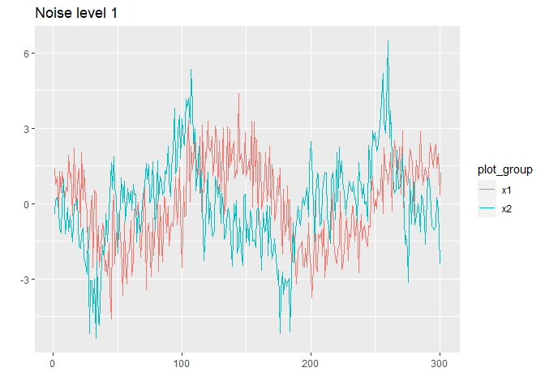

Simulation of the Van der Pol oscillator
================
Compiled at 2023-11-06 22:32:11 UTC

``` r
here::i_am(paste0(params$name, ".Rmd"), uuid = "ed3de31b-cc20-4300-90cc-e98faa8c0c62")
```

The purpose of this document is to simulate the in “SPARSE
RECONSTRUCTION OF ORDINARY DIFFERENTIAL EQUATIONS WITH INFERENCE” by
Sara Venkatraman et al. described Van der Pol ODE.

``` r
library("conflicted")
library(data.table)
library(dplyr)
library(ggplot2)

library(deSolve)
library(ggfortify) # to autoplot time series
```

``` r
# create or *empty* the target directory, used to write this file's data: 
projthis::proj_create_dir_target(params$name, clean = TRUE)

# function to get path to target directory: path_target("sample.csv")
path_target <- projthis::proj_path_target(params$name)

# function to get path to previous data: path_source("00-import", "sample.csv")
path_source <- projthis::proj_path_source(params$name)
```

## Simulation of the Van der Pol oscillator

### Van der Pol ODE system

``` r
# Define the system of differential equations
f <- function(t, x, mu) {
  dx1dt <- x[2]
  dx2dt <- mu * (1 - x[1]^2) * x[2] - x[1]
  
  return(list(c(dx1dt, dx2dt)))
}
```

### Set parameters

``` r
# Specify parameters
mu <- 2
x0 <- c(1.0, 0.0)
t_start <- 0
t_end <- 15
h <- 0.05  # Step size default = 0.05 (0.4 or smaller)
time_span <- seq(t_start, t_end, h)
```

### Solve the ODE system

``` r
# Solve the ODE system using the RK4 method
solution <- 
  ode(y = x0, times = time_span, func = f, parms = mu,
      method = "rk4")

# Create a data frame for plotting
df_VdP <- as.data.frame(solution)
colnames(df_VdP) <- c("Time", "x1", "x2")
```

### Plot the time series

``` r
# Plot the time series
ggplot(df_VdP, aes(x = Time)) +
  geom_line(aes(y = x1, color = "x1(t)")) +
  geom_line(aes(y = x2, color = "x2(t)")) +
  labs(title = "Van der Pol", 
       subtitle = paste0(length(time_span), " time steps"), 
       y = "", color = "") +
  scale_color_manual(values = c("x1(t)" = "blue", "x2(t)" = "red")) +
  theme_minimal()
```

<!-- -->

### Save simulated ODE

``` r
# save time series as csv file
write.csv(solution,
          path_target(paste0("ts_VanderPol.csv")),
          row.names = F)
```

## Add Gaussian noise

``` r
set.seed(123)

# convert data to time series
ts_data <- ts(df_VdP[, 2:3])

n <- dim(ts_data)[1]
m <- dim(ts_data)[2]
 
# Standard deviation of the noise
noise_sd_vec <- c(0.1, 0.2, 0.5, 1)
print(noise_sd_vec)
```

    ## [1] 0.1 0.2 0.5 1.0

``` r
# add gaussian noise, plot and save file
for(noise_sd in noise_sd_vec){
  # add gaussian noise
  ts_noisy <- 
    ts_data + matrix(rnorm(n * m, mean = 0, sd = noise_sd), nrow = n, ncol = m)
  
  # show plot
  print(autoplot(ts_noisy, facets = F) + ggtitle(paste("Noise level", noise_sd)))
  
  # save noisy time series as csv file
  write.csv(
    data.frame(df_VdP["Time"], ts_noisy),
    path_target(paste0("ts_VanderPol_noise_", 
                       gsub("\\.", "-", as.character(noise_sd)), ".csv")),
    row.names = F
  )
}
```

<!-- --><!-- --><!-- --><!-- -->

## Files written

These files have been written to the target directory,
`data/01g-timeseries-simulation-VdP`:

``` r
projthis::proj_dir_info(path_target())
```

    ## # A tibble: 5 × 4
    ##   path                       type         size modification_time  
    ##   <fs::path>                 <fct> <fs::bytes> <dttm>             
    ## 1 ts_VanderPol.csv           file        12.2K 2023-11-06 22:32:13
    ## 2 ts_VanderPol_noise_0-1.csv file        12.2K 2023-11-06 22:32:13
    ## 3 ts_VanderPol_noise_0-2.csv file        12.2K 2023-11-06 22:32:13
    ## 4 ts_VanderPol_noise_0-5.csv file        12.2K 2023-11-06 22:32:13
    ## 5 ts_VanderPol_noise_1.csv   file        12.2K 2023-11-06 22:32:14
