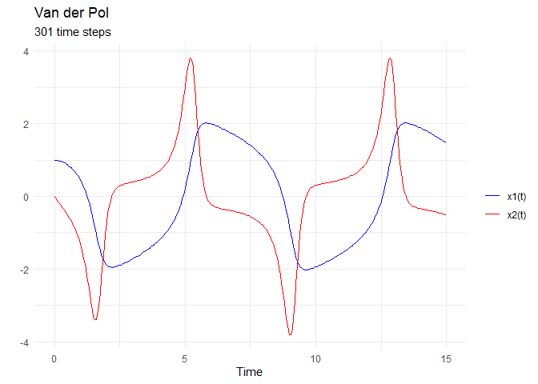

Simulation of the Van der Pol oscillator
================
Compiled at 2023-10-07 09:34:57 UTC

``` r
here::i_am(paste0(params$name, ".Rmd"), uuid = "ed3de31b-cc20-4300-90cc-e98faa8c0c62")
```

The purpose of this document is to simulate the in “SPARSE
RECONSTRUCTION OF ORDINARY DIFFERENTIAL EQUATIONS WITH INFERENCE” by
Sara Venkatraman et al. described Van der Pol ODE.

``` r
library("conflicted")
library(data.table)
library(dplyr)
library(ggplot2)
library(phyloseq)

library(deSolve)
```

``` r
# create or *empty* the target directory, used to write this file's data: 
projthis::proj_create_dir_target(params$name, clean = TRUE)

# function to get path to target directory: path_target("sample.csv")
path_target <- projthis::proj_path_target(params$name)

# function to get path to previous data: path_source("00-import", "sample.csv")
path_source <- projthis::proj_path_source(params$name)
```

## Simulation of the Van der Pol oscillator

### Van der Pol ODE system

``` r
# Define the system of differential equations
f <- function(t, x, mu) {
  dx1dt <- x[2]
  dx2dt <- mu * (1 - x[1]^2) * x[2] - x[1]
  
  return(list(c(dx1dt, dx2dt)))
}
```

### Set parameters

``` r
# Specify parameters
mu <- 2
x0 <- c(1.0, 0.0)
t_start <- 0
t_end <- 15
h <- 0.05  # Step size
time_span <- seq(t_start, t_end, h)
```

### Solve the ODE system

``` r
# Solve the ODE system using the RK4 method
solution <- 
  ode(y = x0, times = time_span, func = f, parms = mu,
      method = "rk4")

# Create a data frame for plotting
data <- as.data.frame(solution)
colnames(data) <- c("time", "x1", "x2")
```

### Plot the time series

``` r
# Plot the time series
ggplot(data, aes(x = time)) +
  geom_line(aes(y = x1, color = "x1(t)")) +
  geom_line(aes(y = x2, color = "x2(t)")) +
  labs(x = "Time", y = "Value", color = "Variable") +
  scale_color_manual(values = c("x1(t)" = "blue", "x2(t)" = "red")) +
  theme_minimal()
```

<!-- -->

## Directly save simulated ODE

``` r
# save time series as csv file
write.csv(
  solution,
  path_target(paste0("ts_VanderPol_R.csv")),
  row.names = F
)
```

## Files written

These files have been written to the target directory,
`data/01g-timeseries-simulation-VdP`:

``` r
projthis::proj_dir_info(path_target())
```

    ## # A tibble: 1 × 4
    ##   path               type         size modification_time  
    ##   <fs::path>         <fct> <fs::bytes> <dttm>             
    ## 1 ts_VanderPol_R.csv file        12.2K 2023-10-07 09:35:02
