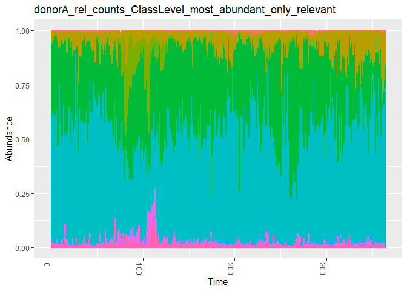
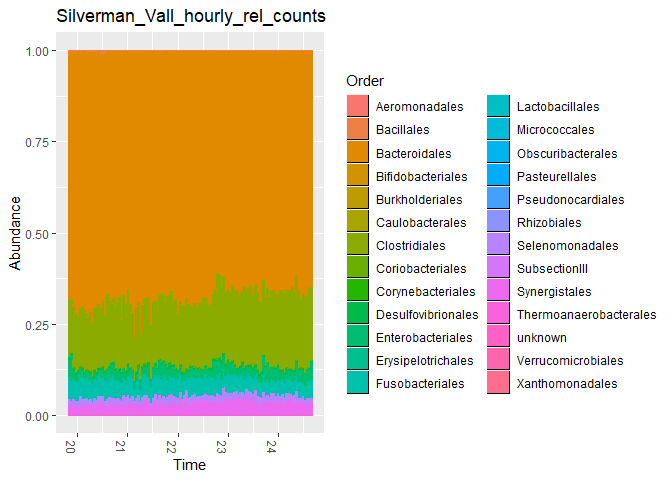
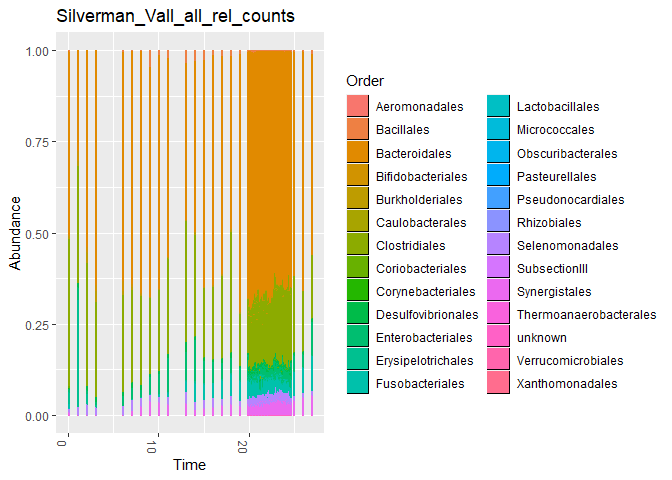
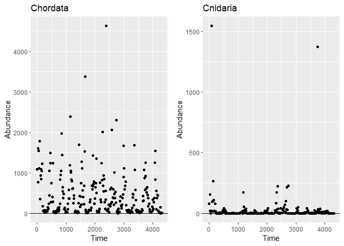
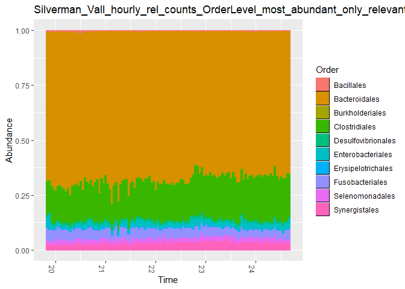
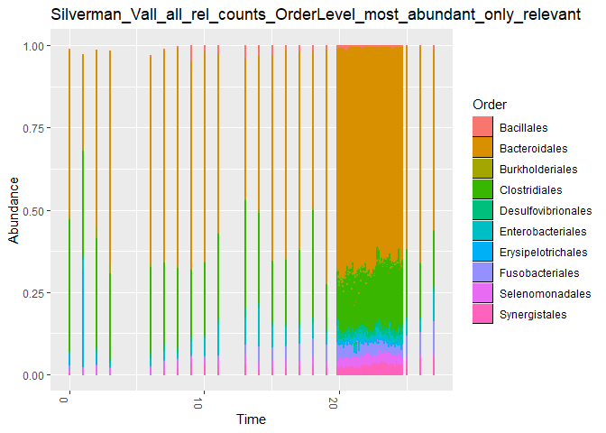

02 General Preprocessing (grouping and filtering) of the time series
================
Compiled at 2023-09-28 10:19:09 UTC

``` r
here::i_am(paste0(params$name, ".Rmd"), uuid = "b3a179f8-2944-4abb-be92-171ebdfd8e78")
```

Previously all time series have been converted into a uniform format as
a phyloseq object. This document now can be used for further processing
of the datasets. This includes conversion to relative counts, filtering
by the most abundant taxa and grouping by a certain taxonomic level.

``` r
library("conflicted")
library("tidyverse")
library("data.table")
library("phyloseq")
library("microViz") # for tax_fix
```

``` r
# create or *empty* the target directory, used to write this file's data: 
projthis::proj_create_dir_target(params$name, clean = TRUE)

# function to get path to target directory: path_target("sample.csv")
path_target <- projthis::proj_path_target(params$name)

# function to get path to previous data: path_source("00-import", "sample.csv")
path_source <- projthis::proj_path_source(params$name)
```

## Select name of object

``` r
# data_source <- "01a-timeseries-BioTIME"
# data_name_vec <- c("study_339", "study_363", "study_414", "study_478")

# data_source <- "01b-timeseries-CLVpaper"
# data_name_vec <- c("bucci_subject_1_rel_counts")
# data_name <- "bucci_subject_2_rel_counts"
# data_name <- "bucci_subject_3_rel_counts"
# data_name <- "bucci_subject_4_rel_counts"
# data_name <- "bucci_subject_5_rel_counts"

data_source <- "01c-timeseries-miaTIME"
data_name_vec <- c("Silverman_Vall_daily_rel_counts",
                   "Silverman_Vall_hourly_rel_counts",
                   "Silverman_Vall_all_rel_counts")
# data_name <- "Silverman_rel_counts"
# data_name <- "Silverman_V1_rel_counts"
# data_name <- "Silverman_V2_rel_counts"
# data_name <- "Silverman_V3_rel_counts"
# data_name <- "Silverman_V4_rel_counts"

# data_source <- "01d-timeseries-HumanGutData-Karwowska-paper"
# data_name_vec <- c("donorA_rel_counts", "donorB_rel_counts", 
#                    "female_rel_counts", "male_rel_counts")

# data_source <- "01e-timeseries-miaSim"
# data_name <- "miaSim_GLV_4species_oscillating_zero"

# data_source <- "01f-timeseries-NODEBNGMpaper"
# data_name_vec <- c("3DLV",  "AFR1", "AFR2", "AFR3", "HL", "RPS", "Ushio")
# data_name_vec <- c("RPS_rel_counts")
```

## Load phyloseq object

``` r
for(data_name in data_name_vec) {
  assign(paste0("ps_", data_name),
         readRDS(path_source(data_source,
                             paste0("ps_", data_name, ".rds"))))
}
```

## Group dataset by taxonomic rank

Aggregate the timeseries by summarizing counts over a taxonomic level.

``` r
tax_level = "Order"

for(data_name in data_name_vec) {
  
  tmp_ps <-
    get(paste0("ps_", data_name)) %>%
    tax_fix(sep = "_") %>%
    # summarize over tax level, include NAs
    tax_glom(taxrank = tax_level, NArm = FALSE)
  
  if(tax_level == "Phylum"){
    tmp_ps <- tmp_ps %>%
      speedyseq::transmute_tax_table(Kingdom, Phylum,
                                     .otu = Phylum)
  } else if (tax_level == "Class") {
    tmp_ps <- tmp_ps %>%
      speedyseq::transmute_tax_table(Kingdom, Phylum, Class,
                                     .otu = Class)
  } else if (tax_level == "Order") {
    tmp_ps <- tmp_ps %>%
      speedyseq::transmute_tax_table(Kingdom, Phylum, Class, Order,
                                     .otu = Order)
  } else if (tax_level == "Family") {
    tmp_ps <- tmp_ps %>%
      speedyseq::transmute_tax_table(Kingdom, Phylum, Class, Order, Family,
                                     .otu = Family)
  }else if (tax_level == "Genus") {
    tmp_ps <- tmp_ps %>%
      speedyseq::transmute_tax_table(Kingdom, Phylum, Class, Order, Family, Genus,
                                     .otu = get(tax_level))
  } else {
    tmp_ps <- tmp_ps %>%
      speedyseq::transmute_tax_table(Kingdom, Phylum, Class, Order,
                                     Family, Genus, Species,
                                     .otu = Species)
  }
  
  assign(paste0("ps_", data_name, "_", tax_level, "Level"),
         tmp_ps)
}

# update data names
data_name_vec_changed <-
  paste0(data_name_vec, "_", tax_level, "Level")
```

## Filter for most abundant taxa

### with mean count \> 1e-5 over all samples

Check for every taxon:

- if mean rel. count over all samples is higher than 0.0001 (in detail:
  samples with mean count \<= 1e-4 are removed) OR
- if the max rel. count of all samples is at least 0.005

``` r
for(data_name in data_name_vec_changed) {

  assign(
    paste0("ps_", data_name, "_most_abundant"),
    get(paste0("ps_", data_name)) %>%
      filter_taxa(function(x)
        mean(x) > 1e-4 | max(x) > 0.005, TRUE)
  )
}

# update data names
data_name_vec_changed <-
  paste0(data_name_vec_changed, "_most_abundant")
```

### with count != 0 for at least 90% of all samples

Check further for every taxon:

- if there are not more than 85% of the samples equal to zero (in
  detail: 15% of samples have a relative count \> 1e-5) OR

``` r
for(data_name in data_name_vec_changed) { 
  assign(
    paste0("ps_", data_name, "_only_relevant"),
    get(paste0("ps_", data_name)) %>%
      filter_taxa(function(x)
        {sum(x > 1e-5) > (0.15 * nsamples(.))},
        TRUE)
  )
}

# update data names
data_name_vec_changed <-
  paste0(data_name_vec_changed, "_only_relevant")
```

<!-- ## Plot removed timeseries -->
<!-- ```{r} -->
<!-- dt_ps <- psmelt(get(paste0("ps_", data_name_vec_changed[1]))) -->
<!-- otus <- dt_ps$OTU %>% unique() -->
<!-- #  -->
<!-- # for(otu in otus){ -->
<!-- #   # plot included taxa -->
<!-- #   plt_tmp <- ggplot(subset(dt_ps, OTU == otu), -->
<!-- #          aes(x = Time, y = Abundance)) + -->
<!-- #     geom_point() + -->
<!-- #     geom_hline(yintercept = 1e-5) + -->
<!-- #     labs(title = otu) -->
<!-- #   print(plt_tmp) -->
<!-- # } -->
<!-- dt_ps <- psmelt(get(paste0("ps_", data_name_vec[1], "_", tax_level, "Level"))) -->
<!-- otus_not_included <- -->
<!--   dt_ps$OTU[!dt_ps$OTU %in% otus] %>% unique() -->
<!-- plt_list = list() -->
<!-- for(otu in otus_not_included){ -->
<!--   # plot included taxa -->
<!--   plt_tmp <- ggplot(subset(dt_ps, OTU == otu), -->
<!--          aes(x = Time, y = Abundance)) + -->
<!--     geom_point() + -->
<!--     geom_hline(yintercept = 1e-5) + -->
<!--     labs(title = otu) + -->
<!--     ylim(0, 0.01) -->
<!--   plt_list = c(plt_list, list(plt_tmp)) -->
<!-- } -->
<!-- cowplot::plot_grid(plotlist=plt_list, nrow=10) -->
<!-- ``` -->

## Plot final dataset

``` r
for(data_name in data_name_vec) { 
  
  plt_tmp <- plot_bar(get(paste0("ps_", data_name)),
           x = "Time") +
    # theme(legend.position = "none") +
    labs(title = data_name,
         x = "Time",
         fill = tax_level) +
    geom_bar(aes(color = get(tax_level), fill = get(tax_level)),
             stat = "identity",
             position = "stack") +
    guides(color = "none")
  
  print(plt_tmp)
}
```

<!-- --><!-- --><!-- -->

``` r
# plot original datasets
for(data_name in data_name_vec_changed) { 
  
  plt_tmp <- plot_bar(get(paste0("ps_", data_name)),
           x = "Time") +
    # theme(legend.position = "none") +
    labs(title = data_name,
         x = "Time",
         fill = tax_level) +
    geom_bar(aes(color = get(tax_level), fill = get(tax_level)),
             stat = "identity",
             position = "stack") +
    guides(color = "none")
  
  print(plt_tmp)
}
```

<!-- --><!-- --><!-- -->

## Save as csv file

``` r
for(data_name in data_name_vec_changed) { 
  
  # get the tmp phyloseq object
  ps_obj <- get(paste0("ps_", data_name))
  
  if(taxa_are_rows(ps_obj)) {
    otu_tmp <- t(otu_table(ps_obj))
  }
  else {
    otu_tmp <- otu_table(ps_obj)
  }
  # combine count data with time information
  ts_obj <-
    cbind(sample_data(ps_obj)[, "Time"],
          otu_tmp)
  print(head(ts_obj))
  
  # save time series as csv file
  write.csv(
    ts_obj,
    path_target(paste0("ts_", data_name, ".csv")),
    row.names = F
  )
    
}
```

    ##   Time Fusobacteriales Enterobacteriales Burkholderiales Bifidobacteriales
    ## 0    0    1.000119e-02       0.008229677     0.010144695       0.003229146
    ## 1    1    9.594198e-04       0.035887770     0.014289142       0.025757684
    ## 2    2    2.108183e-04       0.011391839     0.031388219       0.012894194
    ## 3    3    4.774485e-05       0.010499131     0.029123037       0.016294127
    ## 6    6    6.014314e-05       0.026399276     0.010892885       0.028349513
    ## 7    7    3.118612e-03       0.030368792     0.006656115       0.009164558
    ##   Coriobacteriales Erysipelotrichales   Bacillales Synergistales Clostridiales
    ## 0     4.442445e-03       0.0342314470 0.0008923146  7.881456e-03     0.4025193
    ## 1     4.702534e-04       0.2931944068 0.0000000000  5.204117e-04     0.3205117
    ## 2     2.656313e-04       0.0255293293 0.0000000000  8.599931e-05     0.3373852
    ## 3     7.216396e-05       0.0045849093 0.0000000000  4.774485e-05     0.2612810
    ## 6     0.000000e+00       0.0011508880 0.0050062953  5.535458e-04     0.2663864
    ## 7     3.413901e-05       0.0002461782 0.0026151743  1.061412e-02     0.2540700
    ##   Selenomonadales Desulfovibrionales Bacteroidales
    ## 0     0.007639614        0.002343574     0.5047212
    ## 1     0.020130941        0.010201596     0.2773909
    ## 2     0.030190783        0.010966895     0.5396481
    ## 3     0.020773419        0.012552669     0.6447241
    ## 6     0.022305534        0.010597393     0.6282982
    ## 7     0.028792173        0.015713479     0.6386066
    ##                      Time Fusobacteriales Enterobacteriales Burkholderiales
    ## 19.8333333333333 19.83333      0.05813287        0.04792072     0.003461994
    ## 19.875           19.87500      0.05505526        0.06772592     0.002918104
    ## 19.9166666666667 19.91667      0.05411754        0.02299551     0.003581674
    ## 19.9583333333333 19.95833      0.05277920        0.01711122     0.002802555
    ## 20               20.00000      0.05367244        0.02107201     0.003066328
    ## 20.0416666666667 20.04167      0.05588967        0.01908019     0.002846610
    ##                  Erysipelotrichales  Bacillales Synergistales Clostridiales
    ## 19.8333333333333        0.002028498 0.006131365    0.02642881     0.1576297
    ## 19.875                  0.001947249 0.005270338    0.02874181     0.1479719
    ## 19.9166666666667        0.002445699 0.004590675    0.02415529     0.1665257
    ## 19.9583333333333        0.002434425 0.003767064    0.02386123     0.1628700
    ## 20                      0.001979591 0.002517627    0.02370928     0.1482135
    ## 20.0416666666667        0.001619030 0.003489659    0.03343938     0.1580550
    ##                  Selenomonadales Desulfovibrionales Bacteroidales
    ## 19.8333333333333     0.016851559        0.007136154     0.6742783
    ## 19.875               0.009682145        0.005676849     0.6749840
    ## 19.9166666666667     0.017923639        0.008239615     0.6954247
    ## 19.9583333333333     0.013333415        0.008129392     0.7129115
    ## 20                   0.013898181        0.007127004     0.7246461
    ## 20.0416666666667     0.018419923        0.006022948     0.7011376
    ##   Time Fusobacteriales Enterobacteriales Burkholderiales Erysipelotrichales
    ## 0    0    1.000119e-02       0.008229677     0.010144695       0.0342314470
    ## 1    1    9.594198e-04       0.035887770     0.014289142       0.2931944068
    ## 2    2    2.108183e-04       0.011391839     0.031388219       0.0255293293
    ## 3    3    4.774485e-05       0.010499131     0.029123037       0.0045849093
    ## 6    6    6.014314e-05       0.026399276     0.010892885       0.0011508880
    ## 7    7    3.118612e-03       0.030368792     0.006656115       0.0002461782
    ##     Bacillales Synergistales Clostridiales Selenomonadales Desulfovibrionales
    ## 0 0.0008923146  7.881456e-03     0.4025193     0.007639614        0.002343574
    ## 1 0.0000000000  5.204117e-04     0.3205117     0.020130941        0.010201596
    ## 2 0.0000000000  8.599931e-05     0.3373852     0.030190783        0.010966895
    ## 3 0.0000000000  4.774485e-05     0.2612810     0.020773419        0.012552669
    ## 6 0.0050062953  5.535458e-04     0.2663864     0.022305534        0.010597393
    ## 7 0.0026151743  1.061412e-02     0.2540700     0.028792173        0.015713479
    ##   Bacteroidales
    ## 0     0.5047212
    ## 1     0.2773909
    ## 2     0.5396481
    ## 3     0.6447241
    ## 6     0.6282982
    ## 7     0.6386066

## Files written

These files have been written to the target directory,
`data/02-filter_and_group_ts`:

``` r
projthis::proj_dir_info(path_target())
```

    ## # A tibble: 3 × 4
    ##   path                                          type    size modification_time  
    ##   <fs::path>                                    <fct> <fs::> <dttm>             
    ## 1 …s_OrderLevel_most_abundant_only_relevant.csv file   27.5K 2023-09-28 10:19:43
    ## 2 …s_OrderLevel_most_abundant_only_relevant.csv file   5.33K 2023-09-28 10:19:43
    ## 3 …s_OrderLevel_most_abundant_only_relevant.csv file  23.76K 2023-09-28 10:19:43
