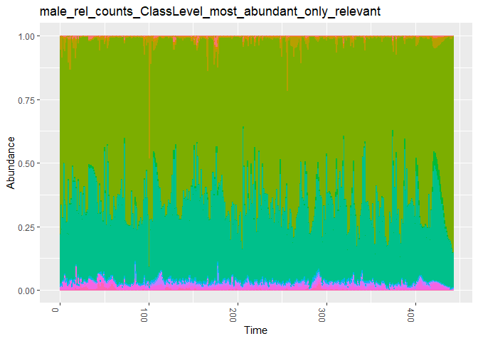

02 General Preprocessing (grouping and filtering) of the time series
================
Compiled at 2023-09-27 15:46:13 UTC

``` r
here::i_am(paste0(params$name, ".Rmd"), uuid = "b3a179f8-2944-4abb-be92-171ebdfd8e78")
```

Previously all time series have been converted into a uniform format as
a phyloseq object. This document now can be used for further processing
of the datasets. This includes conversion to relative counts, filtering
by the most abundant taxa and grouping by a certain taxonomic level.

``` r
library("conflicted")
library("tidyverse")
library("data.table")
library("phyloseq")
library("microViz") # for tax_fix
```

``` r
# create or *empty* the target directory, used to write this file's data: 
projthis::proj_create_dir_target(params$name, clean = TRUE)

# function to get path to target directory: path_target("sample.csv")
path_target <- projthis::proj_path_target(params$name)

# function to get path to previous data: path_source("00-import", "sample.csv")
path_source <- projthis::proj_path_source(params$name)
```

## Select name of object

``` r
# data_source <- "01a-timeseries-BioTIME"
# data_name <- "study-339"

# data_source <- "01b-timeseries-CLVpaper"
# data_name <- "bucci_subject_1_rel_counts"
# data_name <- "bucci_subject_2_rel_counts"
# data_name <- "bucci_subject_3_rel_counts"
# data_name <- "bucci_subject_4_rel_counts"
# data_name <- "bucci_subject_5_rel_counts"

# data_source <- "01c-timeseries-miaTIME"
# data_name <- "Silverman_rel_counts"
# data_name <- "Silverman_V1_rel_counts"
# data_name <- "Silverman_V2_rel_counts"
# data_name <- "Silverman_V3_rel_counts"
# data_name <- "Silverman_V4_rel_counts"
# data_name <- "Silverman_Vall_daily_rel_counts"
# data_name <- "Silverman_Vall_hourly_rel_counts"

data_source <- "01d-timeseries-HumanGutData-Karwowska-paper"
data_name_vec <- c("donorA_rel_counts", "donorB_rel_counts", 
                   "female_rel_counts", "male_rel_counts")
# data_name <- "donorB_rel_counts"
# data_name <- "female_rel_counts"
# data_name <- "male_rel_counts"

# data_source <- "01e-timeseries-miaSim"
# data_name <- "miaSim_GLV_4species_oscillating_zero"

# data_source <- "01f-timeseries-NODEBNGMpaper"
# data_name <- "TS_3DLV"
# data_name <- "TS_AFR1"
# data_name <- "TS_AFR2"
# data_name <- "TS_AFR3"
# data_name <- "TS_HL"
# data_name <- "TS_RPS"
# data_name <- "TS_Ushio"
```

## Load phyloseq object

``` r
for(data_name in data_name_vec) {
  assign(paste0("ps_", data_name),
         readRDS(path_source(data_source,
                             paste0("ps_", data_name, ".rds"))))
}
```

## Group dataset by taxonomic rank

Aggregate the timeseries by summarizing counts over a taxonomic level.

``` r
tax_level = "Class"

for(data_name in data_name_vec) {
  
  tmp_ps <-
    get(paste0("ps_", data_name)) %>%
    tax_fix(sep = "_") %>%
    # summarize over tax level, include NAs
    tax_glom(taxrank = tax_level, NArm = FALSE)
  
  if(tax_level == "Phylum"){
    tmp_ps <- tmp_ps %>%
      speedyseq::transmute_tax_table(Kingdom, Phylum,
                                     .otu = Phylum)
  } else if (tax_level == "Class") {
    tmp_ps <- tmp_ps %>%
      speedyseq::transmute_tax_table(Kingdom, Phylum, Class,
                                     .otu = Class)
  } else if (tax_level == "Order") {
    tmp_ps <- tmp_ps %>%
      speedyseq::transmute_tax_table(Kingdom, Phylum, Class, Order,
                                     .otu = Order)
  } else if (tax_level == "Family") {
    tmp_ps <- tmp_ps %>%
      speedyseq::transmute_tax_table(Kingdom, Phylum, Class, Order, Family,
                                     .otu = Family)
  }else if (tax_level == "Genus") {
    tmp_ps <- tmp_ps %>%
      speedyseq::transmute_tax_table(Kingdom, Phylum, Class, Order, Family, Genus,
                                     .otu = get(tax_level))
  } else {
    tmp_ps <- tmp_ps %>%
      speedyseq::transmute_tax_table(Kingdom, Phylum, Class, Order,
                                     Family, Genus, Species,
                                     .otu = Species)
  }
  
  assign(paste0("ps_", data_name, "_", tax_level, "Level"),
         tmp_ps)
}

# update data names
data_name_vec_changed <-
  paste0(data_name_vec, "_", tax_level, "Level")
```

## Filter for most abundant taxa

### with mean count \> 1e-5 over all samples

Check for every taxon:

- if mean rel. count over all samples is higher than 0.0001 (in detail:
  samples with mean count \<= 1e-4 are removed) OR
- if the max rel. count of all samples is at least 0.005

``` r
for(data_name in data_name_vec_changed) {

  assign(
    paste0("ps_", data_name, "_most_abundant"),
    get(paste0("ps_", data_name)) %>%
      filter_taxa(function(x)
        mean(x) > 1e-4 | max(x) > 0.005, TRUE)
  )
}

# update data names
data_name_vec_changed <-
  paste0(data_name_vec_changed, "_most_abundant")
```

### with count != 0 for at least 90% of all samples

Check further for every taxon:

- if there are not more than 85% of the samples equal to zero (in
  detail: 15% of samples have a relative count \> 1e-5) OR

``` r
for(data_name in data_name_vec_changed) { 
  assign(
    paste0("ps_", data_name, "_only_relevant"),
    get(paste0("ps_", data_name)) %>%
      filter_taxa(function(x)
        {sum(x > 1e-5) > (0.15 * nsamples(.))},
        TRUE)
  )
}

# update data names
data_name_vec_changed <-
  paste0(data_name_vec_changed, "_only_relevant")
```

<!-- ## Plot removed timeseries -->
<!-- ```{r} -->
<!-- dt_ps <- psmelt(get(paste0("ps_", data_name_vec_changed[1]))) -->
<!-- otus <- dt_ps$OTU %>% unique() -->
<!-- #  -->
<!-- # for(otu in otus){ -->
<!-- #   # plot included taxa -->
<!-- #   plt_tmp <- ggplot(subset(dt_ps, OTU == otu), -->
<!-- #          aes(x = Time, y = Abundance)) + -->
<!-- #     geom_point() + -->
<!-- #     geom_hline(yintercept = 1e-5) + -->
<!-- #     labs(title = otu) -->
<!-- #   print(plt_tmp) -->
<!-- # } -->
<!-- dt_ps <- psmelt(get(paste0("ps_", data_name_vec[1], "_", tax_level, "Level"))) -->
<!-- otus_not_included <- -->
<!--   dt_ps$OTU[!dt_ps$OTU %in% otus] %>% unique() -->
<!-- plt_list = list() -->
<!-- for(otu in otus_not_included){ -->
<!--   # plot included taxa -->
<!--   plt_tmp <- ggplot(subset(dt_ps, OTU == otu), -->
<!--          aes(x = Time, y = Abundance)) + -->
<!--     geom_point() + -->
<!--     geom_hline(yintercept = 1e-5) + -->
<!--     labs(title = otu) + -->
<!--     ylim(0, 0.01) -->
<!--   plt_list = c(plt_list, list(plt_tmp)) -->
<!-- } -->
<!-- cowplot::plot_grid(plotlist=plt_list, nrow=10) -->
<!-- ``` -->

## Plot final dataset

``` r
for(data_name in data_name_vec_changed) { 
  
  plt_tmp <- plot_bar(get(paste0("ps_", data_name)),
           x = "Time") +
    theme(legend.position = "none") +
    labs(title = data_name,
         x = "Time",
         fill = tax_level) +
    geom_bar(aes(color = get(tax_level), fill = get(tax_level)),
             stat = "identity",
             position = "stack") +
    guides(color = "none")
  
  print(plt_tmp)
}
```

<!-- --><!-- --><!-- --><!-- -->

## Save as csv file

``` r
for(data_name in data_name_vec_changed) { 
  
  # get the tmp phyloseq object
  ps_obj <- get(paste0("ps_", data_name))
  
  # combine count data with time information
  ts_obj <-
    cbind(sample_data(ps_obj)[, "Time"],
          t(otu_table(ps_obj)))
  print(head(ts_obj))
  
  # save time series as csv file
  write.csv(
    ts_obj,
    path_target(paste0("ts_", data_name, ".csv")),
    row.names = F
  )
    
}
```

    ##        Time Gammaproteobacteria Alphaproteobacteria Bacteroidia
    ## ID-000    0        0.0070555556                   0   0.3640000
    ## ID-001    1        0.0059444444                   0   0.3110000
    ## ID-002    2        0.0057222222                   0   0.3402222
    ## ID-003    3        0.0031007752                   0   0.3625692
    ## ID-004    4        0.0007777778                   0   0.3693333
    ## ID-005    5        0.0011111111                   0   0.3416111
    ##        Clostridia_258483     Bacilli Negativicutes Coriobacteriia Actinomycetia
    ## ID-000         0.5495000 0.032777778    0.03233333    0.009833333   0.001611111
    ## ID-001         0.5995556 0.052500000    0.01772222    0.007555556   0.004444444
    ## ID-002         0.5904444 0.039500000    0.01566667    0.003388889   0.004500000
    ## ID-003         0.5882614 0.019767442    0.01683278    0.003266888   0.005924695
    ## ID-004         0.5917778 0.007888889    0.01855556    0.004000000   0.007388889
    ## ID-005         0.5790556 0.020166667    0.01266667    0.038944444   0.004777778
    ##        Desulfovibrionia Bacteria_Kingdom Campylobacteria Fusobacteriia
    ## ID-000     2.111111e-03     0.0007777778    0.000000e+00             0
    ## ID-001     3.333333e-04     0.0008333333    5.555556e-05             0
    ## ID-002     2.777778e-04     0.0002222222    5.555556e-05             0
    ## ID-003     1.107420e-04     0.0001661130    0.000000e+00             0
    ## ID-004     5.555556e-05     0.0002222222    0.000000e+00             0
    ## ID-005     8.888889e-04     0.0005000000    0.000000e+00             0
    ##        Time Gammaproteobacteria Alphaproteobacteria Bacteroidia
    ## ID-000    0        1.666667e-04                   0   0.5262778
    ## ID-001    1        5.555556e-05                   0   0.5957222
    ## ID-002    2        2.777778e-04                   0   0.6987778
    ## ID-003    3        5.555556e-05                   0   0.5987222
    ## ID-004    4        2.777778e-04                   0   0.6754444
    ## ID-005    5        6.111111e-04                   0   0.5530556
    ##        Clostridia_258483     Bacilli Negativicutes Coriobacteriia Actinomycetia
    ## ID-000         0.4081667 0.034222222    0.02205556   0.0035000000  0.000000e+00
    ## ID-001         0.3505556 0.012666667    0.03116667   0.0028888889  0.000000e+00
    ## ID-002         0.2647222 0.008555556    0.02216667   0.0021111111  5.555556e-05
    ## ID-003         0.3570556 0.017111111    0.02188889   0.0018888889  0.000000e+00
    ## ID-004         0.2841111 0.010777778    0.02561111   0.0008888889  0.000000e+00
    ## ID-005         0.3760000 0.036722222    0.02711111   0.0025555556  5.555556e-05
    ##        Verrucomicrobiae Bacteria_Kingdom
    ## ID-000     2.222222e-04      0.005111111
    ## ID-001     0.000000e+00      0.006888889
    ## ID-002     0.000000e+00      0.003277778
    ## ID-003     5.555556e-05      0.003166667
    ## ID-004     0.000000e+00      0.002833333
    ## ID-005     5.555556e-05      0.003555556
    ##        Time Bacteroidia Clostridia_258483 Negativicutes Gammaproteobacteria
    ## ID-001    1   0.8014444        0.07011111  0.0003333333        1.666667e-04
    ## ID-002    2   0.6778512        0.12777280  0.0085144522        5.601613e-05
    ## ID-003    3   0.5958399        0.16373838  0.0185898889        0.000000e+00
    ## ID-004    4   0.5595000        0.17355556  0.0293888889        0.000000e+00
    ## ID-005    5   0.5808058        0.14910339  0.0458268762        5.534647e-05
    ## ID-006    6   0.6366365        0.11387316  0.0659116648        1.132503e-04
    ##             Bacilli Desulfovibrionia Fusobacteriia Verrucomicrobiae
    ## ID-001 0.0002777778      0.006444444             0      0.001722222
    ## ID-002 0.0005601613      0.006721936             0      0.019101501
    ## ID-003 0.0007367944      0.007141238             0      0.036613013
    ## ID-004 0.0008333333      0.007333333             0      0.052555556
    ## ID-005 0.0013836617      0.007637813             0      0.072061103
    ## ID-006 0.0026047565      0.008267271             0      0.093657984
    ##        Bacteria_Kingdom Coriobacteriia
    ## ID-001       0.11950000              0
    ## ID-002       0.15942191              0
    ## ID-003       0.17734074              0
    ## ID-004       0.17683333              0
    ## ID-005       0.14312597              0
    ## ID-006       0.07893545              0
    ##        Time Bacteroidia Clostridia_258483 Negativicutes Gammaproteobacteria
    ## ID-000    0   0.7271111         0.1946111    0.01122222        0.000000e+00
    ## ID-001    1   0.6435556         0.3089444    0.01472222        1.333333e-03
    ## ID-002    2   0.6752222         0.2169444    0.01294444        0.000000e+00
    ## ID-003    3   0.7075556         0.2434444    0.03161111        1.611111e-03
    ## ID-004    4   0.4489444         0.4543889    0.03805556        7.777778e-04
    ## ID-005    5   0.5860556         0.2895000    0.05950000        5.555556e-05
    ##             Bacilli Desulfovibrionia Actinomycetia Verrucomicrobiae
    ## ID-000 0.0002777778      0.013444444   0.000000000     0.0003333333
    ## ID-001 0.0016111111      0.011388889   0.001222222     0.0000000000
    ## ID-002 0.0001111111      0.011444444   0.001333333     0.0000000000
    ## ID-003 0.0007777778      0.007222222   0.000000000     0.0000000000
    ## ID-004 0.0038333333      0.005444444   0.006111111     0.0000000000
    ## ID-005 0.0037222222      0.004333333   0.002555556     0.0000000000
    ##        Coriobacteriia Campylobacteria Bacteria_Kingdom Fusobacteriia
    ## ID-000   0.0000000000    0.0001111111      0.052888889             0
    ## ID-001   0.0000000000    0.0001111111      0.017111111             0
    ## ID-002   0.0000000000    0.0000000000      0.082000000             0
    ## ID-003   0.0000000000    0.0000000000      0.007777778             0
    ## ID-004   0.0022222222    0.0001666667      0.040055556             0
    ## ID-005   0.0005555556    0.0001666667      0.053555556             0

## Files written

These files have been written to the target directory,
`data/02-filter_and_group_ts`:

``` r
projthis::proj_dir_info(path_target())
```

    ## # A tibble: 4 × 4
    ##   path                                           type   size modification_time  
    ##   <fs::path>                                     <fct> <fs:> <dttm>             
    ## 1 …ts_ClassLevel_most_abundant_only_relevant.csv file  65.3K 2023-09-27 15:46:28
    ## 2 …ts_ClassLevel_most_abundant_only_relevant.csv file  39.4K 2023-09-27 15:46:28
    ## 3 …ts_ClassLevel_most_abundant_only_relevant.csv file  29.9K 2023-09-27 15:46:28
    ## 4 …ts_ClassLevel_most_abundant_only_relevant.csv file  82.8K 2023-09-27 15:46:28
